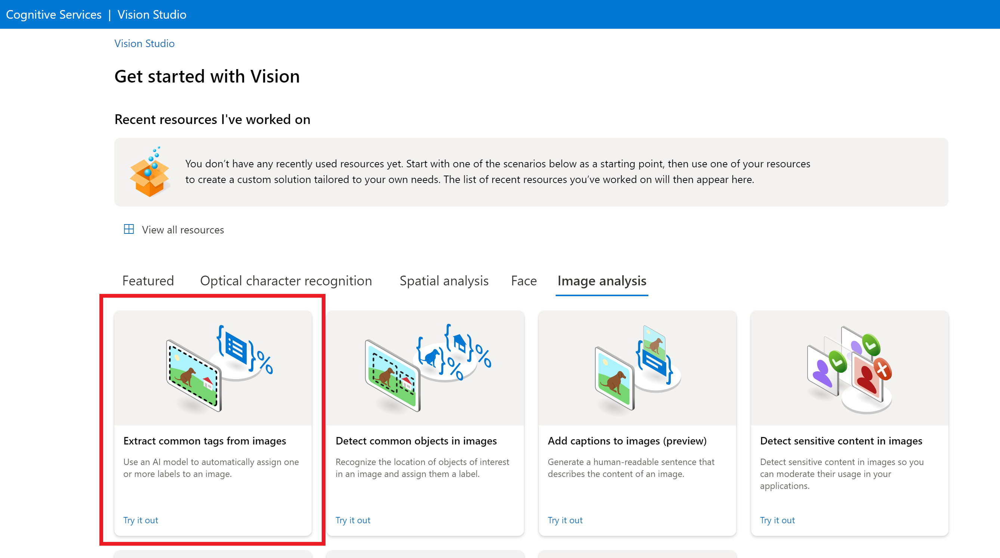
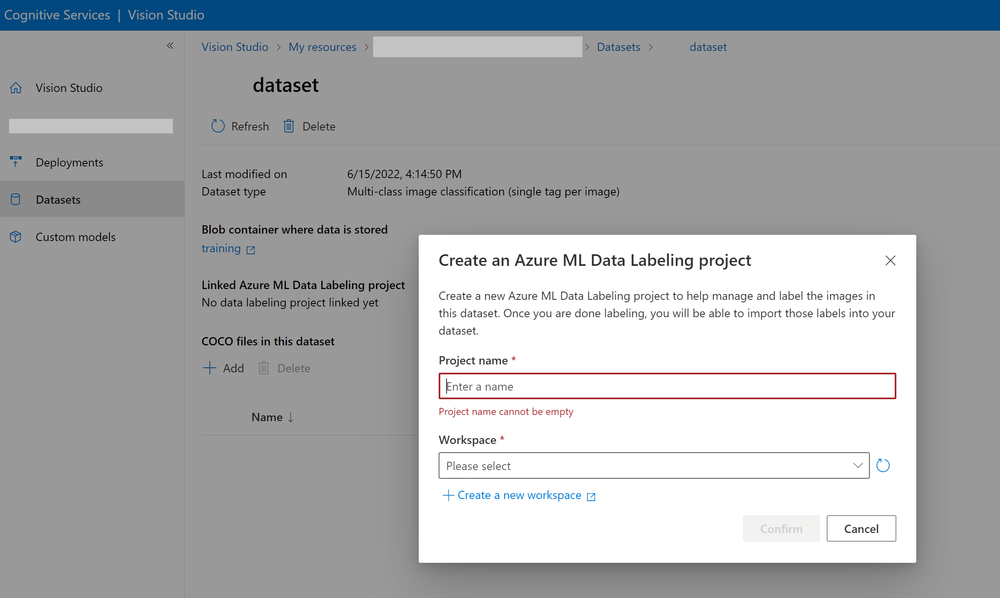
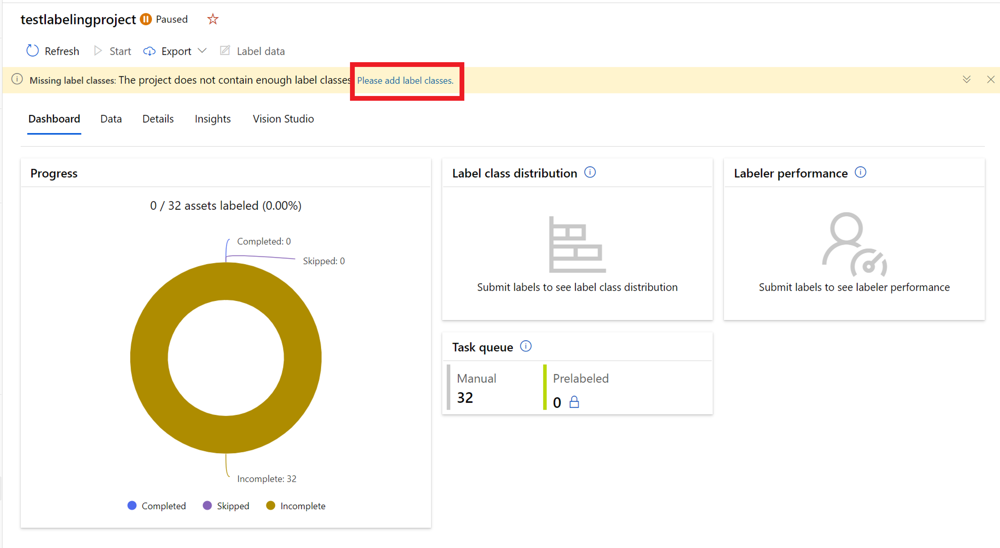
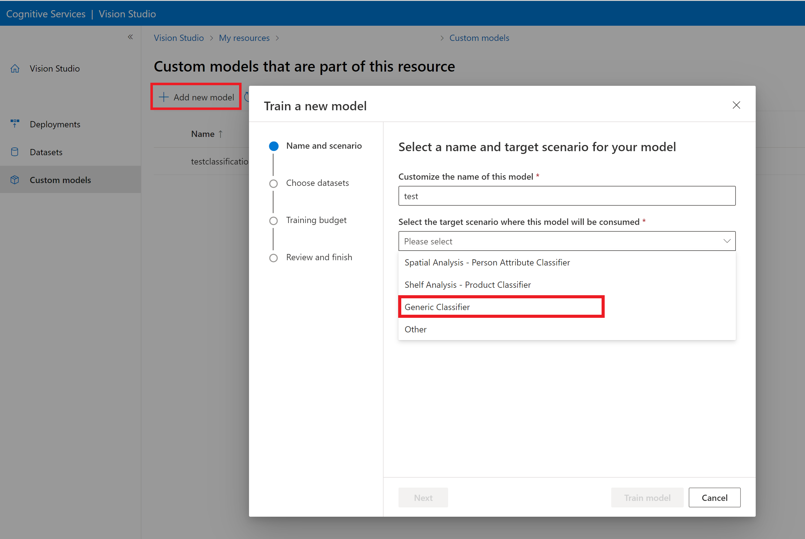
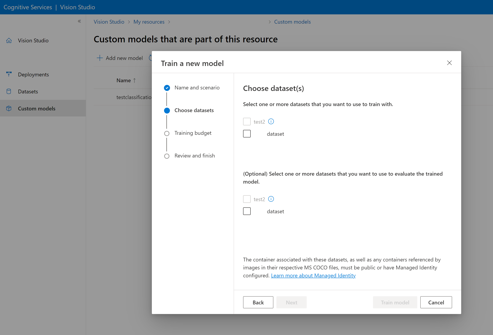
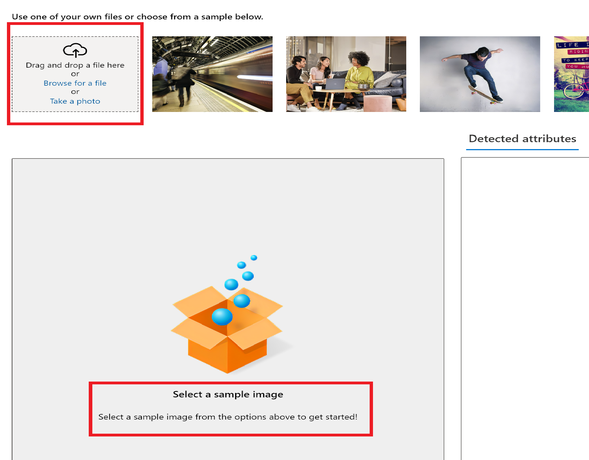

# Create a custom Image Analysis model

Image Analysis 4.0 allows you to train a custom model using your own training images and labels. By manually labeling your images, you can train a model to apply custom tags to images (image classification) or detect custom objects (object detection).

This guide shows you how to create and train a custom model, noting the few differences between classification and detection.

## Prerequisites

* Azure subscription - [Create one for free](https://azure.microsoft.com/free/cognitive-services)
* Once you have your Azure subscription, <a href="https://portal.azure.com/#create/Microsoft.CognitiveServicesComputerVision"  title="Create a Computer Vision resource"  target="_blank">create a Computer Vision resource </a> in the Azure portal to get your key and endpoint. After it deploys, select **Go to resource**. Copy the key and endpoint to a temporary location to use later on.

#### [Vision Studio](#tab/studio)

## Create a new custom model

Begin by going to [Vision Studio](https://portal.vision.cognitive.azure.com/) and selecting the **Image analysis** tab. Then select either the **Extract common tags from images** tile or the **Detect common objects in images** tile, depending on whether you want to train an image classification model or object detection model. This guide will demonstrate a custom image classification model. 



The **Choose the model you want to try out** drop-down lets you select the Pretrained Vision model (ordinary Image Analysis) or a custom trained model. Since you don't have a custom model yet, select **Train a custom model**.


## Prepare training images

You need to upload your training images to an Azure Blob Storage container. If you don't already have an Azure Storage account, follow the instructions in [Create a storage account](/azure/storage/common/storage-account-create?tabs=azure-portal). Then, go to your storage resource in the Azure portal and navigate to the **Storage browser** tab. Here you can create a blob container and upload your images. Put them all at the root of the container.

## Add a dataset from blob storage

To train a custom model, you need to associate it with a _dataset_ where you provide images and their label information as training data. In Vision Studio, select the **Datasets** tab to view your datasets.

To create a new dataset, select **add new dataset**. Enter a name and select a dataset type: If you'd like to do image classification, select `Multi-class image classification`. If you'd like to do object detection, select `Object detection`.


Then, select the container from the Azure Blob Storage account where you stored the training images. Check the box to allow Vision Studio to read and write to the blob storage container. This is a necessary step to import labeled data. Create the dataset.


## Create an AML labeling project

You need a COCO file to convey the labeling information. An easy way to generate a COCO file is to create an Azure Machine Learning project, which comes with a data-labeling workflow.

In the dataset details page, select **Add a new Data Labeling project**. Name it and select **Create a new workspace**, which will open a new Azure portal tab where you can create the AML project.



Once the AML project is created, return to the Vision Studio tab and select it under **Workspace**. The AML portal will then open in a new browser tab.

## AML: Create labels

To start, follow the **Please add label classes** prompt to add label classes.




Once you've added all the class labels, save them, select **start** on the project, and then select **Label data** at the top.


### AML: Manually label training data

Choose **Start labeling** and follow the prompts to label all of your images. When you're finished, return to the Vision Studio tab in your browser. 


You should now be able to import a COCO file. Select the one you just created.

> [!NOTE]
> ## Import COCO files from elsewhere
>
> To import a COCO file, go to the dataset tab and click `Add COCO files to this datset`. You can choose to add a specific COCO file from a Blob storage account or to import from the COCO file from the AML labeling project that you used to label the images in the dataset. Once the COCO file is imported into the dataset, the dataset can be used for training a model.
>
> 
>
> ### About COCO files
>
> [!INCLUDE [coco-files](../includes/coco-files.md)]

> COCO files are JSON files with specific required fields: `"images"`, `"annotations"`, `"categories"`. A sample COCO file will looks like this:
>
> ```json
> {
>  "images": [
>    {
>      "id": 1,
>      "width": 500,
>      "height": 828,
>      "file_name": "0.jpg",
>      "absolute_url": "https://blobstorage1.blob.core.windows.net/cpgcontainer/0.jpg"
>    },
>     {
>       "id": 2,
>       "width": 754,
>       "height": 832,
>       "file_name": "1.jpg",
>       "absolute_url": "https://blobstorage1.blob.core.windows.net/cpgcontainer/1.jpg"
>     },
> 
>    ...
> 
>   ],
>   "annotations": [
>     {
>       "id": 1,
>       "category_id": 7,
>       "image_id": 1,
>       "area": 0.407,
>       "bbox": [
>         0.02663142641129032,
>         0.40691584277841153,
>         0.9524163571731749,
>         0.42766634515266866
>       ]
>     },
>     {
>       "id": 2,
>       "category_id": 9,
>       "image_id": 2,
>       "area": 0.27,
>       "bbox": [
>         0.11803319477782331,
>         0.41586723392402375,
>         0.7765206955096307,
>         0.3483334397217212
>       ]
>     },
>     ...
> 
>   ],
>   "categories": [
>     {
>       "id": 1,
>       "name": "vegall original mixed vegetables"
>     },
>     {
>       "id": 2,
>       "name": "Amy's organic soups lentil vegetable"
>     },
>     {
>       "id": 3,
>       "name": "Arrowhead 8oz"
>     },
> 
>     ...
> 
>   ]
> }
> ```
> 
> ### Field reference
>
> If you're generating your own COCO file from scratch, make sure all the required fields are filled with the correct details. The following tables describe each field in a COCO file:
>
> **"images"**
>
> | Key | Type | Description | Required? |
> |-|-|-|-|
> | id | integer | Uploaded image id | Yes |
> | width | integer | Width of the image in pixels  | Yes |
> | height | integer | Height of the image in pixels | Yes |
> | file name | string | a unique name for the image  | Yes |
> | absolute_url | string | Image path as an absolute URI to a blob in a blob container. The Computer Vision resource must have permission to read the annotation files and all referenced image files. </br></br> The value for `absolute_url` can be found in your container's blob properties: | Yes |
> 
> **"annotations"**
> 
> | Key | Type | Description | Required? |
> |-|-|-|-|
> | id | integer | ID of the annotation | Yes |
> | category_id | integer | ID of the category defined in the `categories` section | Yes |
> | image_id  | integer | ID of the image | Yes |
> | area | integer | Value of 'Width' x 'Height' (third and fourth values of `bbox`) | No |
> | bbox | float | Relative coordinates of the bounding box (0 to 1), in the order of 'Left', 'Top', 'Width', 'Height'  | Yes |
> 
> **"categories"**
> 
> | Key | Type | Description | Required? |
> |-|-|-|-|
> | id | integer | Unique id for each category (label class). These should be present in the `annotations` section. | Yes |
> | name| string | Name of the category (label class) | Yes |


## Train the custom model

To start training a classifier model with your COCO file, go to the **Custom models** tab and select **Add a new model**. Enter a name for the model and select `Image classification` or `Object detection` as the model type.



Select your dataset, which is now associated with the COCO file containing the labeling information.



Select a budget and train the model. For this small example, you can use a `1 hour` budget.


## Evaluate the trained model

After the training has completed, you can view its performance evaluation. By default, performance is estimated based on data in the training dataset. You can optionally create evaluation datasets (using the same process as above) to use at this step for further model evaluation.


## Use a custom model to generate predictions

Once you've built a custom model, you can go back to the **Extract common tags from images** tile in Vision Studio and test it by selecting it in the drop-down and uploading new images.




The prediction results will appear in the right column.


#### [REST API](#tab/rest)

## Create your training dataset

datasets/name PUT registers a new dataset. the dataset JSON specifies details.

```bash
curl -v -X PUT "https://<endpoint>/computervision/datasets/<dataset-name>?api-version=2022-10-12-preview" -H "Content-Type: application/json" -H "Ocp-Apim-Subscription-Key: <subscription-key>" --data-ascii ""
```
```json
{
"annotationKind":"ImageClassification",
"annotationFileUris":"<URI list>",
}
```

## Create and train model

```bash
curl -v -X PUT "https://<endpoint>/computervision/models/<model-name>?api-version=2022-10-12-preview" -H "Content-Type: application/json" -H "Ocp-Apim-Subscription-Key: <subscription-key>" --data-ascii ""
```
```json
{
"trainingParameters": {
    "trainingDatasetName":"<dataset-name>",
    "timeBudgetInMinutes":60,
    "modelKind":"Generic-Classifier",
    "modelProfile":"balanced"
    }
}
```


models/name PUT trains the custom model. the name param names the model. the model JSON specifies the dataset (and probably the model type)

## Evaluate model

```bash
curl -v -X PUT "https://<endpoint>/computervision/models/<model-name>/evaluations/<eval-name>?api-version=2022-10-12-preview" -H "Content-Type: application/json" -H "Ocp-Apim-Subscription-Key: <subscription-key>" --data-ascii ""
```
```json
{
"evaluationParameters":{
    "testDatasetName":"<dataset-name>"
    }
}
```

models/name/evaluations/evalName PUT evaluates an existing model. uses ModelEvaluation JSON

## Use prediction APIs

```bash
curl -v -X PUT "https://<endpoint>/computervision/imageanalysis:analyze?features=Tags&&model-version=<model-name>&api-version=2022-10-12-preview" -H "Content-Type: application/json" -H "Ocp-Apim-Subscription-Key: <subscription-key>" --data-ascii "{\"url\":\"https://upload.wikimedia.org/wikipedia/commons/thumb/a/af/Atomist_quote_from_Democritus.png/338px-Atomist_quote_from_Democritus.png\"}"
```
```json
{
"url":"https://upload.wikimedia.org/wikipedia/commons/thumb/a/af/Atomist_quote_from_Democritus.png/338px-Atomist_quote_from_Democritus.png"
}
```

imageanalysis/analyze POST you can specify a custom model in the _model-name_ param. Uses ImageURL JSON

---


## Next steps

In this guide, you created and trained a custom image classification model using Image Analysis. Next, learn more about the Analyze API, so you can query your custom model from an application.

* [Call the Analyze Image API](./call-analyze-image-40.md)
* See the [Model customization concepts](../concept-model-customization.md) guide for a broad overview of the feature and a list of frequently asked questions.