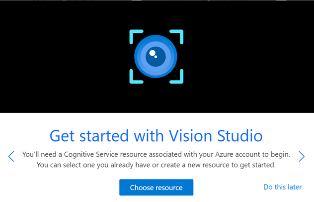
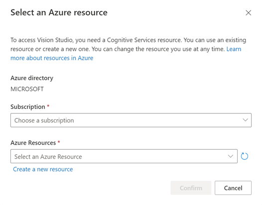
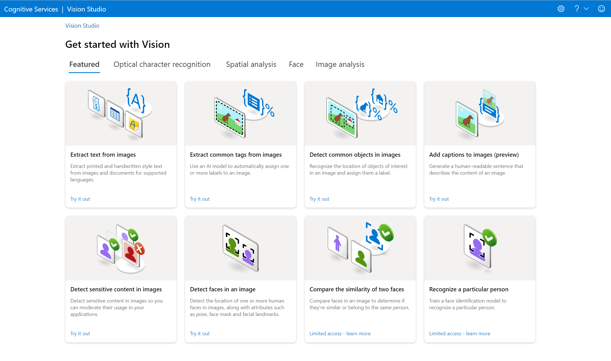

# Quickstart: Get started with Vision Studio

[Vision Studio](https://vision.cognitive.azure.com/) is a set of UI-based tools that lets you explore, build, and integrate features from Azure Cognitive Service for Vision into your applications.

Vision Studio provides you with a platform to try several service features and sample their returned data in a quick, straightforward manner. Using the Studio, you can get started engaging with the services and learning what they offer without needing to write code. Then, use the available client libraries and REST APIs to get started on embedding these services in your own applications.

## Get started using Vision Studio

To use Vision Studio, you will need an Azure resource for Vision for authentication. You can also use this resource to call the services in the try-it-out experiences. Follow these steps to get started.

1.	Create an Azure Subscription. You can [create one for free](https://azure.microsoft.com/en-us/free/ai/).

2.	Log into Vision Studio. If it's your first time logging in, you'll see a window appear that lets you choose a Vision resource. You have the option to skip this step and do it later, but to go ahead and choose a resource, follow the steps below.

3.	Select **Choose resource**, then select an existing resource within your subscription. If you would like to create a new one altogether, select **Create a new resource**. Then enter information for your new resource, such as a name, location, and resource group. 

> [!TIP]
> * When selecting a location for your Azure resource, choose one that's closest to you for lower latency.
> * If you use the free pricing tier, you can keep using the Vision service even after your Azure free trial or service credit expires.

4.	Select **Create resource**. Your resource will be created, and you will be able to try the different features offered by the Vision service. For example, select **Add captions to images**.

5.	This feature has a section to choose your language, select a sample image, or upload one of your own. To use the try-it-out experience, you will need to choose a resource and acknowledge it will incur usage according to your [pricing tier](https://azure.microsoft.com/en-us/pricing/details/cognitive-services/computer-vision/).

6.	After selecting your image and acknowledging usage, you will see the detected attributes of the image appear in the output window. You can also select **JSON** to take a look at the JSON output. Below the try-it-out experience are next steps to get started using this capability in your own application.

## Vision Studio pre-configured features

The Vision service offers multiple features that use prebuilt, pre-configured models for performing various tasks such as: understanding how people move through a space, detecting faces in images, and extracting text from images, among others. See the [Azure Cognitive Services Vision Overview](https://docs.microsoft.com/en-us/azure/cognitive-services/computer-vision/) to see the list of features offered by the Vision service.

Each of these features has a try-it-out experience inside Vision Studio that allows you to input images and pre-configured sample images and offers JSON and text responses. These experiences help you quickly test these prebuilt features using a no-code approach.

## Vision Studio additional features

In addition to the try-it-out experiences, Vision Studio also offers experiences that highlight the importance of fairness, particularly when working with Face models. See [Face fairness information]() for more information on how Microsoft employs the principles of Responsible AI, and learn how you can too.

## Cleaning up resources

If you want to clean up and remove a Cognitive Services subscription, you can delete the resource or resource group. Deleting the resource group also deletes any other resources associated with it.
*	[Portal](https://review.docs.microsoft.com/en-us/azure/cognitive-services/cognitive-services-apis-create-account?branch=release-cogsvcs-language-service&tabs=multiservice%2Cwindows#clean-up-resources)
*	[Azure CLI](https://review.docs.microsoft.com/en-us/azure/cognitive-services/cognitive-services-apis-create-account-cli?branch=release-cogsvcs-language-service&tabs=windows#clean-up-resources)

> [!TIP]
> In Vision Studio, you can find your resource's details (such as its name and pricing tier) as well as switch resources by selecting the Settings icon in the top-right corner of the Vision Studio screen).
> You can't delete your resource from Vision Studio.

## Next steps

*	Go to the [Vision Studio]() to begin using features offered by the service.
*	For more information and documentation on the features offered, see the [Azure Cognitive Services for Vision Overview](https://docs.microsoft.com/en-us/azure/cognitive-services/computer-vision/).

