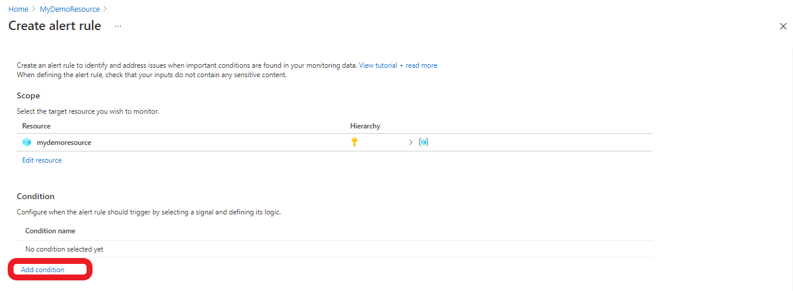
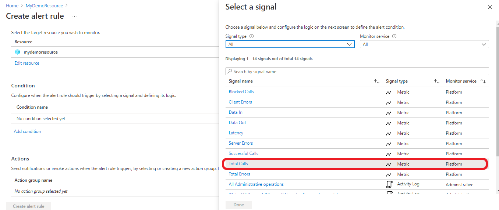

# LUIS Recources

Learn more about LUIS resources [here](./luis-concept-azure-subscription.md).

## Create LUIS resources 

[!INCLUDE [Create LUIS resource in Azure portal](includes/create-luis-resource.md)]

## Create LUIS resources in LUIS Portal

### Create LUIS Authoring resource

1. Sign in to the [LUIS portal](https://www.luis.ai), select your country/region and agree to the terms of use. If you see **My Apps** instead, a LUIS resource already exists and you can skip the next step.

2. In the **Choose an authoring** window that appears, find your Azure subscription, and LUIS authoring resource. If you don't have a resource, you can create a new one.

    :::image type="content" source="../media/luis-how-to-azure-subscription/choose-authoring-resource.png" alt-text="Choose a type of Language Understanding authoring resource.":::
    
    When you create a new authoring resource, provide the following information:
    * **Tenant name** - the tenant your Azure subscription is associated with.
    * **Azure subscription name** - the subscription that will be billed for the resource.
    * **Azure resource group name** - a custom resource group name you choose or create. Resource groups allow you to group Azure resources for access and management.
    * **Azure resource name** - a custom name you choose, used as part of the URL for your authoring and prediction endpoint queries.
    * **Pricing tier** - the pricing tier determines the maximum transaction per second and month.

### Create LUIS Prediction resource

[!INCLUDE [Create LUIS Prediction resource in LUIS portal](./includes/add-pred-resource-portal.md)


## Create LUIS resources in the Azure CLI

Use the [Azure CLI](/cli/azure/install-azure-cli) to create each resource individually.

Resource `kind`:

* Authoring: `LUIS.Authoring`
* Prediction: `LUIS`

1. Sign in to the Azure CLI:

    ```azurecli
    az login
    ```

    This command opens a browser so you can select the correct account and provide authentication.

1. Create a LUIS authoring resource of kind `LUIS.Authoring`, named `my-luis-authoring-resource`. Create it in the _existing_ resource group named `my-resource-group` for the `westus` region.

    ```azurecli
    az cognitiveservices account create -n my-luis-authoring-resource -g my-resource-group --kind LUIS.Authoring --sku F0 -l westus --yes
    ```

1. Create a LUIS prediction endpoint resource of kind `LUIS`, named `my-luis-prediction-resource`. Create it in the _existing_ resource group named `my-resource-group` for the `westus` region. If you want higher throughput than the free tier provides, change `F0` to `S0`. [Learn more about pricing tiers and throughput.](luis-limits.md#key-limits)

    ```azurecli
    az cognitiveservices account create -n my-luis-prediction-resource -g my-resource-group --kind LUIS --sku F0 -l westus --yes
    ```

    > [!Note]
    > These keys aren't used by the LUIS portal until they're assigned on the **Manage** > **Azure Resources** page in the LUIS portal.

## Assign LUIS resources
Creating a resource doesn't necessarily mean that it is put to use, you need to asign it to your apps.

## Assign resources using LUIS portal
**Assign an authoring resource to all your apps** 

You can assign an authoring resource for a single app or for all apps in LUIS. The following procedure assigns the authoring resource to all apps.

1. Sign in to the [LUIS portal](https://www.luis.ai).
1. In the upper-right corner, select your user account, and then select **Settings**.
1. On the **User Settings** page, select **Add authoring resource**, and then select an existing authoring resource. Select **Save**.

**Assign a resource to a specific app**

The following procedure assigns a resource to a specific app.

1. Sign in to the [LUIS portal](https://www.luis.ai). Select an app from the **My apps** list.
1. Go to **Manage** > **Azure Resources**:

    

1. On the **Prediction resource** or **Authoring resource** tab, select the **Add prediction resource** or **Add authoring resource** button.
1. Use the fields in the form to find the correct resource, and then select **Save**.

## Assign prediction resource programatically 

For automated processes like CI/CD pipelines, you might want to automate the assignment of a LUIS resource to a LUIS app. To do so, complete these steps:

1. Get an Azure Resource Manager token from [this website](https://resources.azure.com/api/token?plaintext=true). This token does expire, so use it right away. The request returns an Azure Resource Manager token.

    ```azurecli
    az account get-access-token --resource=https://management.core.windows.net/ --query accessToken --output tsv
    ```
    
    

1. Use the token to request the LUIS runtime resources across subscriptions. Use the [Get LUIS Azure accounts API](https://westus.dev.cognitive.microsoft.com/docs/services/5890b47c39e2bb17b84a55ff/operations/5be313cec181ae720aa2b26c), which your user account has access to.

    This POST API requires the following values:

    |Header|Value|
    |--|--|
    |`Authorization`|The value of `Authorization` is `Bearer {token}`. The token value must be preceded by the word `Bearer` and a space.|
    |`Ocp-Apim-Subscription-Key`|Your authoring key.|

    The API returns an array of JSON objects that represent your LUIS subscriptions. Returned values include the subscription ID, resource group, and resource name, returned as `AccountName`. Find the item in the array that's the LUIS resource that you want to assign to the LUIS app.

1. Assign the token to the LUIS resource by using the [Assign a LUIS Azure accounts to an application](https://westus.dev.cognitive.microsoft.com/docs/services/5890b47c39e2bb17b84a55ff/operations/5be32228e8473de116325515) API.

    This POST API requires the following values:

    |Type|Setting|Value|
    |--|--|--|
    |Header|`Authorization`|The value of `Authorization` is `Bearer {token}`. The token value must be preceded by the word `Bearer` and a space.|
    |Header|`Ocp-Apim-Subscription-Key`|Your authoring key.|
    |Header|`Content-type`|`application/json`|
    |Querystring|`appid`|The LUIS app ID.
    |Body||{`AzureSubscriptionId`: Your Sucbscription ID,<br>`ResourceGroup`: Resource Group name that has your prediction resource,<br>`AccountName`: Name of your prediction resource}|

    When this API is successful, it returns `201 - created status`.

## Unassign a resource

When you unassign a resource, it's not deleted from Azure. It's only unlinked from LUIS.

## Unassign resources using LUIS portal

1. Sign in to the [LUIS portal](https://www.luis.ai), and then select an app from the **My apps** list.
1. Go to **Manage** > **Azure Resources**.
1. Select the **Unassign resource** button for the resource.


## Unassign prediction resorce programatically

1. Get an Azure Resource Manager token from [this website](https://resources.azure.com/api/token?plaintext=true). This token does expire, so use it right away. The request returns an Azure Resource Manager token.

    ```azurecli
    az account get-access-token --resource=https://management.core.windows.net/ --query accessToken --output tsv
    ```
    
    

1. Use the token to request the LUIS runtime resources across subscriptions. Use the [Get LUIS Azure accounts API](https://westus.dev.cognitive.microsoft.com/docs/services/5890b47c39e2bb17b84a55ff/operations/5be313cec181ae720aa2b26c), which your user account has access to.

    This POST API requires the following values:

    |Header|Value|
    |--|--|
    |`Authorization`|The value of `Authorization` is `Bearer {token}`. The token value must be preceded by the word `Bearer` and a space.|
    |`Ocp-Apim-Subscription-Key`|Your authoring key.|

    The API returns an array of JSON objects that represent your LUIS subscriptions. Returned values include the subscription ID, resource group, and resource name, returned as `AccountName`. Find the item in the array that's the LUIS resource that you want to assign to the LUIS app.

1. Assign the token to the LUIS resource by using the [Unassign a LUIS Azure account from an application](https://westus.dev.cognitive.microsoft.com/docs/services/5890b47c39e2bb17b84a55ff/operations/5be32554f8591db3a86232e1/console) API.

    This DELETE API requires the following values:

    |Type|Setting|Value|
    |--|--|--|
    |Header|`Authorization`|The value of `Authorization` is `Bearer {token}`. The token value must be preceded by the word `Bearer` and a space.|
    |Header|`Ocp-Apim-Subscription-Key`|Your authoring key.|
    |Header|`Content-type`|`application/json`|
    |Querystring|`appid`|The LUIS app ID.
    |Body||{`AzureSubscriptionId`: Your Sucbscription ID,<br>`ResourceGroup`: Resource Group name that has your prediction resource,<br>`AccountName`: Name of your prediction resource}|

    When this API is successful, it returns `200 - OK status`.

## Resource ownership

An Azure resource, like a LUIS resource, is owned by the subscription that contains the resource.

To change the ownership of a resource, you can take one of these actions:
* Transfer the [ownership](../../cost-management-billing/manage/billing-subscription-transfer.md) of your subscription.
* Export the LUIS app as a file, and then import the app on a different subscription. Export is available on the **My apps** page in the LUIS portal.

## Change the pricing tier

1.  In [the Azure portal](https://portal.azure.com), Go to **All resources** and select your resource

    
1.  From the left side menu select **Pricing tier** to see the available pricing tiers
1.  Select the pricing tier you want, and click **Select** to save your change<br>
    When the pricing change is complete, a notification appears in the top right verifying  the pricing tier update.

## View Azure resource metrics

## View a summary of Azure resource usage
You can view LUIS usage information in the Azure portal. The **Overview** page shows a summary, including recent calls and errors. If you make a LUIS endpoint request, allow up to five minutes for the change to appear.


## Customizing Azure resource usage charts
The **Metrics** page provides a more detailed view of the data. 
You can configure your metrics charts for a specific **time period** and **metric type**.


## Total transactions threshold alert
If you want to know when you reach a certain transaction threshold, for example 10,000 transactions, you can create an alert:

1. From the left side menu select **Alerts**
2. From the top menu select **New alert Rule**


3. Click on **Add Condition**



4.Select **Total Calls**



5. Scroll down to the **Alert logic** section and set the attributes as you want and click **Done**


6. To send notifications or invoke actions when the alert rule triggers go to hthe **Actions** section and add your action group.


## Next steps

* Learn [how to use versions](luis-how-to-manage-versions.md) to control your app life cycle.


