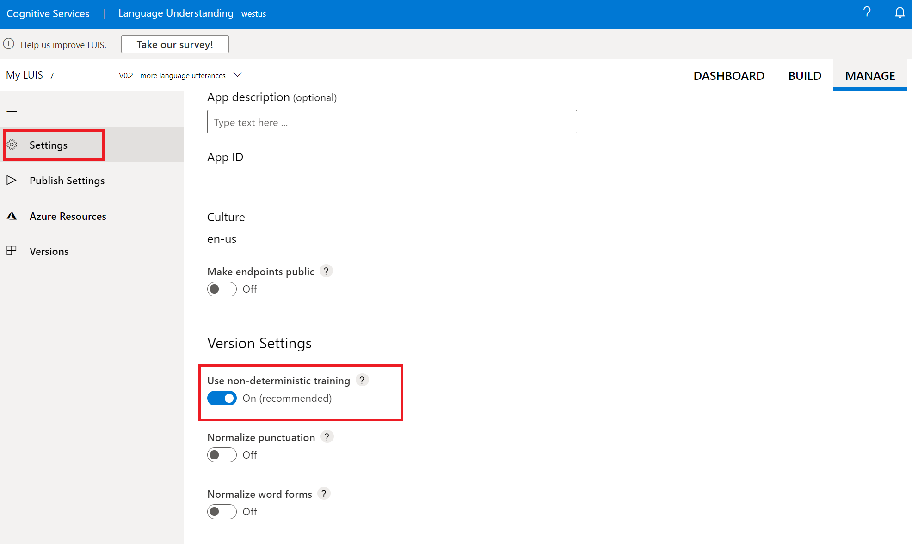

# Train your active version of the LUIS app

Training is the process of teaching your Language Understanding (LUIS) app to improve its natural language understanding. Train your LUIS app after updates to the model such as adding, editing, labeling, or deleting entities, intents, or utterances.

Training and [testing](luis-concept-test.md) an app is an iterative process. After you train your LUIS app, you test it with sample utterances to see if the intents and entities are recognized correctly. If they're not, make updates to the LUIS app, train, and test again.

Training is applied to the active version in the LUIS portal.

## How to train interactively

To start the iterative process in the [LUIS portal](https://www.luis.ai), you first need to train your LUIS app at least once. Make sure every intent has at least one utterance before training.

1. Access your app by selecting its name on the **My Apps** page.

1. In your app, select **Train** in the top panel.

1. When training is complete, a notification appears at the top of the browser.

## Training date and time

Training date and time are GMT + 2.

## Train with all data

Training uses a small percentage of negative sampling. If you want to use all data instead of the small negative sampling, use the [API](#version-settings-api-use-of-usealltrainingdata). Or you can do so from the portal by going to **Manage** --> **Settings**  where you can enable or disable the deterministic training option.

   

### Using the version settings API

Use the [Version settings API](https://westus.dev.cognitive.microsoft.com/docs/services/5890b47c39e2bb17b84a55ff/operations/versions-update-application-version-settings) with the `UseAllTrainingData` set to true to turn off this feature.

## Unnecessary training

You do not need to train after every single change. Training should be done after a group of changes are applied to the model, and the next step you want to do is to test or publish. If you do not need to test or publish, training isn't necessary.

## Training with the REST APIs

Training in the LUIS portal is a single step of pressing the **Train** button. Training with the REST APIs is a two-step process. The first is to [request training](https://westus.dev.cognitive.microsoft.com/docs/services/5890b47c39e2bb17b84a55ff/operations/5890b47c39e2bb052c5b9c45) with HTTP POST. Then request the [training status](https://westus.dev.cognitive.microsoft.com/docs/services/5890b47c39e2bb17b84a55ff/operations/5890b47c39e2bb052c5b9c46) with HTTP Get.

In order to know when training is complete, you have to poll the status until all models are successfully trained.

## Next steps

* [Interactive testing](luis-interactive-test.md)
* [Batch testing](luis-how-to-batch-test.md)
