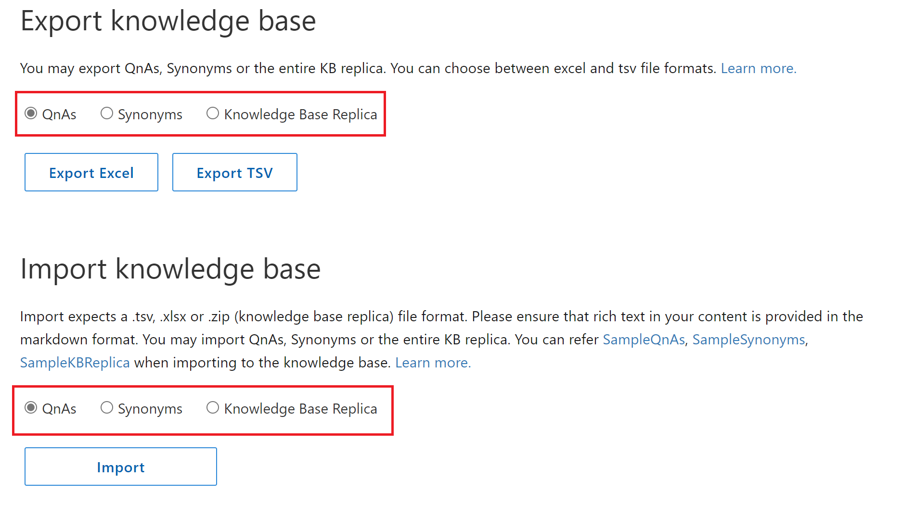

# Migrate a knowledge base using export-import

Migration is the process of creating a new knowledge base from an existing knowledge base. You may do this for several reasons:

* moving a knowledge base from QnA Maker GA to Custom question answering
* backup and restore process
* CI/CD pipeline
* move regions

Migrating a knowledge base requires exporting from an existing knowledge base, then importing into another.

> [!NOTE]
> Follow the below instructions to migrate your existing knowledge base to Custom question answering.

## Prerequisites

# [QnA Maker GA (stable release)](#tab/v1)

> * If you don't have an Azure subscription, [create a free account](https://azure.microsoft.com/free/cognitive-services/) before you begin.
> * A [QnA Maker resource](https://ms.portal.azure.com/#create/Microsoft.CognitiveServicesQnAMaker) created in the Azure portal. Remember your Azure Active Directory ID, Subscription, QnA resource name you selected when you created the resource.
> * Set up a new [QnA Maker service](../How-To/set-up-qnamaker-service-azure.md)

# [Custom question answering (preview release)](#tab/v2)

> * If you don't have an Azure subscription, [create a free account](https://azure.microsoft.com/free/cognitive-services/) before you begin.
> * A [Text Analytics resource](https://ms.portal.azure.com/#create/Microsoft.CognitiveServicesTextAnalytics) with the custom question answering feature enabled in the Azure portal. Remember your Azure Active Directory ID, Subscription, and Text Analytics resource name you selected when you created the resource.
> * Set up [Custom question answering](../How-To/set-up-qnamaker-service-azure.md)

---

## Migrate a knowledge base from QnA Maker
1. Sign in to [QnA Maker portal](https://qnamaker.ai).
1. Select the knowledge base you want to migrate.

1. On the **Settings** page, you can Export **QnAs**, **Synonyms**, or **Knowledge Base Replica**. You can chooose to download in .tsv/.xlsx.

   1. **QnAs**: When exporting QnAs, all QnA pairs (with questions, answers, metadata, follow-up prompts, and the data source names) are downloaded. The QnA IDs that are exported with the questions and answers may be used to update a specific QnA pair using the [update API](/rest/api/cognitiveservices/qnamaker/knowledgebase/update). The QnA ID for a specific QnA pair remains unchanged across multiple export operations.
   2. **Synonyms**: You can export Synonyms that have been added to the knowledge base.
   4. **Knowledge Base Replica**: If you want to download the entire knowledge base with synonyms and other settings, you should choose this option.

   > [!div class="mx-imgBorder"]
   > 

1. Select **Create a knowledge base** from the top menu then create an _empty_ knowledge base. It is empty because when you create it, you are not going to add any URLs or files. Those are added during the import step, after creation. Set the new knowledge base name only. Duplicate names are supported and special characters are supported as well.

    Do not select anything from Step 4 because those values will be overwritten when you import the file. In Step 5, select **Create**.

1. In this new knowledge base, open the **Settings** tab and select either of the following options: **QnAs**, **Synonyms**, or **Knowledge Base Replica**. 

   1. **QnAs**: This option imports all QnA pairs. **The QnA pairs created in the new knowledge base shall have the same QnA ID as present in the exported file**. You can refer [SampleQnAs.xlsx](https://aka.ms/qnamaker-sampleqnas), [SampleQnAs.tsv](https://aka.ms/qnamaker-sampleqnastsv) to import QnAs.
   2. **Synonyms**: This option can be used to import synonyms to the knowledge base. You can refer [SampleSynonyms.xlsx](https://aka.ms/qnamaker-samplesynonyms), [SampleSynonyms.tsv](https://aka.ms/qnamaker-samplesynonymstsv) to import synonyms.
   3. **Knowledge Base Replica**: TThis option can be used to import KB replica with QnAs, Synonyms and Settings. You can refer [KBReplicaSampleExcel](https://aka.ms/qnamaker-samplereplica), [KBReplicaSampleTSV](https://aka.ms/qnamaker-samplereplicatsv) for more details. If you also want to add unstructured content to the replica, refer [CustomQnAKBReplicaSample](https://aka.ms/qnamaker-samplev2replica).

      1. Either QnAs or Unstructured content is required when importing replica. Unstructured documents are only valid for Custom question answering.
      2. Synonyms file is not mandatory when importing replica.
      3. Settings file is mandatory when importing replica.

         |Settings|Update permitted when importing to QnA Maker KB?|Update permitted when importing to Custom question answering KB?|
         |:--|--|--|
         |DefaultAnswerForKB|No|Yes|
         |EnableActiveLearning (True/False)|Yes|No|
         |EnableMultiTurnExtraction (True/False)|Yes|Yes|
         |DefaultAnswerforMultiturn|Yes|Yes|
         |Language|No|No|

1. **Test** the new knowledge base using the Test panel. Learn how to [test your knowledge base](../How-To/test-knowledge-base.md).

1. **Publish** the knowledge base and create a chat bot. Learn how to [publish your knowledge base](../Quickstarts/create-publish-knowledge-base.md#publish-the-knowledge-base).

## Programmatically migrate a knowledge base from QnA Maker

The migration process is programmatically available using the following REST APIs:

**Export**

* [Download knowledge base API](/rest/api/cognitiveservices/qnamaker4.0/knowledgebase/download)

**Import**

* [Replace API (reload with same knowledge base ID)](/rest/api/cognitiveservices/qnamaker4.0/knowledgebase/replace)
* [Create API (load with new knowledge base ID)](/rest/api/cognitiveservices/qnamaker4.0/knowledgebase/create)

## Chat logs
There is no way to migrate chat logs, since the new knowledge base uses Application Insights for storing chat logs.

## Next steps

> [!div class="nextstepaction"]
> [Edit a knowledge base](../How-To/edit-knowledge-base.md)
