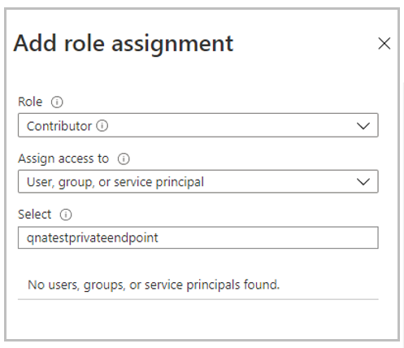
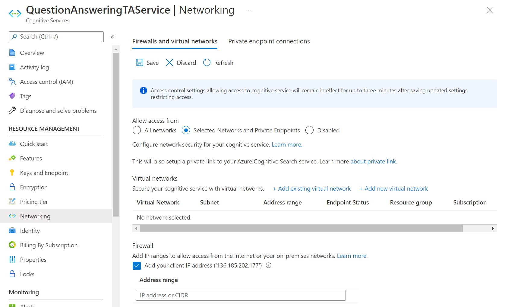

# Private Endpoints

Azure Private Endpoint is a network interface that connects you privately and securely to a service powered by Azure Private Link. Now, Custom question answering provides you support to create private endpoints to the Azure Search Service.

Private endpoints are provided by [Azure Private Link](../../private-link/private-link-overview.md), as a separate service. For more information about costs, see the [pricing page.](https://azure.microsoft.com/pricing/details/private-link/) 

## Prerequisites
> [!div class="checklist"]
> * If you don't have an Azure subscription, create a [free account](https://azure.microsoft.com/free/cognitive-services/) before you begin.
> * A [Text Analytics resource](https://ms.portal.azure.com/?quickstart=true#create/Microsoft.CognitiveServicesTextAnalytics) (with Custom question answering feature) created in the Azure portal. Remember your Azure Active Directory ID, Subscription, Text Analytics resource name you selected when you created the resource.

## Steps to enable private endpoint
1. Assign *Contributer* role to Text Analytics service in the Azure Search Service instance. This operation requires *Owner* access to the subscription. Go to Identity tab in the service resource to get the identity.

> [!div class="mx-imgBorder"]
> 

2. Add the above identity as *Contributer* by going to Azure Search Service IAM tab.

3. Click on *Add role assignments*, add the identity and click on *Save*.

4. Now, go to *Networking* tab in the Azure Search Service instance and switch Endpoint connectivity data from *Public* to *Private*. This operation is a long running process and can take up to 30 mins to complete. 

5. Go to *Networking* tab of Text Analytics service and under the *Allow access from*, select the *Selected Networks and private endpoints* option and Click *save*.
 
> [!div class="mx-imgBorder"]
> 

This will establish a private endpoint connection between Text Analytics service and Azure cognitive search service instance. You can verify the Private endpoint connection on the *Networking* tab of Azure Search service instance. Once the whole operation is completed, you are good to use your Text Analytics service. 

## Support details
 * We don't support changes to Azure Cognitive Search service once you enable private access to your Text Analytics service. If you change the Azure Cognitive Search service via 'Configuration' tab after you have enabled private access, the Text Analytics service will become unusable.
 * After establishing Private Endpoint Connection, if you switch Azure Search Service Networking to 'Public', you won't be able to use the Text Analytics service. Azure Search Service Networking needs to be 'Private' for the Private Endpoint Connection to work
