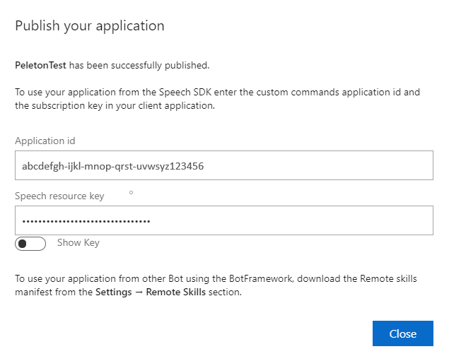
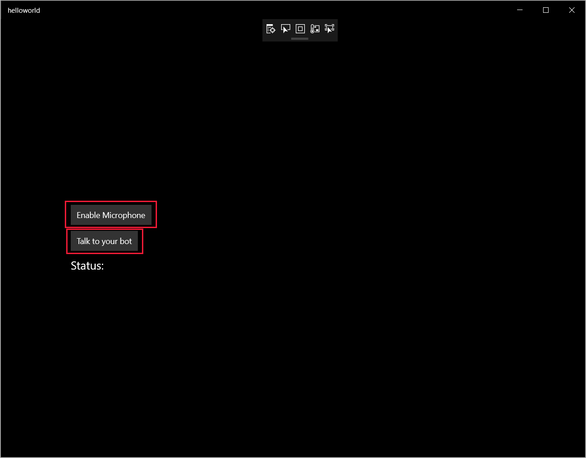

# Integrate with a client application using Speech SDK

[!INCLUDE [deprecation notice](./includes/custom-commands-retire.md)]

In this article, you learn how to make requests to a published Custom Commands application from the Speech SDK running in an UWP application. In order to establish a connection to the Custom Commands application, you need:

- Publish a Custom Commands application and get an application identifier (App ID)
- Create a Universal Windows Platform (UWP) client app using the Speech SDK to allow you to talk to your Custom Commands application

## Prerequisites

A Custom Commands application is required to complete this article. If you haven't created a Custom Commands application, you can do so following the quickstarts:
> [!div class = "checklist"]
> * [Create a Custom Commands application](quickstart-custom-commands-application.md)

You'll also need:
> [!div class = "checklist"]
> * [Visual Studio 2019](https://visualstudio.microsoft.com/downloads/) or higher. This guide is based on Visual Studio 2019.
> * An Azure Cognitive Services Speech resource key and region: Create a Speech resource on the [Azure portal](https://portal.azure.com). For more information, see [Create a new Azure Cognitive Services resource](~/articles/cognitive-services/cognitive-services-apis-create-account.md?tabs=speech#create-a-new-azure-cognitive-services-resource).
> * [Enable your device for development](/windows/uwp/get-started/enable-your-device-for-development)

## Step 1: Publish Custom Commands application

1. Open your previously created Custom Commands application
1. Go to **Settings**, select **LUIS resource**
1. If **Prediction resource** is not assigned, select a query prediction key or create a new one

    Query prediction key is always required before publishing an application. For more information about LUIS resources, reference [Create LUIS Resource](../luis/luis-how-to-azure-subscription.md)

1. Go back to editing Commands, Select **Publish**

   > [!div class="mx-imgBorder"]
   > 

1. Copy the App ID from the publish notification for later use
1. Copy the Speech Resource Key for later use

## Step 2: Create a Visual Studio project

Create a Visual Studio project for UWP development and [install the Speech SDK](./quickstarts/setup-platform.md?pivots=programming-language-csharp&tabs=uwp).

## Step 3: Add sample code

In this step, we add the XAML code that defines the user interface of the application, and add the C# code-behind implementation.

### XAML code

Create the application's user interface by adding the XAML code.

1. In **Solution Explorer**, open `MainPage.xaml`

1. In the designer's XAML view, replace the entire contents with the following code snippet:

   ```xml
   <Page
       x:Class="helloworld.MainPage"
       xmlns="http://schemas.microsoft.com/winfx/2006/xaml/presentation"
       xmlns:x="http://schemas.microsoft.com/winfx/2006/xaml"
       xmlns:local="using:helloworld"
       xmlns:d="http://schemas.microsoft.com/expression/blend/2008"
       xmlns:mc="http://schemas.openxmlformats.org/markup-compatibility/2006"
       mc:Ignorable="d"
       Background="{ThemeResource ApplicationPageBackgroundThemeBrush}">

       <Grid>
           <StackPanel Orientation="Vertical" HorizontalAlignment="Center"
                       Margin="20,50,0,0" VerticalAlignment="Center" Width="800">
               <Button x:Name="EnableMicrophoneButton" Content="Enable Microphone"
                       Margin="0,10,10,0" Click="EnableMicrophone_ButtonClicked"
                       Height="35"/>
               <Button x:Name="ListenButton" Content="Talk"
                       Margin="0,10,10,0" Click="ListenButton_ButtonClicked"
                       Height="35"/>
               <StackPanel x:Name="StatusPanel" Orientation="Vertical"
                           RelativePanel.AlignBottomWithPanel="True"
                           RelativePanel.AlignRightWithPanel="True"
                           RelativePanel.AlignLeftWithPanel="True">
                   <TextBlock x:Name="StatusLabel" Margin="0,10,10,0"
                              TextWrapping="Wrap" Text="Status:" FontSize="20"/>
                   <Border x:Name="StatusBorder" Margin="0,0,0,0">
                       <ScrollViewer VerticalScrollMode="Auto"
                                     VerticalScrollBarVisibility="Auto" MaxHeight="200">
                           <!-- Use LiveSetting to enable screen readers to announce
                                the status update. -->
                           <TextBlock
                               x:Name="StatusBlock" FontWeight="Bold"
                               AutomationProperties.LiveSetting="Assertive"
                               MaxWidth="{Binding ElementName=Splitter, Path=ActualWidth}"
                               Margin="10,10,10,20" TextWrapping="Wrap"  />
                       </ScrollViewer>
                   </Border>
               </StackPanel>
           </StackPanel>
           <MediaElement x:Name="mediaElement"/>
       </Grid>
   </Page>
   ```

The Design view is updated to show the application's user interface.

### C# code-behind source

Add the code-behind source so that the application works as expected. The code-behind source includes:

- Required `using` statements for the `Speech` and `Speech.Dialog` namespaces
- A simple implementation to ensure microphone access, wired to a button handler
- Basic UI helpers to present messages and errors in the application
- A landing point for the initialization code path that will be populated later
- A helper to play back text-to-speech (without streaming support)
- An empty button handler to start listening that will be populated later

Add the code-behind source as follows:

1. In **Solution Explorer**, open the code-behind source file `MainPage.xaml.cs` (grouped under `MainPage.xaml`)

1. Replace the file's contents with the following code: 

   ```csharp
   using Microsoft.CognitiveServices.Speech;
   using Microsoft.CognitiveServices.Speech.Audio;
   using Microsoft.CognitiveServices.Speech.Dialog;
   using System;
   using System.IO;
   using System.Text;
   using Windows.UI.Xaml;
   using Windows.UI.Xaml.Controls;
   using Windows.UI.Xaml.Media;

   namespace helloworld
   {
       public sealed partial class MainPage : Page
       {
           private DialogServiceConnector connector;

           private enum NotifyType
           {
               StatusMessage,
               ErrorMessage
           };

           public MainPage()
           {
               this.InitializeComponent();
           }

           private async void EnableMicrophone_ButtonClicked(
               object sender, RoutedEventArgs e)
           {
               bool isMicAvailable = true;
               try
               {
                   var mediaCapture = new Windows.Media.Capture.MediaCapture();
                   var settings =
                       new Windows.Media.Capture.MediaCaptureInitializationSettings();
                   settings.StreamingCaptureMode =
                       Windows.Media.Capture.StreamingCaptureMode.Audio;
                   await mediaCapture.InitializeAsync(settings);
               }
               catch (Exception)
               {
                   isMicAvailable = false;
               }
               if (!isMicAvailable)
               {
                   await Windows.System.Launcher.LaunchUriAsync(
                       new Uri("ms-settings:privacy-microphone"));
               }
               else
               {
                   NotifyUser("Microphone was enabled", NotifyType.StatusMessage);
               }
           }

           private void NotifyUser(
               string strMessage, NotifyType type = NotifyType.StatusMessage)
           {
               // If called from the UI thread, then update immediately.
               // Otherwise, schedule a task on the UI thread to perform the update.
               if (Dispatcher.HasThreadAccess)
               {
                   UpdateStatus(strMessage, type);
               }
               else
               {
                   var task = Dispatcher.RunAsync(
                       Windows.UI.Core.CoreDispatcherPriority.Normal,
                       () => UpdateStatus(strMessage, type));
               }
           }

           private void UpdateStatus(string strMessage, NotifyType type)
           {
               switch (type)
               {
                   case NotifyType.StatusMessage:
                       StatusBorder.Background = new SolidColorBrush(
                           Windows.UI.Colors.Green);
                       break;
                   case NotifyType.ErrorMessage:
                       StatusBorder.Background = new SolidColorBrush(
                           Windows.UI.Colors.Red);
                       break;
               }
               StatusBlock.Text += string.IsNullOrEmpty(StatusBlock.Text)
                   ? strMessage : "\n" + strMessage;

               if (!string.IsNullOrEmpty(StatusBlock.Text))
               {
                   StatusBorder.Visibility = Visibility.Visible;
                   StatusPanel.Visibility = Visibility.Visible;
               }
               else
               {
                   StatusBorder.Visibility = Visibility.Collapsed;
                   StatusPanel.Visibility = Visibility.Collapsed;
               }
               // Raise an event if necessary to enable a screen reader
               // to announce the status update.
               var peer = Windows.UI.Xaml.Automation.Peers.FrameworkElementAutomationPeer.FromElement(StatusBlock);
               if (peer != null)
               {
                   peer.RaiseAutomationEvent(
                       Windows.UI.Xaml.Automation.Peers.AutomationEvents.LiveRegionChanged);
               }
           }

           // Waits for and accumulates all audio associated with a given
           // PullAudioOutputStream and then plays it to the MediaElement. Long spoken
           // audio will create extra latency and a streaming playback solution
           // (that plays audio while it continues to be received) should be used --
           // see the samples for examples of this.
           private void SynchronouslyPlayActivityAudio(
               PullAudioOutputStream activityAudio)
           {
               var playbackStreamWithHeader = new MemoryStream();
               playbackStreamWithHeader.Write(Encoding.ASCII.GetBytes("RIFF"), 0, 4); // ChunkID
               playbackStreamWithHeader.Write(BitConverter.GetBytes(UInt32.MaxValue), 0, 4); // ChunkSize: max
               playbackStreamWithHeader.Write(Encoding.ASCII.GetBytes("WAVE"), 0, 4); // Format
               playbackStreamWithHeader.Write(Encoding.ASCII.GetBytes("fmt "), 0, 4); // Subchunk1ID
               playbackStreamWithHeader.Write(BitConverter.GetBytes(16), 0, 4); // Subchunk1Size: PCM
               playbackStreamWithHeader.Write(BitConverter.GetBytes(1), 0, 2); // AudioFormat: PCM
               playbackStreamWithHeader.Write(BitConverter.GetBytes(1), 0, 2); // NumChannels: mono
               playbackStreamWithHeader.Write(BitConverter.GetBytes(16000), 0, 4); // SampleRate: 16kHz
               playbackStreamWithHeader.Write(BitConverter.GetBytes(32000), 0, 4); // ByteRate
               playbackStreamWithHeader.Write(BitConverter.GetBytes(2), 0, 2); // BlockAlign
               playbackStreamWithHeader.Write(BitConverter.GetBytes(16), 0, 2); // BitsPerSample: 16-bit
               playbackStreamWithHeader.Write(Encoding.ASCII.GetBytes("data"), 0, 4); // Subchunk2ID
               playbackStreamWithHeader.Write(BitConverter.GetBytes(UInt32.MaxValue), 0, 4); // Subchunk2Size

               byte[] pullBuffer = new byte[2056];

               uint lastRead = 0;
               do
               {
                   lastRead = activityAudio.Read(pullBuffer);
                   playbackStreamWithHeader.Write(pullBuffer, 0, (int)lastRead);
               }
               while (lastRead == pullBuffer.Length);

               var task = Dispatcher.RunAsync(
                   Windows.UI.Core.CoreDispatcherPriority.Normal, () =>
               {
                   mediaElement.SetSource(
                       playbackStreamWithHeader.AsRandomAccessStream(), "audio/wav");
                   mediaElement.Play();
               });
           }

           private void InitializeDialogServiceConnector()
           {
               // New code will go here
           }

           private async void ListenButton_ButtonClicked(
               object sender, RoutedEventArgs e)
           {
               // New code will go here
           }
       }
   }
   ```
    > [!NOTE]
    > If you see error: "The type 'Object' is defined in an assembly that is not referenced"
    > 1. Right-client your solution.
    > 1. Choose **Manage NuGet Packages for Solution**, Select **Updates** 
    > 1. If you see **Microsoft.NETCore.UniversalWindowsPlatform** in the update list, Update **Microsoft.NETCore.UniversalWindowsPlatform** to newest version

1. Add the following code to the method body of `InitializeDialogServiceConnector`

   ```csharp
   // This code creates the `DialogServiceConnector` with your resource information.
   // create a DialogServiceConfig by providing a Custom Commands application id and Speech resource key
   // The RecoLanguage property is optional (default en-US); note that only en-US is supported in Preview
   const string speechCommandsApplicationId = "YourApplicationId"; // Your application id
   const string speechSubscriptionKey = "YourSpeechSubscriptionKey"; // Your Speech resource key
   const string region = "YourServiceRegion"; // The Speech resource region. 

   var speechCommandsConfig = CustomCommandsConfig.FromSubscription(speechCommandsApplicationId, speechSubscriptionKey, region);
   speechCommandsConfig.SetProperty(PropertyId.SpeechServiceConnection_RecoLanguage, "en-us");
   connector = new DialogServiceConnector(speechCommandsConfig);
   ```

1. Replace the strings `YourApplicationId`, `YourSpeechSubscriptionKey`, and `YourServiceRegion` with your own values for your app, speech key, and [region](regions.md)

1. Append the following code snippet to the end of the method body of `InitializeDialogServiceConnector`

   ```csharp
   //
   // This code sets up handlers for events relied on by `DialogServiceConnector` to communicate its activities,
   // speech recognition results, and other information.
   //
   // ActivityReceived is the main way your client will receive messages, audio, and events
   connector.ActivityReceived += (sender, activityReceivedEventArgs) =>
   {
       NotifyUser(
           $"Activity received, hasAudio={activityReceivedEventArgs.HasAudio} activity={activityReceivedEventArgs.Activity}");

       if (activityReceivedEventArgs.HasAudio)
       {
           SynchronouslyPlayActivityAudio(activityReceivedEventArgs.Audio);
       }
   };

   // Canceled will be signaled when a turn is aborted or experiences an error condition
   connector.Canceled += (sender, canceledEventArgs) =>
   {
       NotifyUser($"Canceled, reason={canceledEventArgs.Reason}");
       if (canceledEventArgs.Reason == CancellationReason.Error)
       {
           NotifyUser(
               $"Error: code={canceledEventArgs.ErrorCode}, details={canceledEventArgs.ErrorDetails}");
       }
   };

   // Recognizing (not 'Recognized') will provide the intermediate recognized text
   // while an audio stream is being processed
   connector.Recognizing += (sender, recognitionEventArgs) =>
   {
       NotifyUser($"Recognizing! in-progress text={recognitionEventArgs.Result.Text}");
   };

   // Recognized (not 'Recognizing') will provide the final recognized text
   // once audio capture is completed
   connector.Recognized += (sender, recognitionEventArgs) =>
   {
       NotifyUser($"Final speech to text result: '{recognitionEventArgs.Result.Text}'");
   };

   // SessionStarted will notify when audio begins flowing to the service for a turn
   connector.SessionStarted += (sender, sessionEventArgs) =>
   {
       NotifyUser($"Now Listening! Session started, id={sessionEventArgs.SessionId}");
   };

   // SessionStopped will notify when a turn is complete and
   // it's safe to begin listening again
   connector.SessionStopped += (sender, sessionEventArgs) =>
   {
       NotifyUser($"Listening complete. Session ended, id={sessionEventArgs.SessionId}");
   };
   ```

1. Add the following code snippet to the body of the `ListenButton_ButtonClicked` method in the `MainPage` class

   ```csharp
   // This code sets up `DialogServiceConnector` to listen, since you already established the configuration and
   // registered the event handlers.
   if (connector == null)
   {
       InitializeDialogServiceConnector();
       // Optional step to speed up first interaction: if not called,
       // connection happens automatically on first use
       var connectTask = connector.ConnectAsync();
   }

   try
   {
       // Start sending audio
       await connector.ListenOnceAsync();
   }
   catch (Exception ex)
   {
       NotifyUser($"Exception: {ex.ToString()}", NotifyType.ErrorMessage);
   }
   ```

1. From the menu bar, choose **File** > **Save All** to save your changes

## Try it out

1. From the menu bar, choose **Build** > **Build Solution** to build the application. The code should compile without errors.

1. Choose **Debug** > **Start Debugging** (or press **F5**) to start the application. The **helloworld** window appears.

   

1. Select **Enable Microphone**. If the access permission request pops up, select **Yes**.

   

1. Select **Talk**, and speak an English phrase or sentence into your device's microphone. Your speech is transmitted to the Direct Line Speech channel and transcribed to text, which appears in the window.

## Next steps

> [!div class="nextstepaction"]
> [How-to: send activity to client application (Preview)](./how-to-custom-commands-send-activity-to-client.md)