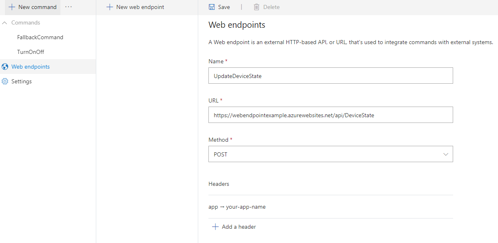
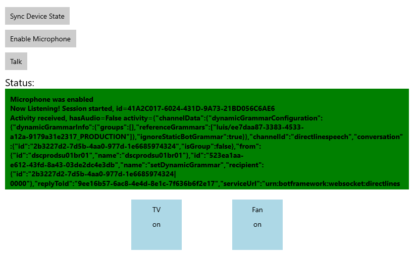

# Set up web endpoints

In this article, you will learn how to setup web endpoints in a Custom Commands application that allow you to make HTTP requests from a client application. You will complete the following tasks:

- Set up web endpoints in Custom Commands application
- Call web endpoints in Custom Commands application
- Receive the web endpoints response
- Integrate the web endpoints response into a custom JSON payload, send, and visualize it from a C# UWP Speech SDK client application

## Prerequisites
> [!div class = "checklist"]
> * [Visual Studio 2019](https://visualstudio.microsoft.com/downloads/)
> * An Azure subscription key for Speech service:
[Get one for free](overview.md#try-the-speech-service-for-free) or create it on the [Azure portal](https://portal.azure.com)
> * A previously [created Custom Commands app](quickstart-custom-commands-application.md)
> * A Speech SDK enabled client app:
[How-to: end activity to client application](./how-to-custom-commands-setup-speech-sdk.md)

## Setup web endpoints

1. Open the Custom Commands application you previously created.
1. Go to "Web endpoints", click "New web endpoint".

   > [!div class="mx-imgBorder"]
   > 

   | Setting | Suggested value | Description |
   | ------- | --------------- | ----------- |
   | Name | UpdateDeviceState | Name for the web endpoint. |
   | URL | https://webendpointexample.azurewebsites.net/api/DeviceState | The URL of the endpoint you wish your custom command app to talk to. |
   | Method | POST | The allowed interactions (such as GET, POST) with your endpoint.|
   | Headers | Key: app, Value: take the first 8 digits of your applicationId | The header parameters to include in the request header.|

    > [!NOTE]
    > - The example web endpoint created using [Azure Function](https://docs.microsoft.com/azure/azure-functions/), which hooks up with the database that saves the device state of the tv and fan
    > - The suggested header is only needed for the example endpoint
    > - To make sure the value of the header is unique in our example endpoint, take the first 8 digits of your applicationId
    > - In real world, the web endpoint can be the endpoint to the [IOT hub](https://docs.microsoft.com/azure/iot-hub/about-iot-hub) that manages your devices

1. Click **Save**.

## Call web endpoints

1. Go to **TurnOnOff** command, select **ConfirmationResponse** under completion rule, then select **Add an action**.
1. Under **New Action-Type**, select **Call web endpoint**
1. In **Edit Action - Endpoints**, select **UpdateDeviceState**, which is the web endpoint we created.  
1. In **Configuration**, put the following values:
   > [!div class="mx-imgBorder"]
   > 

   | Setting | Suggested value | Description |
   | ------- | --------------- | ----------- |
   | Endpoints | UpdateDeviceState | The web endpoint you wish to call in this action. |
   | Query parameters | item={SubjectDevice}&&value={OnOff} | The query parameters to append to the web endpoint URL.  |
   | Body content | N/A | The body content of the request. |

    > [!NOTE]
    > - The suggested query parameters are only needed for the example endpoint

1. In **On Success - Action to execute**, select **Send speech response**.

    In **Simple editor**, enter `{SubjectDevice} is {OnOff}`.

   > [!div class="mx-imgBorder"]
   > 

   | Setting | Suggested value | Description |
   | ------- | --------------- | ----------- |
   | Action to execute | Send speech response | Action to execute if the request to web endpoint succeeds |

   > [!NOTE]
   > - You can also directly access the fields in the http response by using `{YourWebEndpointName.FieldName}`. For example: `{UpdateDeviceState.TV}`

1. In **On Failure - Action to execute**, select **Send speech response**

    In **Simple editor**, enter `Sorry, {WebEndpointErrorMessage}`.

   > [!div class="mx-imgBorder"]
   > 

   | Setting | Suggested value | Description |
   | ------- | --------------- | ----------- |
   | Action to execute | Send speech response | Action to execute if the request to web endpoint fails |

   > [!NOTE]
   > - `{WebEndpointErrorMessage}` is optional. You are free to remove it if you don't want to expose any error message.
   > - Within our example endpoint, we send back http response with detailed error messages for common errors such as missing header parameters.

### Try it out in test portal
- On Success response\
Save, train and test
   > [!div class="mx-imgBorder"]
   > 
- On Fail response\
Remove one of the query parameters, save, retrain, and test
   > [!div class="mx-imgBorder"]
   > 

## Integrate with client application

In [How-to: Send activity to client application (Preview)](./how-to-custom-commands-send-activity-to-client.md), you added a **Send activity to client** action. The activity is sent to the client application whether or not **Call web endpoint** action is successful or not.
However, in most of the cases you only want to send activity to the client application when the call to the web endpoint is successful. In this example, this is when the device's state is successfully updated.

1. Delete the **Send activity to client** action you previously added.
1. Edit call web endpoint:
    1. In **Configuration**, make sure **Query Parameters** is `item={SubjectDevice}&&value={OnOff}`
    1. In **On Success**, change **Action to execute** to **Send activity to client**
    1. Copy the JSON below to the **Activity Content**
   ```json
   {
     "type": "event",
     "name": "UpdateDeviceState",
     "state": "{OnOff}",
     "device": "{SubjectDevice}"
   }
   ```
    > [!div class="mx-imgBorder"]
    > 

Now you only send activity to client when the request to web endpoint is successful.

### Create visuals for syncing device state
Add the following XML to `MainPage.xaml` above the `"EnableMicrophoneButton"` block.

```xml
<Button x:Name="SyncDeviceStateButton" Content="Sync Device State"
        Margin="0,10,10,0" Click="SyncDeviceState_ButtonClicked"
        Height="35"/>
<Button x:Name="EnableMicrophoneButton" ......
        .........../>
```

### Sync device state

In `MainPage.xaml.cs`, add the reference `using Windows.Web.Http;`. Add the following code to the `MainPage` class. This method will send a GET request to the example endpoint, and extract the current device state for your app. Make sure to change `<your_app_name>` to what you used in the **header** in Custom Command Web endpoint

```C#
private async void SyncDeviceState_ButtonClicked(object sender, RoutedEventArgs e)
{
    //Create an HTTP client object
    var httpClient = new HttpClient();

    //Add a user-agent header to the GET request.
    var your_app_name = "<your-app-name>";

    Uri endpoint = new Uri("https://webendpointexample.azurewebsites.net/api/DeviceState");
    var requestMessage = new HttpRequestMessage(HttpMethod.Get, endpoint);
    requestMessage.Headers.Add("app", $"{your_app_name}");

    try
    {
        //Send the GET request
        var httpResponse = await httpClient.SendRequestAsync(requestMessage);
        httpResponse.EnsureSuccessStatusCode();
        var httpResponseBody = await httpResponse.Content.ReadAsStringAsync();
        dynamic deviceState = JsonConvert.DeserializeObject(httpResponseBody);
        var TVState = deviceState.TV.ToString();
        var FanState = deviceState.Fan.ToString();
        await CoreApplication.MainView.CoreWindow.Dispatcher.RunAsync(
            CoreDispatcherPriority.Normal,
            () =>
            {
                State_TV.Text = TVState;
                State_Fan.Text = FanState;
            });
    }
    catch (Exception ex)
    {
        NotifyUser(
            $"Unable to sync device status: {ex.Message}");
    }
}
```

## Try it out

1. Start the application
1. Click Sync Device State.\
If you tested out the app with `turn on tv` in previous section, you would see the TV shows as "on".
    > [!div class="mx-imgBorder"]
    > 
1. Select Enable microphone
1. Select the Talk button
1. Say `turn on the fan`
1. The visual state of the fan should change to "on"
    > [!div class="mx-imgBorder"]
    > 

## Next steps

> [!div class="nextstepaction"]
> [Export Custom Commands application as a remote skill](./how-to-custom-commands-integrate-remote-skills.md)

