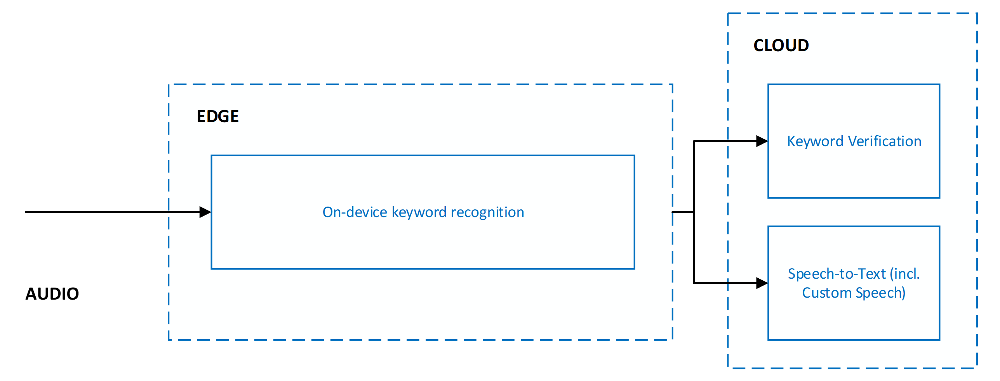

# Keyword Verification overview

Keyword Verification is a cloud service that reduces the impact of false accepts from on-device models with robust models running on Azure. There is no tuning or training required for Keyword Verification to work with your keyword. Incremental model updates are continually deployed to the service to improve accuracy and latency, completely transparent to client applications.

## Keyword Verification and Speech-to-text

When Keyword Verification is used, it is always in combination with Speech-to-text. Both services run in parallel. This means that audio is sent to both services for simultaneous processing.

Running Keyword Verification and Speech-to-text in parallel yields the following benefits:
1. **No additional latency on Speech-to-text results** – Parallel execution means Keyword Verification adds no latency, and the client receives Speech-to-text results just as quickly. If Keyword Verification determines the keyword was not present in the audio, Speech-to-text processing is terminated, which protects against unnecessary Speech-to-text processing. However, network and cloud model processing increases the user-perceived latency of voice activation. For details, see [Recommendations and guidelines](keyword-recognition-guidelines.md)).
2. **Forced keyword prefix in Speech-to-text results** – Speech-to-text processing will ensure that the results sent to the client are prefixed with the keyword. This allows for increased accuracy in the Speech-to-text results for speech that follows the keyword.
3. **Increased Speech-to-text timeout** – Due to the expected presence of the keyword at the beginning of audio, Speech-to-text will allow for a longer pause of up to 5 seconds after the keyword, before determining end of speech and terminating Speech-to-text processing. This ensures the end-user experience is correctly handled for both staged commands (*\<keyword> \<pause> \<command>*) and chained commands (*\<keyword> \<command>*). 

## Keyword Verification responses and latency considerations

For each request to the service, Keyword Verification will return one of two responses: Accepted or Rejected. The processing latency varies depending on the length of the keyword and the length of the audio segment expected to contain the keyword. *Note: processing latency does not include network cost between the client and Azure Speech services.*

| Keyword Verification response | Description |
| ----------------------------- | ----------- |
| Accepted | Indicates the service believed the keyword was present in the audio stream provided as part of the request. |
| Rejected | Indicates the service believed the keyword was not present in the audio stream provided as part of the request. |

Rejected cases often yield higher latencies as the service processes more audio than accepted cases. By default, Keyword Verification will process a maximum of two seconds of audio to search for the keyword. If the keyword is determined not to be present in the two seconds, the service will time out and signal a rejected response to the client.

## Using Keyword Verification with on-device models from Custom Keyword

The Speech SDK facilitates seamless use of on-device models generated using Custom Keyword with Keyword Verification and Speech-to-text. It transparently handles:
1. Audio gating to Keyword Verification & Speech recognition based on the outcome of on-device model.
2. Communicating the keyword to the Keyword Verification service.
3. Communicating any additional metadata to the cloud for orchestrating the end-to-end scenario. 

You do not need to explicitly specify any configuration parameters. All necessary information will automatically be extracted from the on-device model generated by Custom Keyword.

The sample and tutorials linked below show how to use the Speech SDK:
 * [Voice assistant samples on GitHub.](https://github.com/Azure-Samples/Cognitive-Services-Voice-Assistant)
 * [Tutorial: Voice enable your assistant built using Azure Bot Service with the C# Speech SDK.](https://docs.microsoft.com/azure/cognitive-services/speech-service/tutorial-voice-enable-your-bot-speech-sdk)
 * [Tutorial: Create a Custom Commands application with simple voice commands.](https://docs.microsoft.com/azure/cognitive-services/speech-service/how-to-develop-custom-commands-application)

## Pricing

Keyword Verification is always used in combination with Speech-to-text, and there is no cost to using Keyword Verification beyond the cost of Speech-to-text. 

## Next steps

* [Learn more about user experience guidelines with Keyword Verification.](keyword-recognition-guidelines.md#user-experience-recommendations-with-keyword-verification)
* [Get the Speech SDK.](speech-sdk.md)
* [Learn more about Voice Assistants.](voice-assistants.md)
