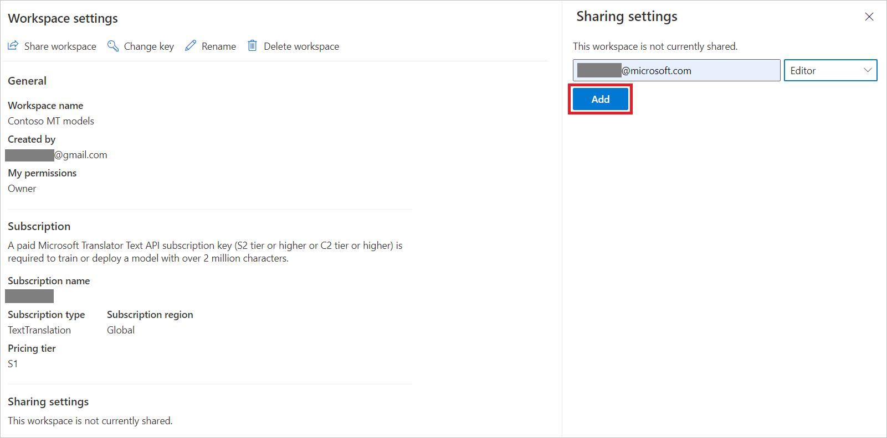
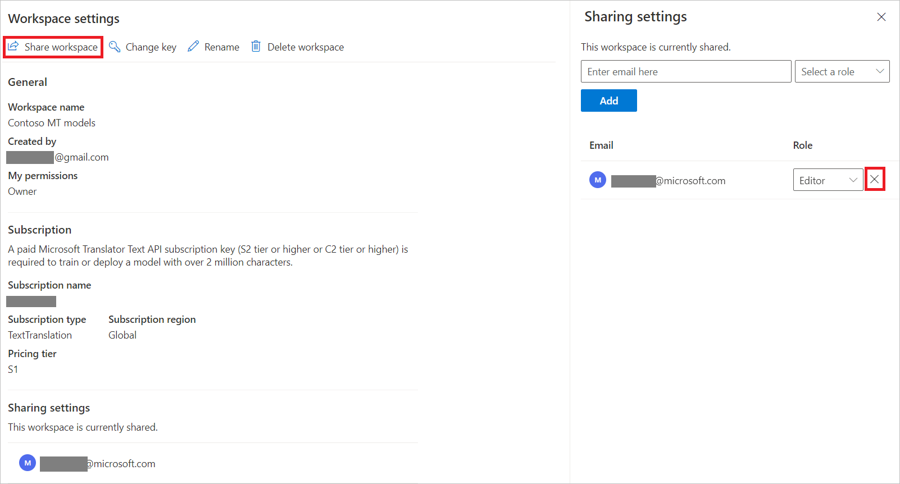

# Manage workspace

The first step before building a custom model is to prepare starting with the prerequisites below and then creating a workspace. Workspaces are places to manage your documents, projects, models. When you create a workspace, you can choose to use the workspace independently, share it with teammates or you can divide up the work and create multiple workspaces.

## Create workspace

Review [how to create a workspace](../quickstart.md#create-workspace) to learn the steps.

## Manage workspace settings

Select a workspace and navigate to 'Workspace settings' where you can manage your workspace:

* Change or delete the resource key in the global resource region. If using a specific region resource key, you will need to create a new workspace.
* Change the workspace name
* Share the workspace with others
* Delete the workspace

### Share workspace for collaboration

The person who creates the Workspace is the owner. Within the 'Workspace settings', an owner can designate three different roles for collaborative workspaces:

* Owner: An owner has full permission to the workspace.
* Editor: An editor in the workspace will be able to add documents, train models, and delete documents and projects. They can add a subscription key, but cannot modify who the workspace is shared with, delete the workspace, or change the workspace name.
* Reader: A reader in the workspace will be able to view (and download if available) all information in the workspace.

### Share workspace steps

1. Select *Share workspace*
2. Fill in the email address
3. Select role from the dropdown list
4. Select *Add*

### Unshare workspace steps

1. Select *Share workspace*
2. Select the `X` icon next to the *Role* of the email you want to remove

## Next Steps

* Learn [How to manage projects](how-to-manage-projects.md) to build high quality custom translation systems.
