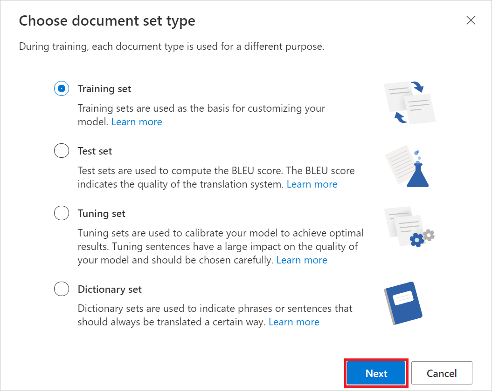
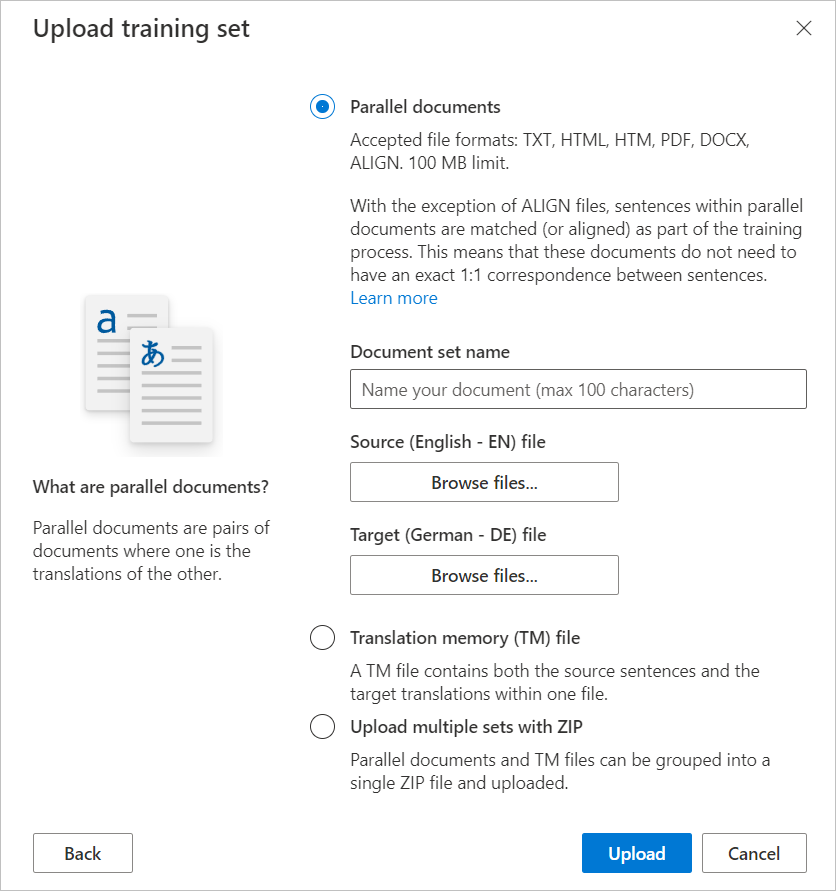
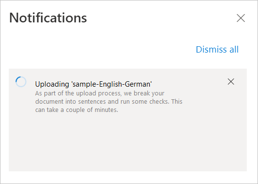

# Build and manage training set documents | Preview

> [!IMPORTANT]
> Custom Translator v2.0 is currently in public preview. Some features may not be supported or have constrained capabilities.

[Custom Translator](../../overview.md) enables you to a build translation system that reflects your business, industry, and domain-specific terminology and style. Training and deploying a custom system is easy and does not require any programming skills. Custom Translator enables you to upload the parallel document types and train your translation systems.

[Parallel documents](../../what-are-parallel-documents.md) are pairs of documents wherein one (target) is a translation of the other (source). One document in the pair contains sentences in the source language and the other document contains those sentences translated into the target language.

Before uploading your documents, review [document formats and naming convention](../../document-formats-naming-convention.md) guidance to make sure your file format is supported in Custom Translator.

## How to create document types

Finding in-domain quality data is often a challenging task that varies based on the customer classification. There are three common types:

1. An enterprise user with data in translation memory accumulated over many years.

1. A user with monolingual data that needs to be synthesized to a target language to form sentence-pair (a source sentence and its target translation).

1. A long-tail user who needs to crawl online portals to collect source sentences and synthesis-to-target sentences.

### Training material for each document types

| Source | What it does | Rules to follow |
|---|---|---|
| Bilingual training documents | Teaches the system your terminology and style. | **Be liberal**. Any in-domain human translation is better than machine translation. Add and remove documents as you go and try to improve the [BLEU score](/azure/cognitive-services/translator/custom-translator/what-is-bleu-score?WT.mc_id=aiml-43548-heboelma). |
| Tuning documents | Trains the Neural Machine Translation parameters. | **Be strict**. Compose them to be optimally representative of what you are going to translation in the future. |
| Test documents | Calculate the [BLEU score](../beginners-guide.md#what-is-a-bleu-score).| **Be strict**. Compose test documents to be optimally representative of what you plan to translate in the future. |
| Phrase dictionary | Forces the given translation with a probability of 1.00. | **Be restrictive**. A phrase dictionary is case-sensitive and any word or phrase listed is translated in the way you specify. In many cases, it is better to not use a phrase dictionary and let the system learn. |
| Sentence dictionary | Forces the given translation with a probability of 1.00. | **Be strict**. A sentence dictionary is case-insensitive and good for common in domain short sentences. For a sentence dictionary match to occur, the entire submitted sentence must match the source dictionary entry. If only a portion of the sentence matches, the entry won't match. |

## How to upload documents

Document types are associated with the language pair selected when you create a project.

1. Sign-in to [Custom Translator](https://portal.customtranslator.azure.ai) portal. Your default workspace is loaded and a list of previously created projects are displayed.

1. Select the desired project **Name**. By default, the **Manage documents** blade is selected and a list of all relevant documents are displayed.

1. Select **Add document set** and choose the document type:

    - Training set
    - Testing set
    - Tuning set
    - Dictionary set:
        - Phrase Dictionary
        - Sentence Dictionary

1. Select **Next**.

   

   >[!Note]
   >Choosing **Dictionary set** launches **Choose type of dictionary** dialog.
   >Choose one and select **Next**

1. Select the document format dial.

    

    - For **Parallel documents**, fill in the `Document set name` and select **Browse files** to select source and target documents.
    - For **Translation memory (TM)** file or **Upload multiple sets with ZIP**, select **Browse files** to select the file

1. Select **Upload**.

At this point, Custom Translator is processing your documents and attempting to extract sentences as indicated in the upload notification. Once done processing, you will see the upload successful notification.

   

## Next steps

- Learn [how to train a model](train-custom-model.md).
- Learn [how to test and evaluate model quality](view-model-test-translation.md).
- Learn [how to publish model](publish-model.md).
- Learn [how to translate with custom models](translate-with-custom-model.md).
