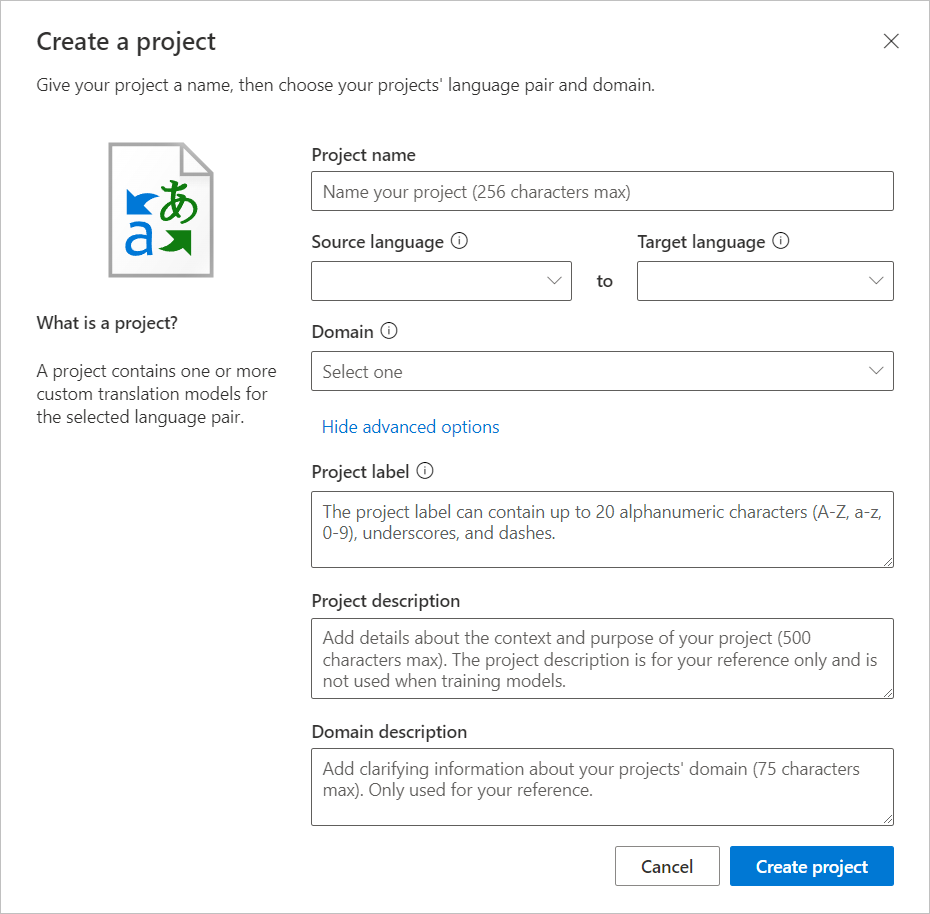
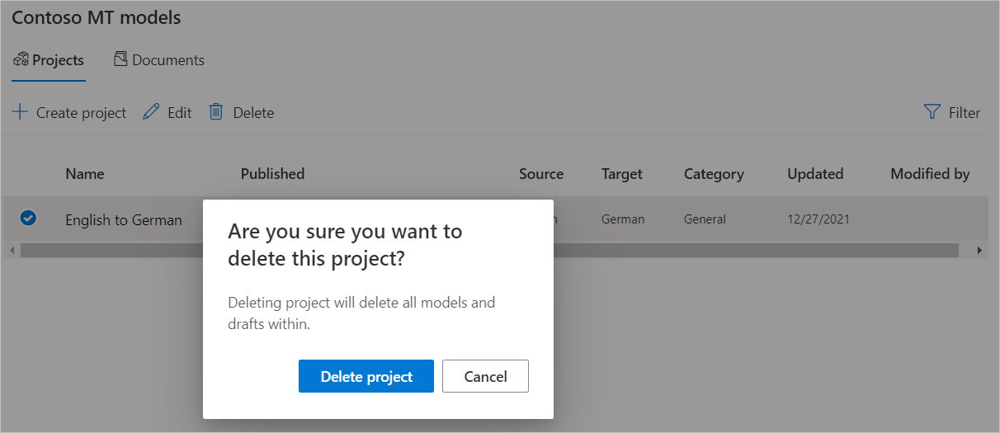
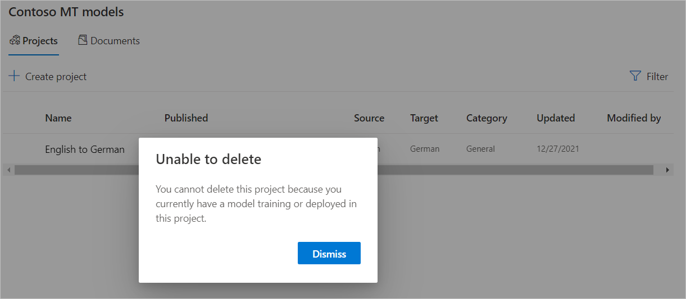

# How to manage a Custom Translator project | preview

> [!IMPORTANT]
> Custom Translator v2.0 is currently in public preview. Some features may not be supported or have constrained capabilities.

A project is a container for models, documents, and tests. Each project automatically includes all documents that are uploaded into that workspace that have the correct language pair.

Creating project is the first step toward building and publishing a model.

## Create project

1. After sign-in, your default workspace is loaded.
    - To create a project in different workspace, select **My workspaces**, then select the workspace name
2. Select **Create project**
3. Enter the following details about your project in the dialog:

    a.  **Project name (required):** Give your project a unique, meaningful name. It's not necessary to mention the languages within the title.

    b.  **Language pair (required):** Select the source and target languages from the dropdown list

    c.  **Domain (required):** Select the domain from the dropdown list that's most appropriate for
        your project. The category describes the terminology and style of the
        documents you intend to translate.

    >[!Note]
    >Select **Show advanced options** to add project label, project description, and domain description

    d.  **Project label:** The project label distinguishes between
        projects with the same language pair and domain. As best practices,
        use a label *only* if you're planning to build multiple projects for
        the same language pair and same domain and want to access these
        projects with a different Domain ID. Don't use this field if you're
        building systems for one domain only. A project label is not required
        and not helpful to distinguish between language pairs. You can use the
        same label for multiple projects.

    e.  **Project description:** A short summary about the project. This description has no
        influence over the behavior of the Custom Translator or your resulting
        custom system, but can help you differentiate between different
        projects.

    f.  **Domain description:** Use this field to better describe the particular
        field or industry in which you're working. For example, if your
        category is medicine, you might add a particular document, such a surgery,
        or pediatrics. The description has no influence over the behavior of the
        Custom Translator or your resulting custom system.

    

3. Select **Create project**

## Edit project

To modify the project name, project description and domain description:

1. Select the workspace name, for example, `Contoso MT models`.
2. Select the project name, for example, `English to German`.
3. **Edit and Delete** buttons are now visible.

    

4. Select **Edit** and fill in or modify existing text.

    

5. Select **Edit project** to save.

## Delete project

1. Follow **Edit a project** steps 1-3
2. Select **Delete** and read the delete message before you select **Delete project** to confirm.

    

>[!Note]
>If your project has published model or in training status, delete fails with the Following message:
>
> 

## Next steps

- Learn [how to manage project documents](build-upload-training-set.md).
- Learn [how to train a model](train-custom-model.md).
- Learn [how to test and evaluate model quality](test-model-details.md).
- Learn [how to publish model](publish-model.md).
- Learn [how to translate with custom models](translate-with-custom-model.md).
