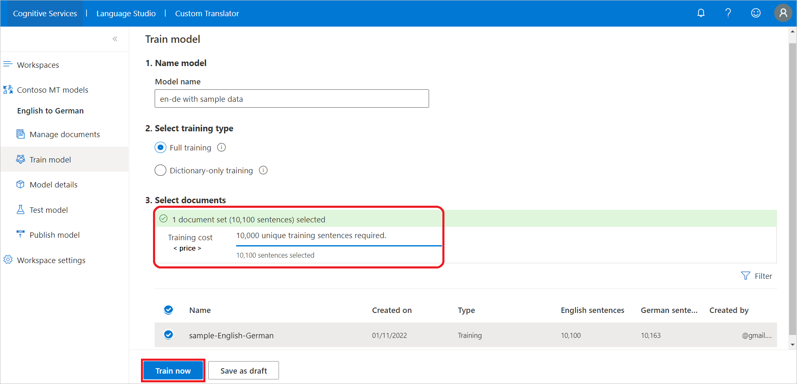

# Train a custom model | preview

> [!IMPORTANT]
> Custom Translator v2.0 is currently in public preview. Some features may not be supported or have constrained capabilities.

A model is the system, which provides translation for a specific language pair. The outcome of a successful training is a model. When training a model, three mutually exclusive document types are required: training, tuning, and testing. If only training data is provided when queuing a training, Custom Translator will automatically assemble tuning and testing data. It will use a random subset of sentences from your training documents, and exclude these sentences from the training data itself. A 10,000 parallel sentence is the minimum requirement to train a model.

## Create model

1. Select **Train model** blade
1. Type **Model name**, for example, "en-de with sample data"
1. Keep the default **Full training** selected or select **Dictionary-only training**

>[!Note]
>Full training displays all uploaded document types. Dictionary-only displays dictionary documents only.

1. Under **Select documents**, select the documents you want to use to train the model, for example, `sample-English-German` and review the training cost associated with the selected number of sentences.
1. Select **Train now**
1. Select **Train** to confirm

>[!Note]
>**Notifications** displays model training in progress, e.g., **Submitting data** state. Training model takes few hours, subject to the number of selected sentences.

## Model details

1. After successful model training, select **Model details** blade
1. Select the model name "en-de with sample data" to review training date/time, total training time, number of sentences used for training, tuning, testing, dictionary, and whether the system generated the test and tuning sets. You will use the "Category ID" to make translation requests.
1. Evaluate the model BLEU score. Using the test set, **BLEU score** is the custom model score and **Baseline BLEU** is the pre-trained baseline model used for customization. Higher **BLEU score** means higher translation quality using the custom model.

## Next steps

- Learn [how to test and evaluate model quality](test-model-details.md).
- Learn [how to publish model](publish-model.md).
- Learn [how to translate with custom models](translate-with-custom-model.md).
