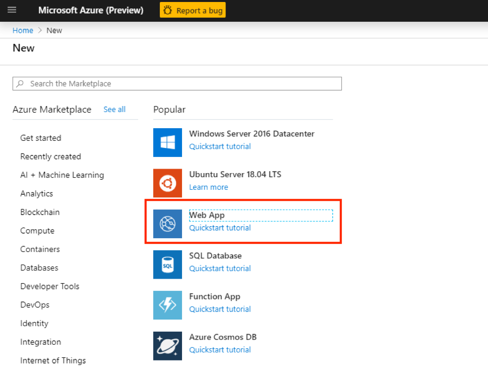
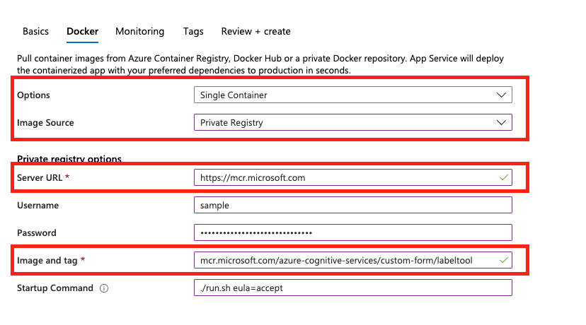

# Deploy the sample labeling tool

The Form Recognizer sample labeling tool is an application that provides a simple user interface (UI), which you can use to manually label forms (documents) for the purpose of supervised learning. In this article, we'll provide links and instructions that teach you how to:

* [Run the sample labeling tool locally](#run-the-sample-labeling-tool-locally)
* [Deploy the sample labeling tool to an Azure Container Instance (ACI)](#deploy-with-azure-container-instances-aci)
* [Use and contribute to the open-source OCR Form Labeling Tool](#open-source-on-github)

## Run the sample labeling tool locally

The fastest way to start labeling data is to run the sample labeling tool locally. The following quickstart uses the Form Recognizer REST API and the sample labeling tool to train a custom model with manually labeled data. 

* [Quickstart: Label forms, train a model, and analyze a form using the sample labeling tool](./quickstarts/label-tool.md).

## Deploy with Azure Container Instances (ACI)

Before we get started, it's important to note that there are two ways to deploy the sample labeling tool to an Azure Container Instance (ACI). Both options are used to run the sample labeling tool with ACI: 

* [Using the Azure portal](#azure-portal)
* [Using the Azure CLI](#azure-cli)

### Azure portal

Follow these steps to create a new resource using the Azure portal: 

1. Sign in to the [Azure portal](https://portal.azure.com/signin/index/).
2. Select **Create a resource**. 
3. Next, select **Web App**. 

   > [!div class="mx-imgBorder"]
   > 
   
4. First, make sure that the **Basics** tab is selected. Now, you're going to need to provide some information: 

   > [!div class="mx-imgBorder"]
   > 
   * Subscription - Select an existing Azure subscription
   * Resource Group - You can reuse an existing resource group or create a new one for this project. Creating a new resource group is recommended.
   * Name - Give your web app a name. 
   * Publish - Select **Docker Container**
   * Operating System -  Select **Linux**
   * Region - Choose a region that makes sense for you.
   * Linux Plan - Select a pricing tier/plan for your app service. 

   > [!div class="mx-imgBorder"]
   > 

5. Next, select the **Docker** tab. 

   > [!div class="mx-imgBorder"]
   > 

6. Now let's configure your Docker container. All fields are required unless otherwise noted:

    # [v2.0](#tab/v2-0)  
   * Options - Select **Single Container**
   * Image Source - Select **Private Registry** 
   * Server URL - Set this to `https://mcr.microsoft.com`
   * Username (Optional) - Create a username. 
   * Password (Optional) - Create a secure password that you'll remember.
   * Image and tag - Set this to `mcr.microsoft.com/azure-cognitive-services/custom-form/labeltool:latest`
   * Continuous Deployment - Set this to **On** if you want to receive automatic updates when the development team makes changes to the sample labeling tool.
   * Startup command - Set this to `./run.sh eula=accept`

    # [v2.1 preview](#tab/v2-1) 
   * Options - Select **Single Container**
   * Image Source - Select **Private Registry** 
   * Server URL - Set this to `https://mcr.microsoft.com`
   * Username (Optional) - Create a username. 
   * Password (Optional) - Create a secure password that you'll remember.
   * Image and tag - Set this to `mcr.microsoft.com/azure-cognitive-services/custom-form/labeltool:latest-preview`
   * Continuous Deployment - Set this to **On** if you want to receive automatic updates when the development team makes changes to the sample labeling tool.
   * Startup command - Set this to `./run.sh eula=accept`
    
    ---

   > [!div class="mx-imgBorder"]
   > 

7. That's it. Next, select **Review + Create**, then **Create** to deploy your web app. When complete, you can access your web app at the URL provided in the **Overview** for your resource.

> [!NOTE]
> When creating your web app, you can also configure authorization/authentication. This is not necessary to get started. 

> [!IMPORTANT]
> You may need to enable TLS for your web app in order to view it at its `https` address. Follow the instructions in [Enable a TLS endpoint](../../container-instances/container-instances-container-group-ssl.md) to set up a sidecar container than enables TLS/SSL for your web app.

### Azure CLI

As an alternative to using the Azure portal, you can create a resource using the Azure CLI. Before you continue, you'll need to install the [Azure CLI](/cli/azure/install-azure-cli). You can skip this step if you're already working with the Azure CLI. 

There's a few things you need know about this command:

* `DNS_NAME_LABEL=aci-demo-$RANDOM` generates a random DNS name. 
* This sample assumes that you have a resource group that you can use to create a resource. Replace `<resource_group_name>` with a valid resource group associated with your subscription. 
* You'll need to specify where you want to create the resource. Replace `<region name>` with your desired region for the web app. 
* This command automatically accepts EULA.

From the Azure CLI, run this command to create a web app resource for the sample labeling tool: 


# [v2.0](#tab/v2-0)   
```azurecli
DNS_NAME_LABEL=aci-demo-$RANDOM

az container create \
  --resource-group <resource_group_name> \
  --name <name> \
  --image mcr.microsoft.com/azure-cognitive-services/custom-form/labeltool \
  --ports 3000 \
  --dns-name-label $DNS_NAME_LABEL \
  --location <region name> \
  --cpu 2 \
  --memory 8 \
  --command-line "./run.sh eula=accept"
``` 
# [v2.1 preview](#tab/v2-1)    
```azurecli
DNS_NAME_LABEL=aci-demo-$RANDOM

az container create \
  --resource-group <resource_group_name> \
  --name <name> \
  --image mcr.microsoft.com/azure-cognitive-services/custom-form/labeltool:latest-preview \
  --ports 3000 \
  --dns-name-label $DNS_NAME_LABEL \
  --location <region name> \
  --cpu 2 \
  --memory 8 \
  --command-line "./run.sh eula=accept"
```

---

### Connect to Azure AD for authorization

It's recommended that you connect your web app to Azure Active Directory. This ensures that only users with valid credentials can sign in and use your web app. Follow the instructions in [Configure your App Service app](../../app-service/configure-authentication-provider-aad.md) to connect to Azure Active Directory.

## Open source on GitHub

The OCR Form Labeling Tool is also available as an open-source project on GitHub. The tool is a web application built using React + Redux, and is written in TypeScript. To learn more or contribute, see [OCR Form Labeling Tool](https://github.com/microsoft/OCR-Form-Tools/blob/master/README.md).

## Next steps

Use the [Train with labels](./quickstarts/label-tool.md) quickstart to learn how to use the tool to manually label training data and perform supervised learning.