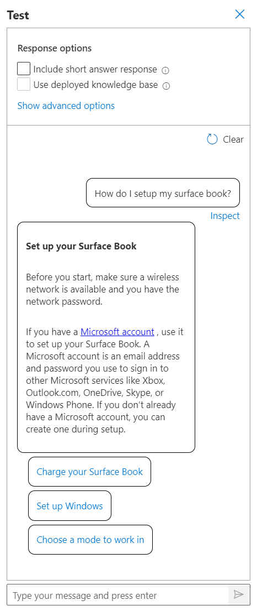

# Create, test, and deploy custom question answering

You can create a question answering project from your own content, such as FAQs or product manuals. This article includes an example of creating a question answering project from a simple FAQ webpage, to answer questions.

## Prerequisites

> [!div class="checklist"]
> * If you don't have an Azure subscription, create a [free account](https://azure.microsoft.com/free/cognitive-services/) before you begin.
> * A [language resource](https://aka.ms/create-language-resource) with the custom question answering feature enabled. Remember your Azure Active Directory ID, Subscription, language resource name you selected when you created the resource.

## Create your first question answering project

1. Sign in to the [Language Studio](https://language.azure.com/) with your Azure credentials.

2. Scroll down to the **Answer questions** section and select **Open custom question answering**.

    > [!div class="mx-imgBorder"]
    > 

3. If you resource is not yet connected to Azure Search select **Connect to Azure Search**. This will open a new browser tab to **Features** pane of your resource in the Azure portal.

    > [!div class="mx-imgBorder"]
    > 

4. Select **Enable custom question answering**, choose the Azure Search resource to link to, and then select **Apply**.

    > [!div class="mx-imgBorder"]
    > 

5. Return to the Language Studio tab. You may need to refresh this page for it to register the change to your resource. Select **Create new project**.

6. Choose the option **I want to set the language for all projects created in this resource** > select **English** > Select **Next**.

7. Enter a project name of **Sample-project**, a description of **My first question answering project**, and leave the default answer with a setting of **No answer found**.

8. Review your choices and select **Create project**

9. From the **Manage sources** page select **Add source** > **URLS**.

10. Select **Add url** enter the following values and then select **Add all**:

    |URL Name|URL Value|
    |--------|---------|
    |Surface Book User Guide |https://download.microsoft.com/download/7/B/1/7B10C82E-F520-4080-8516-5CF0D803EEE0/surface-book-user-guide-EN.pdf |

    The extraction process takes a few moments to read the document and identify questions and answers.

    After successfully adding the source, you can then edit the source contents to add additional custom question answer sets.

## Test your project

1. Select the link to your source, this will open the edit knowledge base page.

2. Select **Test** from the menu bar > Enter the question **How do I setup my surface book?**. An answer will be generated automatically based on the question answer pairs that were automatically identified and extracted from your source URL:

    > [!div class="mx-imgBorder"]
    > 

    If you check the box for **include short answer response** you will also see a precise answer, if available, along with the answer passage in the test pane when you ask a question.

3. Select Inspect to examine the response in more detail. The test window is used to test your changes to your project before deploying your project.

## Deploy your project

1. Select the Deploy knowledge base icon to enter the deploy knowledge base menu.

    > [!div class="mx-imgBorder"]
    > 

    When you deploy a project, the contents of your project move from the `test` index to a `prod` index in Azure Search.

2. Select **Deploy** > and then when prompted select **Deploy** again.

    > [!div class="mx-imgBorder"]
    > 

    Your project is now successfully deployed. You can use the endpoint in your application or in a bot.

## Clean up resources

If you will not continue to test custom question answering you can delete the associated resource.

## Next steps

> [!div class="nextstepaction"]
> [Add questions with metadata](add-question-metadata-portal.md)

For more information:

* [Markdown format in answers](../reference-markdown-format.md)
* QnA Maker [data sources](../Concepts/data-sources-and-content.md).
