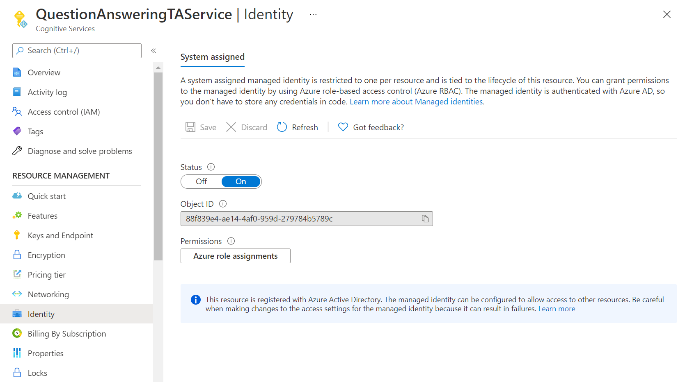
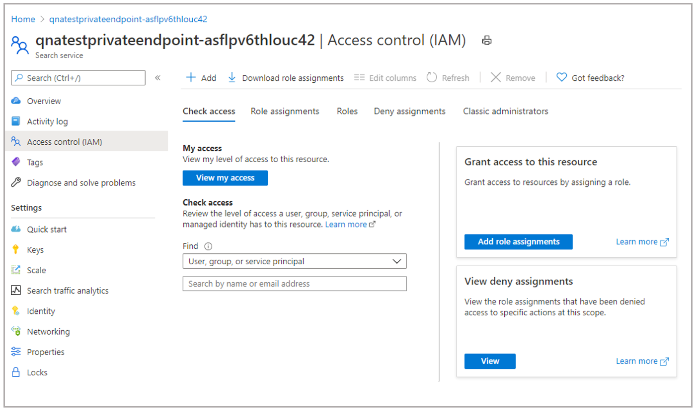
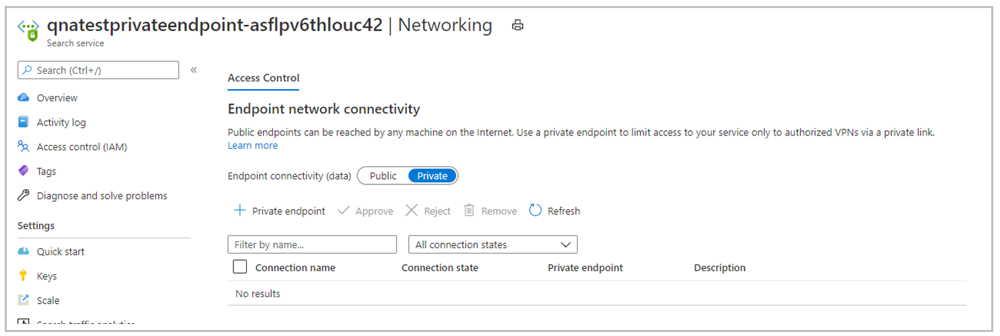

#  Network isolation and private endpoints

The steps below describe how to restrict public access to question answering resources as well as how to enable Azure Private Link. Protect a Cognitive Services resource from public access by [configuring the virtual network](../../../cognitive-services-virtual-networks.md?tabs=portal).

## Private Endpoints

Azure Private Endpoint is a network interface that connects you privately and securely to a service powered by Azure Private Link.  Question answering provides you support to create private endpoints to the Azure Search Service.

Private endpoints are provided by [Azure Private Link](../../../../private-link/private-link-overview.md), as a separate service. For more information about costs, see the [pricing page.](https://azure.microsoft.com/pricing/details/private-link/)

## Steps to enable private endpoint

1. Assign *Contributer* role to language resource (Depending on the context this may appear as a Text Analytics resource) in the Azure Search Service instance. This operation requires *Owner* access to the subscription. Go to Identity tab in the service resource to get the identity.

> [!div class="mx-imgBorder"]
> 

2. Add the above identity as *Contributer* by going to Azure Search Service IAM tab.

3. Select on *Add role assignments*, add the identity and select *Save*.

4. Now, go to *Networking* tab in the Azure Search Service instance and switch Endpoint connectivity data from *Public* to *Private*. This operation is a long running process and can take up to 30 mins to complete. 

5. Go to *Networking* tab of language resource and under the *Allow access from*, select the *Selected Networks and private endpoints* option and select *save*.
 
> [!div class="mx-imgBorder"]
> 

This will establish a private endpoint connection between language resource and Azure Cognitive Search service instance. You can verify the Private endpoint connection on the *Networking* tab of the Azure Cognitive Search service instance. Once the whole operation is completed, you are good to use your language resource with question answering enabled.

## Support details
 * We don't support changes to Azure Cognitive Search service once you enable private access to your Text Analytics service. If you change the Azure Cognitive Search service via 'Features' tab after you have enabled private access, the Text Analytics service will become unusable.

 * After establishing Private Endpoint Connection, if you switch Azure Cognitive Search Service Networking to 'Public', you won't be able to use the Text Analytics service. Azure Search Service Networking needs to be 'Private' for the Private Endpoint Connection to work.

## Restrict access to Cognitive Search resource

Follow the steps below to restrict public access to question answering language resources. Protect a Cognitive Services resource from public access by [configuring the virtual network](../../../cognitive-services-virtual-networks.md?tabs=portal).

After restricting access to Cognitive Service resource based on VNet, To browse knowledge bases on the Language Studio portal from your on-premises network or your local browser.
- Grant access to [on-premises network](../../../cognitive-services-virtual-networks.md?tabs=portal#configuring-access-from-on-premises-networks).
- Grant access to your [local browser/machine](../../../cognitive-services-virtual-networks.md?tabs=portal#managing-ip-network-rules).
- Add the **public IP address of the machine  under the Firewall** section of the **Networking** tab. By default `portal.azure.com` shows the current browsing machine's public IP (select this entry) and then select **Save**.

     > [!div class="mx-imgBorder"]
     > 
