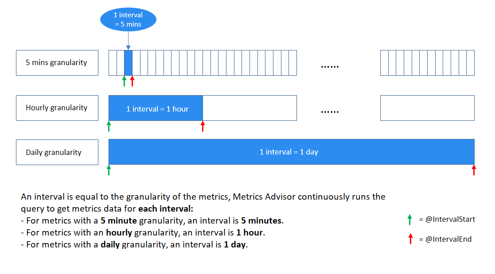
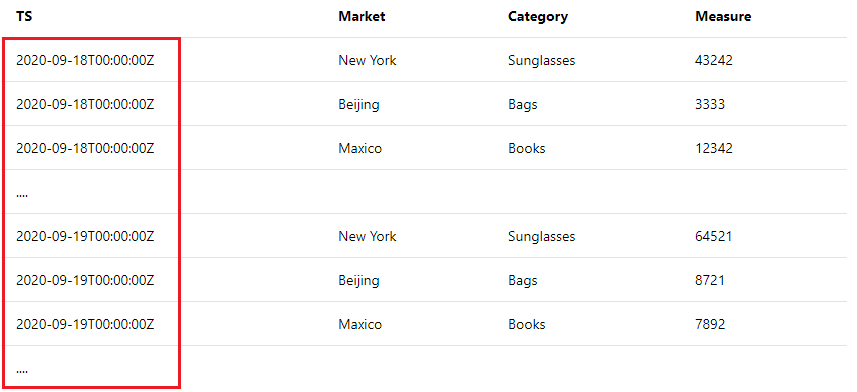
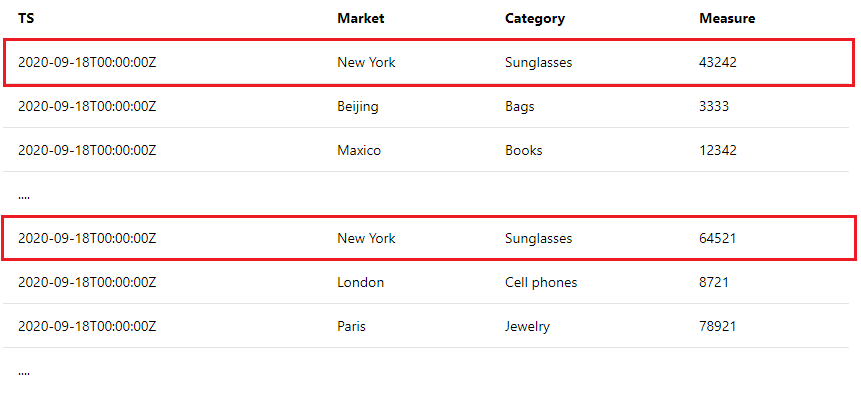

<!--
Remove all the comments in this template before you sign-off or merge to the 
main branch.
-->

<!--
This template provides the basic structure of a tutorial article.
See the [tutorial guidance](contribute-how-to-mvc-tutorial.md) in the contributor guide.

To provide feedback on this template contact 
[the templates workgroup](mailto:templateswg@microsoft.com).
-->

<!-- 1. H1 
Required. Start with "Tutorial: ". Make the first word following "Tutorial: " a 
verb.
-->

# Tutorial: Write a valid query to onboard metrics data

<!-- 2. Introductory paragraph 
Required. Lead with a light intro that describes, in customer-friendly language, 
what the customer will learn, or do, or accomplish. Answer the fundamental “why 
would I want to do this?” question. Keep it short.
-->


<!-- 3. Tutorial outline 
Required. Use the format provided in the list below.
-->

In this tutorial, you learn how to:

> [!div class="checklist"]
> * How to write a valid data onboarding query
> * Common errors and how to avoid them

<!-- 4. Prerequisites 
Required. First prerequisite is a link to a free trial account if one exists. If there 
are no prerequisites, state that no prerequisites are needed for this tutorial.
-->

## Prerequisites

### Create a Metrics Advisor resource

To explore capabilities of Metrics Advisor, you may need to <a href="https://go.microsoft.com/fwlink/?linkid=2142156"  title="Create a Metrics Advisor resource"  target="_blank">create a Metrics Advisor resource </a> in the Azure portal to deploy your Metrics Advisor instance.

<!-- 5. H2s
Required. Give each H2 a heading that sets expectations for the content that follows. 
Follow the H2 headings with a sentence about how the section contributes to the whole.
-->

## Data schema requirements
<!-- Introduction paragraph -->

[!INCLUDE [data schema requirements](../includes/data-schema-requirements.md)]


## <span id="ingestion-work">How does data ingestion work in Metrics Advisor?</span>

When onboarding your metrics to Metrics Advisor, generally there are two ways: 
<!-- Introduction paragraph -->
- Pre-aggregate your metrics into the expected schema and store data into certain files. Fill in the path template during onboarding, and Metrics Advisor will continuously grab new files from the path and perform detection on the metrics. This is a common practice for a data source like Azure Data Lake and Azure Blob Storage.
- If you're ingesting data from data sources like Azure SQL Server, Azure Data Explorer, or other sources, which support using a query script than you need to make sure you are properly constructing your query. This article will teach you how to write a valid query to onboard metric data as expected. 


### What is an interval?

Metrics need to be monitored at a certain granularity according to business requirements. For example, business Key Performance Indicators (KPIs) are monitored at daily granularity. However, service performance metrics are often monitored at minute/hourly granularity. So the frequency to collect metric data from sources are different. 

Metrics Advisor continuously grabs metrics data at each time interval, **the interval is equal to the granularity of the metrics.** Every time, Metrics Advisor runs the query you have written ingests data at this specific interval. Based on this data ingestion mechanism, the query script **should not return all metric data that exists in the database, but needs to limit the result to a single interval.**



## How to write a valid query?
<!-- Introduction paragraph -->
### <span id="use-parameters"> Use @IntervalStart and @IntervalEnd to limit query results</span>

 To help in achieving this, two parameters have been provided to use within the query: **@IntervalStart** and **@IntervalEnd**. 

Every time when the query runs, @IntervalStart and @IntervalEnd will be automatically updated to the latest interval timestamp and gets corresponding metrics data. @IntervalEnd is always assigned as @IntervalStart + 1 granularity. 

Here's an example of proper use of these two parameters with Azure SQL Server: 

```SQL
SELECT [timestampColumnName] AS timestamp, [dimensionColumnName], [metricColumnName] FROM [sampleTable] WHERE [timestampColumnName] >= @IntervalStart and [timestampColumnName] < @IntervalEnd;
```

By writing the query script in this way, the timestamps of metrics should fall in the same interval for each query result. Metrics Advisor will automatically align the timestamps with the metrics' granularity. 

### <span id="use-aggregation"> Use aggregation functions to aggregate metrics</span>

It's a common case that there are many columns within customers data sources, however, not all of them make sense to be monitored or included as a dimension. Customers can use aggregation functions to aggregate metrics and only include meaningful columns as dimensions.

Below is an example where there are more than 10 columns in a customer's data source, but only a few of them are meaningful and need to be included and aggregated into a metric to be monitored. 

| TS | Market | Device OS | Category | ... | Measure1 | Measure2 | Measure3 |
| ----------|--------|-----------|----------|-----|----------|----------|----------|
| 2020-09-18T12:23:22Z | New York | iOS | Sunglasses | ...| 43242 | 322 | 54546|
| 2020-09-18T12:27:34Z | Beijing | Android | Bags | ...| 3333 | 126 | 67677 |
| ...

If customer would like to monitor **'Measure1'** at **hourly granularity** and choose **'Market'** and **'Category'** as dimensions, below are examples of how to properly make use of the aggregation functions to achieve this: 

- SQL sample: 

```sql
    SELECT dateadd(hour, datediff(hour, 0, TS),0) as NewTS
      ,Market
      ,Category
      ,sum(Measure1) as M1
      FROM [dbo].[SampleTable] where TS >= @IntervalStart and TS < @IntervalEnd
	group by Market, Category, dateadd(hour, datediff(hour, 0, TS),0)
```
- Azure Data Explorer sample:

```kusto
    SampleTable
    | where TS >= @IntervalStart and TS < @IntervalEnd
    | summarize M1 = sum(Measure1) by Market, Category, NewTS = startofhour(TS)
```    

> [!Note]
> In the above case, the customer would like to monitor metrics at an hourly granularity, but the raw timestamp(TS) is not aligned. Within aggregation statement, **a process on the timestamp is required** to align at the hour and generate a new timestamp column named 'NewTS'. 


## Common errors during onboarding

- **Error:** Multiple timestamp values are found in query results

    This is a common error, if you haven't limited query results within one interval. For example, if you're monitoring a metric at a daily granularity, you will get this error if your query returns results like this: 

    
    
    There are multiple timestamp values and they're not in the same metrics interval(one day). Check [How does data ingestion work in Metrics Advisor?](#ingestion-work) and understand that Metrics Advisor grabs metrics data at each metrics interval. Then make sure to use **@IntervalStart** and **@IntervalEnd** in your query to limit results within one interval. Check [Use @IntervalStart and @IntervalEnd to limit query results](#use-parameters) for detailed guidance and samples. 


- **Error:** Duplicate metric values are found on the same dimension combination within one metric interval
    
    Within one interval, Metrics Advisor expects only one metrics value for the same dimension combinations. For example, if you're monitoring a metric at a daily granularity, you will get this error if your query returns results like this:

    

    Refer to [Use aggregation functions to aggregate metrics](#use-aggregation) for detailed guidance and samples. 

<!-- 7. Next steps
Required: A single link in the blue box format. Point to the next logical tutorial 
in a series, or, if there are no other tutorials, to some other cool thing the 
customer can do. 
-->

## Next steps

Advance to the next article to learn how to create...
> [!div class="nextstepaction"]
> [Next steps button](enable-anomaly-notification.md)

<!--
Remove all the comments in this template before you sign-off or merge to the 
main branch.
