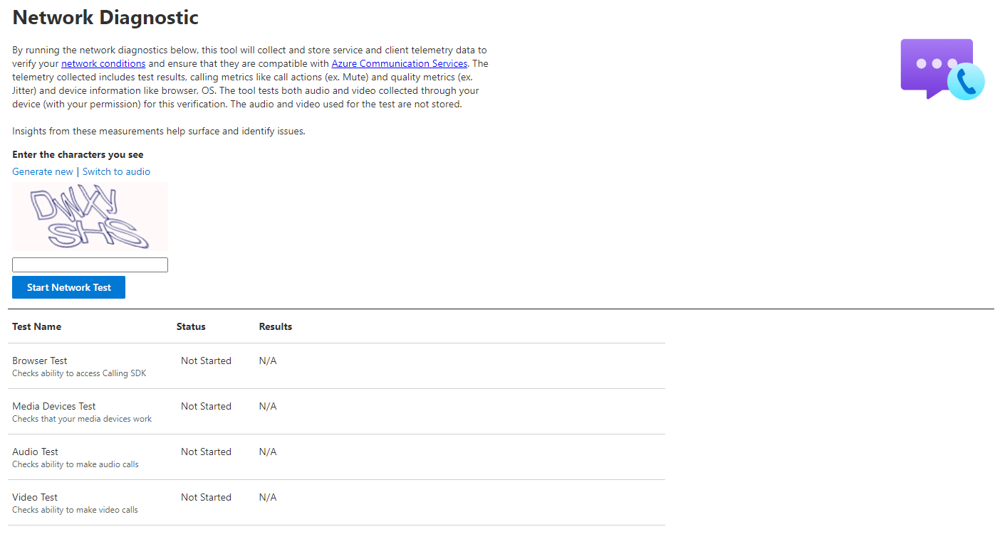

# Network Diagnostics Tool

[!INCLUDE [Private Preview Disclaimer](../../includes/private-preview-include-section.md)]

The Network Diagnostics Tool enables Azure Communication Services developers to ensure that their device and network conditions are optimal for connecting to the service to ensure a great call experience. The tool can be found at [aka.ms/acsdiagnostics](https://acs-network-diagnostic-tool.azurewebsites.net/). There users can quickly run a test, free of charge, by pressing the start test button. The tool performs diagnostics on the network, devices, and call quality. The results of the diagnostics are directly provided through the tools UI. 

  
As part of the diagnostics performed, the user is asked to enable permissions for the tool to access their devices. The user is also asked to record their voice which is then played back using an echo bot to ensure that the microphone is working as expected. The tool finally, performs a video test, where it uses the camera to detect video and measure the quality of the video sent and received. 
  
## Performed tests

  The tool performs the following tests on behalf of the users and provides results for them:
  
  | Test                              | Description                              |
  |-----------------------------------|------------------------------------------|
  | Browser Diagnostic                |  Checks for browser comaptibility. Azure Communication Services support specific browsers for [calling](../voice-video-calling/calling-sdk-features.md#javascript-calling-sdk-support-by-os-and-browser) and [chat](../chat/sdk-features.md#javascript-chat-sdk-support-by-os-and-browser). | 
  | Media Device Diagnostic           | Checks for availability of device (camera, microphone and speaker) and enabled permissions for those devices on the browser. |
  | Service Connectivity              | Checks whether it can connect to Azure Communication Services |
  | Audio Test                        | Performs an echo bot call, where the user can talk to echo bot and hear themselves back. The test records media quality statistics for audio including jitter, bitrate, packet loss and RTT with thresholds for optimal conditions. |
  | Video Test                        | Performs a loop back video test, where video captured by the camera is sent back and forth to check for network quality conditions. The test records media quality statistics for video including jitter, bitrate, packetloss and RTT with thresholds for optimal conditions. |
  
## Privacy

By running the network test, the tool collects and store service and client telemetry data to verify your network conditions and ensure that they are compatible with Azure Communication Services. The telemetry collected does not contain personal identifiable information. The test utilizes both audio and video collected through your device for this verification. The audio and video used for the test are not stored.
  
## Next Steps

- [Explore User-Facing Diagnostic APIs](../voice-video-calling/user-facing-diagnostics.md)
- [Enable Media Quality Statistics in your application](../voice-video-calling/media-quality-sdk.md)
- [Add Real-Time Inspection tool to your application](./real-time-inspection.md)
- [Consume call logs with Azure Monitor](../analytics/call-logs-azure-monitor.md)
