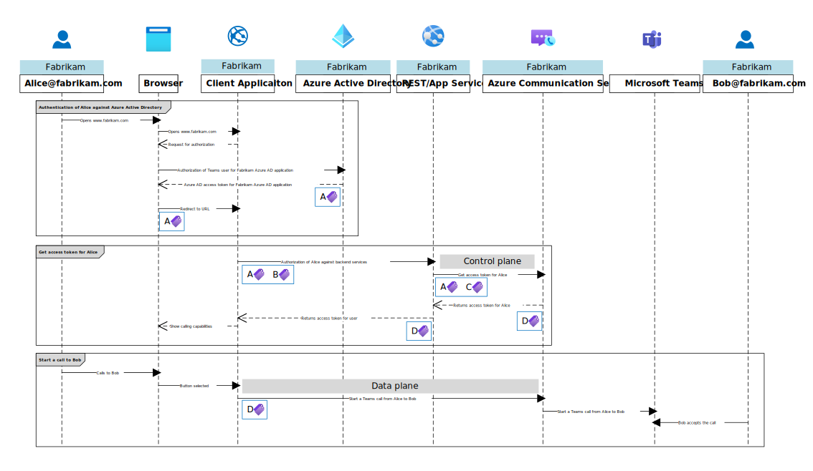
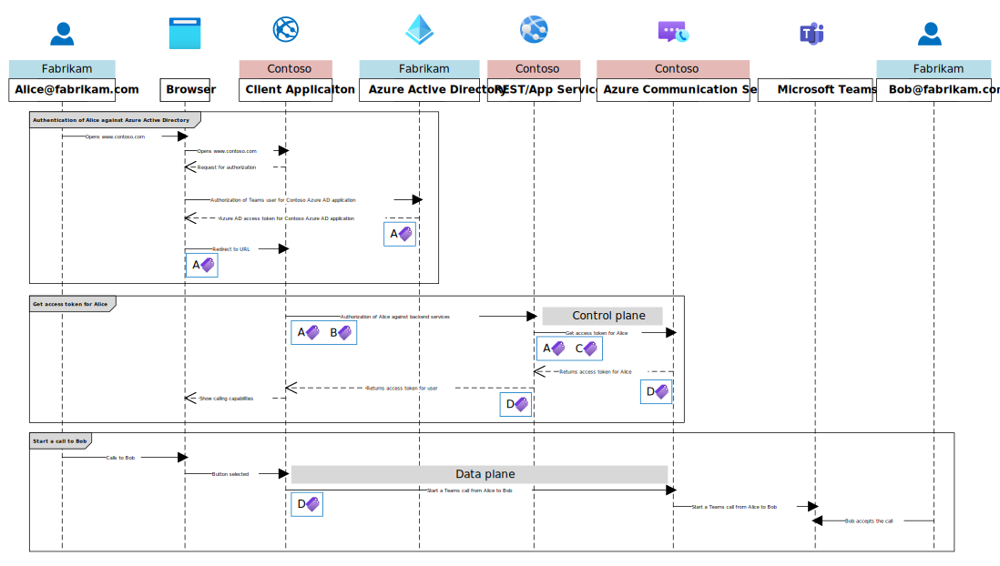

# Authentication

Azure Communication Services provides developers ability to build custom Teams calling experience with Communication Services calling SDK. This articles provides insights into the process of authentication and describes individual authentication artifacts. In the following use cases, we will demonstrate authentication for single and multi-tenant Azure Active Directory application.

# Authentication flow cases

## Case 1: Single tenant application using Azure RBAC
The following scenario shows example of company Fabrikam, that has build custom Teams calling application for internal use within a company. All Teams users are managed by Azure Active Directory and the access to the Azure Communication Services is controlled via Azure role-based access control (Azure RBAC).

Steps:
1. Fabrikam Teams user opens Fabrikam's Client Application
1. Fabrikam Teams user is being redirected to Azure AD of Fabrikam, to authenticate for Fabrikam's Azure AD application with Azure Communication Services permission.
1. Fabrikam Teams user is authenticated, and the request is being redirected to Fabrikam's Client Application, based on configuration of Fabrikam's Azure AD application.
1. Fabrikam's Client Application requests access token from Fabrikam's Communication Services resource. The response contains access token for Communication Services calling SDK.
1. Fabrikam's Client Application uses received access token to make a call to another Teams user.

Artifacts:
- Credentials
  - Type: _`Email and password`_
- Artifact 1
  - Type: Azure AD access token
  - Audience: Azure Communication Services
  - Azure AD appplication ID: Fabrikam's _`Azure AD application ID`_
  - Permission: _`https://auth.msft.communication.azure.com/Teams.ManageCalls`_
- Artifact 4
  - Type: Azure Communication Services access token
  - Audience: _`Azure Communication Services`_
  - Azure Communication Resource ID: Fabrikam's _`Azure Communication Resource ID`_
  - Permission: _`VoIP`_
  
## Case 2: Multi-tenant application using connection string
The following scenario shows example of company Contoso, that has build custom Teams calling application for external customers, such as company Fabrikam. Contoso infrastructure leverages custom authentication within the Contoso infrastructure. Contoso infrastructure is using connection string to retrieve the token for Contoso Teams user.

Steps:
1. Fabrikam Teams user opens Contoso's Client Application
1. Fabrikam Teams user is being redirected to Azure AD of Fabrikam, to authenticate for Contoso's Azure AD application with delegated Azure Communication Services permission.
1. Fabrikam Teams user is authenticated, and the request is being redirected to Contoso's Client Application, based on configuration of Contoso's Azure AD application.
1. Contoso Client Application requests access token from Contoso's backend service. The response will contain access token for Communication Services calling SDK.
1. Contoso backend service is using connection string to request access token from Contoso's Communication Services resource. The response contains access token for Communication Services calling SDK.
1. Contoso Client Application uses received access token to make a call to another Teams user.

Artifacts:
- Credentials
  - Type: _`Email and password`_
- Artifact 1
  - Type: Azure AD access token
  - Audience: Azure Communication Services
  - Azure AD appplication ID: Contoso's _`Azure AD application ID`_
  - Permission: _`https://auth.msft.communication.azure.com/Teams.ManageCalls`_
- Artifact 2
  - Type: Custom Contoso authentication artifact
- Artifact 3
  - Type: HMAC (based on Contoso's _`connection string`_)
- Artifact 4
  - Type: Azure Communication Services access token
  - Audience: _`Azure Communication Services`_
  - Azure Communication Resource ID: Contoso's _`Azure Communication Services Resource ID`_
  - Permission: _`VoIP`_

## Next steps

The following articles might be of interest to you:

- Learn more about [authentication](../authentication.md).
- Try [quickstart for authentication of Teams users](../../quickstarts/manage-teams-identity.md).
- Try [quickstart for calling to a Teams user](../../quickstarts/voice-video-calling/get-started-with-voice-video-calling-custom-teams-client.md).
