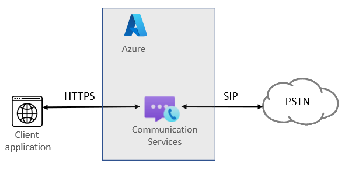
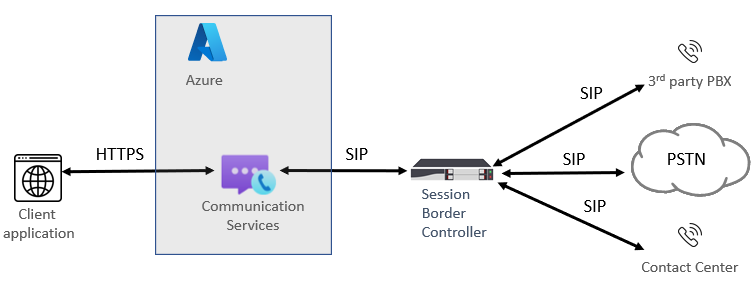

# Telephony concepts

[!INCLUDE [Private Preview Notice](../../includes/private-preview-include.md)]

Azure Communication Services Calling client libraries can be used to add telephony and PSTN to your applications. This page summarizes key telephony concepts and capabilities. See the [calling library](../../quickstarts/voice-video-calling/calling-client-samples?pivots=platform-web) to learn more about specific client library languages and capabilities.

## Overview of telephony
Whenever your users interact with a traditional telephone number, calls are facilitated by PSTN (Public Switched Telephone Network) voice calling. To make and receive PSTN calls, you need to add telephony capabilities to your Azure Communication Services resource. In this case, signaling and media use a combination of IP-based and PSTN-based technologies to connect your users. Communication Services provides two discrete ways to reach the PSTN network: Azure Cloud Calling and SIP interface.

### Azure Cloud Calling

An easy way of adding PSTN connectivity to your app or service, in this case, Microsoft is your telco provider. You can buy numbers directly from Microsoft. Azure Cloud Calling is an all-in-the-cloud telephony solution for Communication services. This is the simplest option that connects ACS to the Public Switched Telephone Network (PSTN) to enable calls to landlines and mobile phones worldwide. With this option, Microsoft acts as your PSTN carrier, as shown in the following diagram:

If you answer ‘yes’ to the following, then Azure Cloud Calling is the right solution for you:
- Azure cloud calling is available in your region.
- You do not need to retain your current PSTN carrier.
- You want to use Microsoft-managed access to the PSTN.

With this option:
- You get numbers directly from Microsoft and can call phones around the world.
- You do not require deployment or maintenance of an on-premises deployment—because Azure Cloud calling operates out of Azure Communication Services.
- Note: If necessary, you can choose to connect a supported Session Border Controller (SBC) through SIP Interface for interoperability with third-party PBXs, analog devices, and other third-party telephony equipment supported by the SBC.

This option requires an uninterrupted connection to Azure Communication Services.

### SIP Interface

With this option, you can connect legacy on-premises telephony and your carrier of choice to Azure Communication services. It provides PSTN calling capabilities to your ACS applications even if Azure Cloud Calling is not available in your country/region. 

If you answer ‘yes’ to any of the following questions, then SIP Interface is the right solution for you:

- You want to use ACS with PSTN calling capabilities.
- You need to retain your current PSTN carrier.
- You want to mix routing, with some calls going through Azure Cloud Calling, some through your carrier.
- You need to interoperate with third-party PBXs and/or equipment such as overhead pagers, analog devices, and so on.

With this option:

- You connect your own supported SBC to Azure Communication Services without the need for additional on-premises software.
- You can use literally any telephony carrier with ACS.
- You can choose to configure and manage this option, or it can be configured and managed by your carrier or partner (ask if your carrier or partner provides this option).
- You can configure interoperability between your telephony equipment—such as a third-party PBX and analog devices—and ACS.

This option requires the following:

- Uninterrupted connection to Azure.
- Deploying and maintaining a supported SBC.
- A contract with a third-party carrier. (Unless deployed as an option to provide a connection to third-party PBX, analog devices, or other telephony equipment for users who are on Communication Services.)

## Next steps

### Conceptual documentation

- [Phone number types in Azure Communication Services](./plan-solution.md)
- [Plan for SIP Interface](./sip-interface-infra.md)
- [Pricing](../pricing.md)

### Quickstarts

- [Get a phone Number](../../quickstarts/telephony-sms/get-phone-number.md)
- [Call to Phone](../../quickstarts/voice-video-calling/pstn-call.md)
