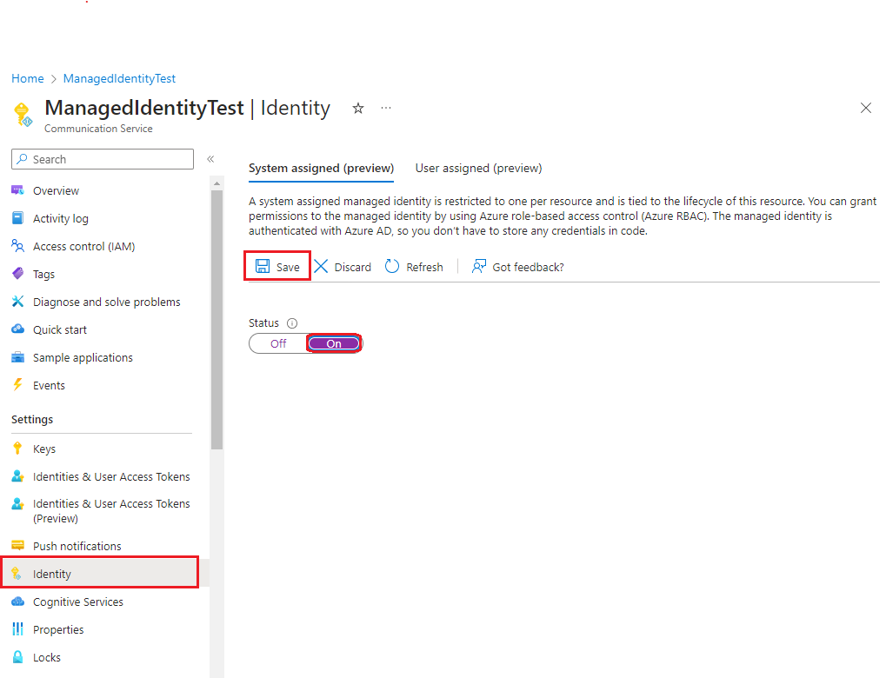
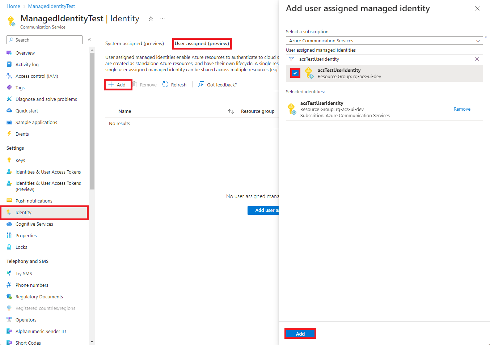

# How to use Managed Identity with Azure Communication Services
Azure Communication Services (ACS) is a fully managed communication platform that enables developers to build real-time communication features into their applications. By using Managed Identity with Azure Communication Services, you can simplify the authentication process for your application, while also increasing its security. This document covers how to use Managed Identity with Azure Communication Services.

## Using Managed Identity with ACS

ACS supports using Managed Identity to authenticate with the service. By using Managed Identity, you can eliminate the need to manage your own access tokens and credentials.

Your ACS resource can be assigned two types of identity:
1. A **System Assigned Identity** which is tied to your resource and is deleted when your resource is deleted.
   Your resource can only have one system-assigned identity.
2. A **User Assigned Identity** which is an Azure resource that can be assigned to your ACS resource. This identity isn't deleted when your resource is deleted. Your resource can have multiple user-assigned identities.

To use Managed Identity with ACS, follow these steps:

1. Grant your Managed Identity access to the Communication Services resource. This assignment can be through the Azure portal, Azure CLI and the Azure Communication Management SDKs.
2. Use the Managed Identity to authenticate with ACS. Authentication can be done through the Azure SDKs or REST APIs that support Managed Identity.


-----

## Add a system-assigned identity

# [Azure portal](#tab/portal)

1. In the left navigation of your app's page, scroll down to the **Settings** group.

2. Select **Identity**.

3. Within the **System assigned** tab, switch **Status** to **On**. Select **Save**.

    

# [Azure CLI](#tab/cli)

Run the `az communication identity assign` command to assign a system-assigned identity:

```azurecli-interactive
az communication identity assign --system-assigned --name myApp --resource-group myResourceGroup
```
-----

## Add a user-assigned identity

Assigning a user-assigned identity to your ACS resource requires that you first create the identity and then add its resource identifier to your Communication service resource.

# [Azure portal](#tab/portal)

First, you need to create a user-assigned managed identity resource.

1. Create a user-assigned managed identity resource according to [these instructions](~/articles/active-directory/managed-identities-azure-resources/how-manage-user-assigned-managed-identities.md#create-a-user-assigned-managed-identity).

2. In the left navigation for your app's page, scroll down to the **Settings** group.

3. Select **Identity**.

4. Select **User assigned** > **Add**.

5. Search for the identity you created earlier, select it, and select **Add**.

    

# [Azure CLI](#tab/cli)

1. Create a user-assigned identity.

    ```azurepowershell-interactive
    az identity create --resource-group <group-name> --name <identity-name>
    ```

2. Run the `az communication identity assign` command to assign a user-assigned identity:

```azurecli-interactive
az communication identity assign --name myApp --resource-group myResourceGroup --user-assigned <identity-id>
```

-----

## Managed Identity using ACS management SDKs
Managed Identity can also be assigned to your ACS resource using the Azure Communication Management SDKs. 
This assignment can be achieved by introducing the identity property in the resource definition either on creation or when updating the resource.

# [.NET](#tab/dotnet)
You can assign your managed identity to your ACS resource using the Azure Communication Management SDK for .NET by setting the `Identity` property on the `CommunicationServiceResourceData `.

For example:

```csharp
public async Task CreateResourceWithSystemAssignedManagedIdentity()
{
    ArmClient armClient = new ArmClient(new DefaultAzureCredential());
    SubscriptionResource subscription = await armClient.GetDefaultSubscriptionAsync();

    //Create Resource group
    ResourceGroupCollection rgCollection = subscription.GetResourceGroups();
    // With the collection, we can create a new resource group with an specific name
    string rgName = "myRgName";
    AzureLocation location = AzureLocation.WestUS2;
    ArmOperation<ResourceGroupResource> lro = await rgCollection.CreateOrUpdateAsync(WaitUntil.Completed, rgName, new ResourceGroupData(location));
    ResourceGroupResource resourceGroup = lro.Value;

    // get resource group collection
    CommunicationServiceResourceCollection collection = resourceGroup.GetCommunicationServiceResources();
    string communicationServiceName = "myCommunicationService";
    
    // Create Communication Service Resource
    var identity = new ManagedServiceIdentity(ManagedServiceIdentityType.SystemAssigned);
    CommunicationServiceResourceData data = new CommunicationServiceResourceData("global")
    {
        DataLocation = "UnitedStates",
        Identity = identity
    };
    var communicationServiceLro = await collection.GetCommunicationServiceResources().CreateOrUpdateAsync(WaitUntil.Completed, communicationServiceName, data);
    var resource = communicationServiceLro.Value;
}
```
For more information on using the .NET Management SDK, see [Azure Communication Management SDK for .NET](https://github.com/Azure/azure-sdk-for-net/blob/main/sdk/communication/Azure.ResourceManager.Communication/README.md).

For more information specific to managing your resource instance, see [Managing your Communication Service Resource instance](https://github.com/Azure/azure-sdk-for-net/blob/main/sdk/communication/Azure.ResourceManager.Communication/samples/Sample1_ManagingCommunicationService.md)


# [JavaScript](#tab/javascript)

For Node.js apps and JavaScript functions, samples on how to create or update your ACS resource with a managed identity can be found in the [Azure Communication Management Developer Samples for JavaScript](https://github.com/Azure/azure-sdk-for-js/blob/main/sdk/communication/arm-communication/samples-dev/communicationServicesCreateOrUpdateSample.ts)

For more information on using the JavaScript Management SDK, see [Azure Communication Management SDK for JavaScript](https://github.com/Azure/azure-sdk-for-js/blob/main/sdk/communication/arm-communication/README.md)

# [Python](#tab/python)

For Python apps and functions, Code Samples on how to create or update your ACS resource  with a managed identity can be found in the [Azure Communication Management Developer Samples for Python](https://github.com/Azure/azure-sdk-for-python/blob/main/sdk/communication/azure-mgmt-communication/generated_samples/communication_services/create_or_update_with_system_assigned_identity.py)

For more information on using the python Management SDK, see [Azure Communication Management SDK for Python](https://github.com/Azure/azure-sdk-for-python/blob/main/sdk/communication/azure-mgmt-communication/README.md)
# [Java](#tab/java)

For Java apps and functions, Code Samples on how to create or update your ACS resource  with a managed identity can be found in the [Azure Communication Management Developer Samples for Java](https://github.com/Azure/azure-sdk-for-java/blob/main/sdk/communication/azure-resourcemanager-communication/src/samples/java/com/azure/resourcemanager/communication/generated/CommunicationServicesCreateOrUpdateSamples.java).

For more information on using the java Management SDK, see [Azure Communication Management SDK for Java](https://github.com/Azure/azure-sdk-for-java/blob/main/sdk/communication/azure-resourcemanager-communication/README.md)

# [GoLang](#tab/go)

For Golang apps and functions, Code Samples on how to create or update your ACS resource  with a managed identity can be found in the [Azure Communication Management Developer Samples for Golang](https://github.com/Azure/azure-sdk-for-go/blob/main/sdk/resourcemanager/communication/armcommunication/services_client_example_test.go).

For more information on using the golang Management SDK, see [Azure Communication Management SDK for Golang](https://github.com/Azure/azure-sdk-for-go/blob/main/sdk/resourcemanager/communication/armcommunication/README.md)


-----
> [!NOTE]
> A resource can have both system-assigned and user-assigned identities at the same time. In this case, the `type` property would be `SystemAssigned,UserAssigned`.
>
>Removing all managed identity assignments from a resource can also be acheived by specifying the `type` property as `None`.


## Next steps
Now that you have learned how to enable Managed Identity with Azure Communication Services. Consider implementing this feature in your own applications to simplify your authentication process and improve security. 

- [Managed Identities](~/articles/active-directory/managed-identities-azure-resources/overview.md)
- [Manage user-assigned managed identities](~/articles/active-directory/managed-identities-azure-resources/how-manage-user-assigned-managed-identities.md)
