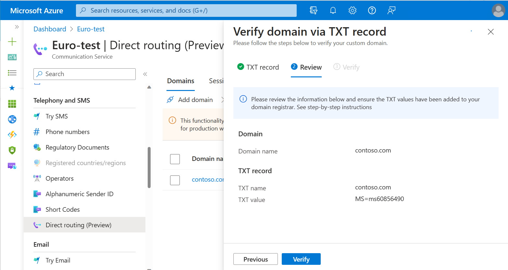
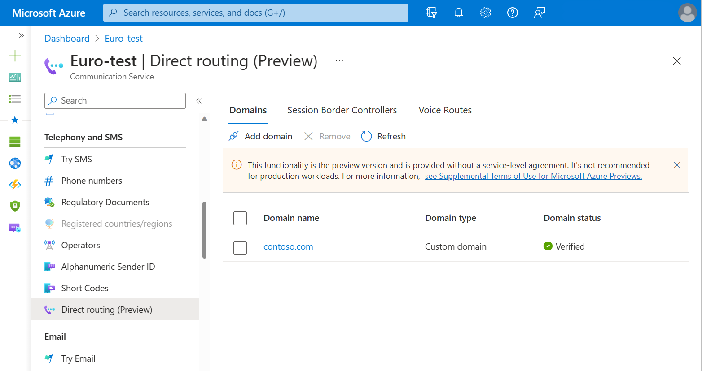

# Validate a domain for direct routing

This article describes the process of validating domain name ownership. A fully qualified domain name (FQDN) consists of two parts: host name and domain name. For example, if your session border controller (SBC) name is `sbc1.contoso.com`, then `sbc1` would be a host name and `contoso.com` would be a domain name. If there's an SBC with FQDN of `acs.sbc1.testing.contoso.com`, `acs` is a host name and `sbc1.testing.contoso.com` is a domain name. To use direct routing, you need to validate that you own the domain part of your FQDN.

To configure direct routing configuration in Azure Communication Services, you first verify domain ownership for your SBC FQDN. You then configure the SBC FQDN and port number and create voice routing rules.

## Validate domain ownership by using the Azure portal

When you're verifying the domain name portion of the FQDN, keep in mind that the `*.onmicrosoft.com` and `*.azure.com` domain names aren't supported for the SBC FQDN domain name. For example, if you have two domain names, `contoso.com` and `contoso.onmicrosoft.com`, use `sbc.contoso.com` as the SBC name.

If you're using a subdomain, make sure that this subdomain is also added and verified. For example, if you want to use `sbc.acs.contoso.com`, you need to register `acs.contoso.com`.

### Add a new domain name

1. Open the Azure portal and go to your [Communication Services resource](../../quickstarts/create-communication-resource.md).
1. On the left pane, under **Voice Calling - PSTN**, select **Direct routing**.
1. On the **Domains** tab, select **Connect domain**.
1. Enter the domain part of the SBC FQDN.
1. Reenter the domain name.
1. Select **Confirm**, and then select **Add**.

### Verify domain ownership

1. Select Verify next to new domain that is now visible in Domain’s list.
1. Azure portal generates a value for a TXT record, you need to add that record to

   

   >[!NOTE]
   >It might take up to 30 minutes for new DNS record to propagate on the Internet

1. Select Next. If everything is set up correctly, you should see Domain status changed to *Verified* next to the added domain.

   

### Remove a domain from Azure Communication Services

If you want to remove a domain from your Azure Communication Services direct routing configuration, select the checkbox fir a corresponding domain name, and select *Remove*.

## Next steps

### Conceptual documentation

- [Telephony in Azure Communication Services](../../concepts/telephony/telephony-concept.md)
- [Direct routing infrastructure requirements](../../concepts/telephony/direct-routing-infrastructure.md)
- [Pricing](../../concepts/pricing.md)

### Quickstarts

- [Outbound call to a phone number](../../quickstarts/telephony/pstn-call.md)
- [Redirect inbound telephony calls with Call Automation](../../quickstarts/call-automation/redirect-inbound-telephony-calls.md)