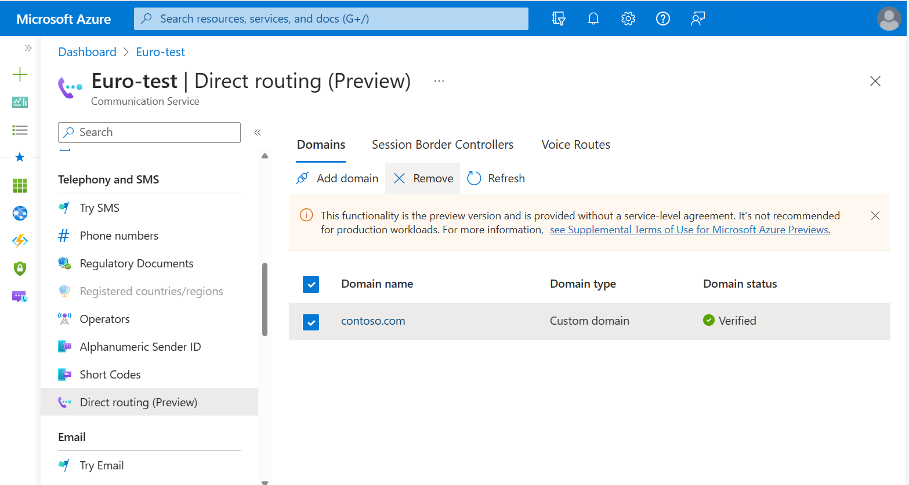

# Validate a domain for direct routing

This article describes the process of validating domain name ownership by using the Azure portal.

A fully qualified domain name (FQDN) consists of two parts: host name and domain name. For example, if your session border controller (SBC) name is `sbc1.contoso.com`, then `sbc1` is the host name and `contoso.com` is the domain name. If an SBC has an FQDN of `acs.sbc1.testing.contoso.com`, then `acs` is the host name and `sbc1.testing.contoso.com` is the domain name.

To use direct routing in Azure Communication Services, you need to validate that you own either the domain part of your SBC FQDN, or entire SBC FQDN. After that, you can configure the SBC FQDN and port number and then create voice routing rules.

When you're verifying the ownership of the SBC FQDN, keep in mind that the `*.onmicrosoft.com` and `*.azure.com` domain names aren't supported. For example, if you have two domain names, `contoso.com` and `contoso.onmicrosoft.com`, use `sbc.contoso.com` as the SBC name.

Validating domain part makes sense if you plan to add multiple SBCs from the same domain name space. For example if you're using `sbc-eu.contoso.com`, `sbc-us.contoso.com`, and `sbc-af.contoso.com` you can validate `contoso.com` domain once and add SBCs from that domain later without extra validation.
Validating entire FQDN is helpful if you're a service provider and don't want to validate your base domain ownership with every customer. In that case, you must validate base domain only in resource you control. For example if you're running SBCs `customer1.acs.adatum.biz`, `customer2.acs.adatum.biz`, and `customer3.acs.adatum.biz`, you don't need to validate `acs.adatum.biz` for every Communication resource, instead you validate `acs.adatum.biz` in your resource (resource you own), and customers validate the entire FQDN as a domain name in their resources. This option provides more granular security approach.

## Add a new domain name

1. Open the Azure portal and go to your [Communication Services resource](../../quickstarts/create-communication-resource.md).
1. On the left pane, under **Voice Calling - PSTN**, select **Direct routing**.
1. On the **Domains** tab, select **Connect domain**.
1. Enter the domain part of the SBC FQDN, or entire SBC FQDN.
1. Reenter the domain name.
1. Select **Confirm**, and then select **Add**.

## Verify domain ownership

1. On the **Domains** tab, select **Verify** next to the new domain that you created.
1. The Azure portal generates a value for a TXT record. Add that record to your domain's registrar or DNS hosting provider with the provided value.

   

   It might take up to 30 minutes for a new DNS record to propagate on the Internet.

1. Select **Next**. If you set up everything correctly, **Domain status** should change to **Verified** next to the added domain.

   

## Remove a domain from Azure Communication Services

If you want to remove a domain from your Azure Communication Services direct routing configuration, select the checkbox for a corresponding domain name, and then select **Remove**.

## Next steps

### Conceptual documentation

- [Telephony in Azure Communication Services](../../concepts/telephony/telephony-concept.md)
- [Direct routing infrastructure requirements](../../concepts/telephony/direct-routing-infrastructure.md)
- [Pricing](../../concepts/pricing.md)

### Quickstarts

- [Outbound call to a phone number](../../quickstarts/telephony/pstn-call.md)
- [Redirect inbound telephony calls with Call Automation](../../quickstarts/call-automation/redirect-inbound-telephony-calls.md)