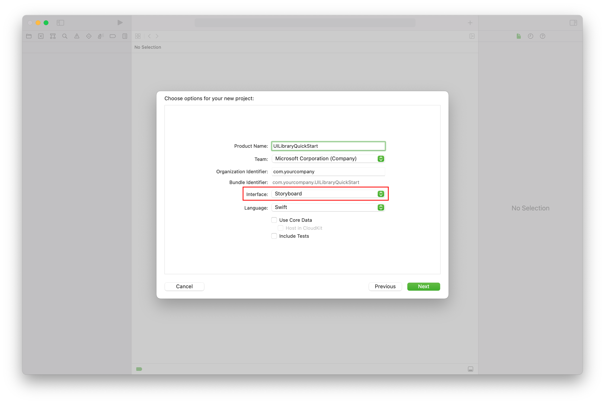

## Prerequisites

- An Azure account with an active subscription. [Create an account for free](https://azure.microsoft.com/free/?WT.mc_id=A261C142F).
- A Mac running [Xcode](https://go.microsoft.com/fwLink/p/?LinkID=266532), along with a valid developer certificate installed into your Keychain. [CocoaPods](https://cocoapods.org/) must also be installed to fetch dependencies.
- A deployed Communication Services resource. [Create a Communication Services resource](https://docs.microsoft.com/azure/communication-services/quickstarts/create-communication-resource).
- Azure Communication Services Token. [See example.](https://docs.microsoft.com/en-ca/azure/communication-services/quickstarts/identity/quick-create-identity)

## Setting up

### Creating the Xcode project

In Xcode, create a new iOS project and select the **App** template. We will be using UIKit storyboards. You're not going to create tests during this quickstart. Feel free to uncheck **Include Tests**.


Name the project `UILibraryQuickStart`.



### Install the package and dependencies with CocoaPods

1. Create a Podfile for your application:

```
source 'https://github.com/Azure/AzurePrivatePodspecs'

platform :ios, '13.0'

target 'UILibraryQuickStart' do
    use_frameworks!
    pod 'azure-communication-ui-library', '1.0.0-alpha.1'
    pod 'AzureCommunicationCalling', '2.0.1-beta.1'
    pod 'MicrosoftFluentUI', '0.3.3'
end
```

2. Run `pod install`.
3. Open the generated `.xcworkspace` with Xcode.

### Request access to the microphone, camera, etc.

To access the device's hardware, update your app's Information Property List. Set the associated value to a `string` that will be included in the dialog the system uses to request access from the user.

Right-click the `Info.plist` entry of the project tree and select **Open As** > **Source Code**. Add the following lines the top level `<dict>` section, and then save the file.

```xml
<key>NSCameraUsageDescription</key>
<string></string>
<key>NSMicrophoneUsageDescription</key>
<string></string>
```

## Initialize Composite

Go to 'ViewController'. Here we'll drop the following code to initialize our Composite Components for Call. Replace `<GROUP_CALL_ID>` with your group id for your call, `<DISPLAY_NAME>` with your name, and `<USER_ACCESS_TOKEN>` with your token.

```swift
import UIKit
import AzureCommunicationCalling
import CallingComposite

class ViewController: UIViewController {

    private var callComposite: CallComposite?

    override func viewDidLoad() {
        super.viewDidLoad()

        let button = UIButton(frame: CGRect(x: 100, y: 100, width: 200, height: 50))
        button.contentEdgeInsets = UIEdgeInsets(top: 10.0, left: 20.0, bottom: 10.0, right: 20.0)
        button.layer.cornerRadius = 10
        button.backgroundColor = .systemBlue
        button.setTitle("Start Experience", for: .normal)
        button.addTarget(self, action: #selector(startCallComposite), for: .touchUpInside)

        button.translatesAutoresizingMaskIntoConstraints = false
        self.view.addSubview(button)
        button.centerXAnchor.constraint(equalTo: view.centerXAnchor).isActive = true
        button.centerYAnchor.constraint(equalTo: view.centerYAnchor).isActive = true
    }

    @objc private func startCallComposite() {
        let callCompositeOptions = CallCompositeOptions()

        callComposite = CallComposite(withOptions: callCompositeOptions)

        let communicationTokenCredential = try! CommunicationTokenCredential(token: "<USER_ACCESS_TOKEN>")

        let options = GroupCallOptions(communicationTokenCredential: communicationTokenCredential,
                                       displayName: displayName,
                                       groupId: uuid)
        callComposite?.launch(with: options)
    }
}
```

## Run the code

You can build and run your app on iOS simulator by selecting **Product** > **Run** or by using the (&#8984;-R) keyboard shortcut.'

- Tap `Start Experience`.
- Accept audio permissions and select device, mic, and video settings.
- Tap `Start Call`.


## Object Model

The following classes and interfaces handle some of the major features of the Azure Communication Services UI client library:

| Name                                                                        | Description                                                                                  |
| --------------------------------------------------------------------------- | -------------------------------------------------------------------------------------------- |
| CallComposite | The composite renders a call experience with participant gallery and controls. |
| CallCompositeOptions | Includes options such as the theme configuration and the events handler. |
| CallCompositeEventsHandler | Allows you to receive events from composite. |
| GroupCallOptions | The options for joining a group call, such as groupId. |
| TeamsMeetingOptions | The options for joining a Team's meeting, such as the meeting link. |
| ThemeConfiguration | Allows you to customize the theme. |

## UI Library Functionality

### Create Call Composite Options and Call Composite

Initialize a `CallCompositeOptions` instance and a `CallComposite` instance inside the `startCallComposite` function.

```swift
@objc private func startCallComposite() {
    let callCompositeOptions = CallCompositeOptions()

    callComposite = CallComposite(withOptions: callCompositeOptions)
}
```

### Setup Authentication

Initialize a `CommunicationTokenCredential` instance inside the `startCallComposite` function. Replace `<USER_ACCESS_TOKEN>` with your token.

```swift
let communicationTokenCredential = try! CommunicationTokenCredential(token: "<USER_ACCESS_TOKEN>")
```

Refer to the [user access token](../../access-tokens.md) documentation if you don't already have a token available.

### Setup Group Call or Teams Meeting Options

Depending on what type of Call/Meeting you would like to setup, use the appropriate options object.

#### Group Call

Initialize a `GroupCallOptions ` instance inside the `startCallComposite` function. Replace `<GROUP_CALL_ID>` with your group id for your call and `<DISPLAY_NAME>` with your name.

```swift
let options = GroupCallOptions(communicationTokenCredential: communicationTokenCredential,
                               displayName: displayName,
                               groupId: uuid)
```

#### Teams Meeting

Initialize a `TeamsMeetingOptions ` instance inside the `startCallComposite` function. Replace `<TEAMS_MEETING_LINK>` with your group id for your call and `<DISPLAY_NAME>` with your name.

```swift
let options = TeamsMeetingOptions(communicationTokenCredential: communicationTokenCredential,
                                  displayName: displayName,
                                  meetingLink: link)
```

#### Get a Microsoft Teams meeting link

A Microsoft Teams meeting link can be retrieved using Graph APIs. This process is detailed in [Graph documentation](/graph/api/onlinemeeting-createorget?tabs=http&view=graph-rest-beta&preserve-view=true).
The Communication Services Calling SDK accepts a full Microsoft Teams meeting link. This link is returned as part of the `onlineMeeting` resource, accessible under the [`joinWebUrl` property](/graph/api/resources/onlinemeeting?view=graph-rest-beta&preserve-view=true)
You can also get the required meeting information from the **Join Meeting** URL in the Teams meeting invite itself.

### Launch

Call `launch` on the `CallComposite` instance inside the `startCallComposite` function

```swift
callComposite?.launch(with: options)
```

### Implement the closure for events handler

You can implement the closures from `CallCompositeEventsHandler` to act on the events and pass the implementation to `CallCompositeOptions`. An event for when the composite ended with an error is an example.

```swift
let handler = CallCompositeEventsHandler(didFail: { error in
            print("didFail with error:\(error)")
        })
```

```swift
let callCompositeOptions = CallCompositeOptions(callCompositeEventsHandler: handler)
```

### Customizing the theme

You can customize the theme by creating a custom theme configuration that implements the ThemeConfiguration protocol. You then include an instance of that new class in your CallCompositeOptions.

```swift
class CustomThemeConfiguration: ThemeConfiguration {
   var primaryColor: UIColor {
       return UIColor.red
   }
}
```

```swift
let callCompositeOptions = CallCompositeOptions(themeConfiguration: CustomThemeConfiguration())
```
