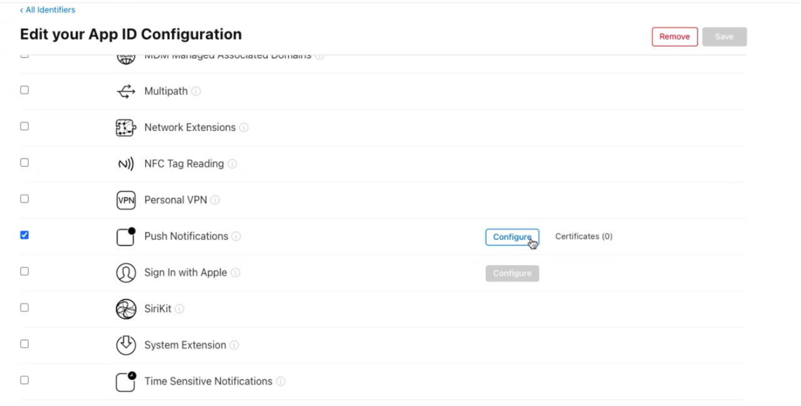
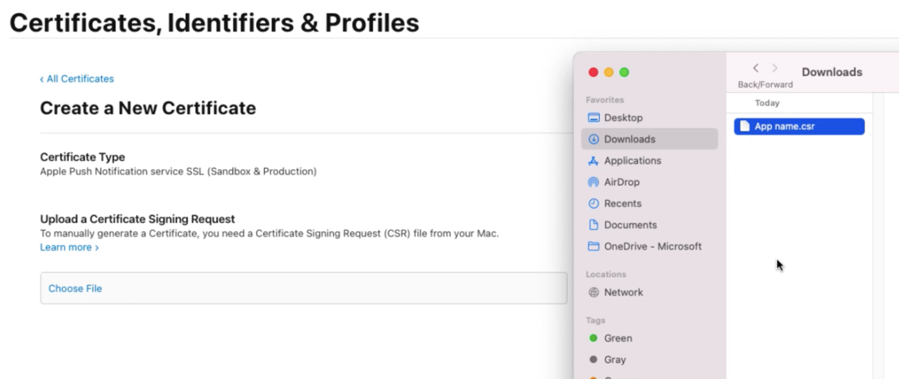
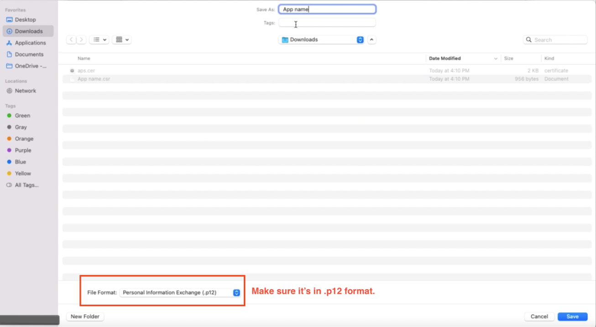
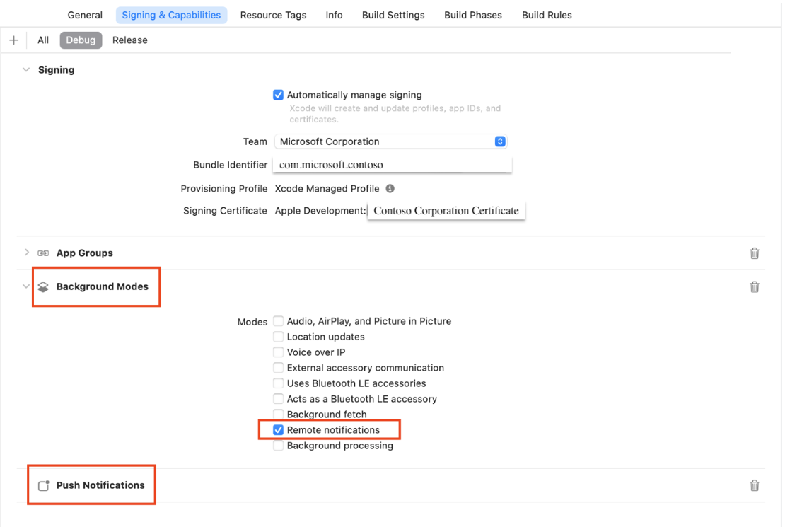

# Tutorial: Create push notifications in your iOS app

This tutorial guides you to create push notifications in your iOS app by using the Azure Communication Services Chat SDK.
  
Push notifications alert users of incoming messages in a chat thread when the mobile app isn't running in the foreground. Azure Communication Services supports two versions of push notifications:

- **Basic version**: A badge number appears on the app's icon, the device plays a notification sound, and a pop-up alert banner appears.

  > [!div class="mx-imgBorder"]
  > 

- **Advanced version**: In addition to the features supported in the basic version, you can customize the title and the message preview in the alert banner.

  > [!div class="mx-imgBorder"]
  > 

In this tutorial, you:

> [!div class="checklist"]
>
> - Set up an Apple Push Notification service (APNs) certificate.
> - Configure Xcode for push notifications.
> - Implement a basic or advanced version of push notifications.
> - Test the notifications on your app.
> - Set up automatic registration renewal for push notifications.

## Download code

Access the sample code for this tutorial on [GitHub](https://github.com/Azure-Samples/communication-services-ios-quickstarts/tree/main/add-chat-push-notifications).

## Prerequisites

- Finish all the prerequisite steps in [Quickstart: Add Chat to your app](../quickstarts/chat/get-started.md?pivots=programming-language-swift).

- Create an Azure notification hub within the same subscription as your Communication Services resource, and then link the notification hub to your Communication Services resource. See [Notification hub provisioning](../concepts/notifications.md#notification-hub-provisioning).

## Create a .p12 APNs certificate and set it in the notification hub

If you're not a Microsoft internal customer, take all the steps in the following procedure.

If you're a Microsoft internal customer, [submit a ticket](https://aka.ms/mapsupport) and provide the bundle ID of your app to get a .p12 certificate. Then skip to the last step in the following procedure.

1. Sign in to the [Apple Developer Portal](https://developer.apple.com/).

1. Go to **Certificates, Identifiers & Profiles** > **Identifiers** > **App IDs**, and then select the app ID that's associated with your app.

   > [!div class="mx-imgBorder"]
   > 

1. On the page for your app ID, select **Capabilities** > **Push Notifications**, and then select **Save**.

   > [!div class="mx-imgBorder"]
   > 

1. In the **Modify App Capabilities** dialog that appears, select **Confirm**.

   > [!div class="mx-imgBorder"]
   > 

1. On the page for your app ID, select **Capabilities** > **Push Notifications** > **Configure**, and then make the following choice:

   - For testing push notifications while developing an iOS app, select the **Create Certificate** button under **Development SSL Certificate**.  
   - For sending push notifications in production,  select the **Create Certificate** button under **Production SSL Certificate**.

   > [!div class="mx-imgBorder"]
   > 

1. The **Create a New Certificate** area appears on the **Certificates, Identifiers & Profiles** page.

   > [!div class="mx-imgBorder"]
   > 

1. On a new browser tab, follow [this Apple help page](https://help.apple.com/developer-account/#/devbfa00fef7) to create a certificate signing request (CSR) and save the file as *App name.cer*. The instructions include using the Certificate Assistant to request a certificate and to fill in the certificate information.

   > [!div class="mx-imgBorder"]
   > 

   > [!div class="mx-imgBorder"]
   > 

1. Drag the .cer file to the **Choose File** area. Then select **Continue** on the upper-right corner.

   > [!div class="mx-imgBorder"]
   > 

1. Select **Download**.

   > [!div class="mx-imgBorder"]
   > 

1. Save the file locally in .p12 format.

   > [!div class="mx-imgBorder"]
   > 

1. Open the .cer file that you downloaded. In Keychain Access, select your certificate, right-click it, and then export your certificate in .p12 format.

1. Go to your notification hub. Under **Settings**, select **Apple (APNS)**. Then fill in the certificate details:

   - For **Authentication Mode**, select **Certificate**.
   - For **Upload Certificate**, upload the .p12 file that you just created.
   - For **Application Mode**, select the mode based on your need.

   When you finish entering all the information, select **Save**.

   > [!div class="mx-imgBorder"]
   > 

## Configure Xcode

1. In Xcode, go to **Signing & Capabilities**.

1. Add a capability by selecting **+ Capability**, and then select **Push Notifications**.  

1. Add another capability by selecting **+ Capability**, and then select **Background Modes**.

1. Under **Background Modes**, select **Remote notifications**.

   > [!div class="mx-imgBorder"]
   > 

1. For **Pod Target - AzureCore**, set **Require Only App-Extension-Safe API** as **No**.
  
## Implement push notifications

### Basic version

If you want to implement a basic version of push notifications, you need to register for remote notifications with APNs. Refer to the [sample code](https://github.com/Azure-Samples/communication-services-ios-quickstarts/blob/main/add-chat-push-notifications/SwiftPushTest/AppDelegate.swift) to see the related implementation in *AppDelegate.swift*.

### Advanced version

If you want to implement an advanced version of push notifications, you need to include the following items in your app. The reason is that the encryption of customer content (for example, chat message content and sender display name) in push notification payloads requires some workarounds.

#### Data storage for encryption keys  

Create persistent data storage in iOS devices. This data storage should be able to share data between the main app and app extensions.

In the sample code for this tutorial, choose App Groups as the data storage by taking these actions:

- Add the App Groups capability to your app's targets (main app and app extensions) by following the steps in the Apple article [Adding capabilities to your app](https://developer.apple.com/documentation/xcode/adding-capabilities-to-your-app?changes=latest_minor#Add-a-capability).

- Configure App Groups by following the steps in the Apple article [Configuring App Groups](https://developer.apple.com/documentation/xcode/configuring-app-groups?changes=latest_minor). Make sure your main app and your app extensions have the same container name.

#### Notification Service Extension

Implement the Notification Service Extension bundled with the main app. This app extension is used for decrypting the push notification payload when the device receives it.

1. Go to [Add a service app extension to your project](https://developer.apple.com/documentation/usernotifications/modifying-content-in-newly-delivered-notifications#Add-a-service-app-extension-to-your-project) in the Apple documentation and follow the steps.

1. Go to [Implement your extension's handler methods](https://developer.apple.com/documentation/usernotifications/modifying-content-in-newly-delivered-notifications#Implement-your-extensions-handler-methods) in the Apple documentation. Apple provides the default code to decrypt data, and you can follow the overall structure for this tutorial. However, because you're using the Chat SDK for decryption, you need to replace the part that starts from `// Try to decode the encrypted message data` with customized logic. Refer to the [sample code](https://github.com/Azure-Samples/communication-services-ios-quickstarts/blob/main/add-chat-push-notifications/SwiftPushTestNotificationExtension/NotificationService.swift) to see the related implementation in *NotificationService.swift*.

#### Implementation of the PushNotificationKeyStorage protocol

The `PushNotificationKeyStorage` protocol is required for the advanced version of push notifications. You could use the default `AppGroupPushNotificationKeyStorage` class that the Chat SDK provides. If you don't use App Groups as the key storage, or if you want to customize key storage methods, create your own class that conforms to the `PushNotificationKeyStorage` protocol.

`PushNotificationKeyStorage` defines two methods:

- `onPersistKey(encryptionKey:expiryTime)`: This method is used to persist the encryption key in the storage of the user's iOS device. The Chat SDK sets 45 minutes as the expiration time for the encryption key. If you want push notifications to be in effect for more than 45 minutes, you need to schedule a `chatClient.startPushNotifications(deviceToken:)` call more frequently (for example, every 15 minutes) so that a new encryption key can be registered before the old key expires.

- `onRetrieveKeys() -> [String]`: This method is used to retrieve the valid keys that were stored previously. You have the flexibility to provide customization based on the data storage that you chose earlier.

In the protocol extension, the Chat SDK provides an implementation of the `decryptPayload(notification:) -> PushNotificationEvent` method that you can use. Refer to the [sample code](https://github.com/Azure-Samples/communication-services-ios-quickstarts/blob/main/add-chat-push-notifications/SwiftPushTestNotificationExtension/NotificationService.swift) to see the related implementation in  *NotificationService.swift*.

## Test your notifications

1. Create a chat thread with User A and User B.

2. Download the [GitHub repository for sample apps](https://github.com/Azure-Samples/communication-services-ios-quickstarts/tree/main/add-chat-push-notifications-auto-renew).

3. Put User A's `<ACESS_TOKEN>` and `<ACS_RESOURCE_ENDPOINT>` values into *AppSettings.plist*.

4. Set **Enable Bitcode** to **No** for two Pod targets: **AzureCommunicationChat** and **Trouter**.

5. Plug the iOS device into your Mac and run the program. When you're asked to authorize push notifications on the device, select **Allow**.

6. As User B, send a chat message. Confirm that User A receives a push notification on the iOS device.

## Implement registration renewal

For Microsoft to provide a secure chat service, the registration for push notifications on iOS devices remains valid for only 45 minutes. To maintain the functionality of push notifications, you need to implement registration renewal in the client app.

This tutorial proposes two solutions that are aligned with Apple's official guidelines. We recommend that you implement both solutions together to increase their effectiveness.

> [!NOTE]
> Various factors might influence the effectiveness of either solution. For example, the device's battery status, network conditions, and iOS-specific restrictions could affect the app's ability to run background tasks. For more information, see the [Advances in App Background Execution](https://developer.apple.com/videos/play/wwdc2019/707) video and the [Pushing background updates to your app](https://developer.apple.com/documentation/usernotifications/pushing-background-updates-to-your-app) article from Apple.

### Solution 1: Background tasks

Background tasks offer a way to perform activities even when the app is not in the foreground. When you implement a background task, your app can request more time to complete a specific task, such as renewing the push notification registration.

The following sections describe how you can use background tasks for registration renewal.

#### Configure automatic refresh of user access tokens

To ensure uninterrupted access to chat services, you need to maintain valid user access tokens. Tokens typically have a default validity period of 24 hours, after which they expire and require renewal. Implementing an automatic refresh mechanism helps guarantee that the token is valid whenever the chat application is activated.

The Chat SDK streamlines token management by automating the refresh process when a custom access token refresher is implemented. Complete the following steps to configure your chat application to support automatic token refresh:

1. To help ensure your chat application maintains continuous and secure user access, you need to implement a service tier that's dedicated to issuing tokens. One option is to use Azure Functions for this purpose.

   To create an Azure function, see the [Build a trusted user access service using Azure Functions](../tutorials/trusted-service-tutorial.md) article. It describes how to set up your function app and deploy the necessary code for issuing tokens.

1. After you configure your Azure function:

   1. Obtain the token issuer URL from the Azure portal. Your chat application uses this URL to request new tokens.

   1. Create and integrate the token refresher within your chat application. This component requests fresh tokens and initializes the chat client for seamless automatic token renewal.

      Sample code for the token refresher and its integration with the chat client is available in the [GitHub repository for sample apps](https://github.com/Azure-Samples/communication-services-ios-quickstarts/tree/main/add-chat-push-notifications-auto-renew).

#### Enable and schedule background tasks

To activate and schedule background tasks in your iOS app, follow the steps in the Apple article [Using background tasks to update your app](https://developer.apple.com/documentation/uikit/app_and_environment/scenes/preparing_your_ui_to_run_in_the_background/using_background_tasks_to_update_your_app).

For practical implementation, consult the [GitHub repository for sample apps](https://github.com/Azure-Samples/communication-services-ios-quickstarts/tree/main/add-chat-push-notifications-auto-renew). The provided sample uses `BGProcessingTask` configured to initiate no sooner than one minute into the future, demonstrating how to efficiently fetch data in the background.

### Solution 2: Remote notification

A remote notification is the mechanism for iOS applications to run background tasks in response to external triggers. You can use remote notifications for tasks like refreshing registrations without user intervention.

To use remote notifications to run a background task:

1. Implement a triggering mechanism.

   For example, you can use an Azure function app as the triggering mechanism. It enables you to run code in response to various triggers, including HTTP requests, so it's useful for initiating silent push notifications. Remember to implement the device registry on your end so that the function app knows where to deliver the notifications.

1. Set up a notification hub.

   The Azure Notification Hubs service provides a scalable push notification infrastructure that can send notifications to any platform (iOS, Android, Windows, and so on) from any back end (cloud or on-premises).
  
   You can reuse the same notification hub that you use for regular push notifications. If you want to set up a new one, see the [Azure Notification Hubs documentation](../../notification-hubs/notification-hubs-push-notification-overview.md).

1. Configure the Azure function app for regular notifications.

   Adjust the function app to periodically send remote notifications via the notification hub. These notifications are forwarded to APNs and directed to the specified device. For more instructions, see [Notification Hubs output binding for Azure Functions](../../azure-functions/functions-bindings-notification-hubs.md).

1. Handle notifications in your app.

   In your iOS app, implement [the application instance method](https://developer.apple.com/documentation/uikit/uiapplicationdelegate/1623013-application) to trigger an automatic refresh of registration upon receiving a silent notification.

For more information, see the Apple article [Setting up a remote notification server](https://developer.apple.com/documentation/usernotifications/setting-up-a-remote-notification-server).

## Related content

- [Build a trusted user access service using Azure Functions](../tutorials/trusted-service-tutorial.md)
- [Quickstart: Add Chat to your app](../quickstarts/chat/get-started.md?pivots=programming-language-swift)
- [UI Library overview](../concepts/ui-library/ui-library-overview.md)
