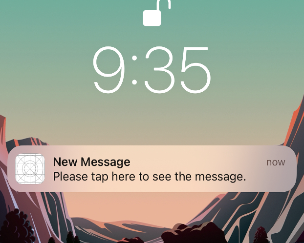
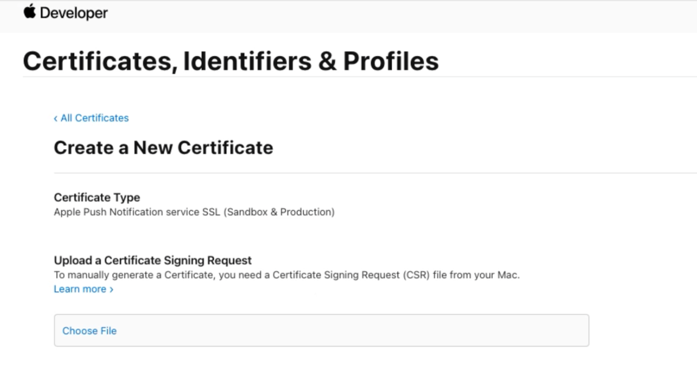
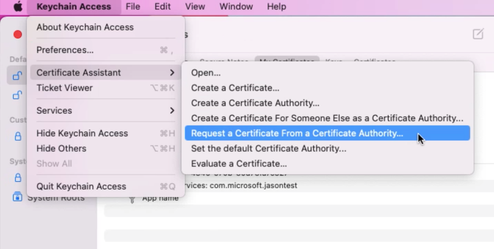

# Tutorial: Enable push notifications in your chat app

This tutorial will guide you to enable push notifications in your iOS app by using the Azure Communication Services Chat SDK.
  
Push notifications alert clients of incoming messages in a chat thread in situations where the mobile app isn't running in the foreground. Azure Communication Services supports two versions of push notifications:

- **Basic version**: The user will be able to see a badge number of 1 on the app's icon, receive a notification sound and see a pop-up alert banner.

  > [!div class="mx-imgBorder"]
  > 

- **Advanced version**: Except for the features supported in basic version, the Contoso will be able to customize the title & message preview section in alert banner.

  > [!div class="mx-imgBorder"]
  > 

## Download code

Access the sample code for this tutorial on [GitHub](https://github.com/Azure-Samples/communication-services-ios-quickstarts/tree/main/add-chat-push-notifications).

## Prerequisites

- Finish all the prerequisite steps in [Chat Quickstart](../quickstarts/chat/get-started.md?pivots=programming-language-swift).

- Create an Azure Notification Hub within the same subscription as your Communication Services resource and link the Notification Hub to your Communication Services resource. See [Notification Hub provisioning](../concepts/notifications.md#notification-hub-provisioning).

## Create a .p12 APNS cert and set it in Notification Hub

If you are not a Microsoft internal client, follow step 1 to step 9 in the following procedure.

If you are a Microsoft internal client, [submit a ticket](https://aka.ms/mapsupport) and provide the bundle ID of your app to get a .p12 cert. Once you get a valid certificate issued, execute the step 9.

1. Log in to the Apple Developer Portal. Navigate to `Certificates, IDs & Profiles > Identifiers > App IDs` and select the App ID associated with your app.

   > [!div class="mx-imgBorder"]
   > 

1. On the screen for your App ID, check  `Capabilities > Push Notifications`. Select Save and respond "Confirm" to the Modify App Capabilities dialog box that appears.

   > [!div class="mx-imgBorder"]
   > 

   > [!div class="mx-imgBorder"]
   > 

1. In the same page, select `Capabilities > Push Notifications > Configure`. Select one of the following buttons:

   - Development SSL Certificate > Create Certificate (for testing push notifications while developing an iOS app)  
   - Production SSL Certificate > Create Certificate (for sending push notifications in production)

   > [!div class="mx-imgBorder"]
   > 

1. Then you're navigated to the below page. Here, you'll upload a Certificate Signing Request (CSR). Follow the next step to create a CSR.

   > [!div class="mx-imgBorder"]
   > 

1. In a new browser tab, follow this [help page](https://help.apple.com/developer-account/#/devbfa00fef7) to create a CSR and save the file as "App name.cer".

   > [!div class="mx-imgBorder"]
   > 

   > [!div class="mx-imgBorder"]
   > 

1. Drag the .cer file to "Choose File" area. Then hit "continue" on the right top corner.

   > [!div class="mx-imgBorder"]
   > 

1. Select "Download" and save the file to local disk.

   > [!div class="mx-imgBorder"]
   > 

1. Open the .cer file you downloaded; it will open Keychain Access. Select your certificate, right-click, and export your certificate in .p12 format.

   > [!div class="mx-imgBorder"]
   > 

1. Go to your notification hub, select "Apple (APNS)" under Settings and select "Certificate" under Authentication Mode. Also select the Application Mode based on your need. Then upload the .p12 file you just created.

   > [!div class="mx-imgBorder"]
   > 

## Configure XCode

1. In XCode, go to  `Signing & Capabilities`. Add a capability by selecting "+ Capability", and then select "Push Notifications".  

1. Add another capability by selecting "+ Capability", and then select "Background Modes". Also select "Remote Notifications" under Background Modes.

   > [!div class="mx-imgBorder"]
   > 

1. Set "Require Only App-Extension-Safe API" as "No" for Pod Target - AzureCore.
  
## Implement push notifications

### Basic version

If you want to implement a basic version of Push Notification, you need to register for remote notifications with APNS (Apple Push Notification Service). Refer to [sample code](https://github.com/Azure-Samples/communication-services-ios-quickstarts/blob/main/add-chat-push-notifications/SwiftPushTest/AppDelegate.swift) to see the related implementation in `AppDelegate.swift`.  

### Advanced version

If you want to implement an advanced version of Push Notification, you need to include the following items in your app. The reason is that we encrypt customer content (e.g. chat message content, sender display name, etc.) in push notification payload and it requires some workaround on your side.

#### Data Storage for encryption keys  

Create a persistent data storage in IOS device. This data storage should be able to share data between Main App and App Extensions (Refer to Item 2 for more information about App Extension – Notification Service Extension).

In our sample code, we'll choose "App Group" as the data storage. Below are the suggested steps to create and use "App Group":

Follow the steps in [Add a capability](https://developer.apple.com/documentation/xcode/adding-capabilities-to-your-app?changes=latest_minor#Add-a-capability) to add the Apps Groups capability to your app's targets – both Main App and Notification Service Extension (Refer to Item 2 on how to create a Notification Service Extension).

Also follow the steps in this [Apple official doc](https://developer.apple.com/documentation/xcode/configuring-app-groups?changes=latest_minor) to configure App Group. Make sure your Main App and App Extension have the same container name.  

#### Notification Service Extension

Implement a "Notification Service Extension" bundled with main app. This is used for decrypting the push notification payload when receiving it.

Go to this [Apple official doc](https://developer.apple.com/documentation/usernotifications/modifying_content_in_newly_delivered_notifications). Follow the step "Add a Service App Extension to your project" and "Implement Your Extension's Handler Methods".

Notice that in the step "Implement Your Extension's Handler Methods," Apple provides the sample code to decrypt data and we'll follow the overall structure. However, since we use chat SDK for decryption, we need to replace the part starting from `"// Try to decode the encrypted message data."` with our customized logic. Refer to the [sample code](https://github.com/Azure-Samples/communication-services-ios-quickstarts/blob/main/add-chat-push-notifications/SwiftPushTestNotificationExtension/NotificationService.swift) to see the related implementation in `NotificationService.swift`.

#### Implementation of PushNotificationKeyStorage Protocol

`PushNotificationKeyStorage` is required for advanced version. As the SDK user, you could use the default `AppGroupPushNotificationKeyStorage` class provided by chat SDK. If you don't use `App Group` as the key storage or would like to customize key storage methods, create your own class which conforms to PushNotificationKeyStorage protocol.

For PushNotificationKeyStorage, it defines two methods:

- `onPersistKey(encryptionKey:expiryTime)`: This method is used to persist the encryption key in the storage of user's IOS device. Chat SDK will set 45 minutes as the expiry time of the encryption key. If you want Push Notification to be effect for more than 45 minutes, you need to schedule to call `chatClient.startPushNotifications(deviceToken:)` on a comparatively frequent basis (eg. every 15 minutes) so a new encryption key could be registered before the old key expires.

- `onRetrieveKeys() -> [String]`: This method is used to retrieve the valid keys previously stored. You have the flexibility to provide the customization based on the data storage (item 1) you choose.

In protocol extension, chat SDK provides the implementation of `decryptPayload(notification:) -> PushNotificationEvent` method which you can take advantage of. Refer to the  [sample code](https://github.com/Azure-Samples/communication-services-ios-quickstarts/blob/main/add-chat-push-notifications/SwiftPushTestNotificationExtension/NotificationService.swift) to see the related implementation in  `NotificationService.swift`.

## Test your notifications

1. Create a Chat Thread with User A and User B.

2. Download the Sample App Repo and follow the above steps in the prerequisites and implementation section.

3. Put User A's <ACESS_TOEKN> and <ACS_RESOURCE_ENDPOINT> into `AppSettings.plist`.

4. Set "Enable Bitcode" to "No" for two Pods targets – AzureCommunicationChat and Trouter.

5. Plug the IOS device into your mac, run the program and select "allow" when asked to authorize push notification on device.

6. As User B, send a chat message. You (User A) should be able to receive a push notification in your IOS device.

## Implement registration renewal

For Microsoft to provide secure chat service, the registration for push notifications on iOS devices remains valid for only 45 minutes. To maintain the functionality of push notifications, you need to implement registration renewal in the client app.  

Here we propose two solutions aligned with Apple's official guidelines. It is important to note that the effectiveness of either solution may be influenced by various factors such as the device's battery status, network conditions, and iOS-specific restrictions that could affect the app's ability to execute background tasks, which is stated in [Apple WWDC Video](https://developer.apple.com/videos/play/wwdc2019/707) and [Apple official wiki](https://developer.apple.com/documentation/usernotifications/pushing-background-updates-to-your-app). We recommend that you implement both solutions together to increase their effectiveness.

### Solution 1: Background tasks

Background Tasks offer a way to perform activities even when the app is not in the foreground. By implementing a background task, your app can request additional time to complete a specific task, such as renewing the push notification registration. Here's how you can leverage background tasks for registration renewal:

#### Configure automatic refresh of user access tokens

To ensure uninterrupted access to chat services, you need to maintain valid user access tokens. Tokens typically have a default validity period (24 hours), after which they expire, requiring renewal. Implementing an auto-refresh mechanism guarantees that the token is always valid whenever the chat application is activated.

The Chat SDK streamlines token management by automating the refresh process when a custom access token refresher is implemented. Complete the following steps to configure your chat application to support token auto-refresh:

1. To ensure your chat application maintains continuous and secure user access, you need to implement a service tier dedicated to issuing tokens. One option is to leverage Azure Functions for this purpose.

   To create your Azure Function, see [Build a trusted user access service using Azure Functions](../tutorials/trusted-service-tutorial.md). This guide describes how to set up your function app and deploy the code needed to issue tokens.

1. Once your Azure Function is configured:

   1. Obtain the Token Issuer URL from the Azure Portal, which your chat application uses to request new tokens.

   1. Create and Integrate the Token Refresher within your chat application. This implements a token refresher component that requests fresh tokens and initializes the Chat Client with this component for seamless automatic token renewal.

      For easy reference and implementation, sample code for the token refresher and its integration with the Chat Client is available in our [Sample App Repository](https://github.com/Azure-Samples/communication-services-ios-quickstarts/tree/main/add-chat-push-notifications-auto-renew).

#### Enable and schedule background tasks

To activate and schedule background tasks in your application, adhere to Apple's guidelines as outlined in their documentation on [Using Background Tasks to Update Your App](https://developer.apple.com/documentation/uikit/app_and_environment/scenes/preparing_your_ui_to_run_in_the_background/using_background_tasks_to_update_your_app). This guide provides comprehensive steps for integrating background task capabilities into your iOS app.

For practical implementation, consult our [Sample App Repository](https://github.com/Azure-Samples/communication-services-ios-quickstarts/tree/main/add-chat-push-notifications-auto-renew). In the provided sample, we use BGProcessingTask configured to initiate no sooner than 1 minute into the future, demonstrating how to efficiently fetch data in the background.

### Solution 2: Remote notification

[Remote notification](https://developer.apple.com/documentation/usernotifications/setting-up-a-remote-notification-server) is the mechanism for iOS applications to execute background tasks in response to external triggers. They can be used for tasks like refreshing registrations without user intervention. Here's how to use remote notification to run a background task:

1. Implement a triggering mechanism.

   For example, you can use an Azure Function App as the triggering mechanism. It enables you to run code in response to various triggers, including HTTP requests, making it ideal for initiating silent push notifications. Remember to implement the device registry on your end so that the function app knows where to deliver the notifications.

1. Set up an Azure Notification Hub.

  Azure Notification Hub provides a scalable, easy-to-use push notification infrastructure that can send notifications to any platform (iOS, Android, Windows, and so on) from any backend (cloud or on-premises). It's essential for managing and pushing notifications to devices.
  
  You can reuse the same notification hub that you use for regular push notifications. If you want to set up a new one, see [Azure Notification Hubs Documentation](../../notification-hubs/notification-hubs-push-notification-overview.md).

1. Configure Azure Function App for regular notifications.

   Adjust the Azure Function App to periodically send remote notifications via the Azure Notification Hub. These notifications are forwarded to the Apple Push Notification Service (APNS) and directed to the specified device. For more instructions, see [Functions-bindings-notification-hubs](../../azure-functions/functions-bindings-notification-hubs.md).

1. Handle notifications in your app.

   In your iOS app, implement [the application instance method](https://developer.apple.com/documentation/uikit/uiapplicationdelegate/1623013-application) to trigger a registration auto-refresh upon receiving a silent notification.

## Related content

- [Build a trusted user access service using Azure Functions](../tutorials/trusted-service-tutorial.md)
- [Chat Quickstart](../quickstarts/chat/get-started.md?pivots=programming-language-swift)
- [UI Library Overview](../concepts/ui-library/ui-library-overview.md)
