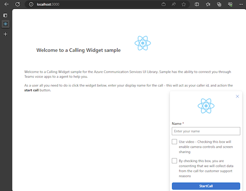

# Get Started with Azure Communication Services calling to Teams Call Queue and Auto Attendant

[!INCLUDE [Public Preview Notice](../../includes/public-preview-include.md)]



This project aims to guide developers to intiate a call from the ACS Calling Web SDK to Teams Call Queue and Auto Attendant using the Azure Communication UI Library.

As per your requirements, you may need to offer your customers an easy way to reach out to you without any complex setup.

Calling to Teams Call Queue and Auto Attendant is a simple yet effective concept that facilitates instant interaction with customer support, financial advisor, and other customer-facing teams. The goal of this tutorial is to assist you in initiating interactions with your customers when they click a button on the web.

If you wish to try it out, you can download the code from [GitHub](https://github.com/Azure-Samples/communication-services-javascript-quickstarts/tree/main/ui-library-click-to-call).

Following this tutorial will:

- Allow you to control your customers audio and video experience depending on your customer scenario
- Move your customers call into a new window so they can continue browsing while on the call

This tutorial is broken down into three parts:

- Creating your widget
- using post messaging to start a calling experience in a new window
- Embed your calling experience

## Prerequisites

- [Visual Studio Code](https://code.visualstudio.com/) on one of the [supported platforms](https://code.visualstudio.com/docs/supporting/requirements#_platforms).
- [Node.js](https://nodejs.org/), Active LTS and Maintenance LTS versions [Node 18 LTS](https://nodejs.org/en) is recommended. Use the `node --version` command to check your version.
- An Azure Communication Services resource. [Create a Communications Resource](../../quickstarts/create-communication-resource.md)
- Complete the Teams tenant setup in [Teams calling and chat interoperability](../../concepts/interop/calling-chat.md)

### Set up the project

Only use this step if you are creating a new application.

To set up the react App, we use the `create-react-app` command line tool. This tool
creates an easy to run TypeScript application powered by React. This command will create a simple react application using TypeScript.

```bash
# Create an Azure Communication Services App powered by React.
npx create-react-app ui-library-calling-widget-app --template typescript

# Change to the directory of the newly created App.
cd ui-library-calling-widget-app
```

### Get your dependencies

Then you need to update the dependency array in the `package.json` to include some beta and alpha packages from Azure Communication Services for this to work:

```json
"@azure/communication-calling": "1.17.1-beta.5",
"@azure/communication-chat": "1.4.0-beta.1",
"@azure/communication-react": "1.9.0-beta.1",
"@azure/communication-calling-effects": "1.0.1",
"@azure/communication-common": "2.2.1",
"@fluentui/react-icons": "~2.0.203",
"@fluentui/react": "~8.98.3",
```

Once you run these commands, you’re all set to start working on your new project. In this tutorial, we are modifying the files in the `src` directory.

## Initial app setup

To get started, we replace the provided `App.tsx` content with a main page that will:

- Store all of the Azure Communication information that we need to create a CallAdapter to power our Calling experience
- Control the different pages of our application
- Register the different fluent icons we use in the UI library and some new ones for our purposes

`src/App.tsx`

```ts
// imports needed
import { CallAdapterLocator } from "@azure/communication-react";
import "./App.css";
import { useEffect, useMemo, useState } from "react";
import {
  CommunicationIdentifier,
  CommunicationUserIdentifier,
} from "@azure/communication-common";
import {
  Spinner,
  Stack,
  initializeIcons,
  registerIcons,
} from "@fluentui/react";
import { CallAdd20Regular, Dismiss20Regular } from "@fluentui/react-icons";
```

```ts
type AppPages = "calling-widget" | "new-window-call";

registerIcons({
  icons: { dismiss: <Dismiss20Regular />, callAdd: <CallAdd20Regular /> },
});
initializeIcons();
function App() {
  const [page, setPage] = useState<AppPages>("calling-widget");

  /**
   * Token for local user.
   */
  const token = "<Enter your Azure Communication Services token here>";

  /**
   * User identifier for local user.
   */
  const userId: CommunicationIdentifier = {
    communicationUserId: "<Enter your user Id>",
  };

  /**
   * Rawid for teams voice app to call
   * 
   * Rawid's for Teams voiceapps are prefixed by 28:orgid:<fetched value from teams tenant>
   * Rawid's for Teams users are prefixed by 8:orgid<id value>
   *
   * You can also make calls directly to agents by providing their rawid.
   */
  const teamsVoiceAppIdentifier = "<Enter the rawid here>";

  switch (page) {
    case "calling-widget": {
      return (
        <Stack verticalAlign="center" style={{ height: "100%", width: "100%" }}>
          <Spinner
            label={"Please enter your identification to start application"}
            ariaLive="assertive"
            labelPosition="top"
          />
        </Stack>
      );
    }
    case "new-window-call": {
      return (
        <Stack verticalAlign="center" style={{ height: "100%", width: "100%" }}>
          <Spinner
            label={"Getting user credentials from server"}
            ariaLive="assertive"
            labelPosition="top"
          />
        </Stack>
      );
    }
  }
}

export default App;
```

In this snippet we register two new icons `<Dismiss20Regular/>` and `<CallAdd20Regular>`. These new icons are used inside the widget component that we are creating later.

### Running the app

We can then test to see that the basic application is working by running:

```bash
# Install the newe dependencies
npm install

# run the React app
npm run start
```

Once the app is running, you can see it on `http://localhost:3000` in your browser. You should see a little spinner saying: `Please enter your identification to start application` as
a test message.

## Next steps

> [!div class="nextstepaction"] > [Part 1: Creating your widget](./calling-widget-tutorial-part-1-creating-your-widget.md)
