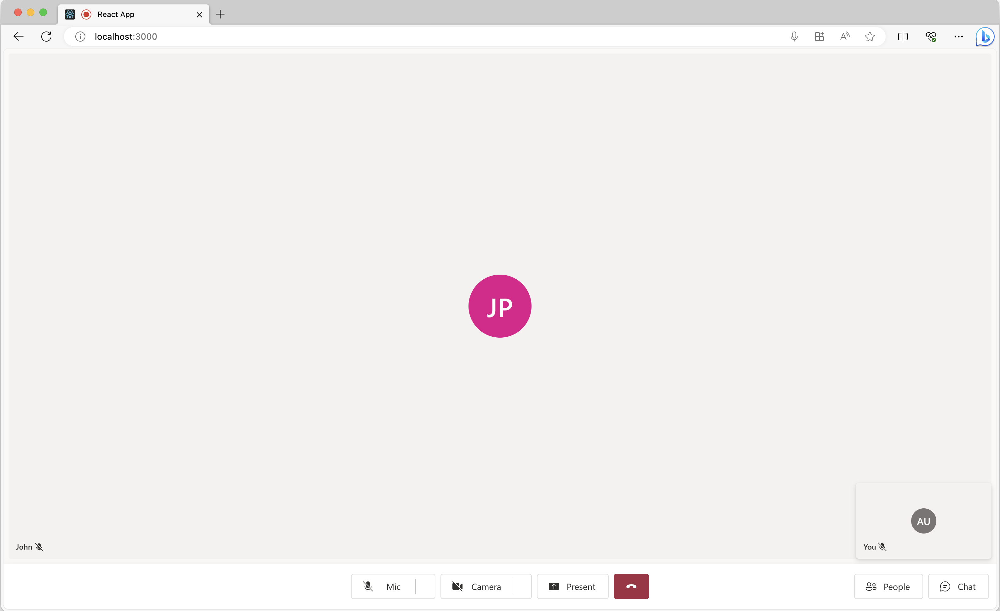

# Enable inline image using UI Library in Teams Interoperability Chat

[!INCLUDE [Public Preview Notice](../includes/public-preview-include.md)]

In a Teams Interoperability Chat ("Interop Chat"), we can enable Azure Communication Service end users to receive inline images sent by Teams users. Currently, the Azure Communication Service end user is able to only receive inline images from the Teams user. Refer to [UI Library Use Cases](../concepts/ui-library/ui-library-use-cases.md) to learn more.

>[!IMPORTANT]
>
>Inline image feature comes with the CallWithChat Composite without additional setups. 
>


## Download code

Access the code for this tutorial on [GitHub](https://github.com/Azure-Samples/communication-services-javascript-quickstarts/tree/main/ui-library-quickstart-teams-interop-meeting-chat).

## Prerequisites

- An Azure account with an active subscription. For details, see [Create an account for free](https://azure.microsoft.com/free/?WT.mc_id=A261C142F).
- [Visual Studio Code](https://code.visualstudio.com/) on one of the [supported platforms](https://code.visualstudio.com/docs/supporting/requirements#_platforms).
- [Node.js](https://nodejs.org/), Active LTS and Maintenance LTS versions. Use the `node --version` command to check your version.
- An active Communication Services resource and connection string. [Create a Communication Services resource](../quickstarts/create-communication-resource.md).
- Using the UI library version [1.7.0-beta.1](https://www.npmjs.com/package/@azure/communication-react/v/1.7.0-beta.1) or the latest.
- Have a Teams meeting created and the meeting link ready.
- Be familiar with how [ChatWithChat Composite](https://azure.github.io/communication-ui-library/?path=/docs/composites-call-with-chat-basicexample--basic-example) works.


## Background

First of all, we need to understand that Teams Interop Chat has to part of a Teams meeting currently. When the Teams user creates an online meeting, a chat thread would be created and associated with the meeting. To enable the Azure Communication Service end user joining the chat and starting to send/receive messages, a meeting participant (a Teams user) would need to admit them to the call first. Otherwise, they don't have access to the chat.

Once the Azure Communication Service end user is admitted to the call, they would be able to start to chat with other participants on the call. In this tutorial, we're checking out how inline image works in Interop chat.

## Overview

As mentioned previously, since we need to join a Teams meeting first, we need to use the ChatWithChat Composite from the UI library. Let's follow the basic example from the [storybook page](https://azure.github.io/communication-ui-library/?path=/docs/composites-call-with-chat-basicexample--basic-example) to create a ChatWithChat Composite.

From the sample code, it needs `CallWithChatExampleProps`, which is defined as the following code snippet:

```js
export type CallWithChatExampleProps = {
  // Props needed for the construction of the CallWithChatAdapter
  userId: CommunicationUserIdentifier;
  token: string;
  displayName: string;
  endpointUrl: string;
  locator: TeamsMeetingLinkLocator | CallAndChatLocator;

  // Props to customize the CallWithChatComposite experience
  fluentTheme?: PartialTheme | Theme;
  compositeOptions?: CallWithChatCompositeOptions;
  callInvitationURL?: string;
};

```

To be able to start the Composite for meeting chat, we need to pass `TeamsMeetingLinkLocator`, which looks like this:

```js
{ "meetingLink": "<TEAMS_MEETING_LINK>" }
```

Note that meeting link should look something like `https://teams.microsoft.com/l/meetup-join/19%3ameeting_XXXXXXXXXXX%40thread.v2/XXXXXXXXXXX`.


And this is all you need! And there's no other setup needed to enable inline image specifically. 


## Run the code

Let's run `npm run start` then you should be able to access our sample app via `localhost:3000` like the following screenshot: 



Simply click on the chat button located in the bottom to reveal the chat panel and now if Teams user sends an image, you should see something like the following screenshot:


Note that in a Teams Interop Chat, we currently only support Azure Communication Service end user to receive inline images sent by the Teams user. To learn more about what features are supported, refer to the [UI library Use Cases](../concepts/ui-library/includes/web-ui-use-cases.md)


## Known Issues

* The UI library might not support certain GIF images at this time. The user might receive a static image instead.
* the Web UI library doesn't support Clips (short videos) sent by the Teams users at this time.


## Next steps

> [!div class="nextstepaction"]
> [Check the rest of the UI Library](https://azure.github.io/communication-ui-library/)

You may also want to:

- [Add chat to your app](../quickstarts/chat/get-started.md)
- [Creating user access tokens](../quickstarts/identity/access-tokens.md)
- [Learn about client and server architecture](../concepts/client-and-server-architecture.md)
- [Learn about authentication](../concepts/authentication.md)
- [Add file sharing with UI Library in Azure Communication Service Chat](./file-sharing-tutorial-acs-chat.md)
- [Add file sharing with UI Library in Teams Interoperability Chat](./file-sharing-tutorial-interop-chat.md)
