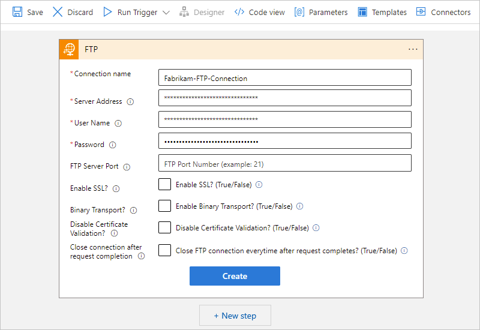
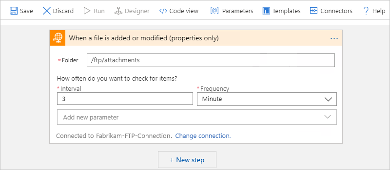
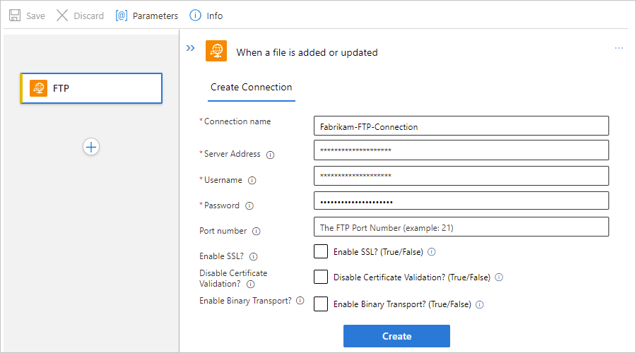
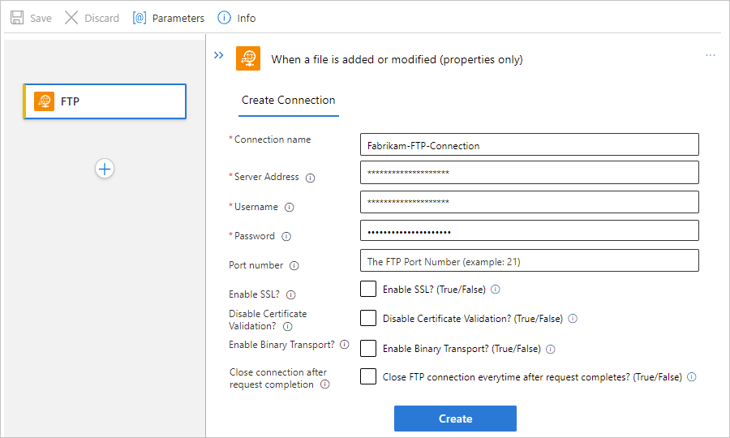
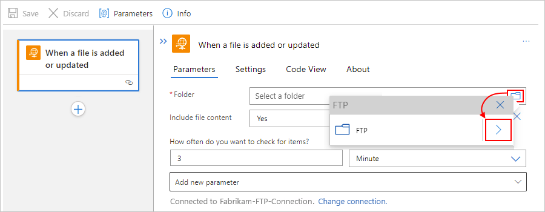
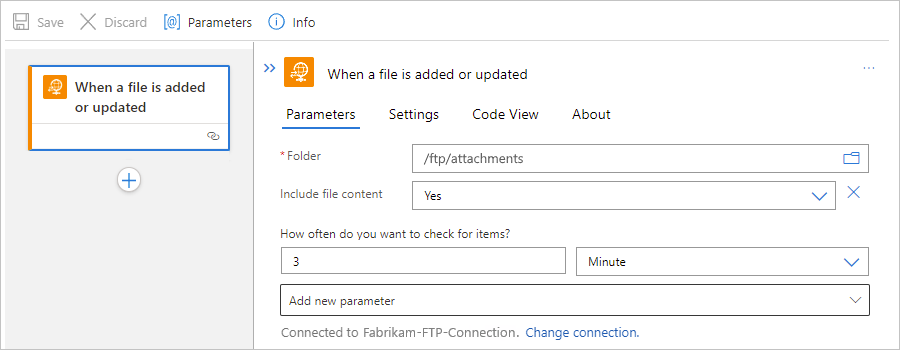

# Connect to an FTP server from workflows in Azure Logic Apps

This article shows how to access your FTP server from a workflow in Azure Logic Apps with the FTP connector. You can then create automated workflows that run when triggered by events in your FTP server or in other systems and run actions to manage your FTP server data, content, and resources.

For example, your workflow can start with an FTP trigger that monitors and responds to events on your FTP server. The trigger makes the outputs available to subsequent actions in your workflow. Your workflow can run FTP actions that create, send, receive, and manage files through your FTP server account using the following specific tasks:

* Monitor when files are added or changed.
* Get, create, copy, update, list, and delete files.
* Get file content and metadata.
* Extract archives to folders.

If you're new to Azure Logic Apps, review the following get started documentation:

* [What is Azure Logic Apps](../logic-apps/logic-apps-overview.md)
* [Quickstart: Create your first logic app workflow](../logic-apps/quickstart-create-first-logic-app-workflow.md)

## Connector technical reference

The FTP connector has different versions, based on [logic app type and host environment](../logic-apps/logic-apps-overview.md#resource-environment-differences).

| Logic app | Environment | Connector version |
|-----------|-------------|-------------------|
| **Consumption** | Multi-tenant Azure Logic Apps | [Managed connector - Standard class](managed.md). For operations, limits, and other information, review the [FTP managed connector reference](/connectors/ftp). |
| **Consumption** | Integration service environment (ISE) | [Managed connector - Standard class](managed.md) and ISE version. For operations, managed connector limits, and other information, review the [FTP managed connector reference](/connectors/ftp). For ISE-versioned limits, review the [ISE message limits](../logic-apps/logic-apps-limits-and-config.md#message-size-limits), not the managed connector limits. |
| **Standard** | Single-tenant Azure Logic Apps and App Service Environment v3 (Windows plans only) | [Managed connector - Standard class](managed.md) and [built-in connector](built-in.md), which is [service provider based](../logic-apps/custom-connector-overview.md#service-provider-interface-implementation). The built-in connector can directly access Azure virtual networks with a connection string and doesn't need the on-premises data gateway.   For managed connector operations, limits, and other information, review the [FTP managed connector reference](/connectors/ftp). For the built-in version, review the [FTP built-in connector operations](#built-in-operations) section later in this article. |
||||

## Prerequisites

* An Azure account and subscription. If you don't have an Azure subscription, [sign up for a free Azure account](https://azure.microsoft.com/free/?WT.mc_id=A261C142F).

* Your FTP host server address and account credentials

  The FTP connector requires access to your FTP server from the internet and that your FTP server is set up to operate in *passive* mode. Your logic app workflow requires your FTP account credentials to create a connection and access your FTP account.

* The logic app workflow where you want to access your FTP account. To start your workflow with an FTP trigger, you have to start with a blank workflow. To use an FTP action, start your workflow with another trigger, such as the **Recurrence** trigger.

For other connector requirements, review [FTP managed connector reference](/connectors/ftp/).

## Limitations

* For FTP security, the FTP connector supports only explicit FTP over TLS/SSL (FTPS) and isn't compatible with implicit FTPS.

* Capacity and throughput

  * Managed connector for Consumption and Standard workflows

    By default, FTP actions can read or write files that are *50 MB or smaller*. To handle files larger than 50 MB, FTP actions support [message chunking](../logic-apps/logic-apps-handle-large-messages.md). The **Get file content** action implicitly uses chunking.

  * Built-in connector for Standard workflows:

    By default, FTP actions can read or write files that are *200 MB or smaller*. Currently, the FTP built-in connector doesn't support chunking.

* FTP triggers no longer return file content. To get file content, use the pattern described in the [FTP managed connector reference trigger limits](/connectors/ftp/#trigger-limits).

* If you have an on-premises FTP server, consider the following options:

  * Consumption workflows: Create an [integration service environment (ISE)](../logic-apps/connect-virtual-network-vnet-isolated-environment-overview.md) or use [Azure App Service Hybrid connections](../app-service/app-service-hybrid-connections.md), which both let you access on-premises data sources without an on-premises data gateway.

  * Standard workflows: Use the FTP built-in connector operations, which work without an on-premises data gateway.

* FTP triggers don't fire if a file is added or updated in a subfolder. If your workflow requires the trigger to work on a subfolder, create nested workflows with triggers. For more information, review [FTP managed connector reference trigger limits](/connectors/ftp/#trigger-limits).

* FTP triggers work by checking the FTP file system and looking for any file that's changed since the last poll. The trigger uses the last modified time on a file. If an external client or other tool creates the file and preserves the timestamp when the files change, disable the preservation feature so that your trigger can work. For more information, review [FTP managed connector reference trigger limits](/connectors/ftp/#trigger-limits).

* The FTP managed connector requires that the FTP server enables specific commands and support folder names with whitespace. For more information, review [FTP managed connector reference - Trigger limits](/connectors/ftp/#trigger-limits) and [requirements](/connectors/ftp/#requirements).

For other connector limitations, review [FTP managed connector reference](/connectors/ftp/).

## Add an FTP trigger

The FTP managed connector and built-in connector each have only one trigger available:

* Managed connector trigger: The **When a file is added or modified (properties only)** trigger starts a Consumption or Standard logic app workflow when one or more files are added or changed in a folder on the FTP server. This trigger gets only the file metadata, not the file content. However, to get the content, your workflow can follow this trigger with the [**Get file content**](#get-file-content) action. For more information about this trigger, review [When a file is added or updated (properties only)](/connectors/ftp/#when-a-file-is-added-or-modified-(properties-only)).

* Built-in connector trigger: The **When a file is added or modified** trigger starts a Standard logic app workflow when one or more files are added or changed in a folder on the FTP server. This trigger gets only the file metadata, not the file content. However, to get the content, your workflow can follow this trigger with the [**Get file content**](#get-file-content) action. For more information about this trigger, review [When a file is added or updated](#when-file-added-updated).

For example, you can use this trigger to monitor an FTP folder for new files that describe customer orders. You can then use the FTP action named **Get file metadata** to get the properties for that new file, and then use **Get file content** to get the content from that file for further processing and store that order in an orders database. You might also use a condition to check that file's content against specific criteria and get that content only if that content meets the criteria.

The following steps use the Azure portal, but with the appropriate Azure Logic Apps extension, you can also use the following tools to create logic app workflows:

* Consumption logic app workflows: [Visual Studio](../logic-apps/quickstart-create-logic-apps-with-visual-studio.md) or [Visual Studio Code](../logic-apps/quickstart-create-logic-apps-visual-studio-code.md)

* Standard logic app workflows: [Visual Studio Code](../logic-apps/create-single-tenant-workflows-visual-studio-code.md)

### [Consumption](#tab/consumption)

1. In the [Azure portal](https://portal.azure.com), and open your blank logic app workflow in the designer.

1. Find and select the [FTP trigger](/connectors/ftp/) that you want to use.

   1. On the designer, under the search box, select **All**.

   1. In the search box, enter **ftp**.

   1. From the triggers list, select the trigger named **When a filed is added or modified (properties only)**.

      

1. Provide the [information for your connection](/connectors/ftp/#creating-a-connection). When you're done, select **Create**.

   By default, this connector transfers files in text format. To transfer files in binary format, for example, where and when encoding is used, select **Enable Binary Transport**.

   

1. After the trigger information box appears, in the **Folder** box, select the folder icon so that a list appears. 

   To find the folder you want to monitor for new or edited files, select the right angle arrow (**>**), browse to that folder, and then select the folder.

   

   Your selected folder appears in the **Folder** box.

   

1. When you're done, save your workflow.

### [Standard](#tab/standard)

1. In the [Azure portal](https://portal.azure.com), and open your blank logic app workflow in the designer.

1. Find and select the FTP trigger that you want to use.

   1. On the designer, select **Choose an operation**. In the search box, enter **ftp**. Under the search box, select either of the following options:

      * **Built-in** when you want to use the FTP built-in connector trigger. From the triggers list, select the trigger named **When a filed is added or updated**.

        

      * **Azure** when you want to use the [FTP managed connector trigger](/connectors/ftp/). From the triggers list, select the trigger named **When a filed is added or modified (properties only)**.

        

1. Provide the [information for your connection](/connectors/ftp/#creating-a-connection). When you're done, select **Create**.

   By default, this connector transfers files in text format. To transfer files in binary format, for example, where and when encoding is used, select **Enable Binary Transport**.

   **Built-in**

   

   **Azure**

   

1. In the **Folder** box, select the folder icon so that a list appears. To find the folder you want to monitor for new or edited files, select the right angle arrow (**>**), browse to that folder, and then select the folder.

   

   Your selected folder appears in the **Folder** box.

   

1. When you're done, save your logic app workflow.

---

Although saving your workflow automatically enables and publishes your logic app resource live in Azure, the only task that your workflow currently performs is to check your FTP server for new or updated files, based on your specified interval and frequency. Now that your workflow has a trigger, add the actions you want to run when the FTP trigger finds a new or updated file. For this example, you can add an FTP action that gets the new or updated content.

## Add an FTP action

The FTP managed connector and built-in connector each have multiple actions. For example, both connector types have the [**Get file content**](#get-file-content) action. You can use this action to get the content from a file for further processing and store that order in an orders database. You might also use a condition to check that file's content against specific criteria and get that content only if that content meets the criteria.

For more information about this trigger, review [Get file content](/connectors/ftp/#get-file-content).

The following steps use the Azure portal, but with the appropriate Azure Logic Apps extension, you can also use the following tools to create logic app workflows:

* Consumption logic app workflows: [Visual Studio](../logic-apps/quickstart-create-logic-apps-with-visual-studio.md) or [Visual Studio Code](../logic-apps/quickstart-create-logic-apps-visual-studio-code.md)

* Standard logic app workflows: [Visual Studio Code](../logic-apps/create-single-tenant-workflows-visual-studio-code.md)

### [Consumption](#tab/consumption)

1. In the [Azure portal](https://portal.azure.com), and open your logic app workflow in the designer.

1. In the designer, under the trigger or any other actions, select **New step**.

1. Find and select the [FTP action](/connectors/ftp/) that you want to use.

   1. On the designer, under the **Chooose an operation** search box, select **All**.

   1. In the search box, enter **ftp**.

   1. From the actions list, select the action named **Get file content**.

   

1. If you already have a connection to your FTP server and account, go to the next step. Otherwise, provide the necessary details for that connection, and then select **Create**.

   

1. After the **Get file metadata** action appears, click inside the **File** box so that the dynamic content list appears. You can now select properties for the outputs from previous steps. In the dynamic content list, under **Get file metadata**, select the **List of Files Id** property, which references the collection where the file was added or updated.

   

   The **List of Files Id** property now appears in the **File** box.

   

1. Now add this FTP action: **Get file content**

   

1. After the **Get file content** action appears, click inside the **File** box so that the dynamic content list appears. You can now select properties for the outputs from previous steps. In the dynamic content list, under **Get file metadata**, select the **Id** property, which references the file that was added or updated.

   

   The **Id** property now appears in the **File** box.

   

1. Save your logic app.

### [Standard](#tab/standard)

---

## Test your logic app

To check that your workflow returns the content that you expect, add another action that sends you the content from the uploaded or updated file.

1. Under the **Get file content** action, add an action that can send you the file's contents. This example adds the **Send an email** action for the Office 365 Outlook.

   

1. After the action appears, provide the information and include the properties that you want to test. For example, include the **File content** property, which appears in the dynamic content list after you select **See more** in the **Get file content** section.

   

1. Save your logic app. To run and trigger the logic app, on the toolbar, select **Run**, and then add a file to the FTP folder that your logic app now monitors.

## FTP built-in connector operations

The FTP built-in connector is available only for Standard logic app workflows and provides the following operations:

| Trigger | Description |
|---------|-------------|
| [**When a file is added or updated**](#when-file-added-updated) | Start a logic app workflow when one or more files are added or changed in a folder on the FTP server. This trigger gets only the file metadata, not the file content. However, to get the content, your workflow can follow this trigger with the [**Get file content**](#get-file-content) action.    For more information, review [When a file is added or updated](#when-file-added-updated). |
|||

| Action | Description |
|--------|-------------|
| [**Create file**](#create-file) | Create a file |
| [**Delete file**](#delete-file) |
| [**Get File Content**](#get-file-content) |
| [**Get the file metadata**](#get-file-metadata) |
| [**List files and subfolders in a folder**](#list-files-subfolders-folder) |
| [**Update file**](#update-file) |
|||

### When a file is added or updated

Operation ID: `whenFtpFilesAreAddedOrModified`

This trigger starts a logic app workflow when one or more files are added or updated in a folder on the FTP server. The trigger gets only the file metadata, not any file content. However, to get the content, your workflow can follow this trigger with the [**Get file content**](#get-file-content) action.

#### Parameters

| Name | Key | Required | Type | Description |
|------|-----|----------|------|-------------|
| **Folder path** | `folderPath` | True | String | The folder path. |
| **Number of files to return** | `maxFileCount` | False | Integer | The maximum number of files to return from a single trigger run. Valid values range from 1 - 100.   **Note**: The **Split On** setting can force this trigger to process each item individually. |
| **Old files cutoff timestamp** | `oldFileCutOffTimestamp` | False | DateTime | The cutoff time to use when ignoring older files using the `YYYY-MM-DDTHH:MM:SS` format. To disable this capability, don't provide this input. |
||||||

#### Returns

Blob metadata

| Name | Type |
|------|------|
| **List of Files** | [BlobMetadata](/connectors/ftp/#blobmetadata) |
|||

### Create file

Operation ID: `createFile`

### Delete file

### Get file content

### Get the file metadata

The **Get file metadata** action gets the properties for a file that's on your FTP server and the **Get file content** action gets the file content based on the information about that file on your FTP server. For example, you can add the trigger from the previous example and these actions to get the file's content after that file is added or edited.

### List the files and subfolders in a folder

### Update file

## Next steps

* Learn about other [Logic Apps connectors](../connectors/apis-list.md)