# Connect to an FTP server from workflows in Azure Logic Apps

This article shows how to access your FTP server from a workflow in Azure Logic Apps with the FTP connector. You can then create automated workflows that run when triggered by events in your FTP server or in other systems and run actions to manage files on your FTP server.

For example, your workflow can start with an FTP trigger that monitors and responds to events on your FTP server. The trigger makes the outputs available to subsequent actions in your workflow. Your workflow can run FTP actions that create, send, receive, and manage files through your FTP server account using the following specific tasks:

* Monitor when files are added or changed.
* Create, copy, delete, list, and update files.
* Get file metadata and content.
* Manage folders.

If you're new to Azure Logic Apps, review the following get started documentation:

* [What is Azure Logic Apps](../logic-apps/logic-apps-overview.md)
* [Quickstart: Create your first logic app workflow](../logic-apps/quickstart-create-first-logic-app-workflow.md)

## Connector technical reference

The FTP connector has different versions, based on [logic app type and host environment](../logic-apps/logic-apps-overview.md#resource-environment-differences).

| Logic app | Environment | Connector version |
|-----------|-------------|-------------------|
| **Consumption** | Multi-tenant Azure Logic Apps | Managed connector (Standard class). For more information, review the following documentation:   - [FTP managed connector reference](/connectors/ftp)  - [Managed connectors in Azure Logic Apps](managed.md) |
| **Consumption** | Integration service environment (ISE) | Managed connector (Standard class) and ISE version, which has different message limits than the Standard class. For more information, review the following documentation:   - [FTP managed connector reference](/connectors/ftp)  - [ISE message limits](../logic-apps/logic-apps-limits-and-config.md#message-size-limits)  - [Managed connectors in Azure Logic Apps](managed.md) |
| **Standard** | Single-tenant Azure Logic Apps and App Service Environment v3 (Windows plans only) | Managed connector (Standard class) and built-in connector, which is [service provider based](../logic-apps/custom-connector-overview.md#service-provider-interface-implementation). The built-in connector can directly access Azure virtual networks with a connection string. For more information, review the following documentation:   - [FTP managed connector reference](/connectors/ftp)  - [FTP built-in connector operations](#built-in-operations) section later in this article  - [Managed connectors in Azure Logic Apps](managed.md)  - [Built-in connectors in Azure Logic Apps](built-in.md) |
||||

## Limitations

* Capacity and throughput

  * Built-in connector for Standard workflows:

    By default, FTP actions can read or write files that are *200 MB or smaller*. Currently, the FTP built-in connector doesn't support chunking.

  * Managed connector for Consumption and Standard workflows

    By default, FTP actions can read or write files that are *50 MB or smaller*. To handle files larger than 50 MB, FTP actions support [message chunking](../logic-apps/logic-apps-handle-large-messages.md). The **Get file content** action implicitly uses chunking.

* For more limitations that apply to both the FTP managed connector and built-in connector, review the [FTP managed connector reference - Limitations](/connectors/ftp/#limitations).

## Prerequisites

* An Azure account and subscription. If you don't have an Azure subscription, [sign up for a free Azure account](https://azure.microsoft.com/free/?WT.mc_id=A261C142F).

* The logic app workflow where you want to access your FTP account. To start your workflow with an FTP trigger, you have to start with a blank workflow. To use an FTP action, start your workflow with another trigger, such as the **Recurrence** trigger.

* For more requirements that apply to both the FTP managed connector and built-in connector, review the [FTP managed connector reference - Requirements](/connectors/ftp/#requirements).

## Known issues

By default, triggers that return an array have a **Split On** setting that's already enabled. With this setting enabled, the trigger automatically *debatches* the array by internally creating a separate workflow instance to process each array item. All the workflow instances run in parallel so that the array items are processed at the same time.

However, when the **Split On** setting is enabled, *managed* connector triggers return the outputs for all the array items as lists. Any subsequent actions that reference these outputs have to first handle these outputs as lists. To handle each array item individually, you can add extra actions. For example, to iterate through these array items, you can use a **For each** loop. For triggers that return only metadata or properties, use an action that gets the array item's metadata first, and then use an action to get the items contents.

You have to apply this approach only for *managed* connector triggers, not built-in connector triggers that return outputs for one array item at a time when the **Split On** setting is enabled.

For example, suppose you have managed connector trigger named **When a file is added or modified (properties only)** that returns the metadata or properties for the new or updated files as arrays. To get the metadata separately for each file, you might use a **For each** loop that iterates through the array. In this loop, use the following FTP managed connector actions in the specified order:

1. **Get file metadata** to get each file's metadata.

1. **Get file content** action to get each file's content.

## Add an FTP trigger

A Consumption logic app workflow can use only the FTP managed connector. However, a Standard logic app workflow can use the FTP managed connector *and* the FTP built-in connector. In a Standard logic app workflow, managed connectors are also labeled as **Azure** connectors.

The FTP managed connector and built-in connector each have only one trigger available:

* Managed connector trigger: The FTP trigger named **When a file is added or modified (properties only)** runs a Consumption or Standard logic app workflow when one or more files are added or changed in a folder on the FTP server. This trigger gets only the file properties or metadata, not the file content. However, to get the file content, your workflow can follow this trigger with other FTP actions.

  For more information about this trigger, review [When a file is added or modified (properties only)](/connectors/ftp/#when-a-file-is-added-or-modified-(properties-only)).

* Built-in connector trigger: The FTP trigger named **When a file is added or updated** runs a Standard logic app workflow when one or more files are added or changed in a folder on the FTP server. This trigger gets only the file properties or metadata, not the file content. However, to get the content, your workflow can follow this trigger with other FTP actions. For more information about this trigger, review [When a file is added or updated](#when-file-added-updated).

The following steps use the Azure portal, but with the appropriate Azure Logic Apps extension, you can also use the following tools to create and edit logic app workflows:

* Consumption logic app workflows: [Visual Studio](../logic-apps/quickstart-create-logic-apps-with-visual-studio.md) or [Visual Studio Code](../logic-apps/quickstart-create-logic-apps-visual-studio-code.md)

* Standard logic app workflows: [Visual Studio Code](../logic-apps/create-single-tenant-workflows-visual-studio-code.md)

### [Consumption](#tab/consumption)

1. In the [Azure portal](https://portal.azure.com), and open your blank logic app workflow in the designer.

1. On the designer, under the search box, select **All**.

1. In the search box, enter **ftp**. From the triggers list, select the trigger named **When a filed is added or modified (properties only)**.

   

1. Provide the [information for your connection](/connectors/ftp/#creating-a-connection). When you're done, select **Create**.

   > [!NOTE]
   >
   > By default, this connector transfers files in text format. To transfer files in binary format, 
   > for example, where and when encoding is used, select the binary transport option.

   

1. After the trigger information box appears, find the folder that you want to monitor for new or edited files.

   1. In the **Folder** box, select the folder icon to view the folder directory.

   1. Select the right angle arrow (**>**). Browse to the folder that you want, and then select the folder.

   

   Your selected folder appears in the **Folder** box.

   

1. When you're done, save your workflow.

### [Standard](#tab/standard)

This section shows the steps for the following FTP connector triggers:

* [*Built-in* trigger named **When a file is added or updated**](#built-in-connector-trigger)

  If you use this FTP built-in trigger, you can get the file content by just using the FTP built-in action named **Get file content** without using the **Get file metadata** action first, unlike when you use the FTP managed trigger. For more information about FTP built-in connector operations, review [FTP built-in connector operations](#ftp-built-in-connector-operations) later in this article.

* [*Managed* trigger named **When a file is added or modified (properties only)**](#managed-connector-trigger)

  If you use this FTP managed trigger, you have to later use the **Get file metadata** action first to get a single array item before you use any other action on the file that was added or modified. This workaround results from the [known issue around the **Split On** setting](#known-issues) described earlier in this article.

#### Built-in connector trigger

1. In the [Azure portal](https://portal.azure.com), and open your blank logic app workflow in the designer.

1. On the designer, select **Choose an operation**. Under the search box, select **Built-in**.

1. In the search box, enter **ftp**. From the triggers list, select the trigger named **When a filed is added or updated**.

   

1. Provide the information for your connection.

   > [!NOTE]
   >
   > By default, this connector transfers files in text format. To transfer files in binary format, 
   > for example, where and when encoding is used, select the binary transport option.

   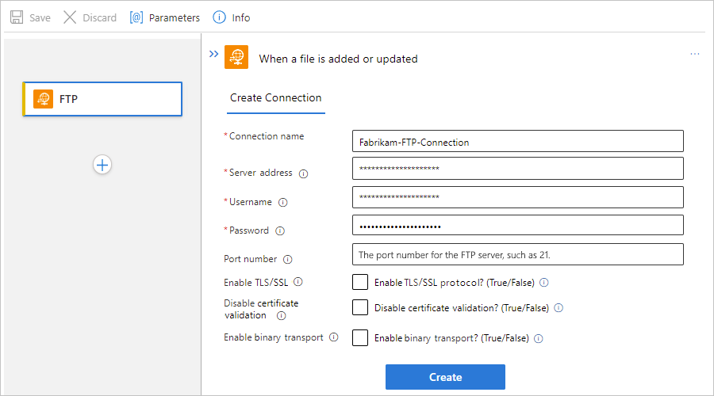

1. When you're done, select **Create**.

1. When the trigger information box appears, in the **Folder path** box, specify the path to the folder that you want to monitor.

   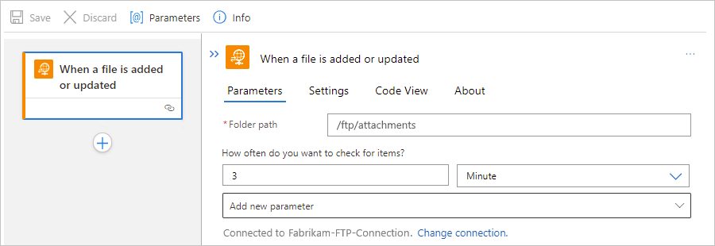

1. When you're done, save your logic app workflow.

#### Managed connector trigger

1. In the [Azure portal](https://portal.azure.com), and open your blank logic app workflow in the designer.

1. On the designer, select **Choose an operation**. Under the search box, select **Azure**.

1. In the search box, enter **ftp**. From the triggers list, select the trigger named **When a filed is added or modified (properties only)**.

   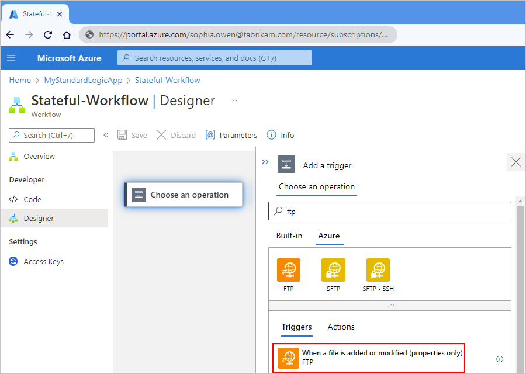

1. Provide the [information for your connection](/connectors/ftp/#creating-a-connection).

   > [!NOTE]
   >
   > By default, this connector transfers files in text format. To transfer files in binary format, 
   > for example, where and when encoding is used, select the binary transport option.

   

1. When you're done, select **Create**.

1. When the trigger information box appears, find the folder that you want to monitor for new or edited files.

   1. In the **Folder** box, select the folder icon to view the folder directory.

   1. Select the right angle arrow (**>**). Browse to the folder that you want, and then select the folder.

   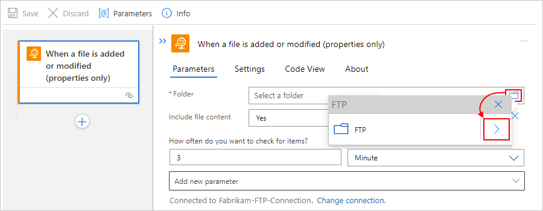

   Your selected folder appears in the **Folder** box.

   

1. When you're done, save your logic app workflow.

---

When you save your workflow, this step automatically publishes your updates to your deployed logic app, which is live in Azure. With only a trigger, your workflow just checks the FTP server based on your specified schedule. You have to [add an action](#add-ftp-action) that responds to the trigger and does something with the trigger outputs.

## Add an FTP action

A Consumption logic app workflow can use only the FTP managed connector. However, a Standard logic app workflow can use the FTP managed connector and the FTP built-in connector. Each version has multiple actions. For example, both managed and built-in connector versions have their own actions to get file metadata and get file content.

* Managed connector actions: These actions run in a Consumption or Standard logic app workflow.

* Built-in connector actions: These actions run only in a Standard logic app workflow.

The following steps use the Azure portal, but with the appropriate Azure Logic Apps extension, you can also use the following tools to create and edit logic app workflows:

* Consumption logic app workflows: [Visual Studio](../logic-apps/quickstart-create-logic-apps-with-visual-studio.md) or [Visual Studio Code](../logic-apps/quickstart-create-logic-apps-visual-studio-code.md)

* Standard logic app workflows: [Visual Studio Code](../logic-apps/create-single-tenant-workflows-visual-studio-code.md)

Before you can use an FTP action, your workflow must already start with a trigger, which can be any kind that you choose. For example, you can use the generic **Recurrence** built-in trigger to start your workflow on specific schedule.

### [Consumption](#tab/consumption)

1. In the [Azure portal](https://portal.azure.com), and open your logic app workflow in the designer.

1. Find and select the [FTP action](/connectors/ftp/) that you want to use.

   This example continues with the action named **Get file metadata** so you can get the metadata for a single array item.

   1. On the designer, under the trigger or any other actions, select **New step**.

   1. Under the **Choose an operation** search box, select **All**.

   1. In the search box, enter **ftp get file metadata**.

   1. From the actions list, select the action named **Get file metadata**.

   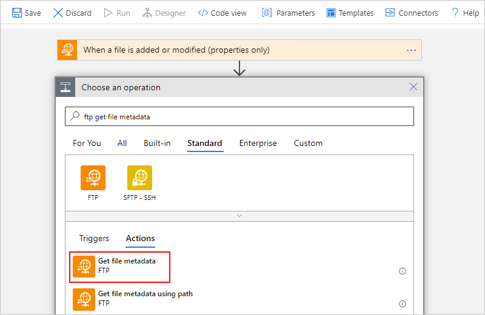

1. If necessary, provide the [information for your connection](/connectors/ftp/#creating-a-connection). When you're done, select **Create**.

   > [!NOTE]
   >
   > By default, this connector transfers files in text format. To transfer files in binary format, 
   > for example, where and when encoding is used, select the binary transport option.

   

1. After the **Get file metadata** action information box appears, click inside the **File** box so that the dynamic content list opens.
   
   You can now select outputs from the preceding trigger.

1. In the dynamic content list, under **When a file is added or modified**, select **List of Files Id**.

   

   The **File** property now references the **List of Files Id** trigger output.

1. On the designer, under the **Get file metadata** action, select **New step**.

1. Under the **Choose an operation** search box, select **All**.

1. In the search box, enter **ftp get file content**.

1. From the actions list, select the action named **Get file content**.

   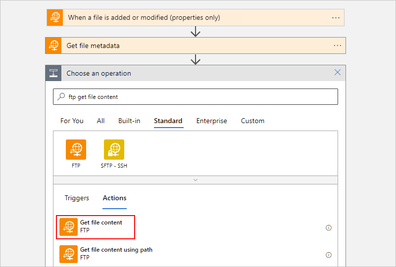

1. After the **Get file content** action information box appears, click inside the **File** box so that the dynamic content list opens.

   You can now select outputs from the preceding trigger and any other actions.

1. In the dynamic content list, under **Get file metadata**, select **Id**, which references the file that was added or updated.

   

   The **File** property now references the **Id** action output.

   

1. When you're done, save your logic app workflow.

### [Standard](#tab/standard)

The steps to add and use an FTP action differ based on whether your workflow uses an "Azure" managed connector trigger or a built-in connector trigger.

* [**Workflows with a built-in trigger**](#built-in-trigger-workflows): Describes the steps for workflows that start with a built-in trigger.

  If you used the FTP built-in trigger, and you want the content from a newly added or updated file, you can use a **For each** loop to iterate through the array that's returned by the trigger. You can then use just the **Get file content** action without any other intermediary actions. For more information about FTP built-in connector operations, review [FTP built-in connector operations](#ftp-built-in-connector-operations) later in this article.

* [**Workflows with a managed trigger**](#managed-trigger-workflows): Describes the steps for workflows that start with a managed trigger.

 If you used the FTP managed connector trigger, and want the content from a newly added or modified file, you can use a **For each** loop to iterate through the array that's returned by the trigger. You then have to use intermediary actions such as the FTP action named **Get file metadata** before you use the **Get file content** action.

#### Workflows with a built-in trigger

1. In the [Azure portal](https://portal.azure.com), and open your logic app workflow in the designer.

1. On the designer, under the trigger or any other actions, select the plus sign (**+**) > **Add an action**.

1. On the **Add an action** pane, under the **Choose an operation** search box, select **Built-in**.

1. In the search box, enter **ftp get file content**. From the actions list, select **Get file content**.

   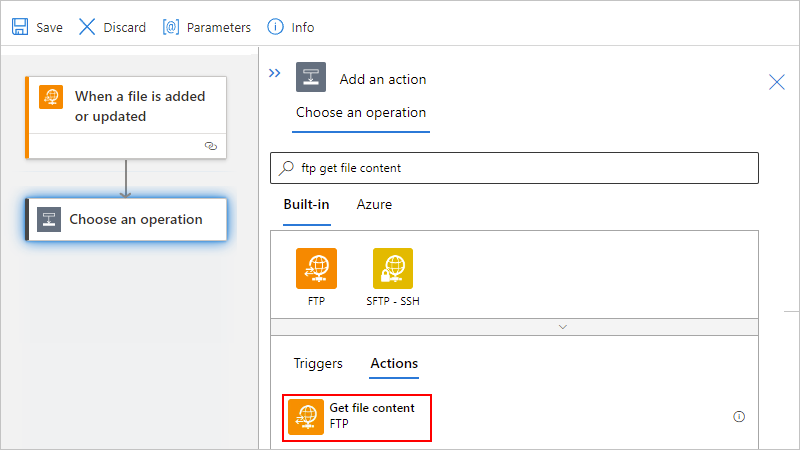

1. If necessary, provide the information for your connection. When you're done, select **Create**.

   > [!NOTE]
   >
   > By default, this connector transfers files in text format. To transfer files in binary format, 
   > for example, where and when encoding is used, select the binary transport option.

   

1. In the action information pane that appears, click inside the **File path** box so that the dynamic content list opens.

   You can now select outputs from the preceding trigger.

1. In the dynamic content list, under **When a file is added or updated**, select **File path**.

   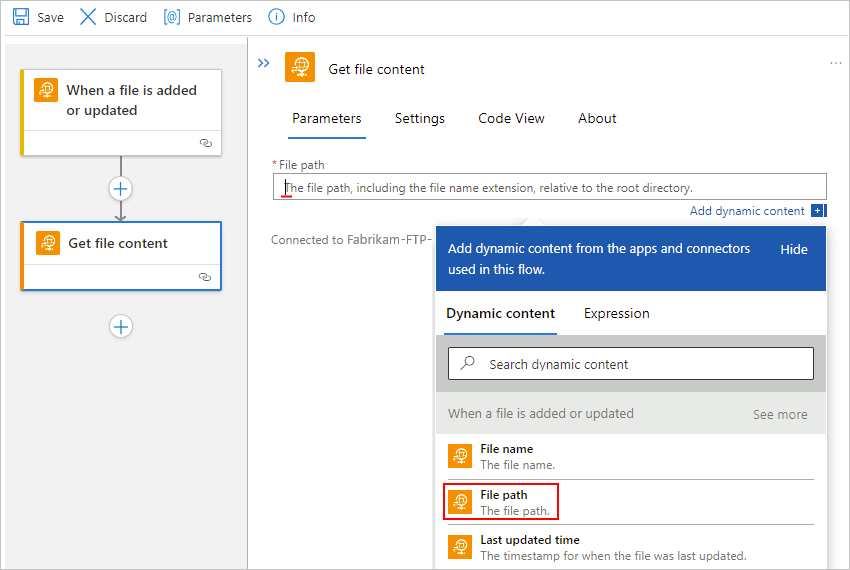

   The **File path** property now references the **File path** trigger output.

   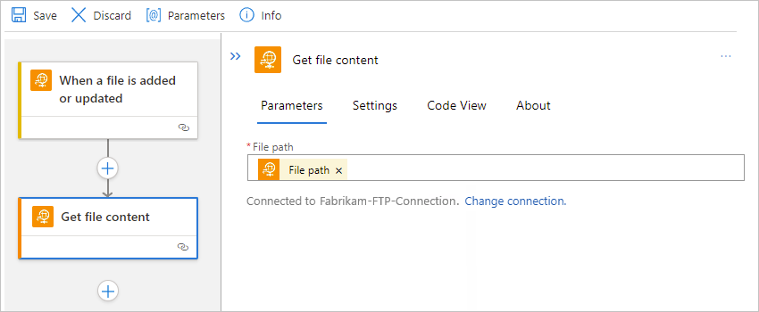

1. Add any other actions that your workflow needs. When you're done, save your logic app workflow.

#### Workflows with a managed trigger

1. In the [Azure portal](https://portal.azure.com), and open your logic app workflow in the designer.

1. On the designer, under the trigger or any other actions, select the plus sign (**+**) > **Add an action**.

1. On the **Add an action** pane, under the **Choose an operation** search box, select **Azure**.

1. In the search box, enter **ftp get file metadata**. From the actions list, select the **Get file metadata** action.

   

1. If necessary, provide the [information for your connection](/connectors/ftp/#creating-a-connection). When you're done, select **Create**.

   > [!NOTE]
   >
   > By default, this connector transfers files in text format. To transfer files in binary format, 
   > for example, where and when encoding is used, select the binary transport option.

   

1. In the action information pane that appears, click inside the **File** box so that the dynamic content list opens.

   You can now select outputs from the preceding trigger.

1. In the dynamic content list, under **When a file is added or modified (properties only)**, select **List of Files Id**.

   

   The **File** property now references the **List of Files Id** trigger output.

   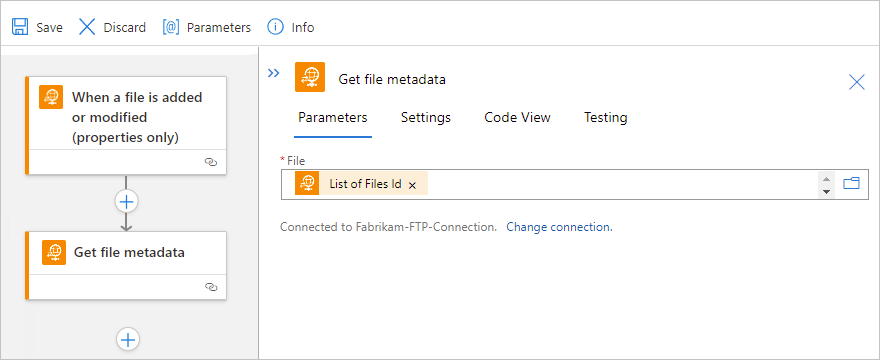

1. On the designer, under the **Get file metadata** action, select the plus sign (**+**) > **Add an action**. 

1. In the **Add an action** pane, under the **Choose an operation** search box, select **Azure**.

1. In the search box, enter **ftp get file content**. From the actions list, select the **Get file content** action.

   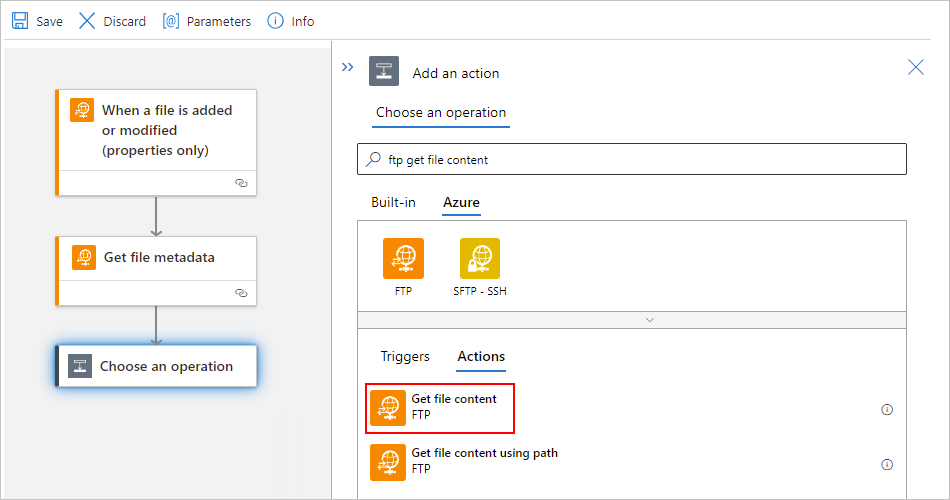

1. In the action information pane that appears, click inside the **File** box so that the dynamic content list opens.

   You can now select outputs from the preceding trigger or actions.

1. In the dynamic content list, under **Get file metadata**, select **Id**.

   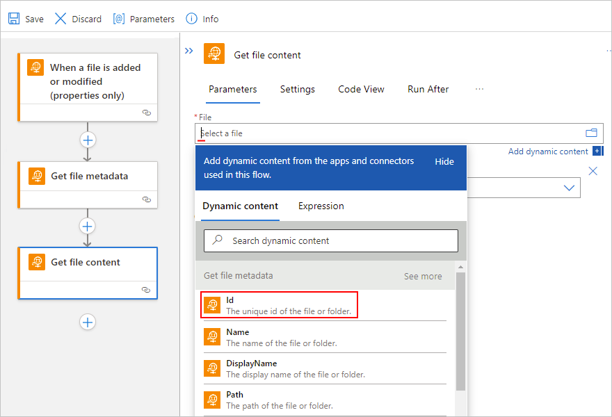

   The **File** property now references the **Id** action output.

   

1. Add any other actions that your workflow needs. When you're done, save your logic app workflow.

---

## Test your workflow

To check that your workflow returns the content that you expect, add another action that sends you the content from the added or updated file. This example uses the Office 365 Outlook action named **Send an email**.

### [Consumption](#tab/consumption)

1. Under the **Get file content** action, add the Office 365 Outlook action named **Send an email**. If you have an Outlook.com account instead, add the Outlook.com **Send an email** action, and adjust the following steps accordingly.

   1. On the designer, under the **Get file content** action, select **New step**.

   1. Under the **Choose an operation** search box, select **All**.

   1. In the search box, enter **office 365 outlook send an email**. From the actions list, select the Office 365 Outlook action named **Send an email**.

   

1. If necessary, sign in to your email account.

1. In the action information box, provide the required values and include any other parameters or properties that you want to test.

   For example, you can include the **File content** output from the **Get file content** action. To find this output, follow these steps:

   1. In the **Get file content** action, click inside the **Body** box so that the dynamic content list opens.

   1. In the dynamic content list, next to **Get file content**, select **See more**.

      

   1. In the dynamic content list, under **Get file content**, select **File Content**.

      The **Body** property now references the **File Content** action output.

      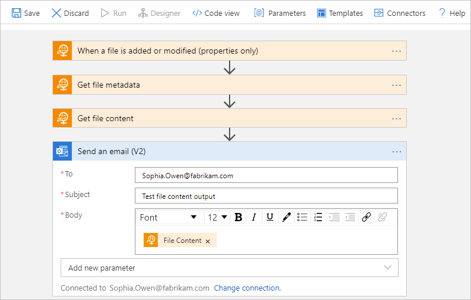

1. Save your logic app workflow.

1. To run and trigger the workflow, on the designer toolbar, select **Run Trigger** > **Run**. Add a file to the FTP folder that your workflow monitors.

### [Standard](#tab/standard)

#### Workflow with built-in trigger and actions

1. Under the **Get file content** action, add the Office 365 Outlook action named **Send an email**. If you have an Outlook.com account instead, add the Outlook.com **Send an email** action, and adjust the following steps accordingly.

   1. On the designer, select **Choose an operation**.

   1. On the **Add an action** pane, under the **Choose an operation** search box, select **Azure**.

   1. In the search box, enter **office 365 outlook send an email**. From the actions list, select the Office 365 Outlook action named **Send an email**.

   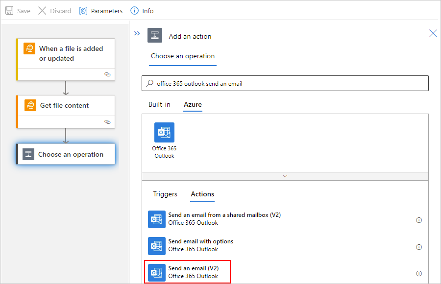

1. If necessary, sign in to your email account.

1. In the action information box, provide the required values and include any other parameters or properties that you want to test.

   For example, you can include the **File content** output from the **Get file content** action. To find this output, follow these steps:

   1. In the **Get file content** action, click inside the **Body** box so that the dynamic content list opens. In the dynamic content list, next to **Get file content**, select **See more**.

      

   1. In the dynamic content list, under **Get file content**, select **File content**.

      The **Body** property now references the **File content** action output.

      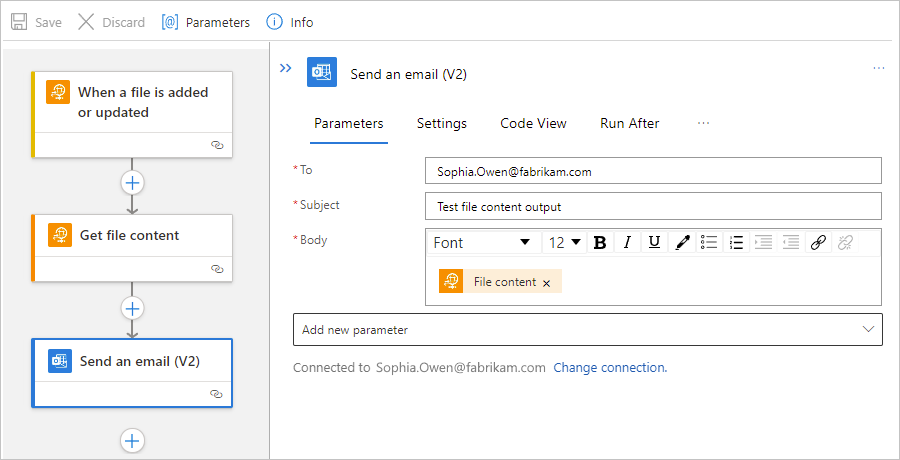

1. Save your logic app workflow.

1. To run and trigger the workflow, follow these steps:

   1. On workflow menu, select **Overview**.

   1. On the **Overview** pane toolbar, select **Run Trigger** > **Run**.

   1. Add a file to the FTP folder that your workflow monitors.

#### Workflow with managed trigger and actions

1. Under the **Get file content** action, add the Office 365 Outlook action named **Send an email**. If you have an Outlook.com account instead, add the Outlook.com **Send an email** action, and adjust the following steps accordingly.

   1. On the designer, select **Choose an operation**.

   1. On the **Add an action** pane, under the **Choose an operation** search box, select **Azure**.

   1. In the search box, enter **office 365 outlook send an email**. From the actions list, select the Office 365 Outlook action named **Send an email**.

   

1. If necessary, sign in to your email account.

1. In the action information box, provide the required values and include any other parameters or properties that you want to test.

   For example, you can include the **File content** output from the **Get file content** action. To find this output, follow these steps:

   1. In the **Get file content** action, click inside the **Body** box so that the dynamic content list opens. In the dynamic content list, next to **Get file content**, select **See more**.

      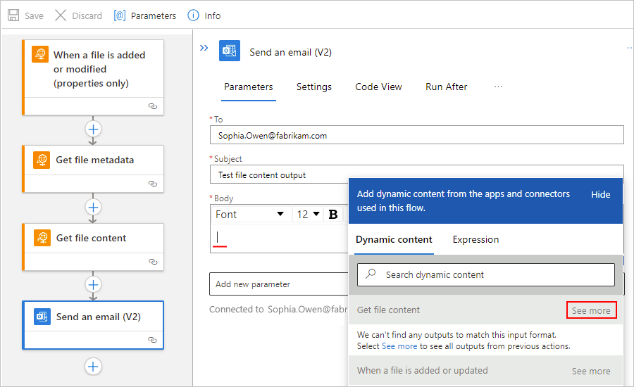

   1. In the dynamic content list, under **Get file content**, select **File content**.

      The **Body** property now references the **File content** action output.

      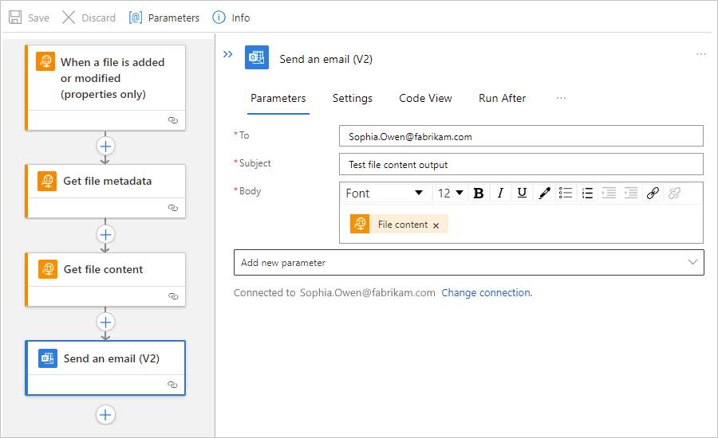

1. Save your logic app workflow.

1. To run and trigger the workflow, follow these steps:

   1. On workflow menu, select **Overview**.

   1. On the **Overview** pane toolbar, select **Run Trigger** > **Run**.

   1. Add a file to the FTP folder that your workflow monitors.

---

## FTP built-in connector operations

The FTP built-in connector is available only for Standard logic app workflows and provides the following operations:

| Trigger | Description |
|---------|-------------|
| [**When a file is added or updated**](#when-file-added-updated) | Start a logic app workflow when a file is added or updated in the specified folder on the FTP server. 

**Note**: This trigger gets only the file metadata or properties, not the file content. However, to get the content, your workflow can follow this trigger with the [**Get file content**](#get-file-content) action. |
|||

| Action | Description |
|--------|-------------|
| [**Create file**](#create-file) | Create a file using the specified file path and file content. |
| [**Delete file**](#delete-file) | Delete a file using the specified file path. |
| [**Get file content**](#get-file-content) | Get the content of a file using the specified file path. |
| [**Get file metadata**](#get-file-metadata) | Get the metadata or properties of a file using the specified file path. |
| [**List files and subfolders in a folder**](#list-files-subfolders-folder) | Get a list of files and subfolders in the specified folder. |
| [**Update file**](#update-file) | Update a file using the specified file path and file content. |
|||

### When a file is added or updated

Operation ID: `whenFtpFilesAreAddedOrModified`

This trigger starts a logic app workflow run when a file is added or updated in the specified folder on the FTP server. The trigger gets only the file metadata or properties, not any file content. However, to get the content, your workflow can follow this trigger with the [**Get file content**](#get-file-content) action.

#### Parameters

| Name | Key | Required | Type | Description |
|------|-----|----------|------|-------------|
| **Folder path** | `folderPath` | True | `string` | The folder path, relative to the root directory. |
| **Number of files to return** | `maxFileCount` | False | `integer` | The maximum number of files to return from a single trigger run. Valid values range from 1 - 100.   **Note**: By default, the **Split On** setting is enabled and forces this trigger to process each file individually in parallel. |
| **Cutoff timestamp to ignore older files** | `oldFileCutOffTimestamp` | False | `dateTime` | The cutoff time to use for ignoring older files. Use the timestamp format `YYYY-MM-DDTHH:MM:SS`. To disable this feature, leave this property empty. |
||||||

#### Returns

When the trigger's **Split On** setting is enabled, the trigger returns the metadata or properties for one file at a time. Otherwise, the trigger returns an array that contains each file's metadata.

| Name | Type |
|------|------|
| **List of files** | [BlobMetadata](/connectors/ftp/#blobmetadata) |
|||

### Create file

Operation ID: `createFile`

This action creates a file using the specified file path and file content. If the file already exists, this action overwrites that file.

> [!IMPORTANT]
>
> If the file is deleted or renamed on the FTP server immediately after creation, 
> the operation might return an HTTP **404** error by design. To avoid this problem, 
> include a 1-minute delay before you delete or rename any newly created files. You can 
> use the [**Delay** action](connectors-native-delay.md) to add this delay to your workflow.

#### Parameters

| Name | Key | Required | Type | Description |
|------|-----|----------|------|-------------|
| **File path** | `filePath` | True | `string` | The file path, including the file name extension if any, relative to the root directory. |
| **File content** | `fileContent` | True | `string` | The file content. |
||||||

#### Returns

This action returns a [BlobMetadata](/connectors/ftp/#blobmetadata) object named **Body**.

| Name | Type |
|------|------|
| **File metadata File name** | `string` |
| **File metadata File path** | `string` |
| **File metadata File size** | `string` |
| **File metadata** | [BlobMetadata](/connectors/ftp/#blobmetadata) |
|||

### Delete file

Operation ID: `deleteFtpFile`

This action deletes a file using the specified file path.

#### Parameters

| Name | Key | Required | Type | Description |
|------|-----|----------|------|-------------|
| **File path** | `filePath` | True | `string` | The file path, including the file name extension if any, relative to the root directory. |
||||||

#### Returns

None

### Get file content

Operation ID: `getFtpFileContent`

This action gets the content of a file using the specified file path.

#### Parameters

| Name | Key | Required | Type | Description |
|------|-----|----------|------|-------------|
| **File path** | `path` | True | `string` | The file path, including the file name extension if any, relative to the root directory. |
||||||

#### Returns

This action returns the content of a file as a binary value named **File content**.

| Name | Type |
|------|------|
| **File content** | Binary |
|||

### Get file metadata

Operation ID: `getFileMetadata`

This action gets the metadata or properties of a file using the specified file path.

#### Parameters

| Name | Key | Required | Type | Description |
|------|-----|----------|------|-------------|
| **File path** | `path` | True | `string` | The file path, including the file name extension if any, relative to the root directory. |
||||||

#### Returns

This action returns the following outputs:

| Name | Type |
|------|------|
| **File name** | `string` |
| **File path** | `string` |
| **File size** | `string` |
| **Last updated time** | `string` |
| **File metadata** | [BlobMetadata](/connectors/ftp/#blobmetadata) |
|||

### List files and subfolders in a folder

Operation ID: `listFilesInFolder`

This action gets a list of files and subfolders in the specified folder.

#### Parameters

| Name | Key | Required | Type | Description |
|------|-----|----------|------|-------------|
| **Folder path** | `folderPath` | True | `string` | The folder path, relative to the root directory. |
| **File content** | `fileContent` | True | `string` | The content for the file |
||||||

#### Returns

This action returns an array that's named **Response** and contains [BlobMetadata](/connectors/ftp/#blobmetadata) objects.

| Name | Type |
|------|------|
| **Response** | Array with [BlobMetadata](/connectors/ftp/#blobmetadata) objects |
|||

### Update file

Operation ID: `updateFile`

This action updates a file using the specified file path and file content.

> [!IMPORTANT]
>
> If the file is deleted or renamed on the FTP server immediately after an update, 
> the operation might return an HTTP **404** error by design. To avoid this problem, 
> include a 1-minute delay before you delete or rename any updated files. You can use 
> the [**Delay** action](connectors-native-delay.md) to add this delay to your workflow.

#### Parameters

| Name | Key | Required | Type | Description |
|------|-----|----------|------|-------------|
| **File path** | `filePath` | True | `string` | The file path, including the file name extension if any, relative to the root directory. |
| **File content** | `fileContent` | True | `string` | The content for the file |
||||||

#### Returns

This action returns a [BlobMetadata](/connectors/ftp/#blobmetadata) object named **Body**.

| Name | Type |
|------|------|
| **Body** | [BlobMetadata](/connectors/ftp/#blobmetadata) |
|||

## Next steps

* [Connectors overview for Azure Logic Apps](../connectors/apis-list.md)