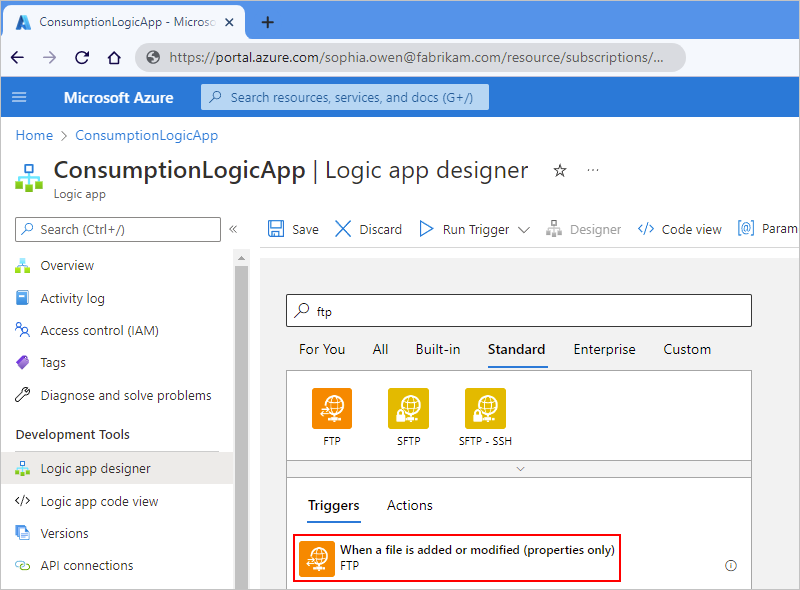
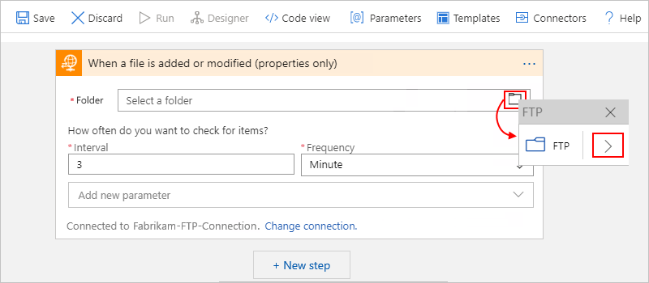
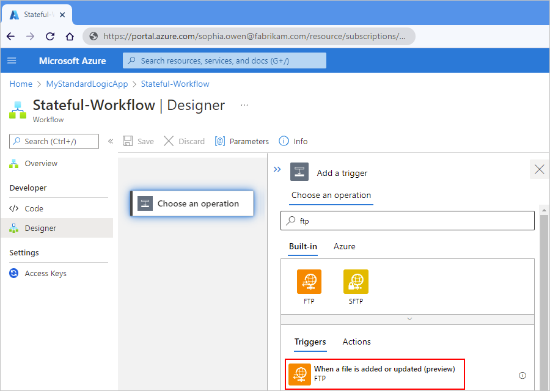
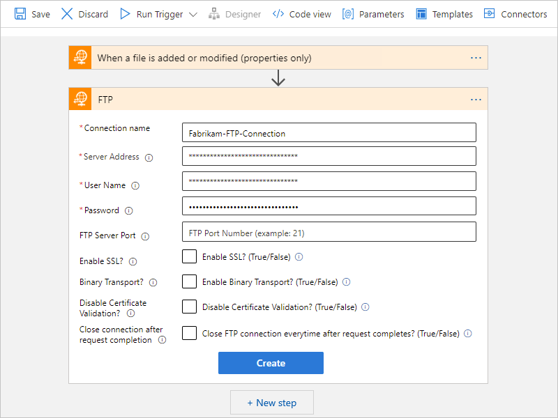
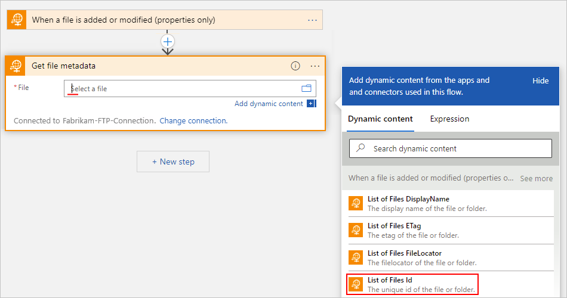
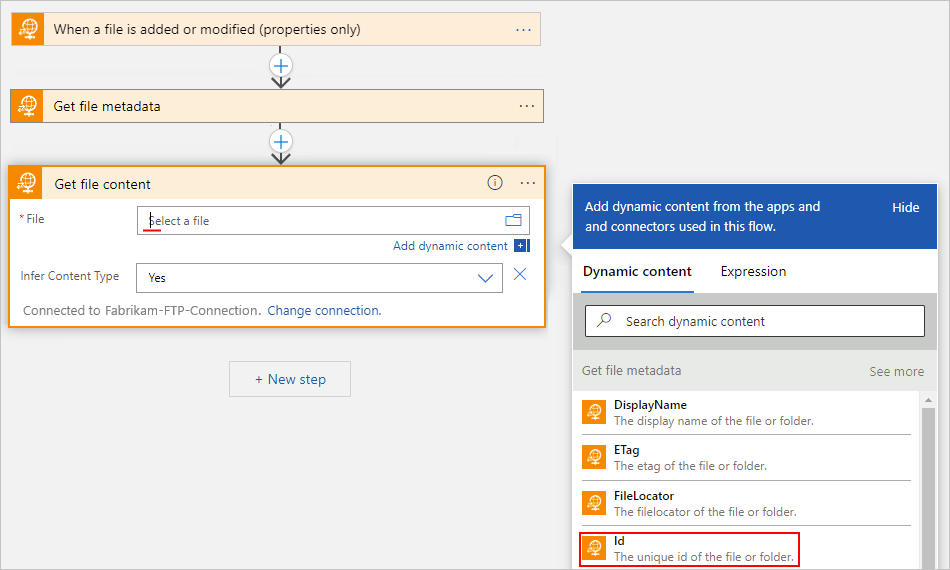
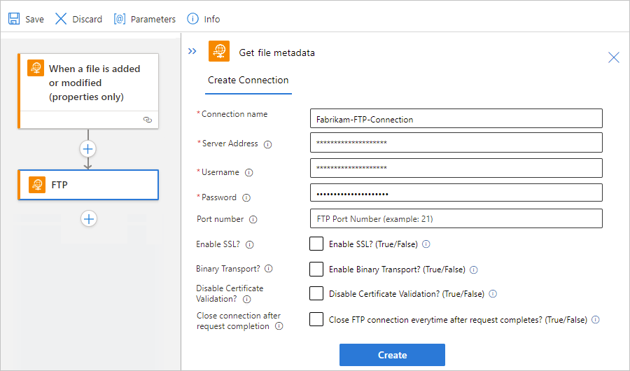

# Connect to an FTP server from workflows in Azure Logic Apps

This article shows how to access your FTP server from a workflow in Azure Logic Apps with the FTP connector. You can then create automated workflows that run when triggered by events in your FTP server or in other systems and run actions to manage your FTP server data, content, and resources.

For example, your workflow can start with an FTP trigger that monitors and responds to events on your FTP server. The trigger makes the outputs available to subsequent actions in your workflow. Your workflow can run FTP actions that create, send, receive, and manage files through your FTP server account using the following specific tasks:

* Monitor when files are added or changed.
* Get, create, copy, update, list, and delete files.
* Get file content and metadata.
* Extract archives to folders.

If you're new to Azure Logic Apps, review the following get started documentation:

* [What is Azure Logic Apps](../logic-apps/logic-apps-overview.md)
* [Quickstart: Create your first logic app workflow](../logic-apps/quickstart-create-first-logic-app-workflow.md)

## Connector technical reference

The FTP connector has different versions, based on [logic app type and host environment](../logic-apps/logic-apps-overview.md#resource-environment-differences).

| Logic app | Environment | Connector version |
|-----------|-------------|-------------------|
| **Consumption** | Multi-tenant Azure Logic Apps | Managed connector (Standard class). For more information, review the following documentation:   - [FTP managed connector reference](/connectors/ftp)  - [Managed connectors in Azure Logic Apps](managed.md) |
| **Consumption** | Integration service environment (ISE) | Managed connector (Standard class) and ISE version, which has different message limits than the Standard class. For more information, review the following documentation:   - [FTP managed connector reference](/connectors/ftp)  - [ISE message limits](../logic-apps/logic-apps-limits-and-config.md#message-size-limits)  - [Managed connectors in Azure Logic Apps](managed.md) |
| **Standard** | Single-tenant Azure Logic Apps and App Service Environment v3 (Windows plans only) | Managed connector (Standard class) and built-in connector, which is [service provider based](../logic-apps/custom-connector-overview.md#service-provider-interface-implementation). The built-in connector can directly access Azure virtual networks with a connection string and doesn't need the on-premises data gateway. For more information, review the following documentation:   - [FTP managed connector reference](/connectors/ftp)  - [FTP built-in connector operations](#built-in-operations) section later in this article  - [Managed connectors in Azure Logic Apps](managed.md)  - [Built-in connectors in Azure Logic Apps](built-in.md) |
||||

## Limitations

* Capacity and throughput

  * Managed connector for Consumption and Standard workflows

    By default, FTP actions can read or write files that are *50 MB or smaller*. To handle files larger than 50 MB, FTP actions support [message chunking](../logic-apps/logic-apps-handle-large-messages.md). The **Get file content** action implicitly uses chunking.

  * Built-in connector for Standard workflows:

    By default, FTP actions can read or write files that are *200 MB or smaller*. Currently, the FTP built-in connector doesn't support chunking.

* FTP triggers now return only metadata or properties, not file content. However, you can follow these triggers with the **Get file content** action and use the pattern described in this article. To make sure that a trigger returns one file at a time, rather than a list, make sure that the trigger's [**Split On** option is enabled](../logic-apps/logic-apps-workflow-actions-triggers.md#split-on-debatch).

* FTP triggers work only the specified folder, not its subfolders. To check a folder's subfolders, set up a separate workflow for each subfolder. For more information, review [FTP managed connector reference - Trigger limits](/connectors/ftp/#trigger-limits).

* If you have an on-premises FTP server, consider the following options:

  * Consumption workflows: Create a [Standard logic app workflow](../logic-apps/single-tenant-overview-compare.md) instead, or use [Azure App Service Hybrid connections](../app-service/app-service-hybrid-connections.md), which both let you access on-premises data sources without an on-premises data gateway.

  * Standard workflows: Use the FTP built-in connector operations, which work without an on-premises data gateway.

* The FTP connector isn't compatible with implicit File Transfer Protocol Secure (FTPS). For secure FTP, make sure to set up *explicit* File Transfer Protocol Secure (FTPS) instead. The FTP connector supports only *explicit* FTP over FTPS, which is an extension of Transport Layer Security (TLS), the successor to Secure Socket Layer (SSL).

For other connector limitations, review [FTP managed connector reference](/connectors/ftp/).

## Prerequisites

* An Azure account and subscription. If you don't have an Azure subscription, [sign up for a free Azure account](https://azure.microsoft.com/free/?WT.mc_id=A261C142F).

* The FTP connector requires your FTP host server address and account credentials

* The FTP connector requires access to the FTP server from or through the internet.

* The FTP connector requires that your FTP server is set up to operate or accept in *passive* mode.

* The FTP connector requires the FTP server to support folder names that include whitespace for use with the preceding commands. Some FTP servers, such as ProFTPd, require that you enable the `NoSessionReuseRequired` option while working in TLS/SSL mode.

* The FTP managed connector requires that the FTP server enables specific commands and support folder names with whitespace. For more information, review [FTP managed connector reference - Trigger limits](/connectors/ftp/#trigger-limits) and [requirements](/connectors/ftp/#requirements).

* The FTP managed connector implements actions that require the FTP server to enable use the following commands:

  - APPE
  - DELE
  - LIST - Make sure this command returns the `year` component for file timestamps older than 6 months.
  - MDTM
  - RENAME
  - RETR
  - SIZE
  - STOR

* FTP triggers work by checking the FTP file system and looking for any file that's changed since the last poll. The trigger uses the last modified time on a file. If you have an external client or other tool that creates the file and preserves the timestamp when the files change, disable the preservation feature so that your trigger can work. For more information, review [FTP managed connector reference - Trigger limits](/connectors/ftp/#trigger-limits).

* The logic app workflow where you want to access your FTP account. To start your workflow with an FTP trigger, you have to start with a blank workflow. To use an FTP action, start your workflow with another trigger, such as the **Recurrence** trigger.

For other connector requirements, review the [FTP managed connector reference](/connectors/ftp/).

## Add an FTP trigger

A Consumption logic app workflow has only the FTP managed connector. However, a Standard logic app workflow can use the FTP managed connector *and* the FTP built-in connector. The FTP managed connector and built-in connector each have only one trigger available:

* Managed connector trigger: The **When a file is added or modified (properties only)** trigger starts a Consumption or Standard logic app workflow when one or more files are added or changed in a folder on the FTP server. This trigger gets only the file properties or metadata, not the file content. However, to get the content, your workflow can follow this trigger with other FTP actions to get the file content. For more information about this trigger, review [When a file is added or modified (properties only)](/connectors/ftp/#when-a-file-is-added-or-modified-(properties-only)).

* Built-in connector trigger: The **When a file is added or modified** trigger starts a Standard logic app workflow when one or more files are added or changed in a folder on the FTP server. This trigger gets only the file properties or metadata, not the file content. However, to get the content, your workflow can follow this trigger with other FTP actions to get the file content. For more information about this trigger, review [When a file is added or updated](#when-file-added-updated).

The following steps use the Azure portal, but with the appropriate Azure Logic Apps extension, you can also use the following tools to create logic app workflows:

* Consumption logic app workflows: [Visual Studio](../logic-apps/quickstart-create-logic-apps-with-visual-studio.md) or [Visual Studio Code](../logic-apps/quickstart-create-logic-apps-visual-studio-code.md)

* Standard logic app workflows: [Visual Studio Code](../logic-apps/create-single-tenant-workflows-visual-studio-code.md)

### [Consumption](#tab/consumption)

1. In the [Azure portal](https://portal.azure.com), and open your blank logic app workflow in the designer.

1. Find and select the [FTP trigger](/connectors/ftp/) that you want to use.

   1. On the designer, under the search box, select **All**.

   1. In the search box, enter **ftp**.

   1. From the triggers list, select the trigger that you want.

      This example continues with the trigger named **When a filed is added or modified (properties only)**.

      

1. Provide the [information for your connection](/connectors/ftp/#creating-a-connection). When you're done, select **Create**.

   By default, this connector transfers files in text format. To transfer files in binary format, for example, where and when encoding is used, turn on the **Binary Transport** option named **Enable Binary Transport**.

   

1. After the trigger information box appears, in the **Folder** box, select the folder icon so that a list appears. 

   To find the folder you want to monitor for new or edited files, select the right angle arrow (**>**), browse to that folder, and then select the folder.

   

   Your selected folder appears in the **Folder** box.

   

1. When you're done, save your workflow.

### [Standard](#tab/standard)

1. In the [Azure portal](https://portal.azure.com), and open your blank logic app workflow in the designer.

1. Find and select the FTP trigger that you want to use.

   This example continues with selecting either the FTP built-in trigger named **When a file is added or updated** or the FTP managed connector trigger named **When a file is added or modified (properties only)**.

   1. On the designer, select **Choose an operation**. In the search box, enter **ftp**. Under the search box, select either of the following options:

      * **Built-in** when you want to use the [FTP built-in connector trigger](#ftp-built-in-connector-operations). From the triggers list, select the trigger that you want.

        This example continues with the trigger named **When a filed is added or updated**.

        

      * **Azure** when you want to use the [FTP managed connector trigger](/connectors/ftp/). From the triggers list, select the trigger that you want.

        This example continues with the trigger named **When a filed is added or modified (properties only)**.

        

1. Provide the [information for your connection](/connectors/ftp/#creating-a-connection). When you're done, select **Create**.

   By default, this connector transfers files in text format. To transfer files in binary format, for example, where and when encoding is used, turn on the **Binary Transport** option named **Enable Binary Transport**.

   * **Built-in**

     

   * **Azure**

     

1. After the trigger information box appears, in the **Folder** box, select the folder icon so that a list appears. To find the folder you want to monitor for new or edited files, select the right angle arrow (**>**), browse to that folder, and then select the folder.

   * **Built-in**

     

     Your selected folder appears in the **Folder** box.

     

   * **Azure**

     

     Your selected folder appears in the **Folder** box.

     

1. When you're done, save your logic app workflow.

---

When you save your workflow, this step automatically publishes your updates to your deployed logic app, which is live in Azure. With only a trigger, your workflow just checks the FTP server based on your specified schedule. You have to [add an action](#add-ftp-action) that responds to the trigger. For this example, you can add an FTP action that gets the new or updated file's metadata, and then use those return values to get the new or updated content.

## Add an FTP action

A Consumption logic app workflow has only the FTP managed connector. However, a Standard logic app workflow can use the FTP managed connector and the FTP built-in connector. Each version has multiple actions.

* Managed connector actions: These actions run in a Consumption or Standard logic app workflow.

* Built-in connector trigger: These actions run only in a Standard logic app workflow.

For example, both connector types have their versions for the **Get file metadata** and **Get file content** actions. You can use an FTP trigger to monitor an FTP folder for new files that describe customer orders. If a newly added file exists, the trigger returns the file properties or metadata. To get these properties, you can use the **Get file metadata** action. You can then follow with the **Get file content** action and use the returned property values for the file to get the content for further processing and store that order in an orders database. You might also use a condition to check that file's content against specific criteria and get that content only if that content meets the criteria. For more information about these actions, review the following documentation:

* [Get file metadata - managed connector version](/connectors/ftp/#get-file-metadata)
* [Get file metadata - built-in connector version](#get-file-metadata)
* [Get file content - managed connector version](/connectors/ftp/#get-file-content)
* [Get file content - built-in connector version](#get-file-content)

The following steps use the Azure portal, but with the appropriate Azure Logic Apps extension, you can also use the following tools to create logic app workflows:

* Consumption logic app workflows: [Visual Studio](../logic-apps/quickstart-create-logic-apps-with-visual-studio.md) or [Visual Studio Code](../logic-apps/quickstart-create-logic-apps-visual-studio-code.md)

* Standard logic app workflows: [Visual Studio Code](../logic-apps/create-single-tenant-workflows-visual-studio-code.md)

### [Consumption](#tab/consumption)

1. In the [Azure portal](https://portal.azure.com), and open your logic app workflow in the designer.

1. Find and select the [FTP action](/connectors/ftp/) that you want to use.

   This example continues with the action named **Get file metadata**.

   1. On the designer, under the trigger or any other actions, select **New step**.

   1. Under the **Choose an operation** search box, select **All**.

   1. In the search box, enter **ftp get file metadata**.

   1. From the actions list, select the action named **Get file metadata**.

   

1. If necessary, provide the [information for your connection](/connectors/ftp/#creating-a-connection). When you're done, select **Create**.

   By default, this connector transfers files in text format. To transfer files in binary format, for example, where and when encoding is used, turn on the **Binary Transport** option named **Enable Binary Transport**.

   

1. After the **Get file metadata** action information box appears, complete the following steps:

   1. Click in the **File** box so that the dynamic content list appears.
   
      You can now select outputs from the preceding trigger.

   1. From the dynamic content list, under **When a file is added or modified**, select **List of Files Id**.

      

1. In the designer, under the **Get file metadata** action, select **New step**.

1. Find and select the action named **Get file content**.

   1. On the designer, under the **Choose an operation** search box, select **All**.

   1. In the search box, enter **ftp get file content**.

   1. From the actions list, select the action named **Get file content**.

   

1. After the **Get file content** action information box appears, complete the following steps:

   1. Click in the **File** box so that the dynamic content list appears.
   
      You can now select outputs from the preceding trigger and any other actions.

   1. From the dynamic content list, under **Get file metadata**, select **Id**, which references the file that was added or updated.

      

      The **Id** property now appears in the **File** box.

      

1. When you're done, save your logic app workflow.

### [Standard](#tab/standard)

1. In the [Azure portal](https://portal.azure.com), and open your logic app workflow in the designer.

1. Find and select the FTP action that you want to use.

   If you used the FTP managed connector trigger, and you want to get the content from a newly added or modified file, you have to use both the FTP actions that get the file's metadata first and then get the file content. However, if you used the FTP built-in trigger, you only need to use the **Get File Content** action.

   1. On the designer, under the trigger or any other actions, select the plus sign (**+**) > **Add an action**.

      The **Choose an operation** box appears with the **Add an action** pane on the right side.

   1. In the **Choose an operation** search box, enter **ftp get file metadata**. Under the search box, select either of the following options:

      * **Built-in** when you want to use the [FTP built-in connector action](#ftp-built-in-connector-operations). From the actions list, select the action that you want.

        This example continues with the action named **Get the file metadata**.

        

      * **Azure** when you want to use the [FTP managed connector action](/connectors/ftp/). From the actions list, select the action that you want.

        This example continues with the action named **Get file metadata**.

        

1. If necessary, provide the [information for your connection](/connectors/ftp/#creating-a-connection). When you're done, select **Create**.

   By default, this connector transfers files in text format. To transfer files in binary format, for example, where and when encoding is used, turn on the **Binary Transport** option named **Enable Binary Transport**.

   * **Built-in**

     

   * **Azure**

     

1. After the **Get file metadata** action information box appears, complete the following steps:

   1. Click in the **File** box so that the dynamic content list appears.
   
      You can now select outputs from the preceding trigger.

   1. From the dynamic content list, under **When a file is added or modified**, select **List of Files Id**.

      * **Built-in**

        

      * **Azure**

        

1. In the designer, under the **Get file metadata** action, select the plus sign (**+**) > **Add an action**.

   * **Built-in**

     

     

   * **Azure**

     

     Your selected folder appears in the **Folder** box.

     

1. When you're done, save your logic app workflow.

---

## Test your workflow

To check that your workflow returns the content that you expect, add another action that sends you the content from the uploaded or updated file.

1. Under the **Get file content** action, add an action that can send you the file's contents. This example adds the **Send an email** action for the Office 365 Outlook.

   

1. After the action appears, provide the information and include the properties that you want to test. For example, include the **File content** property, which appears in the dynamic content list after you select **See more** in the **Get file content** section.

   

1. Save your logic app. To run and trigger the logic app, on the toolbar, select **Run**, and then add a file to the FTP folder that your logic app now monitors.

## FTP built-in connector operations

The FTP built-in connector is available only for Standard logic app workflows and provides the following operations:

| Trigger | Description |
|---------|-------------|
| [**When a file is added or updated**](#when-file-added-updated) | Start a logic app workflow when one or more files are added or changed in a folder on the FTP server. This trigger gets only the file metadata, not the file content. However, to get the content, your workflow can follow this trigger with the [**Get file content**](#get-file-content) action.    For more information, review [When a file is added or updated](#when-file-added-updated). |
|||

| Action | Description |
|--------|-------------|
| [**Create file**](#create-file) | Create a file |
| [**Delete file**](#delete-file) |
| [**Get File Content**](#get-file-content) |
| [**Get the file metadata**](#get-file-metadata) |
| [**List files and subfolders in a folder**](#list-files-subfolders-folder) |
| [**Update file**](#update-file) |
|||

### When a file is added or updated

Operation ID: `whenFtpFilesAreAddedOrModified`

This trigger starts a logic app workflow when one or more files are added or updated in a folder on the FTP server. The trigger gets only the file metadata, not any file content. However, to get the content, your workflow can follow this trigger with the [**Get file content**](#get-file-content) action.

#### Parameters

| Name | Key | Required | Type | Description |
|------|-----|----------|------|-------------|
| **Folder path** | `folderPath` | True | String | The folder path. |
| **Number of files to return** | `maxFileCount` | False | Integer | The maximum number of files to return from a single trigger run. Valid values range from 1 - 100.   **Note**: The **Split On** setting can force this trigger to process each item individually. |
| **Old files cutoff timestamp** | `oldFileCutOffTimestamp` | False | DateTime | The cutoff time to use when ignoring older files using the `YYYY-MM-DDTHH:MM:SS` format. To disable this capability, don't provide this input. |
||||||

#### Returns

When the trigger's **Split On** setting is enabled, the trigger returns the metadata for each file at a time. Otherwise, the trigger returns a list with each file's metadata.

| Name | Type |
|------|------|
| **List of Files** | [BlobMetadata](/connectors/ftp/#blobmetadata) |
|||

### Create file

Operation ID: `createFile`

This action creates a file. If the file is deleted or renamed on the FTP server immediately after creation, the operation might return an HTTP **404** error by design. To avoid this problem, include a 1-minute delay before you delete or rename any newly created files. You can use the [**Delay** action](connectors-native-delay.md) to add this delay to your workflow.

#### Parameters

| Name | Key | Required | Type | Description |
|------|-----|----------|------|-------------|
| **File path** | `filePath` | True | String | The full file path, including the file extension, if any. Specify a path that's relative to the root directory. |
| **The file content** | `fileContent` | True | string | The content for the file |
||||||

#### Returns

| Name | Type |
|------|------|
| **List of Files** | [BlobMetadata](/connectors/ftp/#blobmetadata) |
|||

### Delete file

### Get file content

### Get the file metadata

The **Get file metadata** action gets the properties for a file that's on your FTP server and the **Get file content** action gets the file content based on the information about that file on your FTP server. For example, you can add the trigger from the previous example and these actions to get the file's content after that file is added or edited.

### List the files and subfolders in a folder

### Update file

## Next steps

* Learn about other [Logic Apps connectors](../connectors/apis-list.md)