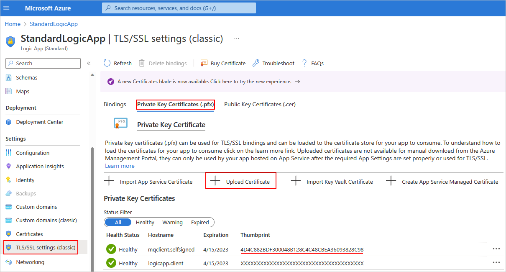
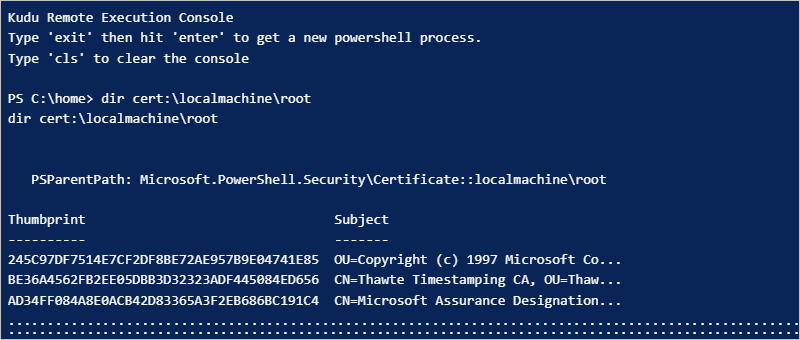
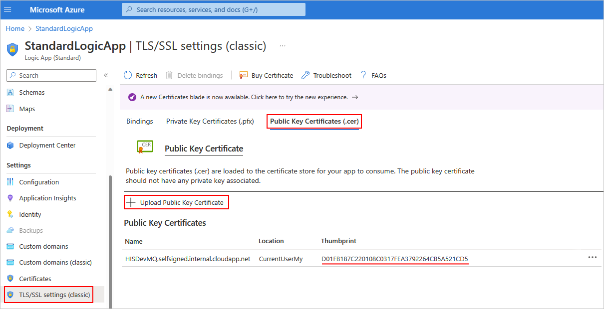
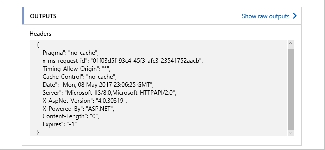

# Connect to an IBM MQ server from a workflow in Azure Logic Apps

[!INCLUDE [logic-apps-sku-consumption-standard](../../includes/logic-apps-sku-consumption-standard.md)]

This article shows how to access an MQ server that's either on premises or in Azure from a workflow in Azure Logic Apps with the MQ connector. You can then create automated workflows that receive and send messages stored in your MQ server. For example, your workflow can browse for a single message in a queue and then run other actions.

The MQ connector provides a wrapper around an Microsoft MQ client, which includes all the messaging capabilities to communicate with a remote MQ server across a TCP/IP network. This connector defines the connections, operations, and parameters to call the MQ client.

## Supported IBM WebSphere MQ versions

* MQ 7.5
* MQ 8.0
* MQ 9.0, 9.1, and 9.2

## Connector technical reference

The MQ connector has different versions, based on [logic app type and host environment](../logic-apps/logic-apps-overview.md#resource-environment-differences).

| Logic app | Environment | Connection version |
|-----------|-------------|--------------------|
| **Consumption** | Multi-tenant Azure Logic Apps | Managed connector, which appears in the designer under the **Enterprise** label. This connector provides only actions, not triggers. For more information, review the following documentation:   - [MQ managed connector reference](/connectors/mq)  - [Managed connectors in Azure Logic Apps](managed.md) |
| **Consumption** | Integration service environment (ISE) | Managed connector, which appears in the designer under the **Enterprise** label. For more information, review the following documentation:   - [MQ managed connector reference](/connectors/mq)  - [Managed connectors in Azure Logic Apps](managed.md) |
| **Standard** | 	Single-tenant Azure Logic Apps and App Service Environment v3 (Windows plans only) | Managed connector, which appears in the designer under the **Azure** label, and built-in connector, which appears in the designer under the **Built-in** label and is service provider based. The built-in version differs in the following ways:   - The built-in version includes actions *and* triggers.   - The built-in version can connect directly to an MQ server and access Azure virtual networks. You don't need an on-premises data gateway.   - The built-in version supports Transport Layer Security (TLS) encryption for data in transit, message encoding for both the send and receive operations, and Azure virtual network integration when your logic app uses the Azure Functions Premium plan   For more information, review the following documentation:   - [MQ managed connector reference](/connectors/mq)  - [MQ built-in connector reference](/azure/logic-apps/connectors/built-in/reference/mq/)  -  [Add a certificate for TLS encryption (built-in MQ connector only)](#add-TLS-certificate)  - [Built-in connectors in Azure Logic Apps](built-in.md) |

## Limitations

* The MQ managed connector supports only server authentication, not client authentication. For more information, see [Connection and authentication problems](#connection-problems).

* The MQ connector doesn't support segmented messages.

* The MQ connector doesn't use the message's **Format** field and doesn't make any character set conversions. The connector only puts whatever data appears in the message field into a JSON message and sends the message along.

For more information, review the [MQ managed connector reference](/connectors/mq) or the [MQ built-in connector reference](/azure/logic-apps/connectors/built-in/reference/mq/).

## Prerequisites

* An Azure account and subscription. If you don't have an Azure subscription, [sign up for a free Azure account](https://azure.microsoft.com/free/?WT.mc_id=A261C142F).

* If you're using an on-premises MQ server, [install the on-premises data gateway](../logic-apps/logic-apps-gateway-install.md) on a server within your network. For the MQ connector to work, the server with the on-premises data gateway also must have .NET Framework 4.6 installed.

  After you install the gateway, you must also create a data gateway resource in Azure. The MQ connector uses this resource to access your MQ server. For more information, review [Set up the data gateway connection](../logic-apps/logic-apps-gateway-connection.md). 

  > [!NOTE]
  >
  > You don't need the gateway in the following scenarios:
  > 
  > * Your MQ server is publicly available or available in Azure.
  > * You're going to use the MQ built-in connector, not the managed connector.

* The logic app workflow where you want to access your MQ server.

  * If you're using the MQ managed connector, which doesn't provide any triggers, make sure that your workflow already starts with a trigger or that you first add a trigger to your workflow. For example, you can use the [Recurrence trigger](../connectors/connectors-native-recurrence.md).

  * If you're using a trigger from the MQ built-in connector, make sure that you start with a blank workflow.

  * If you're using the on-premises data gateway, your logic app resource must use the same location as your gateway resource in Azure.

* If you have a Standard logic app workflow and want to use the MQ built-in connector with TLS encryption, you must first add a certificate for validating incoming non-publicly trusted certificates. For more information, see [Add a certificate for TLS encryption](#add-TLS-certificate).

## Add an MQ trigger (Standard logic app only)

The following steps apply only to Standard logic app workflows, which can use triggers provided by the MQ built-in connector. The MQ managed connector doesn't include any triggers.

These steps use the Azure portal, but with the appropriate Azure Logic Apps extension, you can also use [Visual Studio Code](../logic-apps/create-single-tenant-workflows-visual-studio-code.md) to create a Standard logic app workflow.

1. In the [Azure portal](https://portal.azure.com), open your blank logic app workflow in the designer.

1. On the designer, select **Choose an operation**, if not already selected.

1. Under the **Choose an operation** search box, select **Built-in**. In the search box, enter **mq**.

1. From the triggers list, select the [MQ trigger](/azure/logic-apps/connectors/built-in/reference/mq/#triggers) that you want to use.

1. Provide the [information to authenticate your connection](/azure/logic-apps/connectors/built-in/reference/mq/#authentication). When you're done, select **Create**.

1. When the trigger information box appears, provide the required [information for your trigger](/azure/logic-apps/connectors/built-in/reference/mq/#triggers).

1. When you're done, save your workflow. On the designer toolbar, select **Save**.

## Add an MQ action

A Consumption logic app workflow can use only the MQ managed connector. However, a Standard logic app workflow can use the MQ managed connector and the MQ built-in connector. Each version has multiple actions. For example, both managed and built-in connector versions have their own actions to browse a message.

* Managed connector actions: These actions run in a Consumption or Standard logic app workflow.

* Built-in connector actions: These actions run only in a Standard logic app workflow.

The following steps use the Azure portal, but with the appropriate Azure Logic Apps extension, you can also use the following tools to create logic app workflows:

* Consumption logic app workflows: [Visual Studio](../logic-apps/quickstart-create-logic-apps-with-visual-studio.md) or [Visual Studio Code](../logic-apps/quickstart-create-logic-apps-visual-studio-code.md)

* Standard logic app workflows: [Visual Studio Code](../logic-apps/create-single-tenant-workflows-visual-studio-code.md)

### [Consumption](#tab/consumption)

1. In the [Azure portal](https://portal.azure.com/), open your logic app workflow in the designer.

1. In your workflow where you want to add an MQ action, follow one of these steps:

   * To add an action under the last step, select **New step**.

   * To add an action between steps, move your mouse over the connecting arrow so that the plus sign (**+**) appears. Select the plus sign, and then select **Add an action**.

1. Under the **Choose an operation** search box, select **Enterprise**. In the search box, enter **mq**.

1. From the actions list, select the [MQ action](/connectors/mq/#actions) that you want to use.

1. Provide the [information to authenticate your connection](/connectors/mq/#creating-a-connection). When you're done, select **Create**.

1. When the action information box appears, provide the required [information for your action](/connectors/mq/#actions).

1. When you're done, save your workflow. On the designer toolbar, select **Save**.

### [Standard](#tab/standard)

The steps to add and use an MQ action differ based on whether your workflow uses the built-in connector or the managed, Azure-hosted connector.

* [Built-in connector](#add-built-in-action): Describes the steps to add an action for the MQ built-in connector.

* [Managed connector](#add-managed-action): Describes the steps to add an action for the MQ managed connector.

#### Add an MQ built-in connector action

1. In the [Azure portal](https://portal.azure.com/), open your logic app workflow in the designer.

1. In your workflow where you want to add an MQ action, follow one of these steps:

   * To add an action under the last step, select the plus sign (**+**), and then select **Add an action**.

   * To add an action between steps, select the plus sign (**+**) between those steps, and then select **Add an action**.

1. On the **Add an action** pane, under the **Choose an operation** search box, select **Built-in**. In the search box, enter **mq**.

1. From the actions list, select the [MQ action](/azure/logic-apps/connectors/built-in/reference/mq/#actions) that you want to use.

1. Provide the [information to authenticate your connection](/azure/logic-apps/connectors/built-in/reference/mq/#authentication). When you're done, select **Create**.

1. When the action information box appears, provide the required [information for your action](/azure/logic-apps/connectors/built-in/reference/mq/#actions).

1. When you're done, save your workflow. On the designer toolbar, select **Save**.

#### Add an MQ managed connector action

1. In the [Azure portal](https://portal.azure.com/), open your logic app workflow in the designer.

1. In your workflow where you want to add an MQ action, follow one of these steps:

   * To add an action under the last step, select **New step**.

   * To add an action between steps, move your mouse over the connecting arrow between those steps, select the plus sign (**+**) that appears between those steps, and then select **Add an action**.

1. Under the **Choose an operation** search box, select **Azure**. In the search box, enter **mq**.

1. From the actions list, select the [MQ action](/connectors/mq/#actions) that you want to use.

1. Provide the [information to authenticate your connection](/connectors/mq/#creating-a-connection). When you're done, select **Create**.

1. When the action information box appears, provide the required [information for your action](/connectors/mq/#actions).

1. When you're done, save your workflow. On the designer toolbar, select **Save**.

---

## Test your workflow

To check that your workflow returns the results that you expect, run your workflow and then review the outputs from your workflow's run history.

1. Run your workflow.

   * Consumption logic app: On the workflow designer toolbar, select **Run Trigger** > **Run**.

   * Standard logic app: On workflow resource menu, select **Overview**. On the **Overview** pane toolbar, select **Run Trigger** > **Run**.

   After the run finishes, the designer shows the workflow's run history along with the status for each step.

1. To review the inputs and outputs for each step that ran (not skipped), expand or select the step.

   * To review more input details, select **Show raw inputs**.

   * To review more output details, select **Show raw outputs**. If you set **IncludeInfo** to **true**, more output is included.

## Add a certificate for TLS encryption

Standard logic app workflows in single-tenant Azure Logic Apps use Azure App Service as the platform for handling certificates. App Service lets you add only private key certificates to the Trusted Root Certificate Authorities (CA) store in their isolated environment, App Service Environment (ASE). These private certificates are required and used to validate an incoming certificate that's not publicly trusted, for example, self-signed, private CA, and so on. For more information, see [Certificates and the App Service Environment](../app-service/environment/overview-certificates.md).

The MQ connector uses standard .NET SSL stream validation to validate incoming server certificates against certificates in the Trusted Root CA store. All App Service plans support adding a certificate to the local certificates store, which is used by App Service-hosted logic apps that send a client certificate.

### Two-way TLS connection (server-client authentication)

To upload your client's private key certificate for use with the MQ built-in connector in your Standard logic app workflow, follow these steps:

1. In the [Azure portal](https://portal.azure.com), open your logic app resource. On the logic app resource menu, under **Settings**, select **TLS/SSL settings (classic)**.

1. On the **TLS/SSL settings (classic)** page, select the **Private Key Certificates (.pfx)** tab, and then select **Upload Certificate**.

1. On the **Add Private Key Certificate (.pfx)** pane that opens, find and select the private key certificate file (.pfx), and then enter the certificate password. When you're done, select **Upload**.

1. After you upload the certificate, from the **Thumbprint** column, copy the certificate's thumbprint value.

   

1.	On the logic app resource menu, select **Configuration**.

1. On the **Application settings** tab, select **New application setting**. Add a new application setting named **WEBSITE_LOAD_CERTIFICATES**, and enter the certificate's thumbprint value that you previously copied.

   For more information, see [Edit host and app settings for Standard logic apps in single-tenant Azure Logic Apps](../logic-apps/edit-app-settings-host-settings.md#manage-app-settings).

1. If the uploaded certificate doesn't appear in the private key certificates list, on the toolbar, select **Refresh**.

1. When you create a connection using the MQ built-in connector, in the connection information box, enter the certificate's thumbprint value.

   

### One-way TLS connection (server authentication only)

#### Check existing public key certificates

All trusted signing certificate public keys for trusted CA server certificates usually already exist in your local client computer's Trusted Root CA store. To confirm and view the thumbprints for the required server public key certificate and any chaining certificates in your local store, follow these steps to run the [`cert` PowerShell script](/powershell/module/microsoft.powershell.security/about/about_certificate_provider) from your Standard logic app resource menu.

1. In the [Azure portal](https://portal.azure.com), open your logic app resource. On the logic app resource menu, under **Development Tools**, select **Advanced Tools** > **Go**.

1. From the Kudu **Debug console** menu, select **PowerShell**.

1. From the PowerShell command prompt, run the following script: `dir cert:\localmachine\root`

   The PowerShell window lists the existing thumbprints and descriptions, for example:

   

#### Add public key certificate

To upload a server public key certificate, such as a self-signed or private CA server certificate, for use with the MQ built-in connector in your Standard logic app workflow, follow these steps:

1. In the [Azure portal](https://portal.azure.com), open your logic app resource. On the logic app resource menu, under **Settings**, select **TLS/SSL settings (classic)**.

1. On the **TLS/SSL settings (classic)** page, select the **Public Key Certificates (.cer)** tab, and then select **Upload Public Key Certificate**.

1. On the **Add Public Key Certificate (.cer)** pane that opens, enter a name to describe the certificate. Find and select the public key certificate file (.cer). When you're done, select **Upload**.

1. After you upload the certificate, from the **Thumbprint** column, copy the certificate's thumbprint value.

   

1.	On the logic app resource menu, select **Configuration**.

1. On the **Application settings** tab, select **New application setting**. Add a new application setting named **WEBSITE_LOAD_ROOT_CERTIFICATES**, and enter the certificate's thumbprint value that you previously copied.

   For more information, see [Edit host and app settings for Standard logic apps in single-tenant Azure Logic Apps](../logic-apps/edit-app-settings-host-settings.md#manage-app-settings).

   > [!NOTE]
   >
   > If you specify a private CA server certificate thumbprint for your logic app to use, the MQ built-in 
   > connector doesn't run any certificate validation, such as checking the certificate's source or 
   > expiration date. If standard .NET SSL validation fails, the connector only compares any thumbprint 
   > value that's passed in against the value in the **WEBSITE_LOAD_ROOT_CERTIFICATES** setting.

1. If the uploaded certificate doesn't appear in the private key certificates list, on the toolbar, select **Refresh**.

1. When you create a connection using the MQ built-in connector, in the connection information box, enter the certificate's thumbprint value.

   

## Troubleshoot problems

### Failures with browse or receive actions

If you run a browse or receive action on an empty queue, the action fails with the following header outputs:

### Connection and authentication problems

When your workflow tries connecting to your on-premises MQ server, you might get the following error:

`"MQ: Could not Connect the Queue Manager '<queue-manager-name>': The Server was expecting an SSL connection."`

* If you're using the MQ connector directly in Azure, the MQ server needs to use a certificate that's issued by a trusted [certificate authority](https://www.ssl.com/faqs/what-is-a-certificate-authority/).

* The MQ server requires that you define the cipher specification to use with TLS connections. However, for security purposes and to include the best security suites, the Windows operating system sends a set of supported cipher specifications.

  The operating system where the MQ server runs chooses the suites to use. To make the configuration match, you have to change your MQ server setup so that the cipher specification matches the option chosen in the TLS negotiation.

  When you try to connect, the MQ server logs an event message that the connection attempt failed because the MQ server chose the incorrect cipher specification. The event message contains the cipher specification that the MQ server chose from the list. In the channel configuration, update the cipher specification to match the cipher specification in the event message.

## Next steps

* [Managed connectors in Azure Logic Apps](/connectors/connector-reference/connector-reference-logicapps-connectors)
* [Built-in connectors in Azure Logic Apps](built-in.md)
