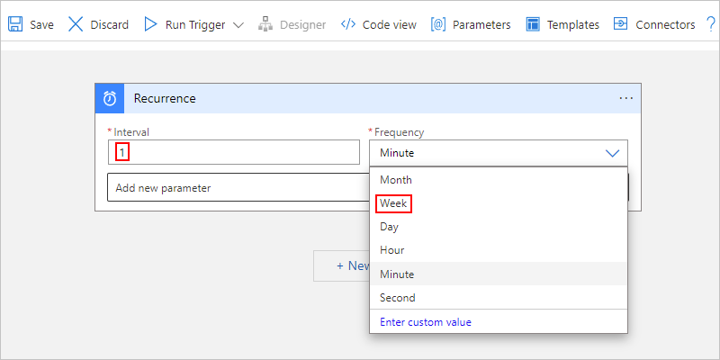
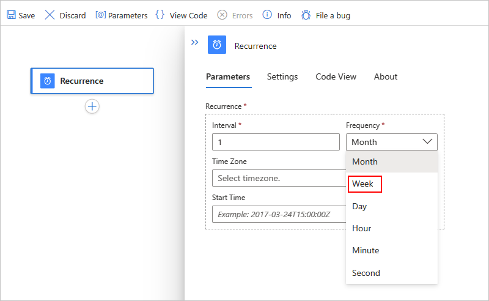
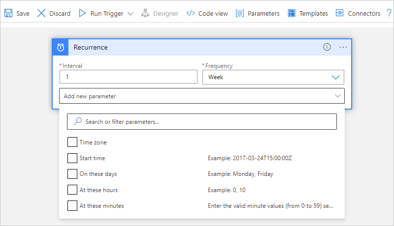
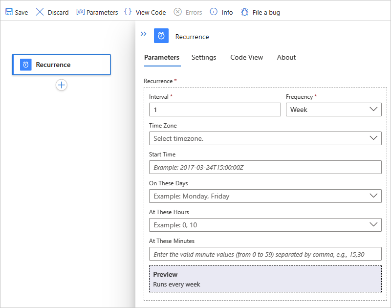
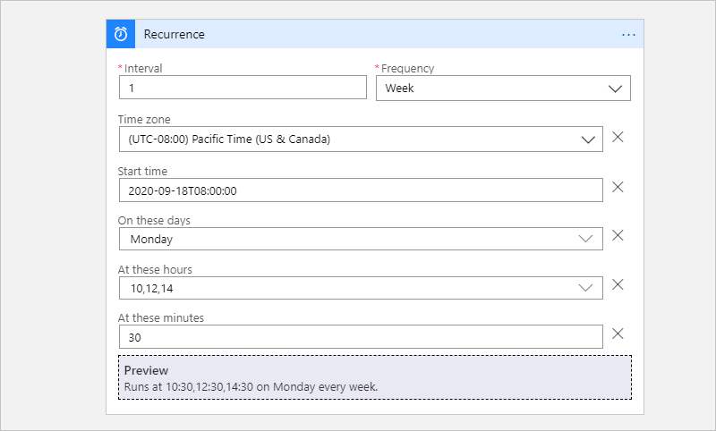
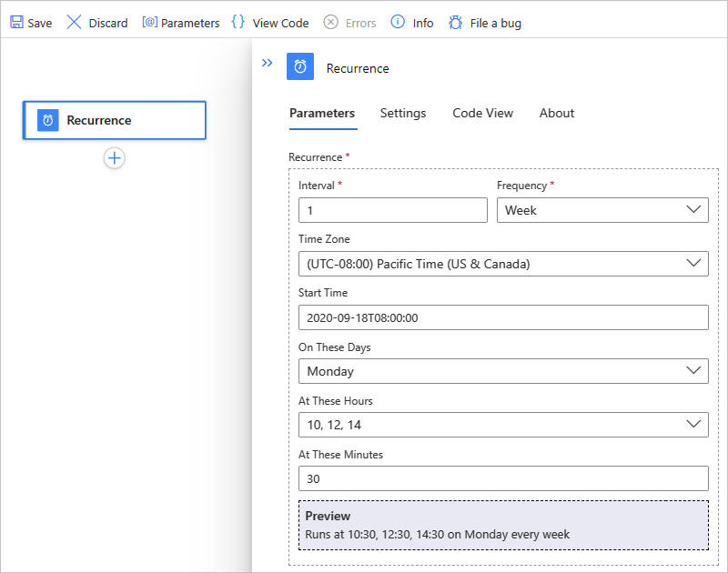

# Schedule and run recurring workflows with the Recurrence trigger in Azure Logic Apps

[!INCLUDE [logic-apps-sku-consumption-standard](../../includes/logic-apps-sku-consumption-standard.md)]

To start and run your workflow on a schedule, you can use the generic Recurrence trigger as the first step. You can set a date, time, and time zone for starting the workflow and a recurrence for repeating that workflow. The following list includes some patterns that this trigger supports along with more advanced recurrences and complex schedules:

* Run at a specific date and time, then repeat every *n* number of seconds, minutes, hours, days, weeks, or months.

* Run immediately and repeat every *n* number of seconds, minutes, hours, days, weeks, or months.

* Run immediately and repeat daily at one or more specific times, such as 8:00 AM and 5:00 PM.

* Run immediately and repeat weekly on specific days, such as Saturday and Sunday.

* Run immediately and repeat weekly on specific days and times, such as Monday through Friday at 8:00 AM and 5:00 PM.

> [!NOTE]
>
> To start and run your workflow only once in the future, use workflow template named 
> **Scheduler: Run Once Jobs**. This template uses the Request trigger and HTTP action, 
> rather than the Recurrence trigger, which doesn't support this recurrence pattern.
> For more information, see [Run jobs one time only](../logic-apps/concepts-schedule-automated-recurring-tasks-workflows.md#run-once).

The Recurrence trigger isn't associated with any specific service, so you can use the trigger with almost any workflow, such as [Consumption logic app workflows and Standard logic app *stateful* workflows](../logic-apps/logic-apps-overview.md#resource-environment-differences). This trigger is currently unavailable for [Standard logic app *stateless* workflows](../logic-apps/logic-apps-overview.md#resource-environment-differences).

The Recurrence trigger is part of the built-in Schedule connector and runs natively on the Azure Logic Apps runtime. For more information about the built-in Schedule triggers and actions, see [Schedule and run recurring automated, tasks, and workflows with Azure Logic Apps](../logic-apps/concepts-schedule-automated-recurring-tasks-workflows.md).

## Prerequisites

* An Azure account and subscription. If you don't have a subscription, [sign up for a free Azure account](https://azure.microsoft.com/free/?WT.mc_id=A261C142F).

* Basic knowledge about [logic app workflows](../logic-apps/logic-apps-overview.md). If you're new to logic apps, learn [how to create your first logic app workflow](../logic-apps/quickstart-create-first-logic-app-workflow.md).

<a name="add-recurrence-trigger"></a>

## Add the Recurrence trigger

1. In the [Azure portal](https://portal.azure.com), create a blank logic app and workflow.

   > [!NOTE]
   >
   > If you created a Standard logic app workflow, make sure to create a *stateful* workflow. 
   > The Recurrence trigger is currently unavailable for stateless workflows.

1. In the designer, follow the corresponding steps, based on whether your logic app workflow is [Consumption or Standard](../logic-apps/logic-apps-overview.md#resource-environment-differences).

### [Consumption](#tab/consumption)

   1. On the designer, under the search box, select **Built-in**.
   1. In the search box, enter **recurrence**. 
   1. From the triggers list, select the trigger named **Recurrence**.

      

### [Standard](#tab/standard)

   1. On the designer, select **Choose operation**.
   1. On the **Add a trigger** pane, under the search box, select **Built-in**.
   1. In the search box, enter **recurrence**.
   1. From the triggers list, select the trigger named **Recurrence**.

      

---

1. Set the interval and frequency for the recurrence. In this example, set these properties to run your workflow every week, for example:

   **Consumption**

   

   **Standard**

   

   | Property | JSON name | Required | Type | Description |
   |----------|-----------|----------|------|-------------|
   | **Interval** | `interval` | Yes | Integer | A positive integer that describes how often the workflow runs based on the frequency. Here are the minimum and maximum intervals: <br><br>- Month: 1-16 months <br>- Week: 1-71 weeks <br>- Day: 1-500 days <br>- Hour: 1-12,000 hours <br>- Minute: 1-72,000 minutes <br>- Second: 1-9,999,999 seconds<br><br>For example, if the interval is 6, and the frequency is "Month", then the recurrence is every 6 months. |
   | **Frequency** | `frequency` | Yes | String | The unit of time for the recurrence: **Second**, **Minute**, **Hour**, **Day**, **Week**, or **Month** |
   ||||||

   > [!IMPORTANT]
   > If you use the **Day**, **Week**, or **Month** frequency, and you specify a future date and time, 
   > make sure that you set up the recurrence in advance. Otherwise, the workflow might skip the first recurrence.
   >
   > * **Day**: Set up the daily recurrence at least 24 hours in advance.
   >
   > * **Week**: Set up the weekly recurrence at least 7 days in advance.
   >
   > * **Month**: Set up the monthly recurrence at least one month in advance.
   >
   > If a recurrence doesn't specify a specific [start date and time](../logic-apps/concepts-schedule-automated-recurring-tasks-workflows.md#start-time), 
   > the first recurrence runs immediately when you save or deploy the logic app, despite your trigger's recurrence setup. To avoid this behavior, 
   > provide a start date and time for when you want the first recurrence to run.
   >
   > If you deploy a disabled workflow that has a Recurrence trigger using an ARM template, the trigger 
   > instantly fires when you enable the workflow unless you set the **Start time** parameter before deployment.
   > upon 'Enable' unless the 'Start time' parameter is configured before deployment.
   >
   > If a recurrence doesn't specify any other advanced scheduling options such as specific times to run future recurrences, 
   > those recurrences are based on the last run time. As a result, the start times for those recurrences might drift due to 
   > factors such as latency during storage calls. To make sure that your logic app doesn't miss a recurrence, especially when 
   > the frequency is in days or longer, try the following options:
   > 
   > * Provide a start date and time for the recurrence and the specific times to run subsequent recurrences. You can use the 
   > properties named **At these hours** and **At these minutes**, which are available only for the **Day** and **Week** frequencies.
   >
   > * For Consumption logic app workflows, use the [Sliding Window trigger](../connectors/connectors-native-sliding-window.md), 
   > rather than the Recurrence trigger.

1. To set advanced scheduling options, open the **Add new parameter** list. Any options that you select appear on the trigger after selection.

   **Consumption**

   

   **Standard**

   

   | Property | JSON name | Required | Type | Description |
   |----------|-----------|----------|------|-------------|
   | **Time zone** | `timeZone` | No | String | Applies only when you specify a start time because this trigger doesn't accept [UTC offset](https://en.wikipedia.org/wiki/UTC_offset). Select the time zone that you want to apply. |
   | **Start time** | `startTime` | No | String | Provide a start date and time, which has a maximum of 49 years in the future and must follow the [ISO 8601 date time specification](https://en.wikipedia.org/wiki/ISO_8601#Combined_date_and_time_representations) in [UTC date time format](https://en.wikipedia.org/wiki/Coordinated_Universal_Time), but without a [UTC offset](https://en.wikipedia.org/wiki/UTC_offset): <br><br>YYYY-MM-DDThh:mm:ss if you select a time zone <br><br>-or- <br><br>YYYY-MM-DDThh:mm:ssZ if you don't select a time zone <br><br>So for example, if you want September 18, 2020 at 2:00 PM, then specify "2020-09-18T14:00:00" and select a time zone such as Pacific Standard Time. Or, specify "2020-09-18T14:00:00Z" without a time zone. <br><br>**Important:** If you don't select a time zone, you must add the letter "Z" at the end without any spaces. This "Z" refers to the equivalent [nautical time](https://en.wikipedia.org/wiki/Nautical_time). If you select a time zone value, you don't need to add a "Z" to the end of your **Start time** value. If you do, Logic Apps ignores the time zone value because the "Z" signifies a UTC time format. <br><br>For simple schedules, the start time is the first occurrence, while for complex schedules, the trigger doesn't fire any sooner than the start time. [*What are the ways that I can use the start date and time?*](../logic-apps/concepts-schedule-automated-recurring-tasks-workflows.md#start-time) |
   | **On these days** | `weekDays` | No | String or string array | If you select "Week", you can select one or more days when you want to run the workflow: **Monday**, **Tuesday**, **Wednesday**, **Thursday**, **Friday**, **Saturday**, and **Sunday** |
   | **At these hours** | `hours` | No | Integer or integer array | If you select "Day" or "Week", you can select one or more integers from 0 to 23 as the hours of the day for when you want to run the workflow. <br><br>For example, if you specify "10", "12" and "14", you get 10 AM, 12 PM, and 2 PM for the hours of the day, but the minutes of the day are calculated based on when the recurrence starts. To set specific minutes of the day, for example, 10:00 AM, 12:00 PM, and 2:00 PM, specify those values by using the property named **At these minutes**. |
   | **At these minutes** | `minutes` | No | Integer or integer array | If you select "Day" or "Week", you can select one or more integers from 0 to 59 as the minutes of the hour when you want to run the workflow. <br><br>For example, you can specify "30" as the minute mark and using the previous example for hours of the day, you get 10:30 AM, 12:30 PM, and 2:30 PM. <br><br>**Note**: Sometimes, the timestamp for the triggered run might vary up to 1 minute from the scheduled time. If you need to pass the timestamp exactly as scheduled to subsequent actions, you can use template expressions to change the timestamp accordingly. For more information, see [Date and time functions for expressions](../logic-apps/workflow-definition-language-functions-reference.md#date-time-functions). |
   |||||

   For example, suppose that today is Friday, September 4, 2020. The following Recurrence trigger doesn't fire *any sooner* than the specified start date and time, which is Friday, September 18, 2020 at 8:00 AM Pacific Time. However, the recurrence schedule is set for 10:30 AM, 12:30 PM, and 2:30 PM on Mondays only. The first time that the trigger fires and creates a workflow instance is on Monday at 10:30 AM. To learn more about how start times work, see these [start time examples](../logic-apps/concepts-schedule-automated-recurring-tasks-workflows.md#start-time).

   Future runs happen at 12:30 PM and 2:30 PM on the same day. Each recurrence creates their own workflow instance. After that, the entire schedule repeats all over again next Monday. [*What are some other example occurrences?*](../logic-apps/concepts-schedule-automated-recurring-tasks-workflows.md#example-recurrences)

   > [!NOTE]
   >
   > The trigger shows a preview for your specified recurrence only when you select "Day" or "Week" as the frequency.

   **Consumption**

   

   **Standard**

   

1. Now continue building your workflow with other actions. For more actions that you can add, see [Connectors for Azure Logic Apps](../connectors/apis-list.md).

## Workflow definition - Recurrence

You can view how the [Recurrence trigger definition](../logic-apps/logic-apps-workflow-actions-triggers.md#recurrence-trigger) appears with your chosen options by reviewing the underlying JSON definition for your workflow in Consumption logic apps and Standard logic apps (stateful only).

Based on whether your logic app is Consumption or Standard, choose one of the following options:

* **Consumption**: On the designer toolbar, select **Code view**. To return to the designer, on the code view editor toolbar, select **Designer**.

* **Standard**: On the workflow menu, select **Code view**. To return to the designer, on the workflow menu, select **Designer**.

The following example shows how a Recurrence trigger definition might appear in the workflow's underlying JSON definition:

``` json
"triggers": {
   "Recurrence": {
      "type": "Recurrence",
      "recurrence": {
         "frequency": "Week",
         "interval": 1,
         "schedule": {
            "hours": [
               10,
               12,
               14
            ],
            "minutes": [
               30
            ],
            "weekDays": [
               "Monday"
            ]
         },
         "startTime": "2020-09-07T14:00:00Z",
         "timeZone": "Pacific Standard Time"
      }
   }
}
```

> [!NOTE]
>
> In the Recurrence trigger definition, the `evaluatedRecurrence` property appears along with the `recurrence` property 
> when any expression or parameter reference appears in the recurrence criteria. This `evaluatedRecurrence` property 
> represents the evaluated values from the expression or parameter reference. If the recurrence criteria doesn't 
> specify any expressions or parameter references, the `evaluatedRecurrence` and `recurrence` properties are the same.

The following example shows how to update the trigger definition so that the trigger runs only once on the last day of each month:

```json
"triggers": {
    "Recurrence": {
        "recurrence": {
            "frequency": "Month",
            "interval": 1,
            "schedule": {
                "monthDays": [-1]
            }
        },
        "type": "Recurrence"
    }
}
```

<a name="daylight-saving-standard-time"></a>

## Trigger recurrence shift and drift (daylight saving time)

To schedule jobs, Azure Logic Apps puts the message for processing into the queue and specifies when that message becomes available, based on the UTC time when the last job ran and the UTC time when the next job is scheduled to run. If you specify a start time with your recurrence, *make sure that you select a time zone* so that your logic app workflow runs at the specified start time. That way, the UTC time for your logic app also shifts to counter the seasonal time change. Recurring triggers honor the schedule that you set, including any time zone that you specify.

Otherwise, if you don't select a time zone, daylight saving time (DST) events might affect when triggers run. For example, the start time shifts one hour forward when DST starts and one hour backward when DST ends. However, some time windows might cause problems when the time shifts. For more information and examples, see [Recurrence for daylight saving time and standard time](../logic-apps/concepts-schedule-automated-recurring-tasks-workflows.md#daylight-saving-standard-time).

## Next steps

* [Pause workflows with delay actions](../connectors/connectors-native-delay.md)
* [Connectors for Logic Apps](../connectors/apis-list.md)
