# Handle incoming or inbound HTTPS requests sent to workflows in Azure Logic Apps

To run your logic app workflow after receiving an HTTPS request from another service, you can start your workflow with the Request built-in trigger. Your workflow can then respond to the HTTPS request by using Response built-in action.

The following list describes some example tasks that your workflow can perform when you use the Request trigger and Response action:

* Receive and respond to an HTTPS request for data in an on-premises database.

* Receive and respond to an HTTPS request from another logic app workflow.

* Trigger a workflow run when an external webhook event happens.

To run your workflow by sending an outgoing or outbound request instead, use the [HTTP built-in trigger or HTTP built-in action](connectors-native-http.md).

## Prerequisites

* An Azure account and subscription. If you don't have a subscription, you can [sign up for a free Azure account](https://azure.microsoft.com/free/?WT.mc_id=A261C142F).

* The logic app workflow where you want to receive the inbound HTTPS request. To start your workflow with a Request trigger, you have to start with a blank workflow. To use the Response action, your workflow must start with the Request trigger. If you're new to Azure Logic Apps, review the following get started documentation:

* [What is Azure Logic Apps](../logic-apps/logic-apps-overview.md)

* [Quickstart: Create a Consumption logic app workflow in multi-tenant Azure Logic Apps](../logic-apps/quickstart-create-first-logic-app-workflow.md)

* [Create a Standard logic app workflow in single-tenant Azure Logic Apps](../logic-apps/create-single-tenant-workflows-azure-portal.md)

<a name="add-request"></a>

## Add a Request trigger

The Request trigger creates a manually callable endpoint that can handle *only* inbound requests over HTTPS. When the calling service sends a request to this endpoint, the Request trigger fires and runs the logic app workflow. For information about how to call this trigger, review [Call, trigger, or nest workflows with HTTPS endpoints in Azure Logic Apps](../logic-apps/logic-apps-http-endpoint.md).

## [Consumption](#tab/consumption)

1. In the [Azure portal](https://portal.azure.com), open your blank logic app workflow in the designer.

1. On the designer, under the search box, select **Built-in**. In the search box, enter **http request**. From the triggers list, select the trigger named **When a HTTP request is received**.

   

   The HTTP request trigger information box appears on the designer.

   

1. In the trigger information box, provide the following values as necessary:

   | Property name | JSON property name | Required | Description |
   |---------------|--------------------|----------|-------------|
   | **HTTP POST URL** | {none} | Yes | The endpoint URL that's generated after you save your workflow and is used for sending a request that triggers your workflow. |
   | **Request Body JSON Schema** | `schema` | No | The JSON schema that describes the properties and values in the incoming request body. The designer uses this schema to generate tokens for the properties in the request. That way, your workflow can parse, consume, and pass along outputs from the Request trigger into your workflow. <br><br>If you don't have a JSON schema, you can generate the schema from a sample payload by using the **Use sample payload to generate schema** capability. |
   |||||

   The following example shows a sample JSON schema:

   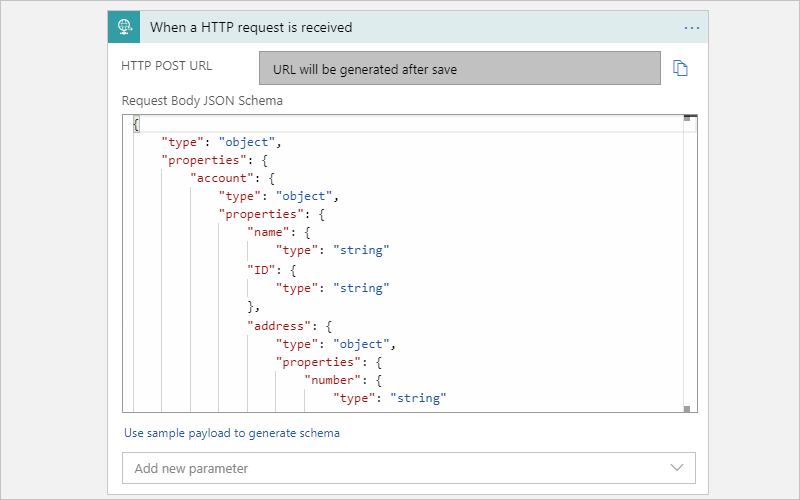

   The following example shows the complete sample JSON schema:

   ```json
   {
      "type": "object",
      "properties": {
         "account": {
            "type": "object",
            "properties": {
               "name": {
                  "type": "string"
               },
               "ID": {
                  "type": "string"
               },
               "address": {
                  "type": "object",
                  "properties": {
                     "number": {
                        "type": "string"
                     },
                     "street": {
                        "type": "string"
                     },
                     "city": {
                        "type": "string"
                     },
                     "state": {
                        "type": "string"
                     },
                     "country": {
                        "type": "string"
                     },
                     "postalCode": {
                        "type": "string"
                     }
                  }
               }
            }
         }
      }
   }
   ```

   When you enter a JSON schema, the designer shows a reminder to include the **Content-Type** header in your request and set that header value to **application/json**. For more information, see [Handle content types](../logic-apps/logic-apps-content-type.md).

   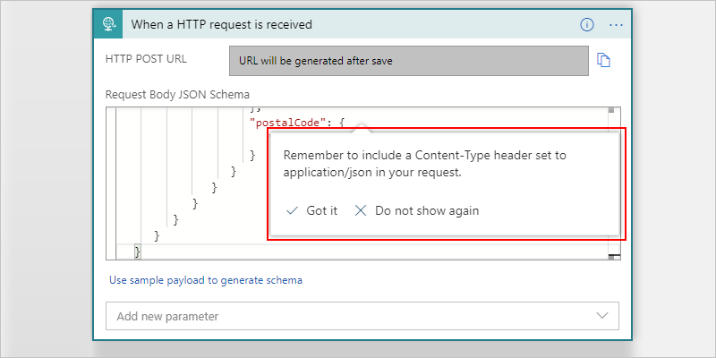

   The following example shows how the **Content-Type** header appears in JSON format:

   ```json
   {
      "Content-Type": "application/json"
   }
   ```

   To generate a JSON schema that's based on the expected payload (data), you can use a tool such as [JSONSchema.net](https://jsonschema.net), or you can follow these steps:

   1. In the Request trigger, select **Use sample payload to generate schema**.

      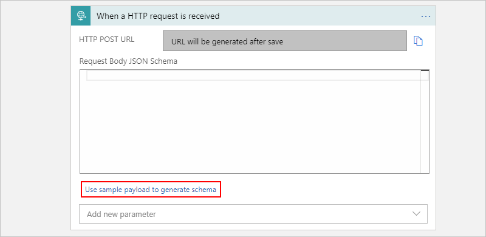

   1. Enter the sample payload, and select **Done**.

      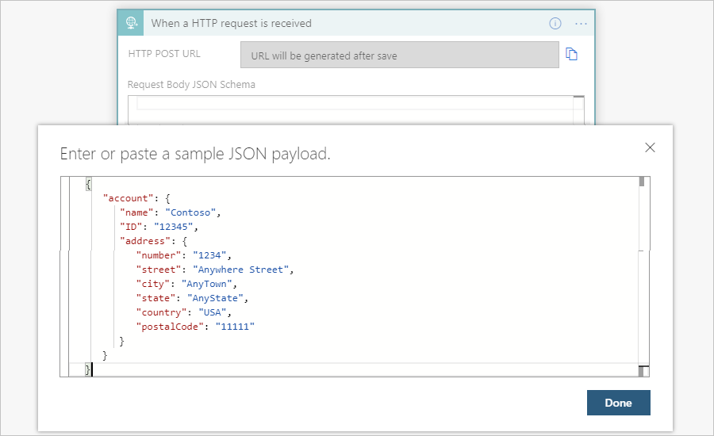

      The following example shows the sample payload:

      ```json
      {
         "account": {
            "name": "Contoso",
            "ID": "12345",
            "address": {
               "number": "1234",
               "street": "Anywhere Street",
               "city": "AnyTown",
               "state": "AnyState",
               "country": "USA",
               "postalCode": "11111"
            }
         }
      }
      ```

1. To check that the inbound call has a request body that matches your specified schema, follow these steps:

   1. To enforce the inbound message to have the same exact fields that your schema describes, in your schema, add the **`required`** property and specify the required fields. Add the **`addtionalProperties`** property, and set the value to **`false`**.
   
      For example, the following schema specifies that the inbound message must have the **`msg`** field and not any other fields:

      ```json
      {
         "properties": {
           "msg": {
              "type": "string"
           }
         },
         "type": "object",
         "required": ["msg"],
         "additionalProperties": false
      }
      ```

   1. In the Request trigger's title bar, select the ellipses button (**...**).

   1. In the trigger's settings, turn on **Schema Validation**, and select **Done**.

      If the inbound call's request body doesn't match your schema, the trigger returns an **HTTP 400 Bad Request** error.

1. To add other properties or parameters to the trigger, open the **Add new parameter** list, and select the parameters that you want to add.

   | Property name | JSON property name | Required | Description |
   |---------------|--------------------|----------|-------------|
   | **Method** | `method` | No | The method that the incoming request must use to call the logic app |
   | **Relative path** | `relativePath` | No | The relative path for the parameter that the logic app's endpoint URL can accept |
   |||||

   The following example adds the **Method** property:

   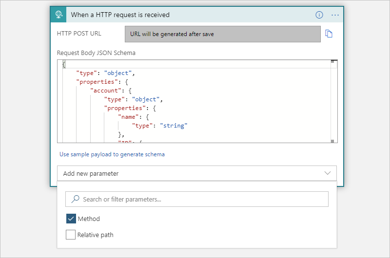

   The **Method** property appears in the trigger so that you can select a method from the list.

   

1. When you're ready, save your workflow. On the designer toolbar, select **Save**.

   This step generates the URL that you can use to send a request that triggers the workflow.

1. To copy the generated URL, select the copy icon next to the URL.

   

   > [!NOTE]
   >
   > If you want to include the hash or pound symbol (**#**) in the URI
   > when making a call to the Request trigger, use this encoded version instead: `%25%23`

## [Standard](#tab/standard)

1. In the [Azure portal](https://portal.azure.com), open your blank logic app workflow in the designer.

1. On the designer, select **Choose an operation**. On the pane that appears, under the search box, select **Built-in**.

1. In the search box, enter **http request**. From the triggers list, select the trigger named **When a HTTP request is received**.

   

   The HTTP request trigger information box appears on the designer.

   

1. In the trigger information box, provide the following values as necessary:

   | Property name | JSON property name | Required | Description |
   |---------------|--------------------|----------|-------------|
   | **HTTP POST URL** | {none} | Yes | The endpoint URL that's generated after you save your workflow and is used for sending a request that triggers your workflow. |
   | **Request Body JSON Schema** | `schema` | No | The JSON schema that describes the properties and values in the incoming request body. The designer uses this schema to generate tokens for the properties in the request. That way, your workflow can parse, consume, and pass along outputs from the Request trigger into your workflow. <br><br>If you don't have a JSON schema, you can generate the schema from a sample payload by using the **Use sample payload to generate schema** capability. |
   |||||

   The following example shows a sample JSON schema:

   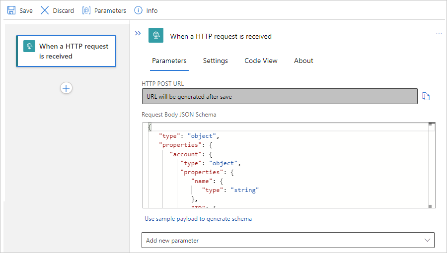

   The following example shows the complete sample JSON schema:

   ```json
   {
      "type": "object",
      "properties": {
         "account": {
            "type": "object",
            "properties": {
               "name": {
                  "type": "string"
               },
               "ID": {
                  "type": "string"
               },
               "address": {
                  "type": "object",
                  "properties": {
                     "number": {
                        "type": "string"
                     },
                     "street": {
                        "type": "string"
                     },
                     "city": {
                        "type": "string"
                     },
                     "state": {
                        "type": "string"
                     },
                     "country": {
                        "type": "string"
                     },
                     "postalCode": {
                        "type": "string"
                     }
                  }
               }
            }
         }
      }
   }
   ```

   When you enter a JSON schema, the designer shows a reminder to include the **Content-Type** header in your request and set that header value to **application/json**. For more information, see [Handle content types](../logic-apps/logic-apps-content-type.md).

   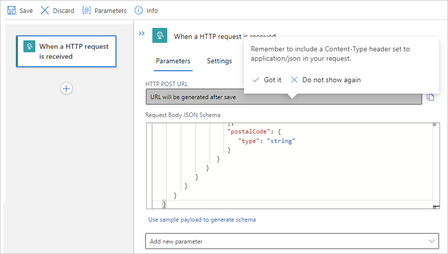

   The following example shows how the **Content-Type** header appears in JSON format:

   ```json
   {
      "Content-Type": "application/json"
   }
   ```

   To generate a JSON schema that's based on the expected payload (data), you can use a tool such as [JSONSchema.net](https://jsonschema.net), or you can follow these steps:

   1. In the Request trigger, select **Use sample payload to generate schema**.

      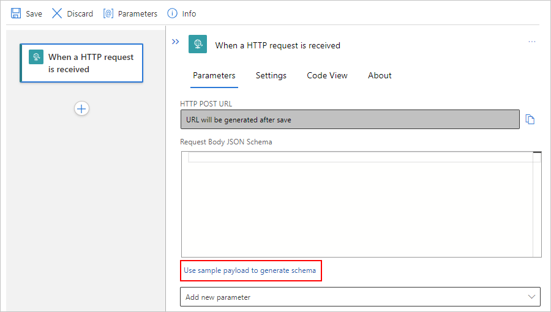

   1. Enter the sample payload, and select **Done**.

      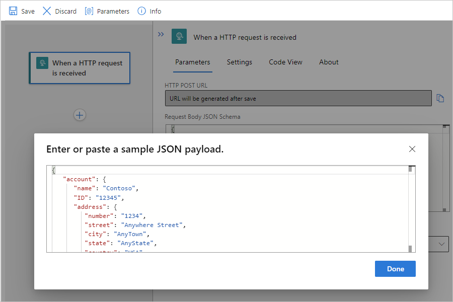

      The following example shows the sample payload:

      ```json
      {
         "account": {
            "name": "Contoso",
            "ID": "12345",
            "address": {
               "number": "1234",
               "street": "Anywhere Street",
               "city": "AnyTown",
               "state": "AnyState",
               "country": "USA",
               "postalCode": "11111"
            }
         }
      }
      ```

1. To check that the inbound call has a request body that matches your specified schema, follow these steps:

   1. To enforce the inbound message to have the same exact fields that your schema describes, in your schema, add the **`required`** property and specify the required fields. Add the **`addtionalProperties`** property, and set the value to **`false`**.
   
      For example, the following schema specifies that the inbound message must have the **`msg`** field and not any other fields:

      ```json
      {
         "properties": {
           "msg": {
              "type": "string"
           }
         },
         "type": "object",
         "required": ["msg"],
         "additionalProperties": false
      }
      ```

   1. In the Request trigger's title bar, select the ellipses button (**...**).

   1. In the trigger's settings, turn on **Schema Validation**, and select **Done**.

      If the inbound call's request body doesn't match your schema, the trigger returns an **HTTP 400 Bad Request** error.

1. To add other properties or parameters to the trigger, open the **Add new parameter** list, and select the parameters that you want to add.

   | Property name | JSON property name | Required | Description |
   |---------------|--------------------|----------|-------------|
   | **Method** | `method` | No | The method that the incoming request must use to call the logic app |
   | **Relative path** | `relativePath` | No | The relative path for the parameter that the logic app's endpoint URL can accept |
   |||||

   The following example adds the **Method** property:

   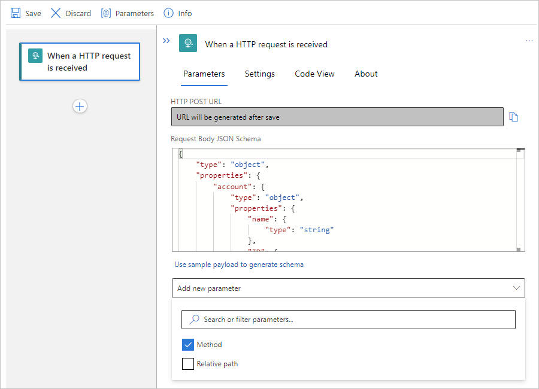

   The **Method** property appears in the trigger so that you can select a method from the list.

   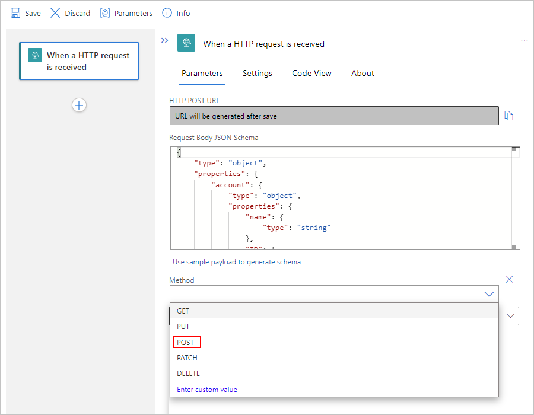

1. When you're ready, save your workflow. On the designer toolbar, select **Save**.

   This step generates the URL that you can use to send a request that triggers the workflow.

1. To copy the generated URL, select the copy icon next to the URL.

   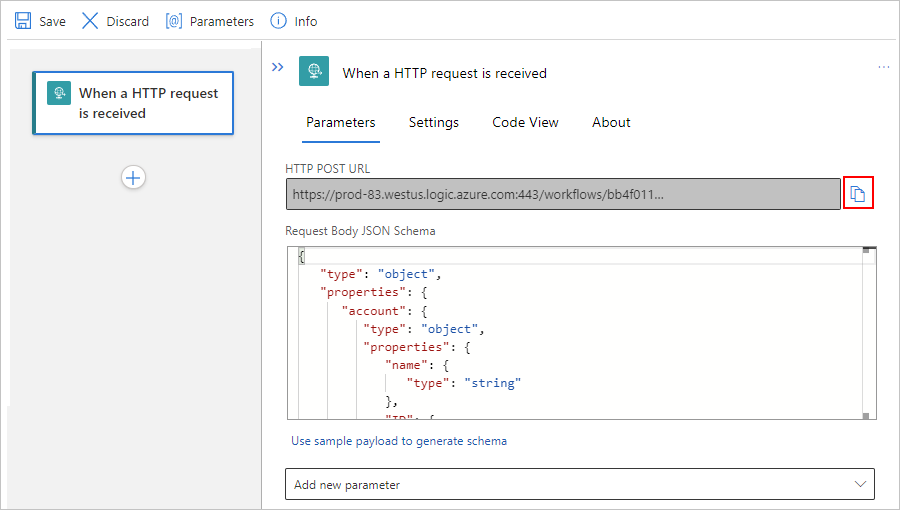

   > [!NOTE]
   >
   > If you want to include the hash or pound symbol (**#**) in the URI
   > when making a call to the Request trigger, use this encoded version instead: `%25%23`

---

Now, continue building your workflow by adding another action as the next step. For example, you can respond to the request by [adding a Response action](#add-response), which you can use to return a customized response and is described later in this article.

> [!NOTE]
>
> Your workflow keeps an inbound request open only for a [limited time](../logic-apps/logic-apps-limits-and-config.md#http-limits). 
> Assuming that your workflow also includes a Response action, if your workflow doesn't return a response to the caller 
> after this time expires, your workflow returns the **504 GATEWAY TIMEOUT** status to the caller. If your workflow 
> doesn't include a Response action, your workflow immediately returns the **202 ACCEPTED** status to the caller.

For information about security, authorization, and encryption for inbound calls to your workflow, such as [Transport Layer Security (TLS)](https://en.wikipedia.org/wiki/Transport_Layer_Security), previously known as Secure Sockets Layer (SSL), [Azure Active Directory Open Authentication (Azure AD OAuth)](../active-directory/develop/index.yml), exposing your logic app resource with Azure API Management, or restricting the IP addresses that originate inbound calls, see [Secure access and data - Access for inbound calls to request-based triggers](../logic-apps/logic-apps-securing-a-logic-app.md#secure-inbound-requests).

## Trigger outputs

The following table lists the outputs from the Request trigger:

| JSON property name | Data type | Description |
|--------------------|-----------|-------------|
| `headers` | Object | A JSON object that describes the headers from the request |
| `body` | Object | A JSON object that describes the body content from the request |
||||

<a name="add-response"></a>

## Add a Response action

When you use the Request trigger to receive inbound requests, you can model the response and send the payload results back to the caller by using the Response built-in action, which works *only* with the Request trigger. This combination with the Request trigger and Response action creates the [request-response pattern](https://en.wikipedia.org/wiki/Request%E2%80%93response). Except for inside Foreach loops and Until loops, and parallel branches, you can add the Response action anywhere in your workflow.

> [!IMPORTANT]
>
> If your Response action includes the following headers, Azure Logic Apps automatically 
> removes these headers from the generated response message without showing any warning 
> or error. Azure Logic Apps won't include these headers, although the service won't 
> stop you from saving workflows that have a Response action with these headers.
>
> * `Allow`
> * `Content-*` headers except for `Content-Disposition`, `Content-Encoding`, and `Content-Type` when you use POST and PUT operations, but are not included for GET operations
> * `Cookie`
> * `Expires`
> * `Last-Modified`
> * `Set-Cookie`
> * `Transfer-Encoding`
>

## [Consumption](#tab/consumption)

1. In the workflow designer, under the step where you want to add the Response action, select **New step**.

   For example, using the Request trigger from earlier:

   

   To add an action between steps, move your pointer over the arrow between those steps. Select the plus sign (**+**) that appears, and then select **Add an action**.

1. Under **Choose an action**, in the search box, enter `response` as your filter, and select the **Response** action.

   

   The Request trigger is collapsed in this example for simplicity.

1. Add any values that are required for the response message.

   In some fields, clicking inside their boxes opens the dynamic content list. You can then select tokens that represent available outputs from previous steps in the workflow. Properties from the schema specified in the earlier example now appear in the dynamic content list.

   For example, for the **Headers** box, include `Content-Type` as the key name, and set the key value to `application/json` as mentioned earlier in this topic. For the **Body** box, you can select the trigger body output from the dynamic content list.

   

   To view the headers in JSON format, select **Switch to text view**.

   

   Here is more information about the properties that you can set in the Response action.

   | Property name | JSON property name | Required | Description |
   |---------------|--------------------|----------|-------------|
   | **Status Code** | `statusCode` | Yes | The status code to return in the response |
   | **Headers** | `headers` | No | A JSON object that describes one or more headers to include in the response |
   | **Body** | `body` | No | The response body |
   |||||

1. To specify additional properties, such as a JSON schema for the response body, open the **Add new parameter** list, and select the parameters that you want to add.

1. When you're done, save your logic app. On the designer toolbar, select **Save**.

## [Standard](#tab/standard)

---

> [!IMPORTANT]
> If you have one or more Response actions in a complex workflow with branches, make sure 
> that the workflow run processes at least one Response action during runtime. 
> Otherwise, if all Response actions are skipped, the caller receives a **502 Bad Gateway** error, even if the workflow finishes successfully.

## Test your workflow

1. To test your logic app, send an HTTP request to the generated URL.

   For example, you can use a tool such as [Postman](https://www.getpostman.com/) to send the HTTP request. For more information about the trigger's underlying JSON definition and how to call this trigger, see these topics, [Request trigger type](../logic-apps/logic-apps-workflow-actions-triggers.md#request-trigger) and [Call, trigger, or nest workflows with HTTP endpoints in Azure Logic Apps](../logic-apps/logic-apps-http-endpoint.md).


## Security and authentication

In a Standard logic app workflow that starts with the Request trigger (but not a webhook trigger), you can use the Azure Functions provision for authenticating inbound calls sent to the endpoint created by that trigger by using a managed identity. This provision is also known as "**Easy Auth**". For more information, review [Trigger workflows in Standard logic apps with Easy Auth](https://techcommunity.microsoft.com/t5/integrations-on-azure-blog/trigger-workflows-in-standard-logic-apps-with-easy-auth/ba-p/3207378).

For more information about security, authorization, and encryption for inbound calls to your logic app workflow, such as [Transport Layer Security (TLS)](https://en.wikipedia.org/wiki/Transport_Layer_Security), previously known as Secure Sockets Layer (SSL), [Azure Active Directory Open Authentication (Azure AD OAuth)](../active-directory/develop/index.yml), exposing your logic app with Azure API Management, or restricting the IP addresses that originate inbound calls, see [Secure access and data - Access for inbound calls to request-based triggers](../logic-apps/logic-apps-securing-a-logic-app.md#secure-inbound-requests).

## Next steps

* [Secure access and data - Access for inbound calls to request-based triggers](../logic-apps/logic-apps-securing-a-logic-app.md#secure-inbound-requests)
* [Managed or Azure-hosted connectors in Azure Logic Apps](/connectors/connector-reference/connector-reference-logicapps-connectors)
