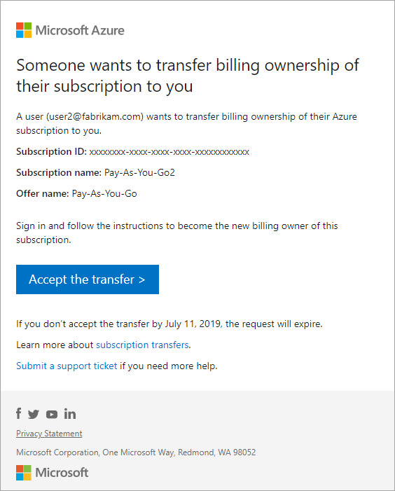
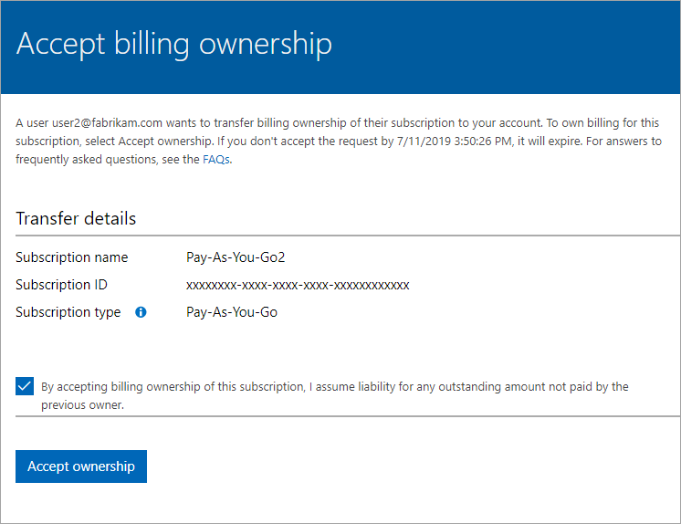
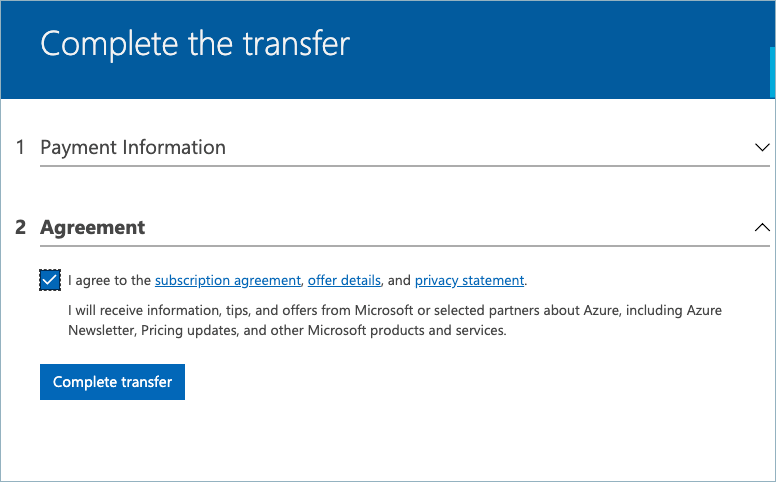

# Transfer billing ownership of an Azure subscription to another account

This article shows the steps needed to transfer billing ownership of an Azure subscription to another account. Before you transfer billing ownership for a subscription, read [About transferring billing ownership for an Azure subscription](../understand/subscription-transfer.md).

If you want to keep your billing ownership but change subscription type, see [Switch your Azure subscription to another offer](switch-azure-offer.md). To control who can access resources in the subscription, see [Azure built-in roles](../../role-based-access-control/built-in-roles.md).

If you're an Enterprise Agreement (EA) customer, your enterprise administrator can transfer billing ownership of your subscriptions between accounts. For more information, [Change Azure subscription or account ownership](ea-portal-administration.md#change-azure-subscription-or-account-ownership).

Only the billing administrator of an account can transfer ownership of a subscription.

## Transfer billing ownership of an Azure subscription

1. Sign in to the [Azure portal](https://portal.azure.com) as an administrator of the billing account that has the subscription that you want to transfer. If you're not sure if you're and administrator, or if you need to determine who is, see [Determine account billing administrator](../understand/subscription-transfer.md#whoisaa).
1. Search for **Cost Management + Billing**.  
   
1. Select **Subscriptions** from the left-hand pane. Depending on your access, you may need to select a billing scope and then select **Subscriptions** or **Azure subscriptions**.
1. Select **Transfer billing ownership** for the subscription that you want to transfer.  
   
1. Enter the email address of a user who's a billing administrator of the account that will be the new owner for the subscription.
1. If you're transferring your subscription to an account in another Azure AD tenant, select if you want to move the subscription to the new account's tenant. For more information, see [Transferring subscription to an account in another Azure AD tenant](#transfer-a-subscription-to-another-azure-ad-tenant-account).
    > [!IMPORTANT]
    > If you choose to move the subscription to the new account's Azure AD tenant, all [Azure role assignments](../../role-based-access-control/role-assignments-portal.md) to access resources in the subscription are permanently removed. Only the user in the new account who accepts your transfer request will have access to manage resources in the subscription. Alternatively, you can clear the **Subscription Azure AD tenant** option to transfer billing ownership without moving the subscription to the new account's tenant. If you do so, existing Azure role assignments to access Azure resources will be maintained.  
    
1. Select **Send transfer request**.
1. The user gets an email with instructions to review your transfer request.  
   
1. To approve the transfer request, the user selects the link in the email and follows the instructions. The user then selects a payment method that will be used to pay for the subscription. If the user doesn't have an Azure account, they have to sign up for a new account.  
   
   
   
1. Success! The subscription is now transferred.

## Transfer a subscription to another Azure AD tenant account

An Azure Active Directory (AD) tenant is created for you when you sign up for Azure. The tenant represents your account. You use the tenant to manage access to your subscriptions and resources.

When you create a new subscription, it's hosted in your account's Azure AD tenant. If you want to give others access to your subscription or its resources, you need to invite them to join your tenant. Doing so helps you control access to your subscriptions and resources.

When you transfer billing ownership of your subscription to an account in another Azure AD tenant, you can move the subscription to the new account's tenant. If you do so, all users, groups, or service principals that had [Azure role assignments](../../role-based-access-control/role-assignments-portal.md) to manage subscriptions and its resources lose their access. Only the user in the new account who accepts your transfer request will have access to manage the resources. The new owner must manually add these users to the subscription to provide access to the use who lost it. For more information, see [Transfer an Azure subscription to a different Azure AD directory](../../role-based-access-control/transfer-subscription.md).

## Transfer Visual Studio and Partner Network subscriptions

Visual Studio and Microsoft Partner Network subscriptions have monthly recurring Azure credit associated with them. When you transfer these subscriptions, your credit isn't available in the destination billing account. The subscription uses the credit in the destination billing account. For example, if Bob transfers a Visual Studio Enterprise subscription to Jane's account on September 9 and Jane accepts the transfer. After the transfer is completed, the subscription starts using credit in Jane's account. The credit will reset every ninth day of the month.

## Next steps after accepting billing ownership

If you've accepted the billing ownership of an Azure subscription, we recommend you review these next steps:

1. Review and update the Service Admin, Co-Admins, and Azure role assignments. To learn more, see [Add or change Azure subscription administrators](add-change-subscription-administrator.md) and [Add or remove Azure role assignments using the Azure portal](../../role-based-access-control/role-assignments-portal.md).
1. Update credentials associated with this subscription's services including:
   1. Management certificates that grant the user admin rights to subscription resources. For more information, see [Create and upload a management certificate for Azure](../../cloud-services/cloud-services-certs-create.md)
   1. Access keys for services like Storage. For more information, see [About Azure storage accounts](../../storage/common/storage-account-create.md)
   1. Remote Access credentials for services like Azure Virtual Machines.
1. If you're working with a partner, consider updating the partner ID on the subscription. You can update the partner ID in the [Azure portal](https://portal.azure.com). For more information, see [Link a partner ID to your Azure accounts](link-partner-id.md)

## Cancel a transfer request

Only one transfer request is active at a time. A transfer request is valid for 15 days. After the 15 days, the transfer request expires.

To cancel a transfer request:

1. Sign in to the [Azure portal](https://portal.azure.com).
1. Navigate to **Subscriptions** > Select the subscription that you sent a transfer request for then select **Transfer billing ownership**.
1. At the bottom of the page, select **Cancel the transfer request**.

:::image type="content" source="./media/billing-subscription-transfer/transfer-billing-owership-cancel-request.png" alt-text="Example showing the Transfer billing ownership window with the Cancel the transfer request option" lightbox="./media/billing-subscription-transfer/transfer-billing-owership-cancel-request.png" :::

## Troubleshooting

Use the following troubleshooting information if you're having trouble transferring subscriptions.

### Original Azure subscription billing owner leaves your organization

>[!Note]
This section specifically applies to a billing account for a Microsoft Customer Agreement. Check if you have access to a [Microsoft Customer Agreement](mca-request-billing-ownership.md#check-for-access).

It's possible that the original billing account owner who created an Azure account and an Azure subscription leaves your organization. If that situation happens, then their user identity is no longer in the organization's Azure Active Directory. Then the Azure subscription doesn't have a billing owner. This situation prevents anyone from performing billing operations to the account, including viewing, and paying bills. The subscription could go into a past-due state. Eventually the subscription could get disabled because of non-payment. Ultimately, the subscription could get deleted and it would affect every service that runs on the subscription.

When a subscription no longer has a valid billing account owner, Azure sends an email to other Billing account owners, Service Administrators (if any), Co-Administrators (if any), and Subscription Owners informing them of the situation and provides them with a link to accept billing ownership of the subscription. Any one of the users can select the link to accept billing ownership. For more information about billing roles, see [Billing Roles](understand-mca-roles.md) and [Classic Roles and Azure RBAC Roles](../../role-based-access-control/rbac-and-directory-admin-roles.md).

Here's an example of what the email looks like.

:::image type="content" source="./media/billing-subscription-transfer/orphaned-subscription-email.png" alt-text="Screenshot showing an example email to accept billing ownership." lightbox="./media/billing-subscription-transfer/orphaned-subscription-email.png" :::

Additionally, Azure shows a banner in the subscription's details window in the Azure portal to Billing owners, Service Administrators, Co-Administrators, and Subscription Owners. Select the link in the banner to accept billing ownership.

:::image type="content" source="./media/billing-subscription-transfer/orphaned-subscription-example.png" alt-text="Screenshot showing an example of a subscription without a valid billing owner." lightbox="./media/billing-subscription-transfer/orphaned-subscription-example.png" :::

### The "Transfer subscription" option is unavailable

 

The self-service subscription transfer isn't available for your billing account. Currently, we don't support transferring the billing ownership of subscriptions in Enterprise Agreement (EA) accounts in the Azure portal. Also, Microsoft Customer Agreement accounts that are created while working with a Microsoft representative don't support transferring billing ownership.

###  Not all subscription types can transfer

Not all types of subscriptions support billing ownership transfer. To view list of subscription types that support transfers, see [Supported subscription types](../understand/subscription-transfer.md#supported-subscription-types)

###  Access denied error shown when trying to transfer subscription billing ownership

You'll see this error if you're trying to transfer a Microsoft Azure Plan subscription and you don't have the necessary permission. To transfer a Microsoft Azure plan subscription, you need to be an owner or contributor on the invoice section to which the subscription is billed. For more information, see [Manage subscriptions for invoice section](../manage/understand-mca-roles.md#manage-subscriptions-for-invoice-section).

## Need help? Contact us.

If you have questions or need help,  [create a support request](https://go.microsoft.com/fwlink/?linkid=2083458).

## Next steps

- Review and update the Service Admin, Co-Admins, and Azure role assignments. To learn more, see [Add or change Azure subscription administrators](add-change-subscription-administrator.md) and [Add or remove Azure role assignments using the Azure portal](../../role-based-access-control/role-assignments-portal.md).