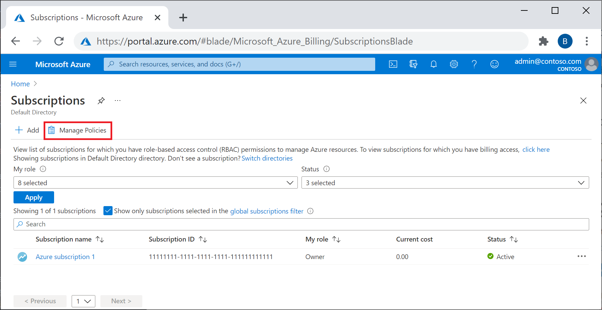
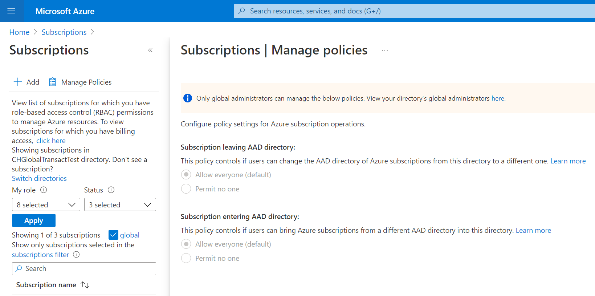

# Manage Azure subscription policies

>[!NOTE]
>This feature is currently in preview and is being gradually rolled out, so not everyone may see this experience on the Azure portal yet. We expect it to be available to everyone shortly.

This article helps you configure Azure subscription policies for subscription operations. 

## Prerequisites

There are 2 possible actions available for this experience - write and read. 
- Only directory [global administrators](https://docs.microsoft.com/azure/active-directory/roles/permissions-reference#global-administrator0) are able to do write operations on subscription policies. Before doing that, the global administrator must [Elevate access to manage all Azure subscriptions and management groups](https://docs.microsoft.com/azure/role-based-access-control/elevate-access-global-admin) after which they will be able to edit the subscription policies.
- All other users can only read the current policy setting.

## Available subscription policy settings
### Subscriptions leaving AAD directory
This policy controls if users are able to move subscriptions out of the current directory. [Subscription owners](https://docs.microsoft.com/azure/role-based-access-control/built-in-roles#owner) have  capability today to [change the directory of an azure subscription](https://docs.microsoft.com/azure/active-directory/fundamentals/active-directory-how-subscriptions-associated-directory) to another one where they are a member. This poses some governance challenges so global administrators may choose to allow/dis-allow directory users from being able to do so.

### Subscriptions entering AAD directory
This policy controls if users from other directories (and having presence in the current directory) are able to move subscriptions into the current directory. The mechanism to do this is the same as [before](https://docs.microsoft.com/azure/active-directory/fundamentals/active-directory-how-subscriptions-associated-directory) and has similiar governance concerns. Global administrators may choose to allow/dis-allow this operation as well.

### Exempted USers
Global Administrators may decide that for governance reasons they may want to block all subscription directory moves - into our out of the current directory. But they may want some special users to be able to do either of these operations if business so demands it. For these scenarios, they can configure an exempted users list which allows these users to bypass the policy setting for everyone else.

## Setting subscription policy

1. Login to [Azure portal](https://portal.azure.com/).
1. Navigate to the subscriptions blade. You will find `Manage Policies` on the command bar.

3. Clicking on this will take you to the details of the current subscription policies set for this directory. Global Administrator with [elevated permissions](https://docs.microsoft.com/azure/role-based-access-control/elevate-access-global-admin) are able to make edits to these settings including adding/removing exempted users.

4. Click on `Save changes` at the bottom to persist any edits made. The changes go into effect immediately. 

## Reading subscription policy

Non-global administrators can still navigate to the subscription policy blade to read the directory's policy settings but they will be unable to make any edits. They will also be unable to see the list of exempted users for privacy reasons. They have an option to view their global administrators in case to want to put in requests for policy changes (as long as the directory settings allows them to do so)

