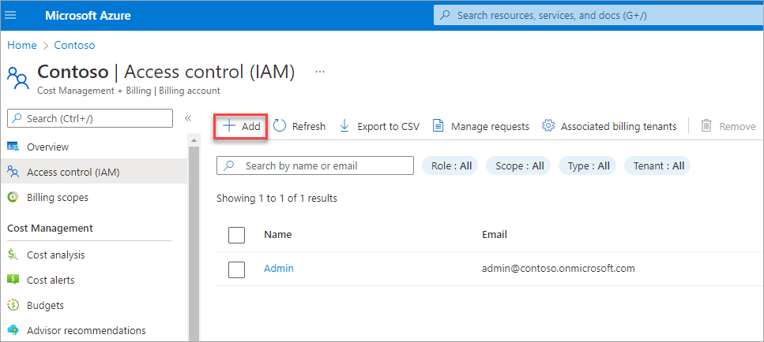
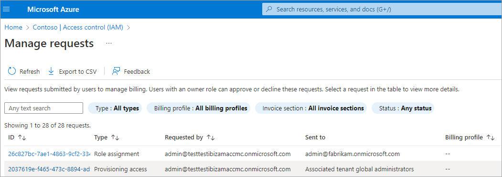

# Manage billing across multiple tenants using Associated billing tenants

You can simplify billing management for your organization by creating multi-tenant billing relationships using associated billing tenants. A multi-tenant billing relationship lets you securely share your organization’s billing account with other tenants, while maintaining control over your billing data. You can create subscriptions in different tenants and provide users in those tenants with access to your organization’s billing account. This relationship lets users on those tenants do billing activities like viewing and downloading invoices or managing licenses.

## Understand type of tenants

Primary billing tenant: The primary billing tenant is the tenant used when the billing account is set up. By default, all subscriptions are bought in this tenant and only users from this tenant can get access to the billing account.

Associated billing tenants: An associated billing tenant is a tenant that is linked to your primary billing tenant’s billing account. These tenants can buy subscriptions using your billing account or can accept subscriptions from you. You can also assign billing account roles to users in an associated billing tenant. 

> [!IMPORTANT]
> Adding associated billing tenants, and provisioning subscriptions and assigning roles to users in associated billing tenants are only available for billing accounts of type Microsoft Customer Agreement that are created by working with a Microsoft sales representative. To learn more about types of billing accounts, see [Billing accounts and scopes in the Azure portal](view-all-accounts.md).

## Access settings for associated billing tenants

When you add an associated billing tenant, you can enable one or both of the following access settings:

- **Billing management**: Billing management lets billing account owners assign roles to users in an associated billing tenant, giving them permission to access billing information and make purchasing decisions.
- **Provisioning**: Provisioning allows the creation of subscriptions in the associated billing tenants.

## Add an associated billing tenant

Before you begin, make sure you have either the tenant ID or the primary domain name for the tenant you want to invite. For more information, see [Find a tenant ID or domain name](finding-tenantid-domain.md).

1. Sign in to the [Azure portal](https://portal.azure.com).
1. Search for **Cost Management + Billing**.  

    
1. Select **Access control (IAM)** on the left side of the page.
1. In the Access control (IAM), select **Associated billing tenants** from the top of the page.

    
1. In the Associated billing tenants page, select **Add** from the top of the page.

     
1. In the Add tenant pane, enter tenant ID or domain name, provide a friendly name and then select one or both options for access settings. To learn about access setting, see [Access settings for associated billing tenant](#access-settings-for-associated-billing-tenants)

    

> [!NOTE]
> The friendly name of an associated billing tenant is used to easily identify the tenant in the Cost management + Billing section. The name is different from the display name of the tenant in Azure active directory.

1. Select **Save**.

If the Provisioning access setting is turned on, a unique link is created for you to send to the global administrator of the associated billing tenant. They must accept the request before you can move subscriptions to their tenant.
    

## Assign roles to users from the associated billing tenant

Before assigning roles, make sure you [add a tenant as an associated billing tenant and enable billing management access setting](#add-an-associated-billing-tenant).

1. Sign in to the [Azure portal](https://portal.azure.com).
1.  Search for **Cost Management + Billing**.  

    
1. Select **Access control (IAM)** on the left side of the page.
1. In the Access control (IAM) page, select **Add** from the top of the page.

    
1. In the Add role assignment pane, select a role, select the associated billing tenant from the tenant dropdown, then enter the email address of the users, groups or apps to whom you want to assign roles.
1. Select **Save**.

    
1. The users receive an email with a link to review the role assignment request. After they accept the role, they have access to your billing account.
1. If the users can't receive emails, you can copy the review link and share it with them.
1. Select manage requests from the top of the **Access control (IAM)** page.
    
    
1. Select the role assignment request sent to the users to whom you you've assigned roles.
    
    
1. Copy the request URL.

    

### Role assignments through associated billing tenants vs Azure B2B 

Choosing to assign roles to users from associated billing tenants might be the right approach, depending on the needs of your organization. The following illustrations and table compares using associated billing tenants and Azure B2B to help you decide which approach is right for your organization. To learn more about Azure B2B, see [B2B collaboration overview](../../active-directory/external-identities/what-is-b2b.md)

|  |Associated billing tenants  |Azure B2B  |
|---------|---------|---------|
|Security     |  The users that you invite to share your billing account will follow their tenant's security policies      |  The users that you invite to share your billing account will follow your tenant's security policies       |
|Access    | The users get access to your billing account in their own tenant and can manage billing and make purchases without switching tenants        |  External guest identities are created for users in your tenant and these identities get access to your billing account. Users would have to switch tenant to manage billing and make purchases     |

## Moving Microsoft 365 subscriptions to an associated billing tenants

Before moving subscriptions, make sure you [add a tenant as an associated billing tenant and enable provisioning access setting](#add-an-associated-billing-tenant).

To move Microsoft 365 subscriptions in the associated billing tenants, see [provision subscriptions in associated billing tenants](https://aka.ms/moveM365subscriptions).

## Need help? contact support

If you need help, [contact support](https://portal.azure.com/?#blade/Microsoft_Azure_Support/HelpAndSupportBlade) to get your issue resolved quickly.

## Next steps

- [Billing administrative roles](understand-mca-roles.md)
- [Associate or add an Azure subscription to your Azure Active Directory tenant](../../active-directory/fundamentals/active-directory-how-subscriptions-associated-directory.md)