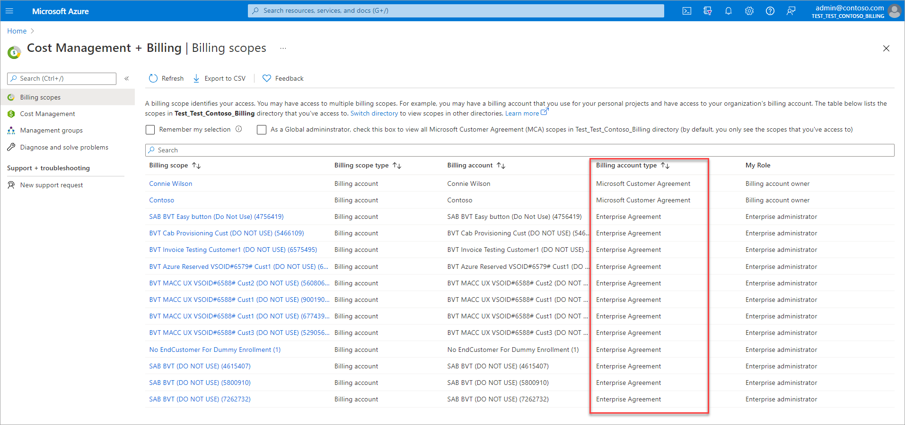
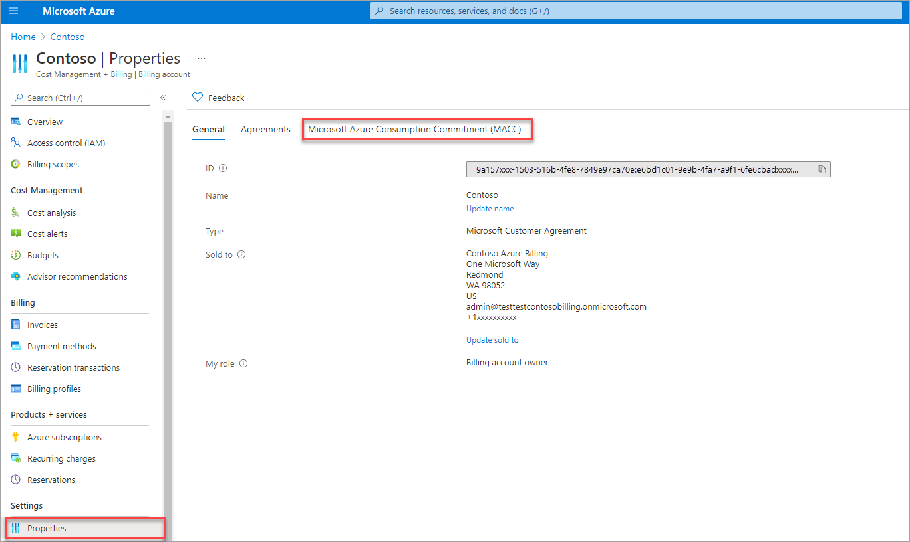
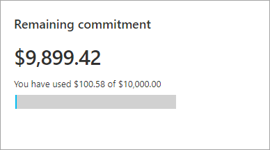
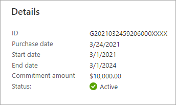

# Track your Microsoft Azure Consumption Commitment (MACC)

The Microsoft Azure Consumption Commitment (MACC) is a contractual commitment that your organization may have made to Microsoft Azure spend over time.  If your organization has a MACC for a Microsoft Customer Agreement (MCA) billing account, you can check important aspects of your commitment, including start/end dates, remaining commitment, and eligible spend in the Azure portal or through REST APIs. MACC or CTC for Enterprise Agreement (EA) billing accounts are not yet available in the Azure portal or through REST APIs.

## Track your MACC Commitment

### [Azure portal](#tab/portal)

1. Sign in to the [Azure portal](https://portal.azure.com).

2. Search for **Cost Management + Billing**.

    

3. In the billing scopes page, select the billing account for which you want to track the commitment. The billing account should be of type **Microsoft Customer Agreement**.

    

    > [!NOTE]
    >
    > Azure portal remembers the last billing scope that you access and displays the scope the next time you come to Cost Management + Billing page. You won't see the billing scopes page if you have visited Cost Management + Billing earlier. If so, check that you are in the [right scope](#check-access-to-a-microsoft-customer-agreement). If not, [switch the scope](view-all-accounts.md#switch-billing-scope-in-the-azure-portal) to select the billing account for a Microsoft Customer Agreement.

4. Select **Properties** from the left-hand side and then select **Microsoft Azure Consumption Commitment (MACC)**.

   

5. The Microsoft Azure Consumption Commitment (MACC) tab has the following sections:

   #### Remaining Commitment 

   The remaining commitment displays the remaining commitment amount as of your last invoice.

   

   #### Details

   The Details section displays other important aspects of your commitment.

   

   | Term | Definition |
   |---|---|
   | ID | An identifier that uniquely identifies your MACC. This identifier is used to get your MACC information through REST APIs. |
   | Purchase date | The date when you made the commitment. |
   | Start date | The date when the commitment became effective. |
   | End date | The date when the commitment expired. |
   | Commitment amount | The amount that you’ve committed to spend on MACC-eligible products/services. |
   | Status | The status of your commitment. Your MACC can have one of the following statutes: 
- Active: MACC is active. Any eligible spend will contribute towards your MACC commitment.
- Completed: You’ve completed your MACC commitment. 
- Expired: MACC is expired. Contact your Microsoft Account team for more information. 
- Canceled: MACC is canceled. New Azure spend will not contribute towards your MACC commitment. |

   #### Events

   The Events section displays events (invoiced spend) that decremented your MACC commitment.

   

   | Term | Definition |
   |---|---|
   | Date | The date when the event happened |
   | Description | A description of the event |
   | Billing profile | The billing profile for which the event happened |
   | MACC decrement | The amount of MACC decrement from the event |
   | Remaining commitment | The remaining MACC commitment after the event |

### [REST API](#tab/rest)

You can use the [Azure Billing](/rest/api/billing/) and the [Consumption](/rest/api/consumption/) APIs to programmatically to get Microsoft Azure Consumption Commitment (MACC) for your billing account.

The examples shown below use REST APIs. Currently, PowerShell and Azure CLI are not supported.

### Find billing accounts you have access to

```json
GET https://management.azure.com/providers/Microsoft.Billing/billingAccounts?api-version=2020-05-01
```
The API response returns a list of billing accounts.

```json
{
  "value": [
    {
      "id": "/providers/Microsoft.Billing/billingAccounts/9a157b81-xxxx-xxxx-xxxx-xxxxxxxxxxxx:xxxxxxxx-xxxx-xxxx-xxxx-xxxxxxxxxxx_xxxx-xx-xx",
      "name": "9a157b81-xxxx-xxxx-xxxx-xxxxxxxxxxxx:xxxxxxxx-xxxx-xxxx-xxxx-xxxxxxxxxxx_xxxx-xx-xx",
      "type": "Microsoft.Billing/billingAccounts",
      "properties": {
        "displayName": "Contoso",
        "agreementType": "MicrosoftCustomerAgreement",
        "accountStatus": "Active",
        "accountType": "Enterprise",
        "hasReadAccess": true,
      }
    },
    {
      "id": "/providers/Microsoft.Billing/billingAccounts/9a12f056-xxxx-xxxx-xxxx-xxxxxxxxxxxx:xxxxxxxx-xxxx-xxxx-xxxx-xxxxxxxxxxx_xxxx-xx-xx",
      "name": "9a12f056-xxxx-xxxx-xxxx-xxxxxxxxxxxx:xxxxxxxx-xxxx-xxxx-xxxx-xxxxxxxxxxx_xxxx-xx-xx",
      "type": "Microsoft.Billing/billingAccounts",
      "properties": {
        "displayName": "Connie Wilson",
        "agreementType": "MicrosoftCustomerAgreement",
        "accountStatus": "Active",
        "accountType": "Individual",
        "hasReadAccess": true,
      }
    }
  ]
}
```

Use the `displayName` property of the billing account to identify the billing account for which you want to track MACC. Copy the `name` of the billing account. For example, if you want to track MACC for **Contoso** billing account, you'd copy ```9a157b81-xxxx-xxxx-xxxx-xxxxxxxxxxxx:xxxxxxxx-xxxx-xxxx-xxxx-xxxxxxxxxxx_xxxx-xx-xx```. Paste this value somewhere so that you can use it in the next step.

### Get list of Microsoft Azure Consumption Commitments

Make the following request, replacing `<billingAccountName>` with the `name` copied in the first step (```9a157b81-xxxx-xxxx-xxxx-xxxxxxxxxxxx:xxxxxxxx-xxxx-xxxx-xxxx-xxxxxxxxxxx_xxxx-xx-xx``).

```json
GET https://management.azure.com/providers/Microsoft.Billing/billingAccounts/<billingAccountName>/providers/Microsoft.Consumption/lots?api-version=2021-05-01&$filter=source%20eq%20%27ConsumptionCommitment%27
```
The API response returns lists of MACCs for your billing account.

```json
    {
    "value": [
      {
        "id": "/providers/Microsoft.Billing/billingAccounts/9a157b81-xxxx-xxxx-xxxx-xxxxxxxxxxxx:xxxxxxxx-xxxx-xxxx-xxxx-xxxxxxxxxxx_xxxx-xx-xx/providers/Microsoft.Consumption/lots/G2021032459206000XXXX",
        "name": "G2021032459206000XXXX",
        "type": "Microsoft.Consumption/lots",
        "eTag": null,
        "properties": {
          "purchasedDate": "2021-03-24T16:26:46.0000000Z",
          "status": "Active",
          "originalAmount": {
            "currency": "USD",
            "value": 10000.0
          },
          "closedBalance": {
            "currency": "USD",
            "value": 9899.42
          },
          "source": "ConsumptionCommitment",
          "startDate": "2021-03-01T00:00:00.0000000Z",
          "expirationDate": "2024-02-28T00:00:00.0000000Z"
        }
      },
      {
        "id": "/providers/Microsoft.Billing/billingAccounts/9a157b81-xxxx-xxxx-xxxx-xxxxxxxxxxxx:xxxxxxxx-xxxx-xxxx-xxxx-xxxxxxxxxxx_xxxx-xx-xx/providers/Microsoft.Consumption/lots/G1011082459206000XXXX",
        "name": "G1011082459206000XXXX",
        "type": "Microsoft.Consumption/lots",
        "eTag": null,
        "properties": {
          "purchasedDate": "2021-03-24T16:26:46.0000000Z",
          "status": "Complete",
          "originalAmount": {
            "currency": "USD",
            "value": 10000.0
          },
          "closedBalance": {
            "currency": "USD",
            "value": 0.00
          },
          "source": "ConsumptionCommitment",
          "startDate": "2020-03-01T00:00:00.0000000Z",
          "expirationDate": "2021-02-28T00:00:00.0000000Z"
        }
      }
    ]
  }
```
| Element name  | Description                                                                                               |
|---------------|-----------------------------------------------------------------------------------------------------------|
| `purchasedDate`  | The date when the MACC was purchased.   |
| `status`  | The status of your commitment. Your MACC can have one of the following statutes: 
- Active: MACC is active. Any eligible spend will contribute towards your MACC commitment.
- Completed: You’ve completed your MACC commitment. 
- Expired: MACC is expired. Contact your Microsoft Account team for more information. 
- Canceled: MACC is canceled. New Azure spend will not contribute towards your MACC commitment.  |
| `originalAmount` | The original commitment amount. |
| `closedBalance`   | The remaining commitment as of the last invoice.    |
| `source`      | For MACC, the source will always be ConsumptionCommitment. |
| `startDate`      |  The date when the MACC became active.  |
| `expirationDate`  | The date when the MACC expires.   |


### Get events that affected MACC commitment

Make the following request, replacing `<billingAccountName>` with the `name` copied in the first step (```5e98e158-xxxx-xxxx-xxxx-xxxxxxxxxxxx:xxxxxxxx-xxxx-xxxx-xxxx-xxxxxxxxxxx_xxxx-xx-xx``). You would need to pass a **startDate** and an **endDate** to get events for your required duration.

```json
GET https://management.azure.com/providers/Microsoft.Billing/billingAccounts/<billingAccountName>/providers/Microsoft.Consumption/events?api-version=2021-05-01&startDate=<startDate>&endDate=<endDate>&$filter=lotsource%20eq%20%27ConsumptionCommitment%27
```
The API response returns all events that affected your MACC commitment.

```json
{
  "value": [
    {
      "id": "/providers/Microsoft.Billing/billingAccounts/5e98e158-xxxx-xxxx-xxxx-xxxxxxxxxxxx:xxxxxxxx-xxxx-xxxx-xxxx-xxxxxxxxxxx_xxxx-xx-xx/providers/Microsoft.Consumption/events/103axxxx-2c25-7xx3-f2a0-ad9a3f1c91xx",
      "name": "103axxxx-2c25-7xx3-f2a0-ad9a3f1c91xx",
      "type": "Microsoft.Consumption/events",
      "eTag": null,
      "properties": {
        "billingProfileId": "/providers/Microsoft.Billing/billingAccounts/5e98e158-xxxx-xxxx-xxxx-xxxxxxxxxxxx:xxxxxxxx-xxxx-xxxx-xxxx-xxxxxxxxxxx_xxxx-xx-xx/billingProfiles/SWFF-DVM4-XXX-XXX",
        "billingProfileDisplayName": "Finance",
        "lotId": "/providers/Microsoft.Billing/billingAccounts/5e98e158-xxxx-xxxx-xxxx-xxxxxxxxxxxx:xxxxxxxx-xxxx-xxxx-xxxx-xxxxxxxxxxx_xxxx-xx-xx/providers/Microsoft.Consumption/lots/G2021032459206000XXXX",
        "lotSource": "ConsumptionCommitment",
        "transactionDate": "2021-05-05T00:09:13.0000000Z",
        "description": "Balance after invoice T00075XXXX",
        "charges": {
          "currency": "USD",
          "value": -100.0
        },
        "closedBalance": {
          "currency": "USD",
          "value": 9899.71
        },
        "eventType": "SettledCharges",
        "invoiceNumber": "T00075XXXX"
      }
    },
    {
      "id": "/providers/Microsoft.Billing/billingAccounts/5e98e158-xxxx-xxxx-xxxx-xxxxxxxxxxxx:xxxxxxxx-xxxx-xxxx-xxxx-xxxxxxxxxxx_xxxx-xx-xx/providers/Microsoft.Consumption/events/203axxxx-2c25-7xx3-f2a0-ad9a3f1c91xx",
      "name": "203axxxx-2c25-7xx3-f2a0-ad9a3f1c91xx",
      "type": "Microsoft.Consumption/events",
      "eTag": null,
      "properties": {
        "billingProfileId": "/providers/Microsoft.Billing/billingAccounts/5e98e158-xxxx-xxxx-xxxx-xxxxxxxxxxxx:xxxxxxxx-xxxx-xxxx-xxxx-xxxxxxxxxxx_xxxx-xx-xx/billingProfiles/SWFF-DVM4-XXX-XXX",
        "billingProfileDisplayName": "Engineering",
        "lotId": "/providers/Microsoft.Billing/billingAccounts/5e98e158-xxxx-xxxx-xxxx-xxxxxxxxxxxx:xxxxxxxx-xxxx-xxxx-xxxx-xxxxxxxxxxx_xxxx-xx-xx/providers/Microsoft.Consumption/lots/G2021032459206000XXXX",
        "lotSource": "ConsumptionCommitment",
        "transactionDate": "2021-04-05T00:09:13.0000000Z",
        "description": "Balance after invoice T00074XXXX",
        "charges": {
          "currency": "USD",
          "value": -0.29
        },
        "closedBalance": {
          "currency": "USD",
          "value": 9999.71
        },
        "eventType": "SettledCharges",
        "invoiceNumber": "T00074XXXX"
      }
    }
  ]
}
```
| Element name  | Description                                                                                               |
|---------------|-----------------------------------------------------------------------------------------------------------|
| `billingProfileId` | The unique identifier for the billing profile for which the event happened. |
| `billingProfileDisplayName` | The display name for the billing profile for which the event happened. |
| `lotId`   | The unique identifier for the MACC.    |
| `lotSource`      | This will be ConsumptionCommitment for MACC. |
| `transactionDate`      |  The date when the event happened.  |
| `description`  | The description of the event.   |
| `charges`  | The amount of MACC decrement.   |
| `closedBalance`  | The balance after the event.   |
| `eventType`  | Only SettledCharges events are supported for MACC.   |
| `invoiceNumber`  | The unique ID of the invoice whose charges decremented MACC.   |
---

## Azure Services and Marketplace Offers that are eligible for MACC

You can determine which Azure services and Marketplace offers are eligible for MACC decrement in the Azure portal. For more information, see [Determine which offers are eligible for Azure consumption commitments (MACC/CtC)](https://docs.microsoft.com/marketplace/azure-consumption-commitment-benefit#determine-which-offers-are-eligible-for-azure-consumption-commitments-maccctc).

## Azure Credits and MACC

If your organization received Azure credits from Microsoft, the consumption or purchases that are covered by credits will not contribute towards your MACC commitment.

If your organization purchased Azure Prepayment, the consumption or purchases that are covered by credits will not contribute towards your MACC commitment.  However, the actual Prepayment purchase itself will decrement your MACC commitment.
For example, Contoso made a MACC commitment of $50,000 in May. In June, they purchased an Azure Prepayment of $10,000. The purchase will decrement their MACC commitment and the remaining commitment will be $40,000. In June, Contoso consumed $10,000 of Azure Prepayment-eligible services. The service charges will be covered by their Azure Prepayment; however, the service charges  won’t decrement their MACC commitment. Once the Azure Prepayment is fully utilized, all Azure service consumption and other eligible purchases will decrement their MACC commitment.

## Check access to a Microsoft Customer Agreement
[!INCLUDE [billing-check-mca](../../../includes/billing-check-mca.md)]

## Need help? Contact support.

If you need help, [contact support](https://portal.azure.com/?#blade/Microsoft_Azure_Support/HelpAndSupportBlade) to get your issue resolved quickly.

## Next steps

- [Determine which offers are eligible for Azure consumption commitments (MACC/CTC)](https://docs.microsoft.com/marketplace/azure-consumption-commitment-benefit#determine-which-offers-are-eligible-for-azure-consumption-commitments-maccctc)
- [Track your Azure credits balance](mca-check-azure-credits-balance.md)