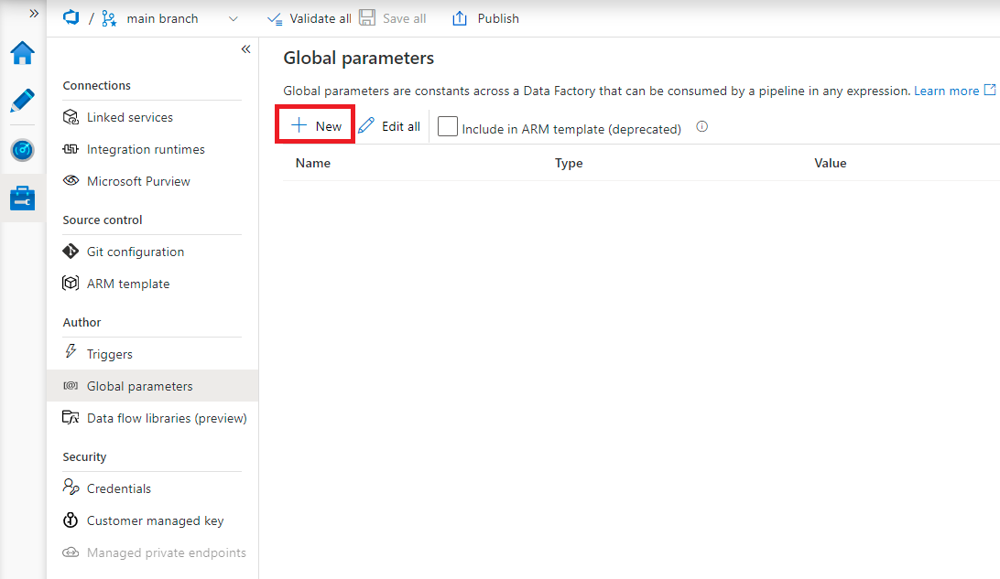
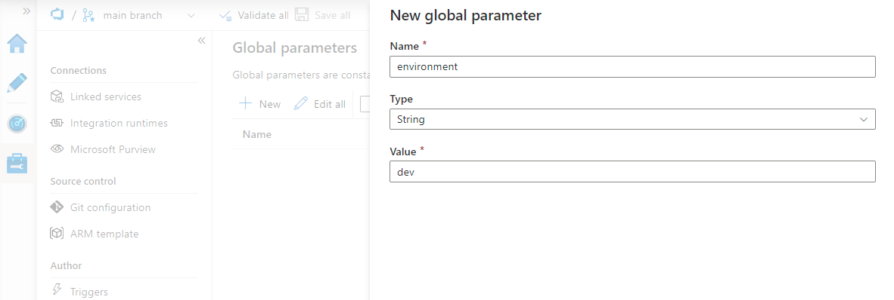
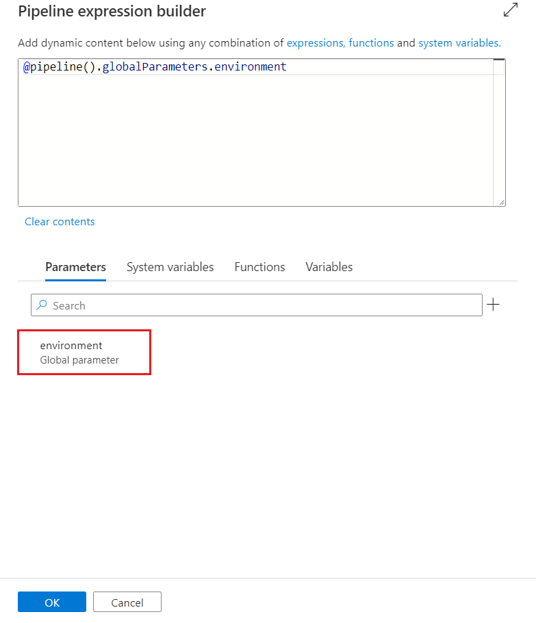
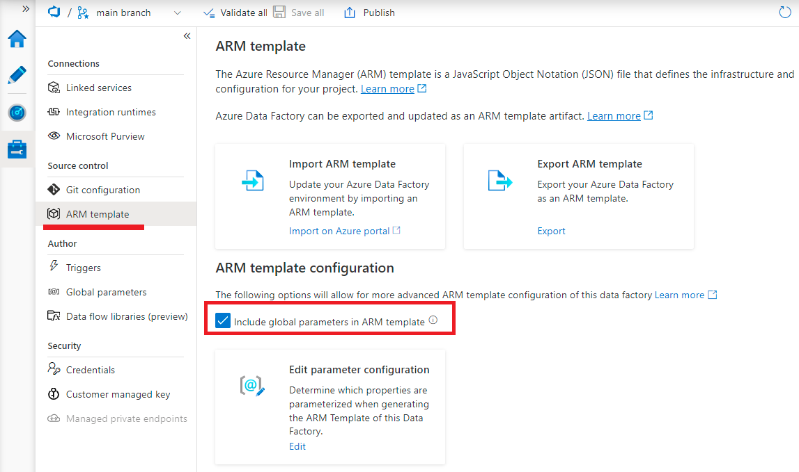

# Global parameters in Azure Data Factory

[!INCLUDE[appliesto-adf-xxx-md](includes/appliesto-adf-xxx-md.md)]

Global parameters are constants across a data factory that can be consumed by a pipeline in any expression. They're useful when you have multiple pipelines with identical parameter names and values. When promoting a data factory using the continuous integration and deployment process (CI/CD), you can override these parameters in each environment. 

## Creating global parameters

To create a global parameter, go to the *Global parameters* tab in the *Manage* section. Select **New** to open the creation side-nav.



In the side-nav, enter a name, select a data type, and specify the value of your parameter.



After a global parameter is created, you can edit it by clicking the parameter's name. To alter multiple parameters at once, select **Edit all**.


## Using global parameters in a pipeline

Global parameters can be used in any [pipeline expression](control-flow-expression-language-functions.md). If a pipeline is referencing another resource such as a dataset or data flow, you can pass down the global parameter value via that resource's parameters. Global parameters are referenced as `pipeline().globalParameters.<parameterName>`.



## <a name="cicd"></a> Global parameters in CI/CD

There are two ways to integrate global parameters in your continuous integration and deployment solution:

* Include global parameters in the ARM template
* Deploy global parameters via a PowerShell script

For most use cases, it is recommended to include global parameters in the ARM template. This will integrate natively with the solution outlined in [the CI/CD doc](continuous-integration-deployment.md). Global parameters will be added as an ARM template parameter by default as they often change from environment to environment. You can enable the inclusion of global parameters in the ARM template from the **Manage** hub.



Adding global parameters to the ARM template adds a factory-level setting that will override other factory-level settings such as a customer-managed key or git configuration in other environments. If you have these settings enabled in an elevated environment such as UAT or PROD, it's better to deploy global parameters via a PowerShell script in the steps highlighted below.

### Deploying using PowerShell

The following steps outline how to deploy global parameters via PowerShell. This is useful when your target factory has a factory-level setting such as customer-managed key.

When you publish a factory or export an ARM template with global parameters, a folder called *globalParameters* is created with a file called *your-factory-name_GlobalParameters.json*. This file is a JSON object that contains each global parameter type and value in the published factory.


If you're deploying to a new environment such as TEST or PROD, it's recommended to create a copy of this global parameters file and overwrite the appropriate environment-specific values. When you republish the original global parameters file will get overwritten, but the copy for the other environment will be untouched.

For example, if you have a factory named 'ADF-DEV' and a global parameter of type string named 'environment' with a value 'dev', when you publish a file named *ADF-DEV_GlobalParameters.json* will get generated. If deploying to a test factory named 'ADF_TEST', create a copy of the JSON file (for example named ADF-TEST_GlobalParameters.json) and replace the parameter values with the environment-specific values. The parameter 'environment' may have a value 'test' now. 


Use the below PowerShell script to promote global parameters to additional environments. Add an Azure PowerShell DevOps task before your ARM Template deployment. In the DevOps task, you must specify the location of the new parameters file, the target resource group, and the target data factory.

> [!NOTE]
> To deploy global parameters using PowerShell, you must use at least version 4.4.0 of the Az module.

```powershell
param
(
    [parameter(Mandatory = $true)] [String] $globalParametersFilePath,
    [parameter(Mandatory = $true)] [String] $resourceGroupName,
    [parameter(Mandatory = $true)] [String] $dataFactoryName
)

Import-Module Az.DataFactory

$newGlobalParameters = New-Object 'system.collections.generic.dictionary[string,Microsoft.Azure.Management.DataFactory.Models.GlobalParameterSpecification]'

Write-Host "Getting global parameters JSON from: " $globalParametersFilePath
$globalParametersJson = Get-Content $globalParametersFilePath

Write-Host "Parsing JSON..."
$globalParametersObject = [Newtonsoft.Json.Linq.JObject]::Parse($globalParametersJson)

foreach ($gp in $globalParametersObject.GetEnumerator()) {
    Write-Host "Adding global parameter:" $gp.Key
    $globalParameterValue = $gp.Value.ToObject([Microsoft.Azure.Management.DataFactory.Models.GlobalParameterSpecification])
    $newGlobalParameters.Add($gp.Key, $globalParameterValue)
}

$dataFactory = Get-AzDataFactoryV2 -ResourceGroupName $resourceGroupName -Name $dataFactoryName
$dataFactory.GlobalParameters = $newGlobalParameters

Write-Host "Updating" $newGlobalParameters.Count "global parameters."

Set-AzDataFactoryV2 -InputObject $dataFactory -Force
```

## Next steps

* Learn about Azure Data Factory's [continuous integration and deployment process](continuous-integration-deployment.md)
* Learn how to use the [control flow expression language](control-flow-expression-language-functions.md)
