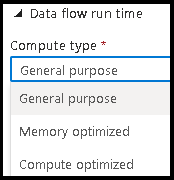

# Retirement of data flow compute optimized option

[!INCLUDE[appliesto-adf-asa-md](includes/appliesto-adf-asa-md.md)]

Azure Data Factory and Azure Synapse Analytics data flows provide a low-code mechanism to transform data in ETL jobs at scale using a graphical design paradigm. Data flows execute on the Azure Data Factory and Azure Synapse Analytics serverless Integration Runtime facility. The scalable nature of Azure Data Factory and Azure Synapse Analytics Integration Runtimes enabled three different compute options for the Azure Databricks Spark environment that is utilized to execute data flows at scale: Memory Optimized, General Purpose, and Compute Optimized. Memory Optimized and General Purpose are the recommended classes of data flow compute to use with your Integration Runtime for production workloads. Because Compute Optimized will often not suffice for common use cases with data flows, we recommend using General Purpose or Memory Optimized data flows in production workloads.

## Migration steps

From now through 31 August 2024, your Compute Optimized data flows will continue to work in your existing pipelines. To avoid service disruption, please remove your existing Compute Optimized data flows before 31 August 2024 and follow the steps below to create a new Azure Integration Runtime and data flow activity. When creating a new data flow activity:

1. Create a new Azure Integration Runtime with “General Purpose” or “Memory Optimized” as the compute type.
2. Set your data flow activity using either of those compute types.

   

## Comparison between different compute options 

| Compute Option              | Performance                                                  |
| :-------------------- | :----------------------------------------------------------- |
| General Purpose Data Flows (Basic) | Good for general use cases in production workloads |
| Memory Optimized Data Flows (Standard) | Best performing runtime for data flows when working with large datasets and many calculations |
| Compute Optimized Data Flows (Deprecated) | Not recommended for production workloads |

* [Visit the Azure Data Factory pricing page for the latest updated pricing available for General Purpose and Memory Optimized data flows](https://azure.microsoft.com/pricing/details/data-factory/data-pipeline/)
* [Find more detailed information at the data flows FAQ here](/azure/data-factory/frequently-asked-questions#mapping-data-flows)  
* [Post questions and find answers on data flows on Microsoft Q&A](https://aka.ms/datafactoryqa)