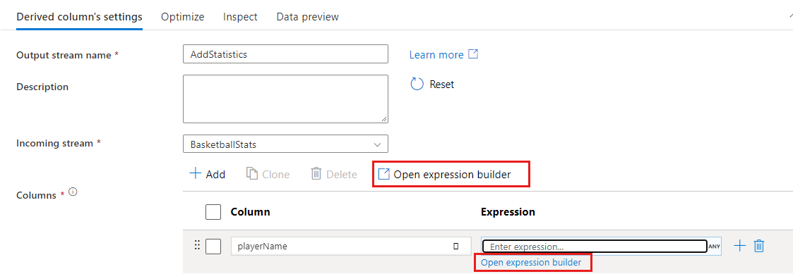
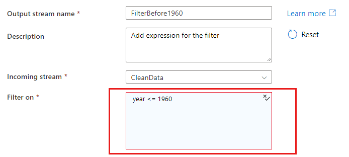
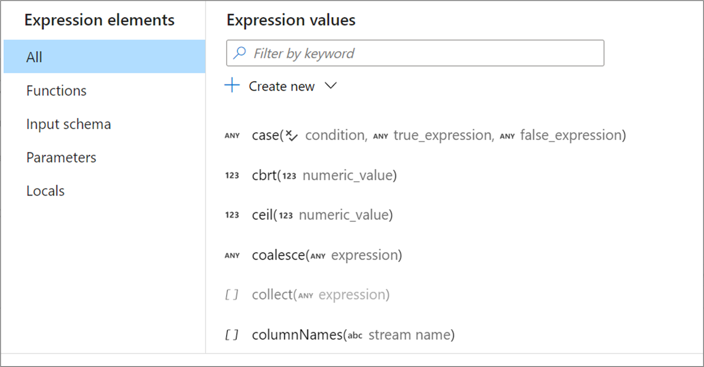
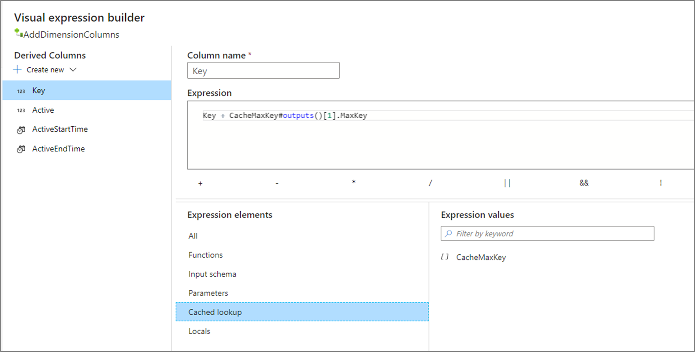
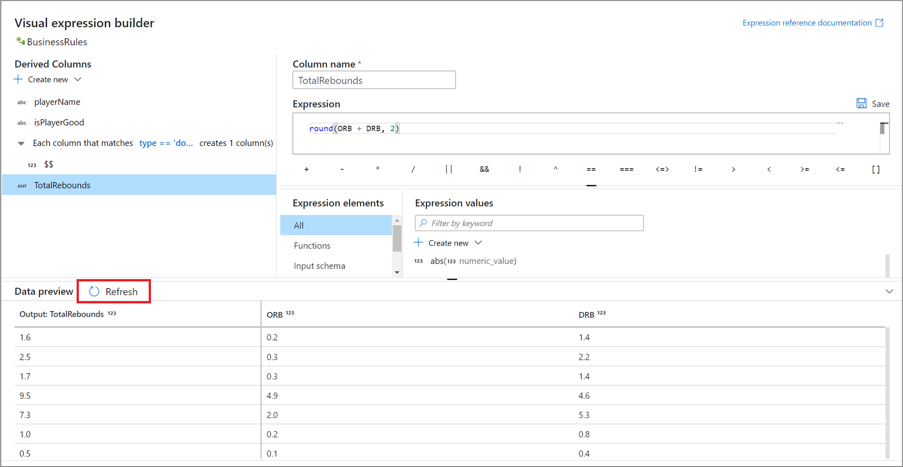

# Build expressions in mapping data flow

[!INCLUDE[appliesto-adf-asa-md](includes/appliesto-adf-asa-md.md)]

In mapping data flow, many transformation properties are entered as expressions. These expressions are composed of column values, parameters, functions, operators, and literals that evaluate to a Spark data type at run time. Mapping data flows has a dedicated experience aimed to aid you in building these expressions called the **Expression Builder**. Utilizing  [IntelliSense](/visualstudio/ide/using-intellisense) code completion for highlighting, syntax checking, and autocompleting, the expression builder is designed to make building data flows easy. This article explains how to use the expression builder to effectively build your business logic.

:::image type="content" source="media/data-flow/expresion-builder.png" alt-text="Expression Builder":::

## Open Expression Builder

There are multiple entry points to opening the expression builder. These are all dependent on the specific context of the data flow transformation. The most common use case is in transformations like [derived column](data-flow-derived-column.md) and [aggregate](data-flow-aggregate.md) where users create or update columns using the data flow expression language. The expression builder can be opened by selecting **Open expression builder** above the list of columns. You can also click on a column context and open the expression builder directly to that expression.



In some transformations like [filter](data-flow-filter.md), clicking on a blue expression text box will open the expression builder. 



When you reference columns in a matching or group-by condition, an expression can extract values from columns. To create an expression, select **Computed column**.


In cases where an expression or a literal value are valid inputs, select **Add dynamic content** to build an expression that evaluates to a literal value.


## Expression elements

In mapping data flows, expressions can be composed of column values, parameters, functions, local variables, operators, and literals. These expressions must evaluate to a Spark data type such as string, boolean, or integer.



### Functions

Mapping data flows has built-in functions and operators that can be used in expressions. For a list of available functions, see the [mapping data flow language reference](data-flow-expression-functions.md).

#### Address array indexes

When dealing with columns or functions that return array types, use brackets ([]) to access a specific element. If the index doesn't exist, the expression evaluates into NULL.


> [!IMPORTANT]
> In mapping data flows, arrays are one-based meaning the first element is referenced by index one. For example, myArray[1] will access the first element of an array called 'myArray'.

### Input schema

If your data flow uses a defined schema in any of its sources, you can reference a column by name in many expressions. If you are utilizing schema drift, you can reference columns explicitly using the `byName()` or `byNames()` functions or match using column patterns.

#### Column names with special characters

When you have column names that include special characters or spaces, surround the name with curly braces to reference them in an expression.

```{[dbo].this_is my complex name$$$}```

### Parameters

Parameters are values that are passed into a data flow at run time from a pipeline. To reference a parameter, either click on the parameter from the **Expression elements** view or reference it with a dollar sign in front of its name. For example, a parameter called parameter1 would be referenced by `$parameter1`. To learn more, see [parameterizing mapping data flows](parameters-data-flow.md). 

### Cached lookup

A cached lookup allows you to do an inline lookup of the output of a cached sink. There are two functions available to use on each sink, `lookup()` and `outputs()`. The syntax to reference these functions is `cacheSinkName#functionName()`. For more information, see [cache sinks](data-flow-sink.md#cache-sink).

`lookup()` takes in the matching columns in the current transformation as parameters and returns a complex column equal to the row matching the key columns in the cache sink. The complex column returned contains a subcolumn for each column mapped in the cache sink. For example, if you had an error code cache sink `errorCodeCache` that had a key column matching on the code and a column called `Message`. Calling `errorCodeCache#lookup(errorCode).Message` would return the message corresponding with the code passed in. 

`outputs()` takes no parameters and  returns the entire cache sink as an array of complex columns. This can't be called if key columns are specified in the sink and should only be used if there is a small number of rows in the cache sink. A common use case is appending the max value of an incrementing key. If a cached single aggregated row `CacheMaxKey` contains a column `MaxKey`, you can reference the first value by calling `CacheMaxKey#outputs()[1].MaxKey`.



### Locals

If you are sharing logic across multiple columns or want to compartmentalize your logic, you can create a local within a derived column\. To reference a local, either click on the local from the **Expression elements** view or reference it with a colon in front of its name. For example, a local called local1 would be referenced by `:local1`. Learn more about locals in the [derived column documentation](data-flow-derived-column.md#locals).

## Preview expression results

If [debug mode](concepts-data-flow-debug-mode.md) is switched on, you can interactively use the debug cluster to preview what your expression evaluates to. Select **Refresh** next to data preview to update the results of the data preview. You can see the output of each row given the input columns.



## String interpolation

When creating long strings that use expression elements, use string interpolation to easily build up complex string logic. String interpolation avoids extensive use of string concatenation when parameters are included in query strings. Use double quotation marks to enclose literal string text together with expressions. You can include expression functions, columns, and parameters. To use expression syntax, enclose it in curly braces,

Some examples of string interpolation:

* ```"My favorite movie is {iif(instr(title,', The')>0,"The {split(title,', The')[1]}",title)}"```

* ```"select * from {$tablename} where orderyear > {$year}"```

* ```"Total cost with sales tax is {round(totalcost * 1.08,2)}"```

* ```"{:playerName} is a {:playerRating} player"```

> [!NOTE]
> When using string interpolation syntax in SQL source queries, the query string must be on one single line, without '/n'.

## Commenting expressions

Add comments to your expressions by using single-line and multiline comment syntax.

The following examples are valid comments:

* ```/* This is my comment */```

* ```/* This is a```
* ```multi-line comment */```

If you put a comment at the top of your expression, it appears in the transformation text box to document your transformation expressions.


## Regular expressions

Many expression language functions use regular expression syntax. When you use regular expression functions, Expression Builder tries to interpret a backslash (\\) as an escape character sequence. When you use backslashes in your regular expression, either enclose the entire regex in backticks (\`) or use a double backslash.

An example that uses backticks:

```
regex_replace('100 and 200', `(\d+)`, 'digits')
```

An example that uses double slashes:

```
regex_replace('100 and 200', '(\\d+)', 'digits')
```

## Keyboard shortcuts

Below are a list of shortcuts available in the expression builder. Most intellisense shortcuts are available when creating expressions.

* Ctrl+K Ctrl+C: Comment entire line.
* Ctrl+K Ctrl+U: Uncomment.
* F1: Provide editor help commands.
* Alt+Down arrow key: Move down current line.
* Alt+Up arrow key: Move up current line.
* Ctrl+Spacebar: Show context help.

## Commonly used expressions

### Convert to dates or timestamps

To include string literals in your timestamp output, wrap your conversion in ```toString()```.

```toString(toTimestamp('12/31/2016T00:12:00', 'MM/dd/yyyy\'T\'HH:mm:ss'), 'MM/dd /yyyy\'T\'HH:mm:ss')```

To convert milliseconds from epoch to a date or timestamp, use `toTimestamp(<number of milliseconds>)`. If time is coming in seconds, multiply by 1,000.

```toTimestamp(1574127407*1000l)```

The trailing "l" at the end of the previous expression signifies conversion to a long type as inline syntax.

### Find time from epoch or Unix Time

toLong( 
    currentTimestamp() -
    toTimestamp('1970-01-01 00:00:00.000', 'yyyy-MM-dd HH:mm:ss.SSS')
) * 1000l

### Data flow time evaluation

Dataflow processes till milliseconds. For *2018-07-31T20:00:00.2170000*, you will see *2018-07-31T20:00:00.217*  in output.
In the portal for the service, timestamp is being shown in the **current browser setting**, which can  eliminate 217, but when you will run the data flow end to end, 217 (milliseconds part will be processed as well). You can use toString(myDateTimeColumn) as expression and see full precision data in preview. Process datetime as datetime rather than string for all practical purposes.
 

## Next steps

[Begin building data transformation expressions](data-flow-expression-functions.md)
