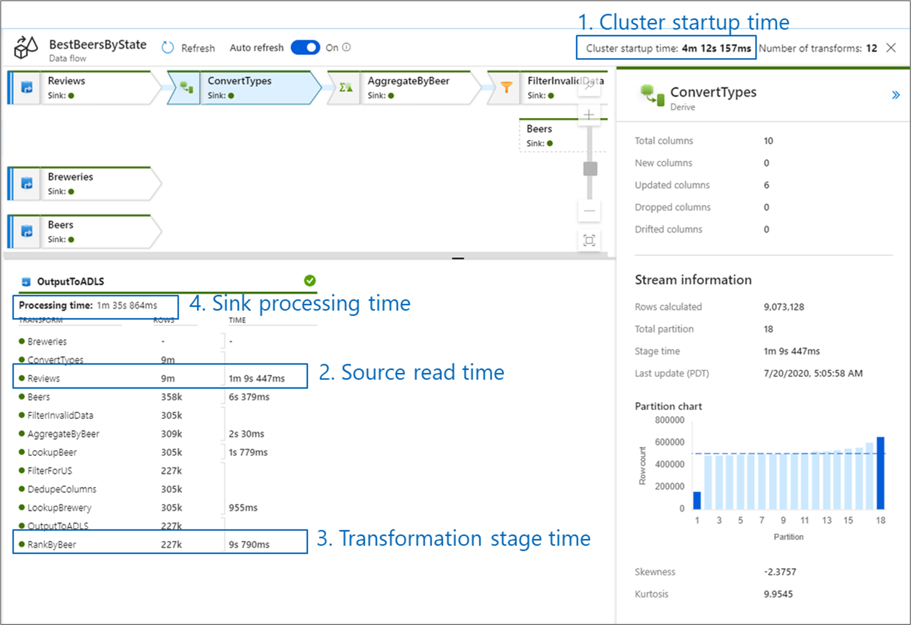
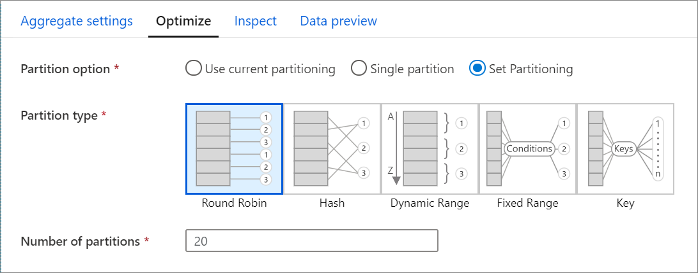
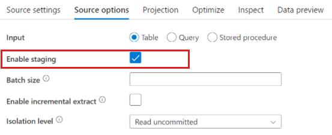
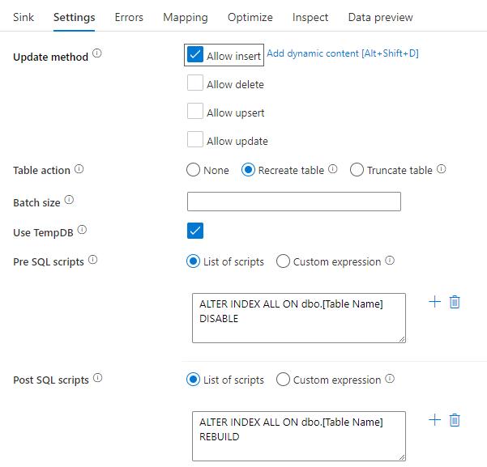
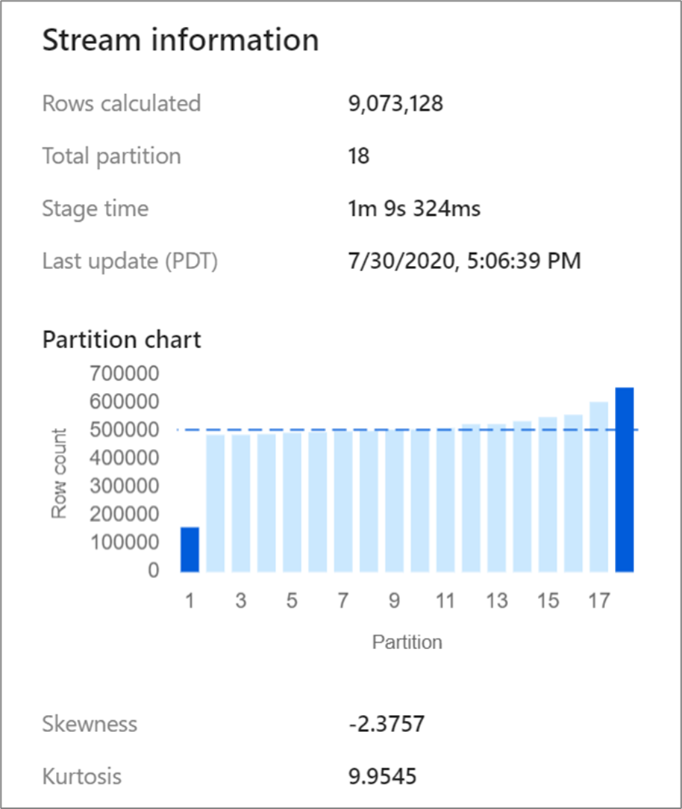

# Mapping data flows performance and tuning guide

[!INCLUDE[appliesto-adf-asa-md](includes/appliesto-adf-asa-md.md)]

Mapping data flows in Azure Data Factory and Synapse pipelines provide a code-free interface to design and run data transformations at scale. If you're not familiar with mapping data flows, see the [Mapping Data Flow Overview](concepts-data-flow-overview.md). This article highlights various ways to tune and optimize your data flows so that they meet your performance benchmarks.

Watch the below video to see shows some sample timings transforming data with data flows.

> [!VIDEO https://www.microsoft.com/en-us/videoplayer/embed/RE4rNxM]

## Testing data flow logic

When designing and testing data flows from UI, debug mode allows you to interactively test against a live Spark cluster. This allows you to preview data and execute your data flows without waiting for a cluster to warm up. For more information, see [Debug Mode](concepts-data-flow-debug-mode.md).

## Monitoring data flow performance

Once you verify your transformation logic using debug mode, run your data flow end-to-end as an activity in a pipeline. Data flows are operationalized in a pipeline using the [execute data flow activity](control-flow-execute-data-flow-activity.md). The data flow activity has a unique monitoring experience compared to other activities that displays a detailed execution plan and performance profile of the transformation logic. To view detailed monitoring information of a data flow, click on the eyeglasses icon in the activity run output of a pipeline. For more information, see [Monitoring mapping data flows](concepts-data-flow-monitoring.md).


When monitoring data flow performance, there are four possible bottlenecks to look out for:

* Cluster start-up time
* Reading from a source
* Transformation time
* Writing to a sink 



Cluster start-up time is the time it takes to spin up an Apache Spark cluster. This value is located in the top-right corner of the monitoring screen. Data flows run on a just-in-time model where each job uses an isolated cluster. This start-up time generally takes 3-5 minutes. For sequential jobs, this can be reduced by enabling a time to live value. For more information, see [optimizing the Azure Integration Runtime](#ir).

Data flows utilize a Spark optimizer that reorders and runs your business logic in 'stages' to perform as quickly as possible. For each sink that your data flow writes to, the monitoring output lists the duration of each transformation stage, along with the time it takes to write data into the sink. The time that is the largest is likely the bottleneck of your data flow. If the transformation stage that takes the largest contains a source, then you may want to look at further optimizing your read time. If a transformation is taking a long time, then you may need to repartition or increase the size of your integration runtime. If the sink processing time is large, you may need to scale up your database or verify you are not outputting to a single file.

Once you have identified the bottleneck of your data flow, use the below optimizations strategies to improve performance.

## Optimize tab

The **Optimize** tab contains settings to configure the partitioning scheme of the Spark cluster. This tab exists in every transformation of data flow and specifies whether you want to repartition the data **after** the transformation has completed. Adjusting the partitioning provides control over the distribution of your data across compute nodes and data locality optimizations that can have both positive and negative effects on your overall data flow performance.



By default, *Use current partitioning* is selected which instructs the service keep the current output partitioning of the transformation. As repartitioning data takes time, *Use current partitioning* is recommended in most scenarios. Scenarios where you may want to repartition your data include after aggregates and joins that significantly skew your data or when using Source partitioning on a SQL DB.

To change the partitioning on any transformation, select the **Optimize** tab and select the **Set Partitioning** radio button. You are presented with a series of options for partitioning. The best method of partitioning differs based on your data volumes, candidate keys, null values, and cardinality. 

> [!IMPORTANT]
> Single partition combines all the distributed data into a single partition. This is a very slow operation that also significantly affects all downstream transformation and writes. This option is strongly discouraged unless there is an explicit business reason to use it.

The following partitioning options are available in every transformation:

### Round robin 

Round robin distributes data equally across partitions. Use round-robin when you don't have good key candidates to implement a solid, smart partitioning strategy. You can set the number of physical partitions.

### Hash

The service produces a hash of columns to produce uniform partitions such that rows with similar values fall in the same partition. When you use the Hash option, test for possible partition skew. You can set the number of physical partitions.

### Dynamic range

The dynamic range uses Spark dynamic ranges based on the columns or expressions that you provide. You can set the number of physical partitions. 

### Fixed range

Build an expression that provides a fixed range for values within your partitioned data columns. To avoid partition skew, you should have a good understanding of your data before you use this option. The values you enter for the expression are used as part of a partition function. You can set the number of physical partitions.

### Key

If you have a good understanding of the cardinality of your data, key partitioning might be a good strategy. Key partitioning creates partitions for each unique value in your column. You can't set the number of partitions because the number is based on unique values in the data.

> [!TIP]
> Manually setting the partitioning scheme reshuffles the data and can offset the benefits of the Spark optimizer. A best practice is to not manually set the partitioning unless you need to.

## Logging level

If you do not require every pipeline execution of your data flow activities to fully log all verbose telemetry logs, you can optionally set your logging level to "Basic" or "None". When executing your data flows in "Verbose" mode (default), you are requesting the service to fully log activity at each individual partition level during your data transformation. This can be an expensive operation, so only enabling verbose when troubleshooting can improve your overall data flow and pipeline performance. "Basic" mode will only log transformation durations while "None" will only provide a summary of durations.


## <a name="ir"></a> Optimizing the Azure Integration Runtime

Data flows run on Spark clusters that are spun up at run-time. The configuration for the cluster used is defined in the integration runtime (IR) of the activity. There are three performance considerations to make when defining your integration runtime: cluster type, cluster size, and time to live.

For more information how to create an Integration Runtime, see [Integration Runtime](concepts-integration-runtime.md).

### Cluster type

There are three available options for the type of Spark cluster spun up: general purpose, memory optimized, and compute optimized.

**General purpose** clusters are the default selection and will be ideal for most data flow workloads. These tend to be the best balance of performance and cost.

If your data flow has many joins and lookups, you may want to use a **memory optimized** cluster. Memory optimized clusters can store more data in memory and will minimize any out-of-memory errors you may get. Memory optimized have the highest price-point per core, but also tend to result in more successful pipelines. If you experience any out of memory errors when executing data flows, switch to a memory optimized Azure IR configuration. 

**Compute optimized** aren't ideal for ETL workflows and aren't recommended for most production workloads. For simpler, non-memory intensive data transformations such as filtering data or adding derived columns, compute-optimized clusters can be used at a cheaper price per core.

### Cluster size

Data flows distribute the data processing over different nodes in a Spark cluster to perform operations in parallel. A Spark cluster with more cores increases the number of nodes in the compute environment. More nodes increase the processing power of the data flow. Increasing the size of the cluster is often an easy way to reduce the processing time.

The default cluster size is four driver nodes and four worker nodes.  As you process more data, larger clusters are recommended. Below are the possible sizing options:

| Worker cores | Driver cores | Total cores | Notes |
| ------------ | ------------ | ----------- | ----- |
| 4 | 4 | 8 | Not available for compute optimized |
| 8 | 8 | 16 | |
| 16 | 16 | 32 | |
| 32 | 16 | 48 | |
| 64 | 16 | 80 | |
| 128 | 16 | 144 | |
| 256 | 16 | 272 | |

Data flows are priced at vcore-hrs meaning that both cluster size and execution-time factor into this. As you scale up, your cluster cost per minute will increase, but your overall time will decrease.

> [!TIP]
> There is a ceiling on how much the size of a cluster affects the performance of a data flow. Depending on the size of your data, there is a point where increasing the size of a cluster will stop improving performance. For example, If you have more nodes than partitions of data, adding additional nodes won't help. 
A best practice is to start small and scale up to meet your performance needs. 

### Time to live

By default, every data flow activity spins up a new Spark cluster based upon the Azure IR configuration. Cold cluster start-up time takes a few minutes and data processing can't start until it is complete. If your pipelines contain multiple **sequential** data flows, you can enable a time to live (TTL) value. Specifying a time to live value keeps a cluster alive for a certain period of time after its execution completes. If a new job starts using the IR during the TTL time, it will reuse the existing cluster and start up time will greatly reduced. After the second job completes, the cluster will again stay alive for the TTL time.

You can additionally minimize the startup time of warm clusters by setting the "Quick re-use" option in the Azure Integration runtime under Data Flow Properties. Setting this to true will tell the service to not teardown the existing cluster after each job and instead re-use the existing cluster, essentially keeping the compute environment you've set in your Azure IR alive for up to the period of time specified in your TTL. This option makes for the shortest start-up time of your data flow activities when executing from a pipeline.

However, if most of your data flows execute in parallel, it is not recommended that you enable TTL for the IR that you use for those activities. Only one job can run on a single cluster at a time. If there is an available cluster, but two data flows start, only one will use the live cluster. The second job will spin up its own isolated cluster.

> [!NOTE]
> Time to live is not available when using the auto-resolve integration runtime
 
## Optimizing sources

For every source except Azure SQL Database, it is recommended that you keep **Use current partitioning** as the selected value. When reading from all other source systems, data flows automatically partitions data evenly based upon the size of the data. A new partition is created for about every 128 MB of data. As your data size increases, the number of partitions increase.

Any custom partitioning happens *after* Spark reads in the data and will negatively impact your data flow performance. As the data is evenly partitioned on read, this is not recommended. 

> [!NOTE]
> Read speeds can be limited by the throughput of your source system.

### Azure SQL Database sources

Azure SQL Database has a unique partitioning option called 'Source' partitioning. Enabling source partitioning can improve your read times from Azure SQL DB by enabling parallel connections on the source system. Specify the number of partitions and how to partition your data. Use a partition column with high cardinality. You can also enter a query that matches the partitioning scheme of your source table.

> [!TIP]
> For source partitioning, the I/O of the SQL Server is the bottleneck. Adding too many partitions may saturate your source database. Generally four or five partitions is ideal when using this option.


#### Isolation level

The isolation level of the read on an Azure SQL source system has an impact on performance. Choosing 'Read uncommitted' will provide the fastest performance and prevent any database locks. To learn more about SQL Isolation levels, please see [Understanding isolation levels](/sql/connect/jdbc/understanding-isolation-levels).

#### Read using query

You can read from Azure SQL Database using a table or a SQL query. If you are executing a SQL query, the query must complete before transformation can start. SQL Queries can be useful to push down operations that may execute faster and reduce the amount of data read from a SQL Server such as SELECT, WHERE, and JOIN statements. When pushing down operations, you lose the ability to track lineage and performance of the transformations before the data comes into the data flow.

### Azure Synapse Analytics sources

When using Azure Synapse Analytics, a setting called **Enable staging** exists in the source options. This allows the service to read from Synapse using ```Staging```, which greatly improves read performance. Enabling ```Staging``` requires you to specify an Azure Blob Storage or Azure Data Lake Storage gen2 staging location in the data flow activity settings.



### File-based sources

While data flows support a variety of file types, the Spark-native Parquet format is recommended for optimal read and write times.

If you're running the same data flow on a set of files, we recommend reading from a folder, using wildcard paths or reading from a list of files. A single data flow activity run can process all of your files in batch. More information on how to set these settings can be found in the connector documentation such as [Azure Blob Storage](connector-azure-blob-storage.md#source-transformation).

If possible, avoid using the For-Each activity to run data flows over a set of files. This will cause each iteration of the for-each to spin up its own Spark cluster, which is often not necessary and can be expensive. 

## Optimizing sinks

When data flows write to sinks, any custom partitioning will happen immediately before the write. Like the source, in most cases it is recommended that you keep **Use current partitioning** as the selected partition option. Partitioned data will write significantly quicker than unpartitioned data, even your destination is not partitioned. Below are the individual considerations for various sink types. 

### Azure SQL Database sinks

With Azure SQL Database, the default partitioning should work in most cases. There is a chance that your sink may have too many partitions for your SQL database to handle. If you are running into this, reduce the number of partitions outputted by your SQL Database sink.

#### Impact of error row handling to performance

When you enable error row handling ("continue on error") in the sink transformation, the service will take an additional step before writing the compatible rows to your destination table. This additional step will have a small performance penalty that can be in the range of 5% added for this step with an additional small performance hit also added if you set the option to also with the incompatible rows to a log file.

#### Disabling indexes using a SQL Script

Disabling indexes before a load in a SQL database can greatly improve performance of writing to the table. Run the below command before writing to your SQL sink.

`ALTER INDEX ALL ON dbo.[Table Name] DISABLE`

After the write has completed, rebuild the indexes using the following command:

`ALTER INDEX ALL ON dbo.[Table Name] REBUILD`

These can both be done natively using Pre and Post-SQL scripts within an Azure SQL DB or Synapse sink in mapping data flows.



> [!WARNING]
> When disabling indexes, the data flow is effectively taking control of a database and queries are unlikely to succeed at this time. As a result, many ETL jobs are triggered in the middle of the night to avoid this conflict. For more information, learn about the [constraints of disabling indexes](/sql/relational-databases/indexes/disable-indexes-and-constraints)

#### Scaling up your database

Schedule a resizing of your source and sink Azure SQL DB and DW before your pipeline run to increase the throughput and minimize Azure throttling once you reach DTU limits. After your pipeline execution is complete, resize your databases back to their normal run rate.

### Azure Synapse Analytics sinks

When writing to Azure Synapse Analytics, make sure that **Enable staging** is set to true. This enables the service to write using [SQL Copy Command](/sql/t-sql/statements/copy-into-transact-sql) which effectively loads the data in bulk. You will need to reference an Azure Data Lake Storage gen2 or Azure Blob Storage account for staging of the data when using Staging.

Other than Staging, the same best practices apply to Azure Synapse Analytics as Azure SQL Database.

### File-based sinks 

While data flows support a variety of file types, the Spark-native Parquet format is recommended for optimal read and write times.

If the data is evenly distributed, **Use current partitioning** will be the fastest partitioning option for writing files.

#### File name options

When writing files, you have a choice of naming options that each have a performance impact.


Selecting the **Default** option will write the fastest. Each partition will equate to a file with the Spark default name. This is useful if you are just reading from the folder of data.

Setting a naming **Pattern** will rename each partition file to a more user-friendly name. This operation happens after write and is slightly slower than choosing the default. Per partition allows you to name each individual partition manually.

If a column corresponds to how you wish to output the data, you can select **As data in column**. This reshuffles the data and can impact performance if the columns are not evenly distributed.

**Output to single file** combines all the data into a single partition. This leads to long write times, especially for large datasets. This option is strongly discouraged unless there is an explicit business reason to use it.

### CosmosDB sinks

When writing to CosmosDB, altering throughput and batch size during data flow execution can improve performance. These changes only take effect during the data flow activity run and will return to the original collection settings after conclusion. 

**Batch size:** Usually, starting with the default batch size is sufficient. To further tune this value, calculate the rough object size of your data, and make sure that object size * batch size is less than 2MB. If it is, you can increase the batch size to get better throughput.

**Throughput:** Set a higher throughput setting here to allow documents to write faster to CosmosDB. Keep in mind the higher RU costs based upon a high throughput setting.

**Write throughput budget:** Use a value which is smaller than total RUs per minute. If you have a data flow with a high number of Spark partitions, setting a budget throughput will allow more balance across those partitions.

## Optimizing transformations

### Optimizing Joins, Exists, and Lookups

#### Broadcasting

In joins, lookups, and exists transformations, if one or both data streams are small enough to fit into worker node memory, you can optimize performance by enabling **Broadcasting**. Broadcasting is when you send small data frames to all nodes in the cluster. This allows for the Spark engine to perform a join without reshuffling the data in the large stream. By default, the Spark engine will automatically decide whether or not to broadcast one side of a join. If you are familiar with your incoming data and know that one stream will be significantly smaller than the other, you can select **Fixed** broadcasting. Fixed broadcasting forces Spark to broadcast the selected stream. 

If the size of the broadcasted data is too large for the Spark node, you may get an out of memory error. To avoid out of memory errors, use **memory optimized** clusters. If you experience broadcast timeouts during data flow executions, you can switch off the broadcast optimization. However, this will result in slower performing data flows.

When working with data sources that can take longer to query, like large database queries, it is recommended to turn broadcast off for joins. Source with long query times can cause Spark timeouts when the cluster attempts to broadcast to compute nodes. Another good choice for turning off broadcast is when you have a stream in your data flow that is aggregating values for use in a lookup transformation later. This pattern can confuse the Spark optimizer and cause timeouts.


#### Cross joins

If you use literal values in your join conditions or have multiple matches on both sides of a join, Spark will run the join as a cross join. A cross join is a full cartesian product that then filters out the joined values. This is significantly slower than other join types. Ensure that you have column references on both sides of your join conditions to avoid the performance impact.

#### Sorting before joins

Unlike merge join in tools like SSIS, the join transformation isn't a mandatory merge join operation. The join keys don't require sorting prior to the transformation. Using Sort transformations in mapping data flows is not recommended.

### Window transformation performance

The [Window transformation](data-flow-window.md) partitions your data by value in columns that you select as part of the ```over()``` clause in the transformation settings. There are a number of very popular aggregate and analytical functions that are exposed in the Windows transformation. However, if your use case is to generate a window over your entire dataset for the purpose of ranking ```rank()``` or row number ```rowNumber()```, it is recommended that you instead use the [Rank transformation](data-flow-rank.md) and the [Surrogate Key transformation](data-flow-surrogate-key.md). Those transformation will perform better again full dataset operations using those functions.

### Repartitioning skewed data

Certain transformations such as joins and aggregates reshuffle your data partitions and can occasionally lead to skewed data. Skewed data means that data is not evenly distributed across the partitions. Heavily skewed data can lead to slower downstream transformations and sink writes. You can check the skewness of your data at any point in a data flow run by clicking on the transformation in the monitoring display.



The monitoring display will show how the data is distributed across each partition along with two metrics, skewness and kurtosis. **Skewness** is a measure of how asymmetrical the data is and can have a positive, zero, negative, or undefined value. Negative skew means the left tail is longer than the right. **Kurtosis** is the measure of whether the data is heavy-tailed or light-tailed. High kurtosis values are not desirable. Ideal ranges of skewness lie between -3 and 3 and ranges of kurtosis are less than 10. An easy way to interpret these numbers is looking at the partition chart and seeing if 1 bar is significantly larger than the rest.

If your data is not evenly partitioned after a transformation, you can use the [optimize tab](#optimize-tab) to repartition. Reshuffling data takes time and may not improve your data flow performance.

> [!TIP]
> If you repartition your data, but have downstream transformations that reshuffle your data, use hash partitioning on a column used as a join key.

## Using data flows in pipelines 

When building complex pipelines with multiple data flows, your logical flow can have a big impact on timing and cost. This section covers the impact of different architecture strategies.

### Executing data flows in parallel

If you execute multiple data flows in parallel, the service spins up separate Spark clusters for each activity. This allows for each job to be isolated and run in parallel, but will lead to multiple clusters running at the same time.

If your data flows execute in parallel, its recommended to not enable the Azure IR time to live property as it will lead to multiple unused warm pools.

> [!TIP]
> Instead of running the same data flow multiple times in a for each activity, stage your data in a data lake and use wildcard paths to process the data in a single data flow.

### Execute data flows sequentially

If you execute your data flow activities in sequence, it is recommended that you set a TTL in the Azure IR configuration. The service will reuse the compute resources resulting in a faster cluster start up time. Each activity will still be isolated receive a new Spark context for each execution. To reduce the time between sequential activities even more, set the "quick re-use" checkbox on the Azure IR to tell the service to re-use the existing cluster.

### Overloading a single data flow

If you put all of your logic inside of a single data flow, the service will execute the entire job on a single Spark instance. While this may seem like a way to reduce costs, it mixes together different logical flows and can be difficult to monitor and debug. If one component fails, all other parts of the job will fail as well. Organizing data flows by independent flows of business logic is recommended. If your data flow becomes too large, splitting it into separates components will make monitoring and debugging easier. While there is no hard limit on the number of transformations in a data flow, having too many will make the job complex.

### Execute sinks in parallel

The default behavior of data flow sinks is to execute each sink sequentially, in a serial manner, and to fail the data flow when an error is encountered in the sink. Additionally, all sinks are defaulted to the same group unless you go into the data flow properties and set different priorities for the sinks.

Data flows allow you to group sinks together into groups from the data flow properties tab in the UI designer. You can both set the order of execution of your sinks as well as to group sinks together using the same group number. To help manage groups, you can ask the service to run sinks in the same group, to run in parallel.

On the pipeline execute data flow activity under the "Sink Properties" section is an option to turn on parallel sink loading. When you enable "run in parallel", you are instructing data flows write to connected sinks at the same time rather than in a sequential manner. In order to utilize the parallel option, the sinks must be group together and connected to the same stream via a New Branch or Conditional Split.

## Next steps

See other Data Flow articles related to performance:

- [Data Flow activity](control-flow-execute-data-flow-activity.md)
- [Monitor Data Flow performance](concepts-data-flow-monitoring.md)
