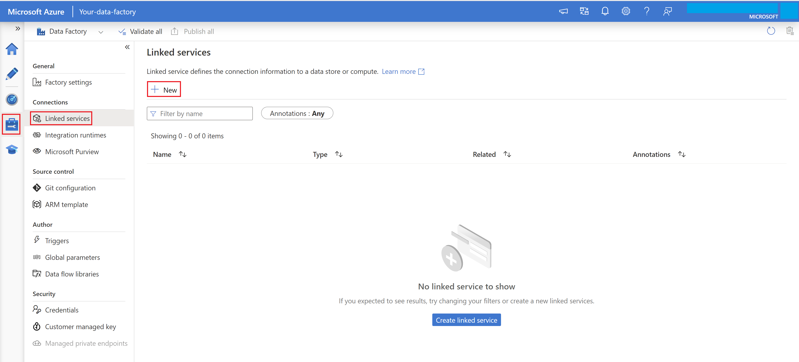
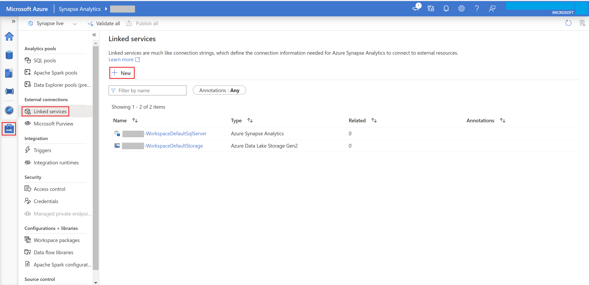

# Use GitHub to read Common Data Model entity references

[!INCLUDE[appliesto-adf-asa-md](includes/appliesto-adf-asa-md.md)]

The GitHub connector in Azure Data Factory and Synapse Analytics pipelines is only used to receive the entity reference schema for the [Common Data Model](format-common-data-model.md) format in mapping data flow.

## Create a linked service to GitHub using UI

Use the following steps to create a linked service to GitHub in the Azure portal UI.

1. 1. Browse to the Manage tab in your Azure Data Factory or Synapse workspace and select Linked Services, then click New:

   # [Azure Data Factory](#tab/data-factory)
   
   # [Azure Synapse](#tab/synapse-analytics)
   
2. Search for GitHub and select the GitHub connector.

   :::image type="content" source="media/connector-github/github-connector.png" alt-text="Screenshot of the GitHub connector.":::    

1. Configure the service details, test the connection, and create the new linked service.

   :::image type="content" source="media/connector-github/configure-github-linked-service.png" alt-text="Screenshot of linked service configuration for GitHub.":::

## Linked service properties

The following properties are supported for the GitHub linked service.

| Property | Description | Required |
|:--- |:--- |:--- |
| type | The type property must be set to **GitHub**. | yes
| userName | GitHub username | yes |
| password | GitHub password | yes |

## Next steps

Create a [source dataset](data-flow-source.md) in mapping data flow.