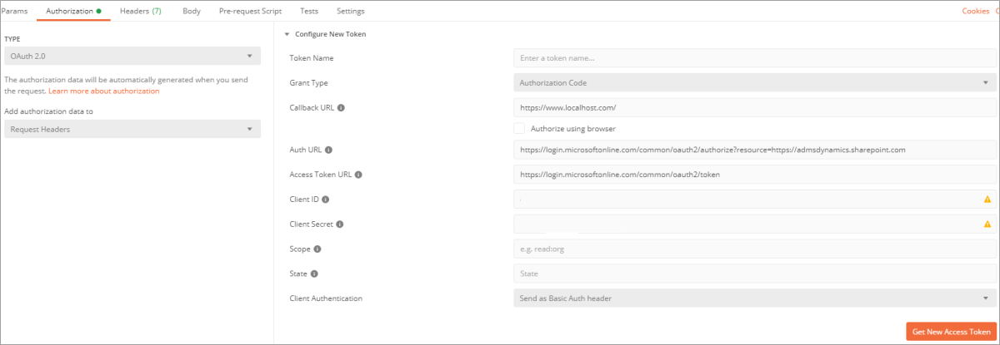
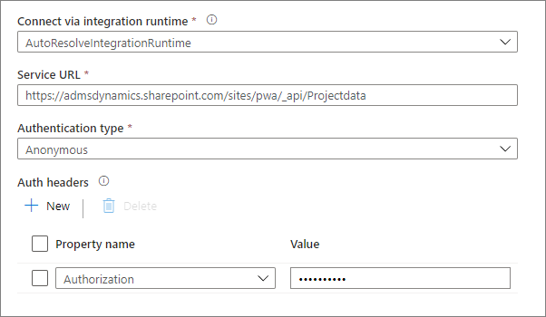
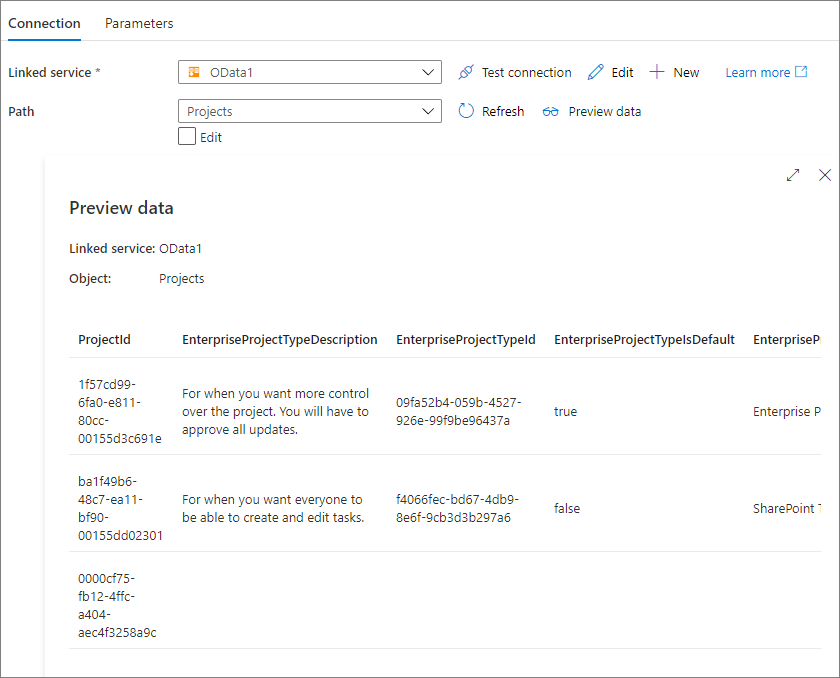

# Copy data from an OData source by using Azure Data Factory
[!INCLUDE[appliesto-adf-asa-md](includes/appliesto-adf-asa-md.md)]

> [!div class="op_single_selector" title1="Select the version of Data Factory service you are using:"]
> * [Version 1](v1/data-factory-odata-connector.md)
> * [Current version](connector-odata.md)

This article outlines how to use Copy Activity in Azure Data Factory to copy data from an OData source. The article builds on [Copy Activity in Azure Data Factory](copy-activity-overview.md), which presents a general overview of Copy Activity.

## Supported capabilities

This OData connector is supported for the following activities:

- [Copy activity](copy-activity-overview.md) with [supported source/sink matrix](copy-activity-overview.md)
- [Lookup activity](control-flow-lookup-activity.md)

You can copy data from an OData source to any supported sink data store. For a list of data stores that Copy Activity supports as sources and sinks, see [Supported data stores and formats](copy-activity-overview.md#supported-data-stores-and-formats).

Specifically, this OData connector supports:

- OData version 3.0 and 4.0.
- Copying data by using one of the following authentications: **Anonymous**, **Basic**, **Windows**, and **AAD service principal**.

## Prerequisites

[!INCLUDE [data-factory-v2-integration-runtime-requirements](../../includes/data-factory-v2-integration-runtime-requirements.md)]

## Get started

[!INCLUDE [data-factory-v2-connector-get-started](../../includes/data-factory-v2-connector-get-started.md)]

The following sections provide details about properties you can use to define Data Factory entities that are specific to an OData connector.

## Linked service properties

The following properties are supported for an OData linked service:

| Property | Description | Required |
|:--- |:--- |:--- |
| type | The **type** property must be set to **OData**. |Yes |
| url | The root URL of the OData service. |Yes |
| authenticationType | The type of authentication used to connect to the OData source. Allowed values are **Anonymous**, **Basic**, **Windows**, and **AadServicePrincipal**. User-based OAuth isn't supported. You can additionally configure authentication headers in `authHeader` property.| Yes |
| authHeaders | Additional HTTP request headers for authentication.<br/> For example, to use API key authentication, you can select authentication type as “Anonymous” and specify API key in the header. | No |
| userName | Specify **userName** if you use Basic or Windows authentication. | No |
| password | Specify **password** for the user account you specified for **userName**. Mark this field as a **SecureString** type to store it securely in Data Factory. You also can [reference a secret stored in Azure Key Vault](store-credentials-in-key-vault.md). | No |
| servicePrincipalId | Specify the Azure Active Directory application's client ID. | No |
| aadServicePrincipalCredentialType | Specify the credential type to use for service principal authentication. Allowed values are: `ServicePrincipalKey` or `ServicePrincipalCert`. | No |
| servicePrincipalKey | Specify the Azure Active Directory application's key. Mark this field as a **SecureString** to store it securely in Data Factory, or [reference a secret stored in Azure Key Vault](store-credentials-in-key-vault.md). | No |
| servicePrincipalEmbeddedCert | Specify the base64 encoded certificate of your application registered in Azure Active Directory. Mark this field as a **SecureString** to store it securely in Data Factory, or [reference a secret stored in Azure Key Vault](store-credentials-in-key-vault.md). | No |
| servicePrincipalEmbeddedCertPassword | Specify the password of your certificate if your certificate is secured with a password. Mark this field as a **SecureString** to store it securely in Data Factory, or [reference a secret stored in Azure Key Vault](store-credentials-in-key-vault.md).  | No|
| tenant | Specify the tenant information (domain name or tenant ID) under which your application resides. Retrieve it by hovering the mouse in the top-right corner of the Azure portal. | No |
| aadResourceId | Specify the AAD resource you are requesting for authorization.| No |
| azureCloudType | For service principal authentication, specify the type of Azure cloud environment to which your AAD application is registered. <br/> Allowed values are **AzurePublic**, **AzureChina**, **AzureUsGovernment**, and **AzureGermany**. By default, the data factory's cloud environment is used. | No |
| connectVia | The [Integration Runtime](concepts-integration-runtime.md) to use to connect to the data store. Learn more from [Prerequisites](#prerequisites) section. If not specified, the default Azure Integration Runtime is used. |No |

**Example 1: Using Anonymous authentication**

```json
{
    "name": "ODataLinkedService",
    "properties": {
        "type": "OData",
        "typeProperties": {
            "url": "https://services.odata.org/OData/OData.svc",
            "authenticationType": "Anonymous"
        },
        "connectVia": {
            "referenceName": "<name of Integration Runtime>",
            "type": "IntegrationRuntimeReference"
        }
    }
}
```

**Example 2: Using Basic authentication**

```json
{
    "name": "ODataLinkedService",
    "properties": {
        "type": "OData",
        "typeProperties": {
            "url": "<endpoint of OData source>",
            "authenticationType": "Basic",
            "userName": "<user name>",
            "password": {
                "type": "SecureString",
                "value": "<password>"
            }
        },
        "connectVia": {
            "referenceName": "<name of Integration Runtime>",
            "type": "IntegrationRuntimeReference"
        }
    }
}
```

**Example 3: Using Windows authentication**

```json
{
    "name": "ODataLinkedService",
    "properties": {
        "type": "OData",
        "typeProperties": {
            "url": "<endpoint of OData source>",
            "authenticationType": "Windows",
            "userName": "<domain>\\<user>",
            "password": {
                "type": "SecureString",
                "value": "<password>"
            }
        },
        "connectVia": {
            "referenceName": "<name of Integration Runtime>",
            "type": "IntegrationRuntimeReference"
        }
    }
}
```

**Example 4: Using service principal key authentication**

```json
{
    "name": "ODataLinkedService",
    "properties": {
        "type": "OData",
        "typeProperties": {
            "url": "<endpoint of OData source>",
            "authenticationType": "AadServicePrincipal",
            "servicePrincipalId": "<service principal id>",
            "aadServicePrincipalCredentialType": "ServicePrincipalKey",
            "servicePrincipalKey": {
                "type": "SecureString",
                "value": "<service principal key>"
            },
            "tenant": "<tenant info, e.g. microsoft.onmicrosoft.com>",
            "aadResourceId": "<AAD resource URL>"
        }
    },
    "connectVia": {
        "referenceName": "<name of Integration Runtime>",
        "type": "IntegrationRuntimeReference"
    }
}
```

**Example 5: Using service principal cert authentication**

```json
{
    "name": "ODataLinkedService",
    "properties": {
        "type": "OData",
        "typeProperties": {
            "url": "<endpoint of OData source>",
            "authenticationType": "AadServicePrincipal",
            "servicePrincipalId": "<service principal id>",
            "aadServicePrincipalCredentialType": "ServicePrincipalCert",
            "servicePrincipalEmbeddedCert": { 
                "type": "SecureString", 
                "value": "<base64 encoded string of (.pfx) certificate data>"
            },
            "servicePrincipalEmbeddedCertPassword": { 
                "type": "SecureString", 
                "value": "<password of your certificate>"
            },
            "tenant": "<tenant info, e.g. microsoft.onmicrosoft.com>",
            "aadResourceId": "<AAD resource e.g. https://tenant.sharepoint.com>"
        }
    },
    "connectVia": {
        "referenceName": "<name of Integration Runtime>",
        "type": "IntegrationRuntimeReference"
    }
}
```

**Example 6: Using API key authentication**

```json
{
    "name": "ODataLinkedService",
    "properties": {
        "type": "OData",
        "typeProperties": {
            "url": "<endpoint of OData source>",
            "authenticationType": "Anonymous",
            "authHeader": {
                "APIKey": {
                    "type": "SecureString",
                    "value": "<API key>"
                }
            }
        },
        "connectVia": {
            "referenceName": "<name of Integration Runtime>",
            "type": "IntegrationRuntimeReference"
        }
    }
}
```

## Dataset properties

This section provides a list of properties that the OData dataset supports.

For a full list of sections and properties that are available for defining datasets, see [Datasets and linked services](concepts-datasets-linked-services.md). 

To copy data from OData, set the **type** property of the dataset to **ODataResource**. The following properties are supported:

| Property | Description | Required |
|:--- |:--- |:--- |
| type | The **type** property of the dataset must be set to **ODataResource**. | Yes |
| path | The path to the OData resource. | Yes |

**Example**

```json
{
    "name": "ODataDataset",
    "properties":
    {
        "type": "ODataResource",
        "schema": [],
        "linkedServiceName": {
            "referenceName": "<OData linked service name>",
            "type": "LinkedServiceReference"
        },
        "typeProperties":
        {
            "path": "Products"
        }
    }
}
```

## Copy Activity properties

This section provides a list of properties that the OData source supports.

For a full list of sections and properties that are available for defining activities, see [Pipelines](concepts-pipelines-activities.md). 

### OData as source

To copy data from OData, the following properties are supported in the Copy Activity **source** section:

| Property | Description | Required |
|:--- |:--- |:--- |
| type | The **type** property of the Copy Activity source must be set to **ODataSource**. | Yes |
| query | OData query options for filtering data. Example: `"$select=Name,Description&$top=5"`.<br/><br/>**Note**: The OData connector copies data from the combined URL: `[URL specified in linked service]/[path specified in dataset]?[query specified in copy activity source]`. For more information, see [OData URL components](https://www.odata.org/documentation/odata-version-3-0/url-conventions/). | No |
| httpRequestTimeout | The timeout (the **TimeSpan** value) for the HTTP request to get a response. This value is the timeout to get a response, not the timeout to read response data. If not specified, the default value is **00:30:00** (30 minutes). | No |

**Example**

```json
"activities":[
    {
        "name": "CopyFromOData",
        "type": "Copy",
        "inputs": [
            {
                "referenceName": "<OData input dataset name>",
                "type": "DatasetReference"
            }
        ],
        "outputs": [
            {
                "referenceName": "<output dataset name>",
                "type": "DatasetReference"
            }
        ],
        "typeProperties": {
            "source": {
                "type": "ODataSource",
                "query": "$select=Name,Description&$top=5"
            },
            "sink": {
                "type": "<sink type>"
            }
        }
    }
]
```

If you were using `RelationalSource` typed source, it is still supported as-is, while you are suggested to use the new one going forward.

## Data type mapping for OData

When you copy data from OData, the following mappings are used between OData data types and Azure Data Factory interim data types. To learn how Copy Activity maps the source schema and data type to the sink, see [Schema and data type mappings](copy-activity-schema-and-type-mapping.md).

| OData data type | Data Factory interim data type |
|:--- |:--- |
| Edm.Binary | Byte[] |
| Edm.Boolean | Bool |
| Edm.Byte | Byte[] |
| Edm.DateTime | DateTime |
| Edm.Decimal | Decimal |
| Edm.Double | Double |
| Edm.Single | Single |
| Edm.Guid | Guid |
| Edm.Int16 | Int16 |
| Edm.Int32 | Int32 |
| Edm.Int64 | Int64 |
| Edm.SByte | Int16 |
| Edm.String | String |
| Edm.Time | TimeSpan |
| Edm.DateTimeOffset | DateTimeOffset |

> [!NOTE]
> OData complex data types (such as **Object**) aren't supported.

## Copy data from Project Online

To copy data from Project Online, you can use the OData connector and an access token obtained from tools like Postman.

> [!CAUTION]
> The access token expires in 1 hour by default, you need to get a new access token when it expires.

1. Use **Postman** to get the access token:

   1. Navigate to **Authorization** tab on the Postman Website.
   1. In the **Type** box, select **OAuth 2.0**, and in the **Add authorization data to** box, select **Request Headers**.
   1. Fill the following information in the **Configure New Token** page to get a new access token: 
      - **Grant type**: Select **Authorization Code**.
      - **Callback URL**: Enter `https://www.localhost.com/`. 
      - **Auth URL**: Enter `https://login.microsoftonline.com/common/oauth2/authorize?resource=https://<your tenant name>.sharepoint.com`. Replace `<your tenant name>` with your own tenant name. 
      - **Access Token URL**: Enter `https://login.microsoftonline.com/common/oauth2/token`.
      - **Client ID**: Enter your AAD service principal ID.
      - **Client Secret**: Enter your service principal secret.
      - **Client Authentication**: Select **Send as Basic Auth header**.
     
   1. You will be asked to login with your username and password.
   1. Once you get your access token, please copy and save it for the next step.
   
    [](./media/connector-odata/odata-project-online-postman-accesstoken-expanded.png#lightbox)

2. Create the OData linked service:
     - **Service URL**: Enter `https://<your tenant name>.sharepoint.com/sites/pwa/_api/Projectdata`. Replace `<your tenant name>` with your own tenant name. 
     - **Authentication type**: Select **Anonymous**.
     - **Auth headers**:
        - **Property name**: Choose **Authorization**.
        - **Value**: Enter the **access token** copied from step1.
     - Test the linked service.

    

3. Create the OData dataset:
     - Create the dataset with the OData linked service created in step2.
     - Preview data.
 
    
 


## Lookup activity properties

To learn details about the properties, check [Lookup activity](control-flow-lookup-activity.md).

## Next steps

For a list of data stores that Copy Activity supports as sources and sinks in Azure Data Factory, see [Supported data stores and formats](copy-activity-overview.md#supported-data-stores-and-formats).