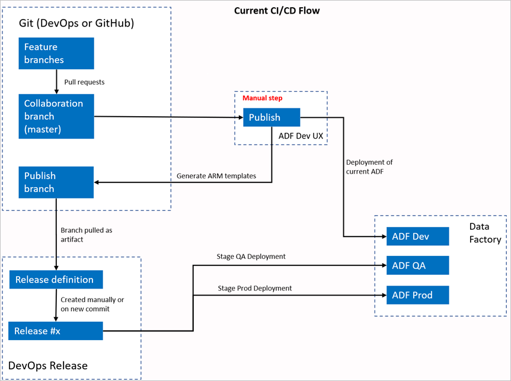
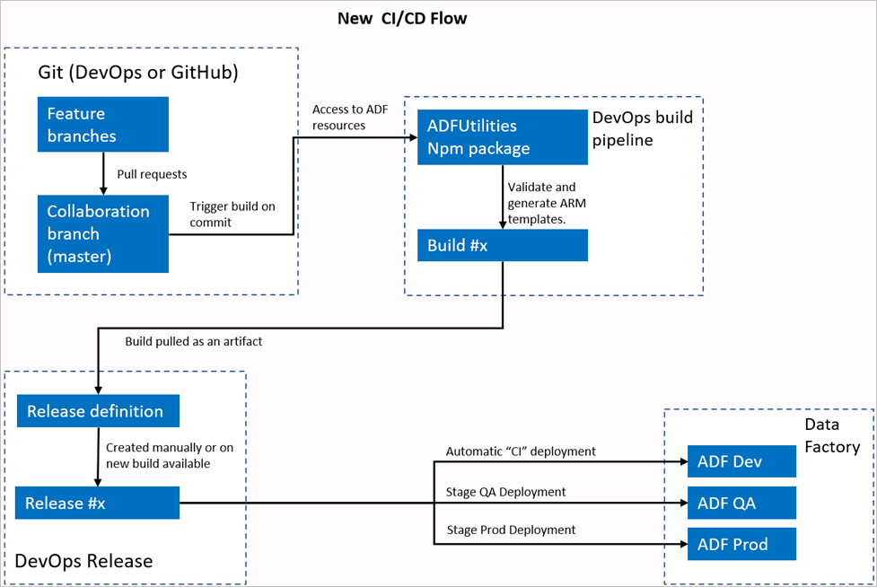
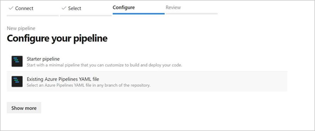

# Automated publishing for continuous integration and delivery

[!INCLUDE[appliesto-adf-xxx-md](includes/appliesto-adf-xxx-md.md)]

## Overview

Continuous integration is the practice of testing each change made to your codebase automatically. As early as possible, continuous delivery follows the testing that happens during continuous integration and pushes changes to a staging or production system.

In Azure Data Factory, continuous integration and delivery (CI/CD) means moving Data Factory pipelines from one environment, such as development, test, and production, to another. Data Factory uses [Azure Resource Manager templates (ARM templates)](../azure-resource-manager/templates/overview.md) to store the configuration of your various Data Factory entities, such as pipelines, datasets, and data flows.

There are two suggested methods to promote a data factory to another environment:

- Automated deployment using Data Factory's integration with [Azure Pipelines](/azure/devops/pipelines/get-started/what-is-azure-pipelines).
- Manually uploading an ARM template by using Data Factory user experience integration with Azure Resource Manager.

For more information, see [Continuous integration and delivery in Azure Data Factory](continuous-integration-deployment.md).

In this article, we focus on the continuous deployment improvements and the automated publish feature for CI/CD.

## Continuous deployment improvements

The automated publish feature takes the **Validate all** and **Export ARM template** features from the Data Factory user experience and makes the logic consumable via a publicly available npm package [@microsoft/azure-data-factory-utilities](https://www.npmjs.com/package/@microsoft/azure-data-factory-utilities). For this reason, you can programmatically trigger these actions instead of having to go to the Data Factory UI and select a button manually. This capability will give your CI/CD pipelines a truer continuous integration experience.

### Current CI/CD flow

1. Each user makes changes in their private branches.
1. Push to master isn't allowed. Users must create a pull request to make changes.
1. Users must load the Data Factory UI and select **Publish** to deploy changes to Data Factory and generate the ARM templates in the publish branch.
1. The DevOps Release pipeline is configured to create a new release and deploy the ARM template each time a new change is pushed to the publish branch.



### Manual step

In the current CI/CD flow, the user experience is the intermediary to create the ARM template. As a result, a user must go to the Data Factory UI and manually select **Publish** to start the ARM template generation and drop it in the publish branch.

### The new CI/CD flow

1. Each user makes changes in their private branches.
1. Push to master isn't allowed. Users must create a pull request to make changes.
1. The Azure DevOps pipeline build is triggered every time a new commit is made to master. It validates the resources and generates an ARM template as an artifact if validation succeeds.
1. The DevOps Release pipeline is configured to create a new release and deploy the ARM template each time a new build is available.



### What changed?

- We now have a build process that uses a DevOps build pipeline.
- The build pipeline uses the ADFUtilities NPM package, which will validate all the resources and generate the ARM templates. These templates can be single and linked.
- The build pipeline is responsible for validating Data Factory resources and generating the ARM template instead of the Data Factory UI (**Publish** button).
- The DevOps release definition will now consume this new build pipeline instead of the Git artifact.

> [!NOTE]
> You can continue to use the existing mechanism, which is the `adf_publish` branch, or you can use the new flow. Both are supported.

## Package overview

There are two commands currently available in the package:

- Export ARM template
- Validate

### Export ARM template

Run `npm run start export <rootFolder> <factoryId> [outputFolder]` to export the ARM template by using the resources of a given folder. This command also runs a validation check prior to generating the ARM template. Here's an example:

```
npm run start export C:\DataFactories\DevDataFactory /subscriptions/xxxxxxxx-xxxx-xxxx-xxxx-xxxxxxxxxxxx/resourceGroups/testResourceGroup/providers/Microsoft.DataFactory/factories/DevDataFactory ArmTemplateOutput
```

- `RootFolder` is a mandatory field that represents where the Data Factory resources are located.
- `FactoryId` is a mandatory field that represents the Data Factory resource ID in the format `/subscriptions/<subId>/resourceGroups/<rgName>/providers/Microsoft.DataFactory/factories/<dfName>`.
- `OutputFolder` is an optional parameter that specifies the relative path to save the generated ARM template.
 
> [!NOTE]
> The ARM template generated isn't published to the live version of the factory. Deployment should be done by using a CI/CD pipeline.
 
### Validate

Run `npm run start validate <rootFolder> <factoryId>` to validate all the resources of a given folder. Here's an example:

```
npm run start validate C:\DataFactories\DevDataFactory /subscriptions/xxxxxxxx-xxxx-xxxx-xxxx-xxxxxxxxxxxx/resourceGroups/testResourceGroup/providers/Microsoft.DataFactory/factories/DevDataFactory
```

- `RootFolder` is a mandatory field that represents where the Data Factory resources are located.
- `FactoryId` is a mandatory field that represents the Data Factory resource ID in the format `/subscriptions/<subId>/resourceGroups/<rgName>/providers/Microsoft.DataFactory/factories/<dfName>`.

## Create an Azure pipeline

While npm packages can be consumed in various ways, one of the primary benefits is being consumed via an [Azure Pipeline](https://nam06.safelinks.protection.outlook.com/?url=https:%2F%2Fdocs.microsoft.com%2F%2Fazure%2Fdevops%2Fpipelines%2Fget-started%2Fwhat-is-azure-pipelines%3Fview%3Dazure-devops%23:~:text%3DAzure%2520Pipelines%2520is%2520a%2520cloud%2Cit%2520available%2520to%2520other%2520users.%26text%3DAzure%2520Pipelines%2520combines%2520continuous%2520integration%2Cship%2520it%2520to%2520any%2520target.&data=04%7C01%7Cabnarain%40microsoft.com%7C5f064c3d5b7049db540708d89564b0bc%7C72f988bf86f141af91ab2d7cd011db47%7C1%7C1%7C637423607000268277%7CUnknown%7CTWFpbGZsb3d8eyJWIjoiMC4wLjAwMDAiLCJQIjoiV2luMzIiLCJBTiI6Ik1haWwiLCJXVCI6Mn0%3D%7C1000&sdata=jo%2BkIvSBiz6f%2B7kmgqDN27TUWc6YoDanOxL9oraAbmA%3D&reserved=0). On each merge into your collaboration branch, a pipeline can be triggered that first validates all of the code and then exports the ARM template into a [build artifact](https://nam06.safelinks.protection.outlook.com/?url=https%3A%2F%2Fdocs.microsoft.com%2F%2Fazure%2Fdevops%2Fpipelines%2Fartifacts%2Fbuild-artifacts%3Fview%3Dazure-devops%26tabs%3Dyaml%23how-do-i-consume-artifacts&data=04%7C01%7Cabnarain%40microsoft.com%7C5f064c3d5b7049db540708d89564b0bc%7C72f988bf86f141af91ab2d7cd011db47%7C1%7C1%7C637423607000278113%7CUnknown%7CTWFpbGZsb3d8eyJWIjoiMC4wLjAwMDAiLCJQIjoiV2luMzIiLCJBTiI6Ik1haWwiLCJXVCI6Mn0%3D%7C1000&sdata=dN3t%2BF%2Fzbec4F28hJqigGANvvedQoQ6npzegTAwTp1A%3D&reserved=0) that can be consumed by a release pipeline. How it differs from the current CI/CD process is that you will *point your release pipeline at this artifact instead of the existing `adf_publish` branch*.

Follow these steps to get started:

1.	Open an Azure DevOps project, and go to **Pipelines**. Select **New Pipeline**.

    
    
1.	Select the repository where you want to save your pipeline YAML script. We recommend saving it in a build folder in the same repository of your Data Factory resources. Ensure there's a *package.json* file in the repository that contains the package name, as shown in the following example:

    ```json
    {
        "scripts":{
            "build":"node node_modules/@microsoft/azure-data-factory-utilities/lib/index"
        },
        "dependencies":{
            "@microsoft/azure-data-factory-utilities":"^0.1.3"
        }
    } 
    ```
    
1.	Select **Starter pipeline**. If you've uploaded or merged the YAML file, as shown in the following example, you can also point directly at that and edit it.

    

    ```yaml
    # Sample YAML file to validate and export an ARM template into a build artifact
    # Requires a package.json file located in the target repository
    
    trigger:
    - main #collaboration branch
    
    pool:
      vmImage: 'ubuntu-latest'
    
    steps:
    
    # Installs Node and the npm packages saved in your package.json file in the build
    
    - task: NodeTool@0
      inputs:
        versionSpec: '10.x'
      displayName: 'Install Node.js'
    
    - task: Npm@1
      inputs:
        command: 'install'
        verbose: true
      displayName: 'Install npm package'
    
    # Validates all of the Data Factory resources in the repository. You'll get the same validation errors as when "Validate All" is selected.
    # Enter the appropriate subscription and name for the source factory.
    
    - task: Npm@1
      inputs:
        command: 'custom'
        customCommand: 'run build validate $(Build.Repository.LocalPath) /subscriptions/xxxxxxxx-xxxx-xxxx-xxxx-xxxxxxxxxxxx/resourceGroups/testResourceGroup/providers/Microsoft.DataFactory/factories/yourFactoryName'
      displayName: 'Validate'
    
    # Validate and then generate the ARM template into the destination folder, which is the same as selecting "Publish" from the UX.
    # The ARM template generated isn't published to the live version of the factory. Deployment should be done by using a CI/CD pipeline. 
    
    - task: Npm@1
      inputs:
        command: 'custom'
        customCommand: 'run build export $(Build.Repository.LocalPath) /subscriptions/xxxxxxxx-xxxx-xxxx-xxxx-xxxxxxxxxxxx/resourceGroups/testResourceGroup/providers/Microsoft.DataFactory/factories/yourFactoryName "ArmTemplate"'
      displayName: 'Validate and Generate ARM template'
    
    # Publish the artifact to be used as a source for a release pipeline.
    
    - task: PublishPipelineArtifact@1
      inputs:
        targetPath: '$(Build.Repository.LocalPath)/ArmTemplate'
        artifact: 'ArmTemplates'
        publishLocation: 'pipeline'
    ```

1.	Enter your YAML code. We recommend that you use the YAML file as a starting point.
1.	Save and run. If you used the YAML, it gets triggered every time the main branch is updated.

## Next steps

Learn more information about continuous integration and delivery in Data Factory:

- [Continuous integration and delivery in Azure Data Factory](continuous-integration-deployment.md).
