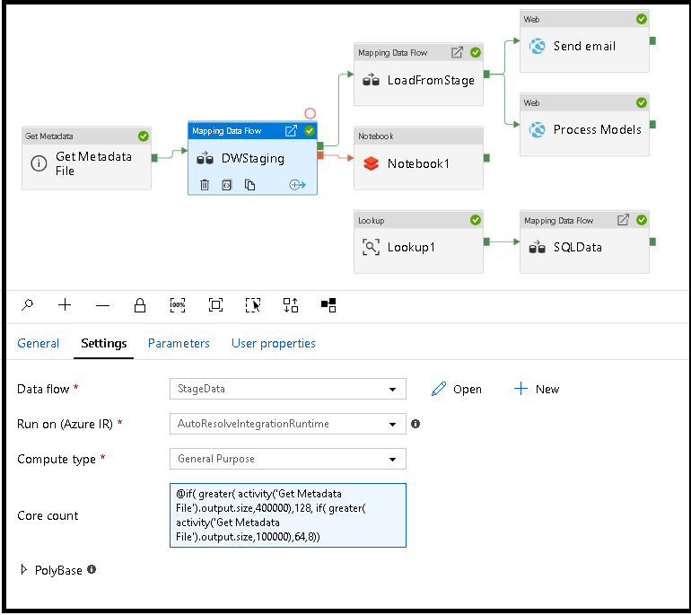
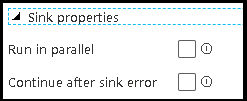
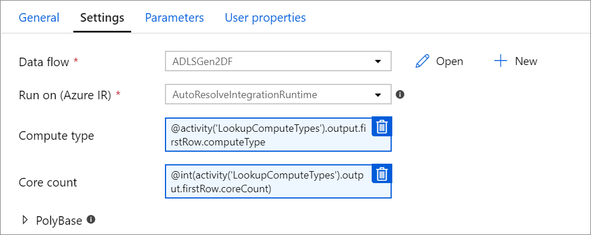

# Data Flow activity in Azure Data Factory

[!INCLUDE[appliesto-adf-asa-md](includes/appliesto-adf-asa-md.md)]

Use the Data Flow activity to transform and move data via mapping data flows. If you're new to data flows, see [Mapping Data Flow overview](concepts-data-flow-overview.md)

## Syntax

```json
{
    "name": "MyDataFlowActivity",
    "type": "ExecuteDataFlow",
    "typeProperties": {
      "dataflow": {
         "referenceName": "MyDataFlow",
         "type": "DataFlowReference"
      },
      "compute": {
         "coreCount": 8,
         "computeType": "General"
      },
      "traceLevel": "Fine",
      "runConcurrently": true,
      "continueOnError": true,      
      "staging": {
          "linkedService": {
              "referenceName": "MyStagingLinkedService",
              "type": "LinkedServiceReference"
          },
          "folderPath": "my-container/my-folder"
      },
      "integrationRuntime": {
          "referenceName": "MyDataFlowIntegrationRuntime",
          "type": "IntegrationRuntimeReference"
      }
}

```

## Type properties

Property | Description | Allowed values | Required
-------- | ----------- | -------------- | --------
dataflow | The reference to the Data Flow being executed | DataFlowReference | Yes
integrationRuntime | The compute environment the data flow runs on. If not specified, the auto-resolve Azure integration runtime will be used. | IntegrationRuntimeReference | No
compute.coreCount | The number of cores used in the spark cluster. Can only be specified if the auto-resolve Azure Integration runtime is used | 8, 16, 32, 48, 80, 144, 272 | No
compute.computeType | The type of compute used in the spark cluster. Can only be specified if the auto-resolve Azure Integration runtime is used | "General", "ComputeOptimized", "MemoryOptimized" | No
staging.linkedService | If you're using an Azure Synapse Analytics source or sink, specify the storage account used for PolyBase staging.<br/><br/>If your Azure Storage is configured with VNet service endpoint, you must use managed identity authentication with "allow trusted Microsoft service" enabled on storage account, refer to [Impact of using VNet Service Endpoints with Azure storage](../azure-sql/database/vnet-service-endpoint-rule-overview.md#impact-of-using-virtual-network-service-endpoints-with-azure-storage). Also learn the needed configurations for [Azure Blob](connector-azure-blob-storage.md#managed-identity) and [Azure Data Lake Storage Gen2](connector-azure-data-lake-storage.md#managed-identity) respectively.<br/> | LinkedServiceReference | Only if the data flow reads or writes to an Azure Synapse Analytics
staging.folderPath | If you're using an Azure Synapse Analytics source or sink, the folder path in blob storage account used for PolyBase staging | String | Only if the data flow reads or writes to Azure Synapse Analytics
traceLevel | Set logging level of your data flow activity execution | Fine, Coarse, None | No


### Dynamically size data flow compute at runtime

The Core Count and Compute Type properties can be set dynamically to adjust to the size of your incoming source data at runtime. Use pipeline activities like Lookup or Get Metadata in order to find the size of the source dataset data. Then, use Add Dynamic Content in the Data Flow activity properties.



[Here is a brief video tutorial explaining this technique](https://www.youtube.com/watch?v=jWSkJdtiJNM)

### Data Flow integration runtime

Choose which Integration Runtime to use for your Data Flow activity execution. By default, Data Factory will use the auto-resolve Azure Integration runtime with four worker cores. This IR has a general purpose compute type and runs in the same region as your factory. For operationalized pipelines, it is highly recommended that you create your own Azure Integration Runtimes that define specific regions, compute type, core counts, and TTL for your data flow activity execution.

A minimum compute type of General Purpose (compute optimized is not recommended for large workloads) with an 8+8 (16 total v-cores) configuration and a 10-minute is the minimum recommendation for most production workloads. By setting a small TTL, the Azure IR can maintain a warm cluster that will not incur the several minutes of start time for a cold cluster. You can speed up the execution of your data flows even more by select "Quick re-use" on the Azure IR data flow configurations. For more information, see [Azure integration runtime](concepts-integration-runtime.md).


> [!IMPORTANT]
> The Integration Runtime selection in the Data Flow activity only applies to *triggered executions* of your pipeline. Debugging your pipeline with data flows runs on the cluster specified in the debug session.

### PolyBase

If you're using an Azure Synapse Analytics as a sink or source, you must choose a staging location for your PolyBase batch load. PolyBase allows for batch loading in bulk instead of loading the data row-by-row. PolyBase drastically reduces the load time into Azure Synapse Analytics.

## Logging level

If you do not require every pipeline execution of your data flow activities to fully log all verbose telemetry logs, you can optionally set your logging level to "Basic" or "None". When executing your data flows in "Verbose" mode (default), you are requesting ADF to fully log activity at each individual partition level during your data transformation. This can be an expensive operation, so only enabling verbose when troubleshooting can improve your overall data flow and pipeline performance. "Basic" mode will only log transformation durations while "None" will only provide a summary of durations.


## Sink properties

The grouping feature in data flows allow you to both set the order of execution of your sinks as well as to group sinks together using the same group number. To help manage groups, you can ask ADF to run sinks, in the same group, in parallel. You can also set the sink group to continue even after one of the sinks encounters an error.

The default behavior of data flow sinks is to execute each sink sequentially, in a serial manner, and to fail the data flow when an error is encountered in the sink. Additionally, all sinks are defaulted to the same group unless you go into the data flow properties and set different priorities for the sinks.



## Parameterizing Data Flows

### Parameterized datasets

If your data flow uses parameterized datasets, set the parameter values in the **Settings** tab.


### Parameterized data flows

If your data flow is parameterized, set the dynamic values of the data flow parameters in the **Parameters** tab. You can use either the ADF pipeline expression language or the data flow expression language to assign dynamic or literal parameter values. For more information, see [Data Flow Parameters](parameters-data-flow.md).

### Parameterized compute properties.

You can parameterize the core count or compute type if you use the auto-resolve Azure Integration runtime and specify values for compute.coreCount and compute.computeType.



## Pipeline debug of Data Flow activity

To execute a debug pipeline run with a Data Flow activity, you must switch on data flow debug mode via the **Data Flow Debug** slider on the top bar. Debug mode lets you run the data flow against an active Spark cluster. For more information, see [Debug Mode](concepts-data-flow-debug-mode.md).


The debug pipeline runs against the active debug cluster, not the integration runtime environment specified in the Data Flow activity settings. You can choose the debug compute environment when starting up debug mode.

## Monitoring the Data Flow activity

The Data Flow activity has a special monitoring experience where you can view partitioning, stage time, and data lineage information. Open the monitoring pane via the eyeglasses icon under **Actions**. For more information, see [Monitoring Data Flows](concepts-data-flow-monitoring.md).

### Use Data Flow activity results in a subsequent activity

The data flow activity outputs metrics regarding the number of rows written to each sink and rows read from each source. These results are returned in the `output` section of the activity run result. The metrics returned are in the format of the below json.

``` json
{
    "runStatus": {
        "metrics": {
            "<your sink name1>": {
                "rowsWritten": <number of rows written>,
                "sinkProcessingTime": <sink processing time in ms>,
                "sources": {
                    "<your source name1>": {
                        "rowsRead": <number of rows read>
                    },
                    "<your source name2>": {
                        "rowsRead": <number of rows read>
                    },
                    ...
                }
            },
            "<your sink name2>": {
                ...
            },
            ...
        }
    }
}
```

For example, to get to number of rows written to a sink named 'sink1' in an activity named 'dataflowActivity', use `@activity('dataflowActivity').output.runStatus.metrics.sink1.rowsWritten`.

To get the number of rows read from a source named 'source1' that was used in that sink, use `@activity('dataflowActivity').output.runStatus.metrics.sink1.sources.source1.rowsRead`.

> [!NOTE]
> If a sink has zero rows written, it will not show up in metrics. Existence can be verified using the `contains` function. For example, `contains(activity('dataflowActivity').output.runStatus.metrics, 'sink1')` will check whether any rows were written to sink1.

## Next steps

See control flow activities supported by Data Factory: 

- [If Condition Activity](control-flow-if-condition-activity.md)
- [Execute Pipeline Activity](control-flow-execute-pipeline-activity.md)
- [For Each Activity](control-flow-for-each-activity.md)
- [Get Metadata Activity](control-flow-get-metadata-activity.md)
- [Lookup Activity](control-flow-lookup-activity.md)
- [Web Activity](control-flow-web-activity.md)
- [Until Activity](control-flow-until-activity.md)
