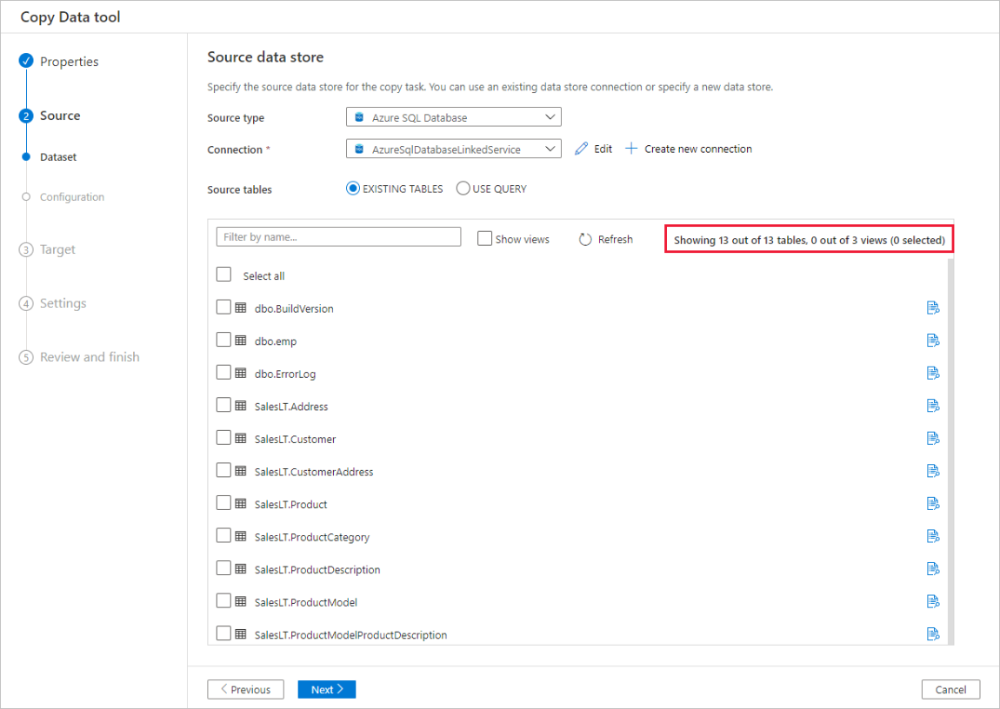
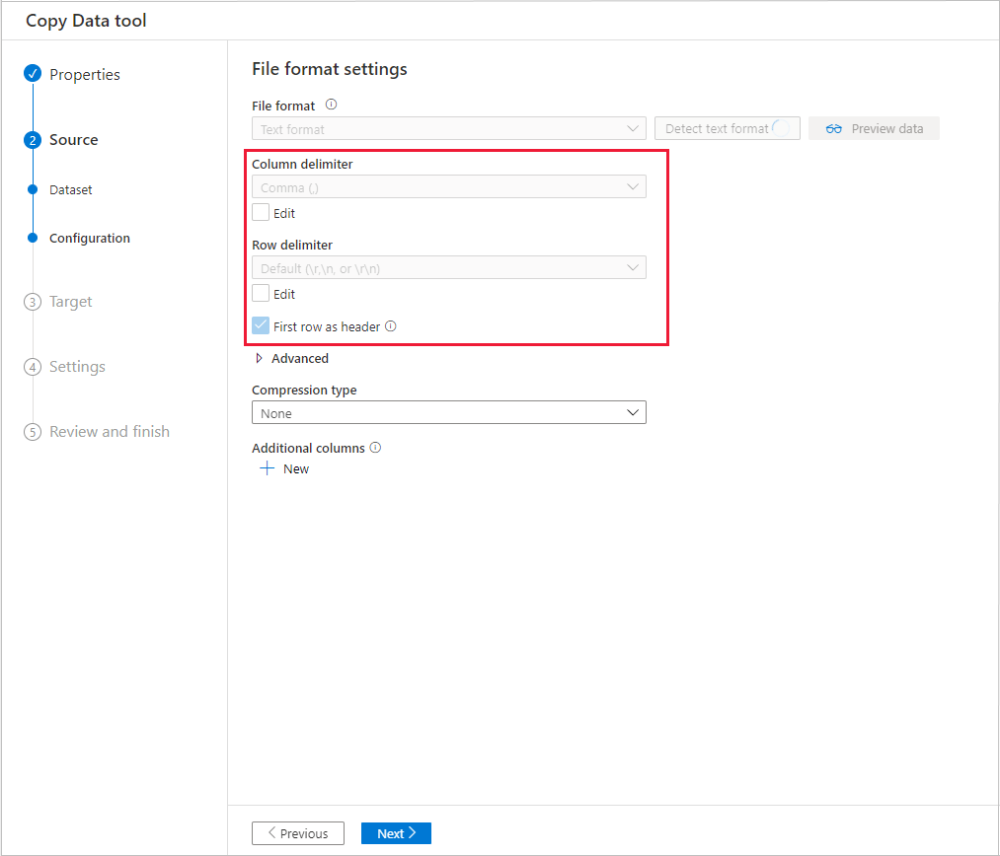
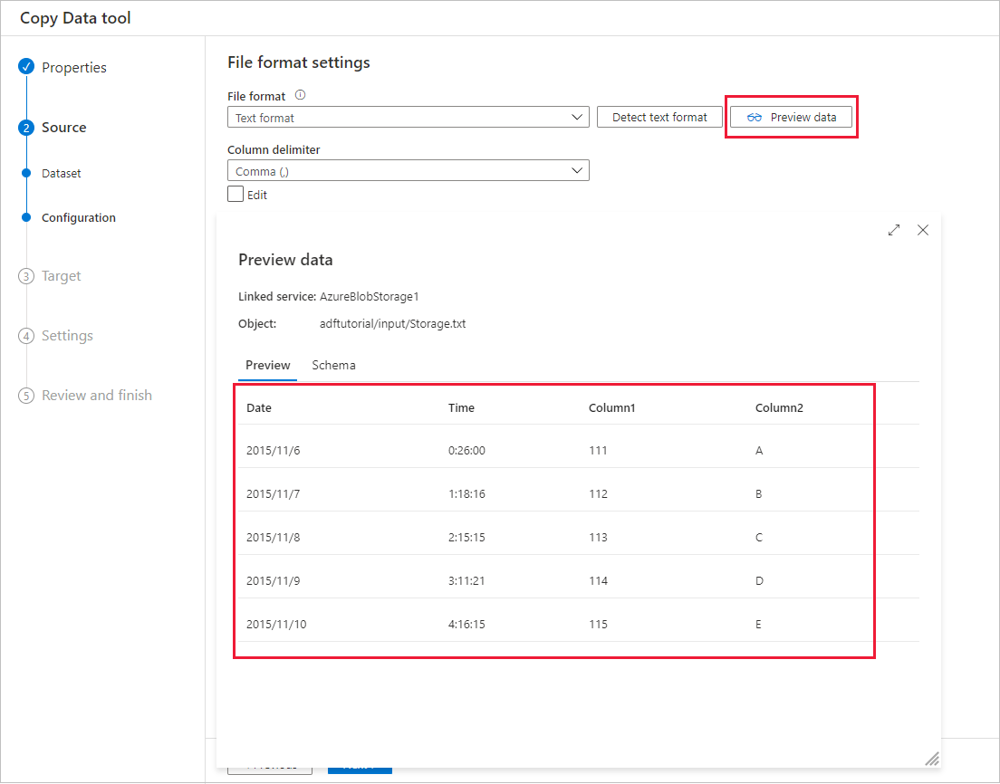
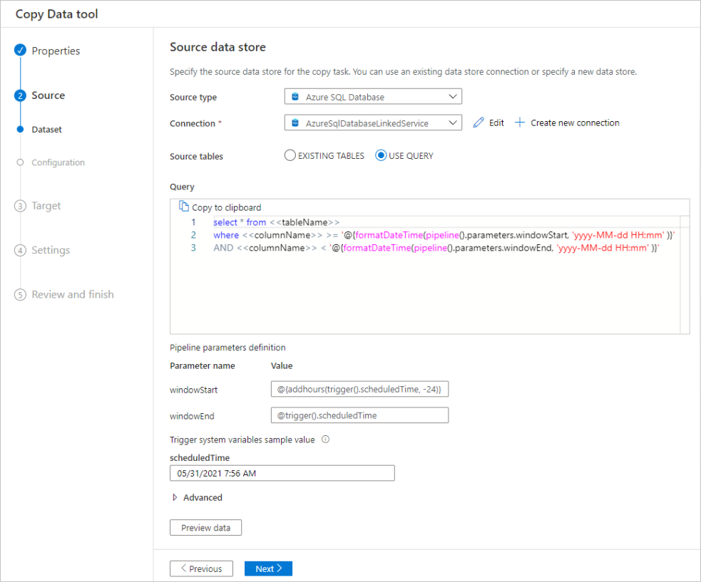
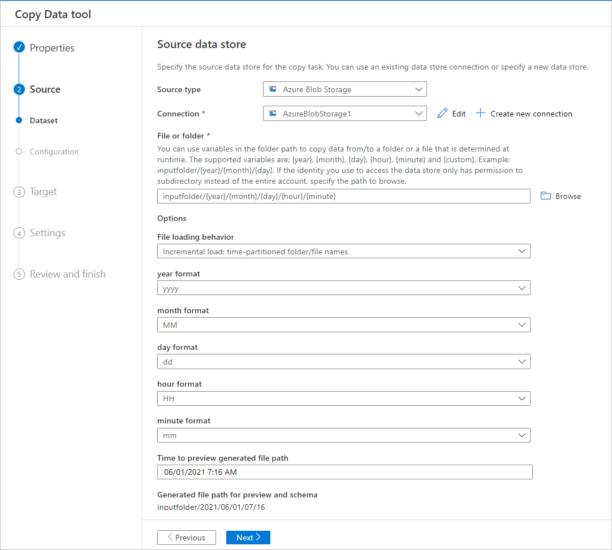
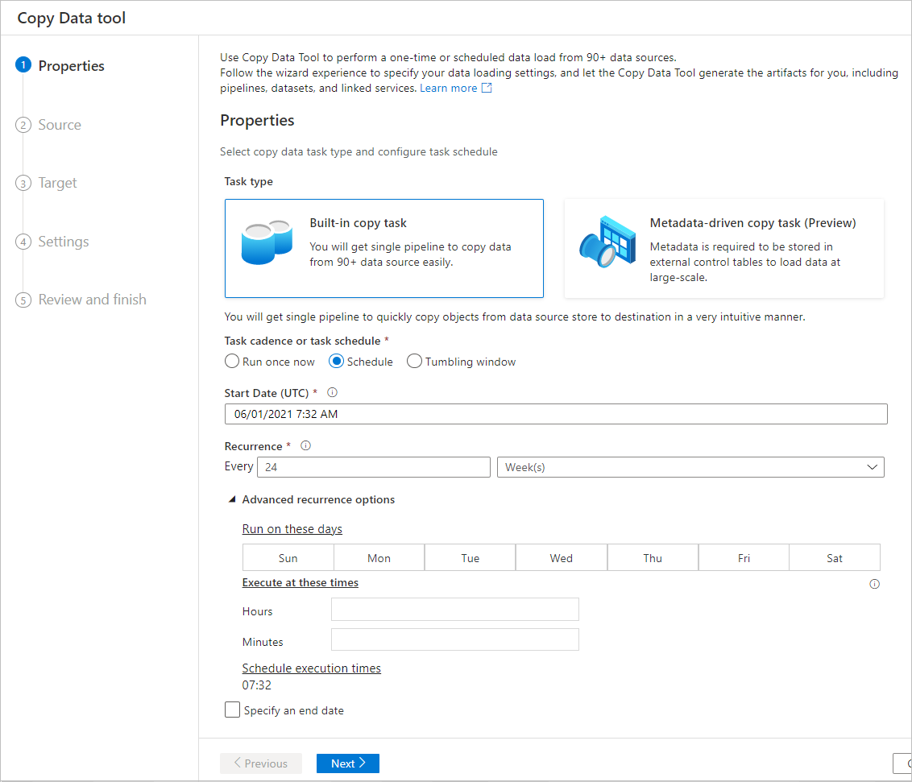

# Copy Data tool in Azure Data Factory and Synapse Analytics
[!INCLUDE[appliesto-adf-asa-md](includes/appliesto-adf-asa-md.md)]

The Copy Data tool eases and optimizes the process of ingesting data into a data lake, which is usually a first step in an end-to-end data integration scenario.  It saves time, especially when you use the service to ingest data from a data source for the first time. Some of the benefits of using this tool are:

- When using the Copy Data tool, you do not need understand service definitions for linked services, datasets, pipelines, activities, and triggers. 
- The flow of Copy Data tool is intuitive for loading data into a data lake. The tool automatically creates all the necessary resources to copy data from the selected source data store to the selected destination/sink data store. 
- The Copy Data tool helps you validate the data that is being ingested at the time of authoring, which helps you avoid any potential errors at the beginning itself.
- If you need to implement complex business logic to load data into a data lake, you can still edit the resources created by the Copy Data tool by using the per-activity authoring in the UI. 

The following table provides guidance on when to use the Copy Data tool vs. per-activity authoring in the UI: 

| Copy Data tool | Per activity (Copy activity) authoring |
| -------------- | -------------------------------------- |
| You want to easily build a data loading task without learning about entities (linked services, datasets, pipelines, etc.) | You want to implement complex and flexible logic for loading data into lake. |
| You want to quickly load a large number of data artifacts into a data lake. | You want to chain Copy activity with subsequent activities for cleansing or processing data. |

To start the Copy Data tool, click the **Ingest** tile on the home page of your the Data Factory or Synapse Studio UI.

# [Azure Data Factory](#tab/data-factory)
:::image type="content" source="./media/doc-common-process/get-started-page.png" alt-text="Screenshot that shows the home page - link to Copy Data tool.":::
# [Synapse Analytics](#tab/synapse-analytics)
:::image type="content" source="./media/doc-common-process/get-started-page-synapse.png" alt-text="Screenshot that shows the home page - link to Copy Data tool.":::

---
After you launch copy data tool, you will see two types of the tasks: one is **built-in copy task** and another is **metadata driven copy task**. The built-in copy task leads you to create a pipeline within five minutes to replicate data without learning about entities.  The metadata driven copy task to ease your journey of creating parameterized pipelines and external control table in order to manage to copy large amounts of objects (for example, thousands of tables) at scale. You can see more details in [metadata driven copy data](copy-data-tool-metadata-driven.md).

## Intuitive flow for loading data into a data lake
This tool allows you to easily move data from a wide variety of sources to destinations in minutes with an intuitive flow:  

1. Configure settings for the **source**.
2. Configure settings for the **destination**. 
3. Configure **advanced settings** for the copy operation such as column mapping, performance settings, and fault tolerance settings. 
4. Specify a **schedule** for the data loading task. 
5. Review **summary** of entities to be created. 
6. **Edit** the pipeline to update settings for the copy activity as needed. 

   The tool is designed with big data in mind from the start, with support for diverse data and object types. You can use it to move hundreds of folders, files, or tables. The tool supports automatic data preview, schema capture and automatic mapping, and data filtering as well.



## Automatic data preview
You can preview part of the data from the selected source data store, which allows you to validate the data that is being copied. In addition, if the source data is in a text file, the Copy Data tool parses the text file to automatically detect the row and column delimiters, and schema.



After the detection, select **Preview data**:



## Schema capture and automatic mapping
The schema of data source may not be same as the schema of data destination in many cases. In this scenario, you need to map columns from the source schema to columns from the destination schema.

The Copy Data tool monitors and learns your behavior when you are mapping columns between source and destination stores. After you pick one or a few columns from source data store, and map them to the destination schema, the Copy Data tool starts to analyze the pattern for column pairs you picked from both sides. Then, it applies the same pattern to the rest of the columns. Therefore, you see all the columns have been mapped to the destination in a way you want just after several clicks.  If you are not satisfied with the choice of column mapping provided by Copy Data tool, you can ignore it and continue with manually mapping the columns. Meanwhile, the Copy Data tool constantly learns and updates the pattern, and ultimately reaches the right pattern for the column mapping you want to achieve. 

> [!NOTE]
> When copying data from SQL Server or Azure SQL Database into Azure Synapse Analytics, if the table does not exist in the destination store, Copy Data tool supports creation of the table automatically by using the source schema. 

## Filter data
You can filter source data to select only the data that needs to be copied to the sink data store. Filtering reduces the volume of the data to be copied to the sink data store and therefore enhances the throughput of the copy operation. Copy Data tool provides a flexible way to filter data in a relational database by using the SQL query language, or files in an Azure blob folder. 

### Filter data in a database
The following screenshot shows a SQL query to filter the data.



### Filter data in an Azure blob folder
You can use variables in the folder path to copy data from a folder. The supported variables are: **{year}**, **{month}**, **{day}**, **{hour}**, and **{minute}**. For example: inputfolder/{year}/{month}/{day}. 

Suppose that you have input folders in the following format: 

```
2016/03/01/01
2016/03/01/02
2016/03/01/03
...
```

Click the **Browse** button for **File or folder**, browse to one of these folders (for example, 2016->03->01->02), and click **Choose**. You should see 2016/03/01/02 in the text box. 

Then, replace **2016** with **{year}**, **03** with **{month}**, **01** with **{day}**, and **02** with **{hour}**, and press the **Tab** key. When you select **Incremental load: time-partitioned folder/file names** in the **File loading behavior** section and you select **Schedule** or **Tumbling window** on the **Properties** page, you should see drop-down lists to select the format for these four variables:



The Copy Data tool generates parameters with expressions, functions, and system variables that can be used to represent {year}, {month}, {day}, {hour}, and {minute} when creating pipeline.

## Scheduling options
You can run the copy operation once or on a schedule (hourly, daily, and so on). These options can be used for the connectors across different environments, including on-premises, cloud, and local desktop. 

A one-time copy operation enables data movement from a source to a destination only once. It applies to data of any size and any supported format. The scheduled copy allows you to copy data on a recurrence that you specify. You can use rich settings (like retry, timeout, and alerts) to configure the scheduled copy.




## Next steps
Try these tutorials that use the Copy Data tool:

- [Quickstart: create a data factory using the Copy Data tool](quickstart-create-data-factory-copy-data-tool.md)
- [Tutorial: copy data in Azure using the Copy Data tool](tutorial-copy-data-tool.md) 
- [Tutorial: copy on-premises data to Azure using the Copy Data tool](tutorial-hybrid-copy-data-tool.md)
