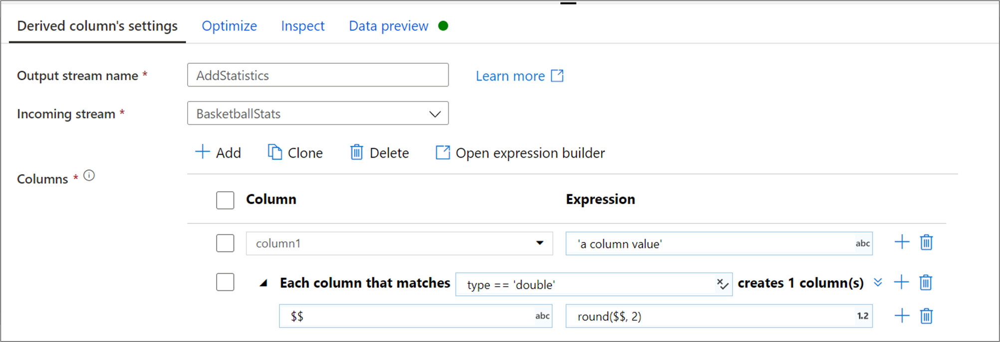
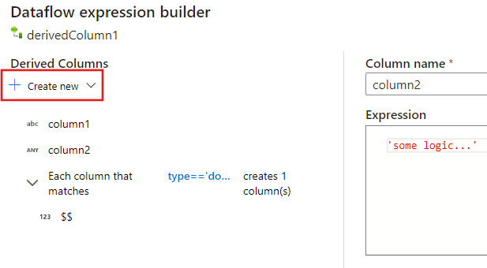
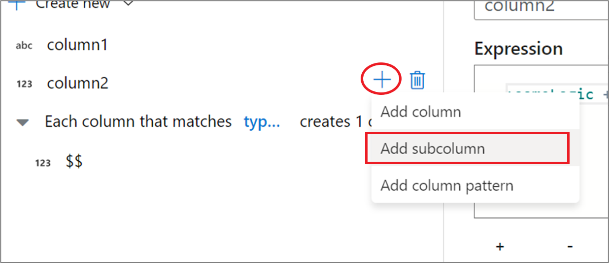
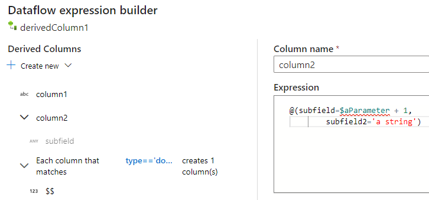
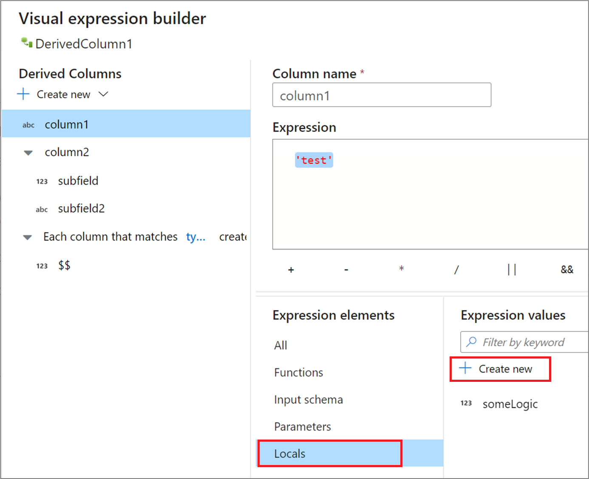
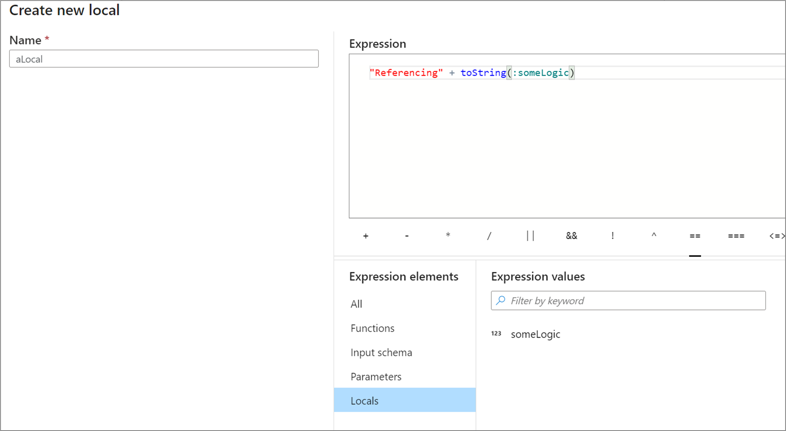
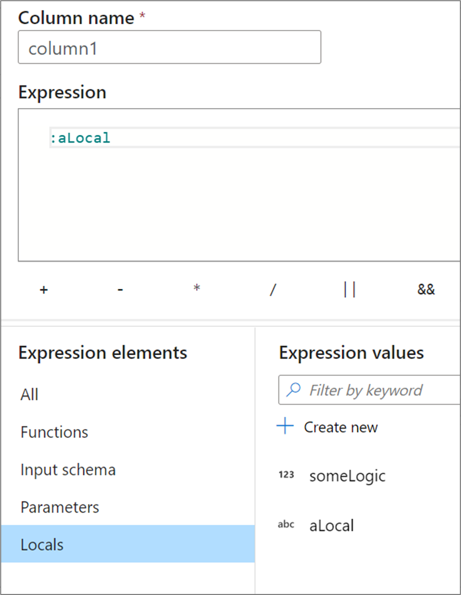

# Derived column transformation in mapping data flow

[!INCLUDE[appliesto-adf-asa-md](includes/appliesto-adf-asa-md.md)]

Use the derived column transformation to generate new columns in your data flow or to modify existing fields.

## Create and update columns

When creating a derived column, you can either generate a new column or update an existing one. In the **Column** textbox, enter in the column you are creating. To override an existing column in your schema, you can use the column dropdown. To build the derived column's expression, click on the **Enter expression** textbox. You can either start typing your expression or open up the expression builder to construct your logic.


To add more derived columns, click on **Add** above the column list or the plus icon next to an existing derived column. Choose either **Add column** or **Add column pattern**.


### Column patterns

In cases where your schema is not explicitly defined or if you want to update a set of columns in bulk, you will want to create column patters. Column patterns allow for you to match columns using rules based upon the column metadata and create derived columns for each matched column. For more information, learn [how to build column patterns](concepts-data-flow-column-pattern.md#column-patterns-in-derived-column-and-aggregate) in the derived column transformation.



## Building schemas using the expression builder

When using the mapping data flow [expression builder](concepts-data-flow-expression-builder.md), you can create, edit, and manage your derived columns in the **Derived Columns** section. All columns that are created or changed in the transformation are listed. Interactively choose which column or pattern you are editing by clicking on the column name. To add an additional column select **Create new** and choose whether you wish to add a single column or a pattern.



When working with complex columns, you can create subcolumns. To do this, click on the plus icon next to any column and select **Add subcolumn**. For more information on handling complex types in data flow, see [JSON handling in mapping data flow](format-json.md#mapping-data-flow-properties).



For more information on handling complex types in data flow, see [JSON handling in mapping data flow](format-json.md#mapping-data-flow-properties).



### Locals

If you are sharing logic across multiple columns or want to compartmentalize your logic, you can create a local within a derived column transformation. A local is a set of logic that doesn't get propagated downstream to the following transformation. Locals can be created within the expression builder by going to **Expression elements** and selecting **Locals**. Create a new one by selecting **Create new**.



Locals can reference any expression element a derived column including functions, input schema, parameters, and other locals. When referencing other locals, order does matter as the referenced local needs to be "above" the current one.



To reference a local in a derived column, either click on the local from the **Expression elements** view or reference it with a colon in front of its name. For example, a local called local1 would be referenced by `:local1`. To edit a local definition, hover over it in the expression elements view and click on the pencil icon.



## Data flow script

### Syntax

```
<incomingStream>
    derive(
           <columnName1> = <expression1>,
           <columnName2> = <expression2>,
           each(
                match(matchExpression),
                <metadataColumn1> = <metadataExpression1>,
                <metadataColumn2> = <metadataExpression2>
               )
          ) ~> <deriveTransformationName>
```

### Example

The below example is a derived column named `CleanData` that takes an incoming stream `MoviesYear` and creates two derived columns. The first derived column replaces column `Rating` with Rating's value as an integer type. The second derived column is a pattern that matches each column whose name starts with 'movies'. For each matched column, it creates a column `movie` that is equal to the value of the matched column prefixed with 'movie_'. 

In the Data Factory UX, this transformation looks like the below image:


The data flow script for this transformation is in the snippet below:

```
MoviesYear derive(
                Rating = toInteger(Rating),
		        each(
                    match(startsWith(name,'movies')),
                    'movie' = 'movie_' + toString($$)
                )
            ) ~> CleanData
```

## Next steps

- Learn more about the [Mapping Data Flow expression language](data-flow-expression-functions.md).
