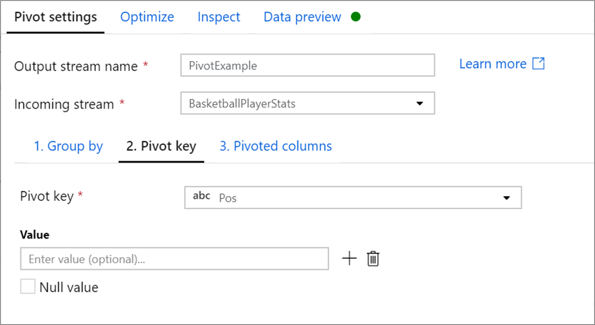
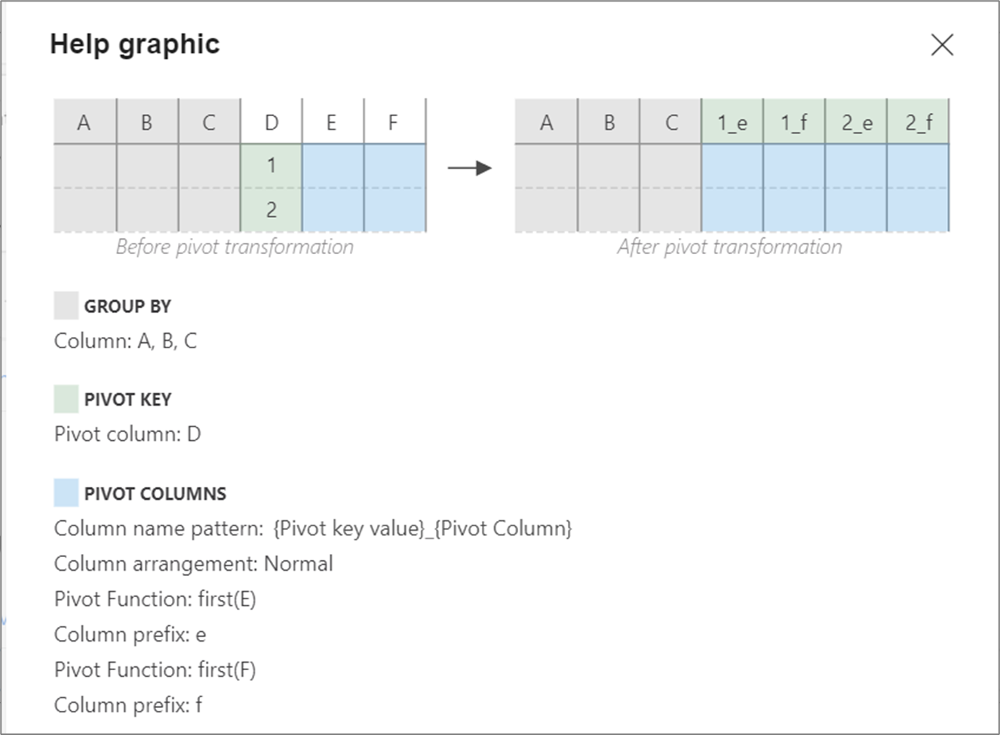

# Pivot transformation in mapping data flow


[!INCLUDE[appliesto-adf-asa-md](includes/appliesto-adf-asa-md.md)]

Use the pivot transformation to create multiple columns from the unique row values of a single column. Pivot is an aggregation transformation where you select group by columns and generate pivot columns using [aggregate functions](data-flow-expression-functions.md#aggregate-functions).

> [!VIDEO https://www.microsoft.com/en-us/videoplayer/embed/RE4C4YN]

## Configuration

The pivot transformation requires three different inputs: group by columns, the pivot key, and how to generate the pivoted columns

### Group by


Select which columns to aggregate the pivoted columns over. The output data will group all rows with the same group by values into one row. The aggregation done in the pivoted column will occur over each group.

This section is optional. If no group by columns are selected, the entire data stream will be aggregated and only one row will be outputted.

### Pivot key



The pivot key is the column whose row values get pivoted into new columns. By default, the pivot transformation will create a new column for each unique row value.

In the section labeled **Value**, you can enter specific row values to be pivoted. Only the row values entered in this section will be pivoted. Enabling **Null value** will create a pivoted column for the null values in the column.

### Pivoted columns


For each unique pivot key value that becomes a column, generate an aggregated row value for each group. You can create multiple columns per pivot key. Each pivot column must contain at least one [aggregate function](data-flow-expression-functions.md#aggregate-functions).

**Column name pattern:** Select how to format the column name of each pivot column. The outputted column name will be a combination of the pivot key value, column prefix and optional prefix, suffice, middle characters. 

**Column arrangement:** If you generate more than one pivot column per pivot key, choose how you want the columns to be ordered. 

**Column prefix:** If you generate more than one pivot column per pivot key, enter a column prefix for each column. This setting is optional if you only have one pivoted column.

## Help graphic

The below help graphic shows how the different pivot components interact with one another



## Pivot metadata

If no values are specified in the pivot key configuration, the pivoted columns will be dynamically generated at run time. The number of pivoted columns will equal the number of unique pivot key values multiplied by the number of pivot columns. As this can be a changing number, the UX will not display the column metadata in the **Inspect** tab and there will be no column propagation. To transformation these columns, use the [column pattern](concepts-data-flow-column-pattern.md) capabilities of mapping data flow. 

If specific pivot key values are set, the pivoted columns will appear in the metadata. The column names will be available to you in the Inspect and Sink mapping.

### Generate metadata from drifted columns

Pivot generates new column names dynamically based on row values. You can add these new columns into the metadata that can be referenced later in your data flow. To do this, use the [map drifted](concepts-data-flow-schema-drift.md#map-drifted-columns-quick-action) quick action in data preview. 


### Sinking pivoted columns

Although pivoted columns are dynamic, they can still be written into your destination data store. Enable **Allow schema drift** in your sink settings. This will allow you to write columns that are not included in metadata. You will not see the new dynamic names in your column metadata, but the schema drift option will allow you to land the data.

### Rejoin original fields

The pivot transformation will only project the group by and pivoted columns. If you want your output data to include other input columns, use a [self join](data-flow-join.md#self-join) pattern.

## Data flow script

### Syntax

```
<incomingStreamName>
    pivot(groupBy(Tm),
        pivotBy(<pivotKeyColumn, [<specifiedColumnName1>,...,<specifiedColumnNameN>]),
        <pivotColumnPrefix> = <pivotedColumnValue>,
        columnNaming: '< prefix >< $N | $V ><middle >< $N | $V >< suffix >',
        lateral: { 'true' | 'false'}
    ) ~> <pivotTransformationName
```
### Example

The screens shown in the configuration section, have the following data flow script:

```
BasketballPlayerStats pivot(groupBy(Tm),
    pivotBy(Pos),
    {} = count(),
    columnNaming: '$V$N count',
    lateral: true) ~> PivotExample

```

## Next steps

Try the [unpivot transformation](data-flow-unpivot.md) to turn column values into row values. 
