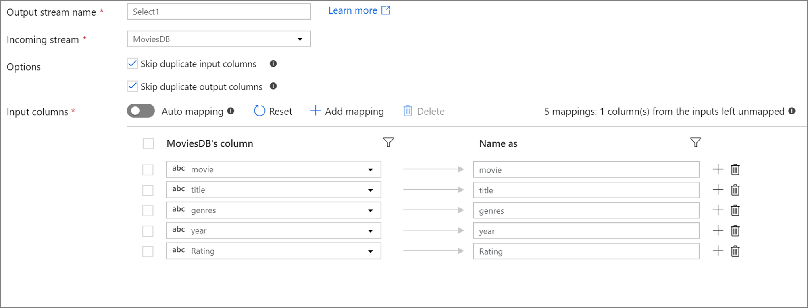
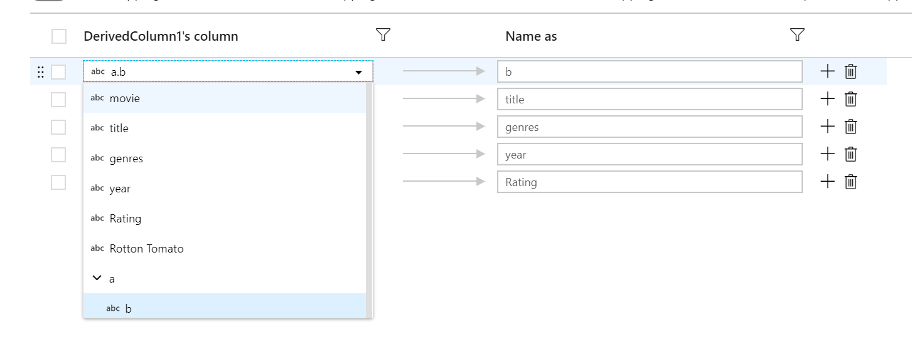
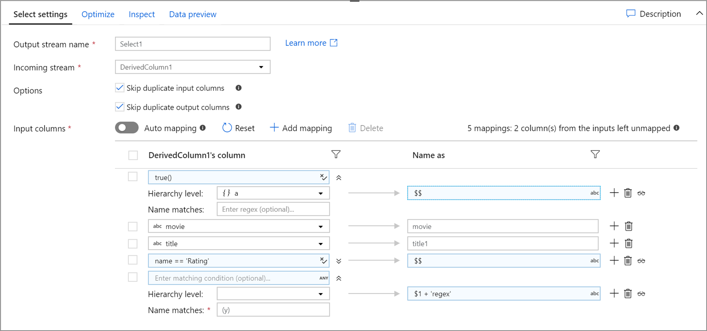

# Select transformation in mapping data flow

[!INCLUDE[appliesto-adf-asa-md](includes/appliesto-adf-asa-md.md)]

Use the select transformation to rename, drop, or reorder columns. This transformation doesn't alter row data, but chooses which columns are propagated downstream. 

In a select transformation, users can specify fixed mappings, use patterns to do rule-based mapping, or enable auto mapping. Fixed and rule-based mappings can both be used within the same select transformation. If a column doesn't match one of the defined mappings, it will be dropped.

## Fixed mapping

If there are fewer than 50 columns defined in your projection, all defined columns will have a fixed mapping by default. A fixed mapping takes a defined, incoming column and maps it an exact name.



> [!NOTE]
> You can't map or rename a drifted column using a fixed mapping

### Mapping hierarchical columns

Fixed mappings can be used to map a subcolumn of a hierarchical column to a top-level column. If you have a defined hierarchy, use the column dropdown to select a subcolumn. The select transformation will create a new column with the value and data type of the subcolumn.



## Rule-based mapping


> [!VIDEO https://www.microsoft.com/en-us/videoplayer/embed/RE4xiXz]

If you wish to map many columns at once or pass drifted columns downstream, use rule-based mapping to define your mappings using column patterns. Match based on the `name`, `type`, `stream`, and `position` of columns. You can have any combination of fixed and rule-based mappings. By default, all projections with greater than 50 columns will default to a rule-based mapping that matches on every column and outputs the inputted name. 

To add a rule-based mapping, click **Add mapping** and select **Rule-based mapping**.


Each rule-based mapping requires two inputs: the condition on which to match by and what to name each mapped column. Both values are inputted via the [expression builder](concepts-data-flow-expression-builder.md). In the left expression box, enter your boolean match condition. In the right expression box, specify what the matched column will be mapped to.


Use `$$` syntax to reference the input name of a matched column. Using the above image as an example, say a user wants to match on all string columns whose names are shorter than six characters. If one incoming column was named `test`, the expression `$$ + '_short'` will rename the column `test_short`. If that's the only mapping that exists, all columns that don't meet the condition will be dropped from the outputted data.

Patterns match both drifted and defined columns. To see which defined columns are mapped by a rule, click the eyeglasses icon next to the rule. Verify your output using data preview.

### Regex mapping

If you click the downward chevron icon, you can specify a regex-mapping condition. A regex-mapping condition matches all column names that match the specified regex condition. This can be used in combination with standard rule-based mappings.


The above example matches on regex pattern `(r)` or any column name that contains a lower case r. Similar to standard rule-based mapping, all matched columns are altered by the condition on the right using `$$` syntax.

If you have multiple regex matches in your column name, you can refer to specific matches using `$n` where 'n' refers to which match. For example, '$2' refers to the second match within a column name.

### Rule-based hierarchies

If your defined projection has a hierarchy, you can use rule-based mapping to map the hierarchies subcolumns. Specify a matching condition and the complex column whose subcolumns you wish to map. Every matched subcolumn will be outputted using the 'Name as' rule specified on the right.


The above example matches on all subcolumns of complex column `a`. `a` contains two subcolumns `b` and `c`. The output schema will include two columns `b` and `c` as the 'Name as' condition is `$$`.

### Parameterization

You can parameterize column names using rule-based mapping. Use the keyword ```name``` to match incoming column names against a parameter. For example, if you have a data flow parameter ```mycolumn```, you can create a rule that matches any column name that is equal to ```mycolumn```. You can rename the matched column to a hard-coded string such as 'business key' and reference it explicitly. In this example, the matching condition is ```name == $mycolumn``` and the name condition is 'business key'. 

## Auto mapping

When adding a select transformation, **Auto mapping** can be enabled by switching the Auto mapping slider. With auto mapping, the select transformation maps all incoming columns, excluding duplicates, with the same name as their input. This will include drifted columns, which means the output data may contain columns not defined in your schema. For more information on drifted columns, see [schema drift](concepts-data-flow-schema-drift.md).


With auto mapping on, the select transformation will honor the skip duplicate settings and provide a new alias for the existing columns. Aliasing is useful when doing multiple joins or lookups on the same stream and in self-join scenarios. 

## Duplicate columns

By default, the select transformation drops duplicate columns in both the input and output projection. Duplicate input columns often come from join and lookup transformations where column names are duplicated on each side of the join. Duplicate output columns can occur if you map two different input columns to the same name. Choose whether to drop or pass on duplicate columns by toggling the checkbox.


## Ordering of columns

The order of mappings determines the order of the output columns. If an input column is mapped multiple times, only the first mapping will be honored. For any duplicate column dropping, the first match will be kept.

## Data flow script

### Syntax

```
<incomingStream>
    select(mapColumn(
        each(<hierarchicalColumn>, match(<matchCondition>), <nameCondition> = $$), ## hierarchical rule-based matching
        <fixedColumn>, ## fixed mapping, no rename
        <renamedFixedColumn> = <fixedColumn>, ## fixed mapping, rename
        each(match(<matchCondition>), <nameCondition> = $$), ## rule-based mapping
        each(patternMatch(<regexMatching>), <nameCondition> = $$) ## regex mapping
    ),
    skipDuplicateMapInputs: { true | false },
    skipDuplicateMapOutputs: { true | false }) ~> <selectTransformationName>
```

### Example

Below is an example of a select mapping and its data flow script:



```
DerivedColumn1 select(mapColumn(
        each(a, match(true())),
        movie,
        title1 = title,
        each(match(name == 'Rating')),
        each(patternMatch(`(y)`),
            $1 + 'regex' = $$)
    ),
    skipDuplicateMapInputs: true,
    skipDuplicateMapOutputs: true) ~> Select1
```

## Next steps
* After using Select to rename, reorder, and alias columns, use the [Sink transformation](data-flow-sink.md) to land your data into a data store.
